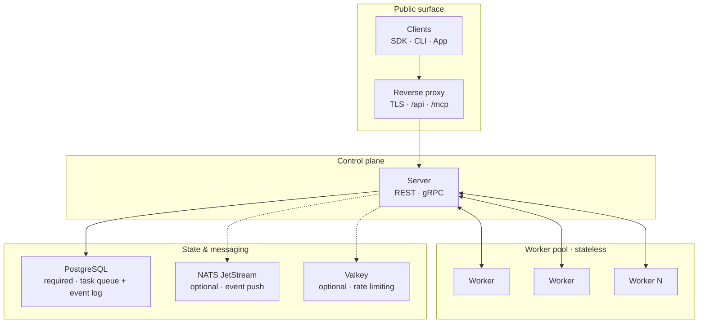

# Everruns

[](https://everruns.com)
[](https://docs.everruns.com)
[](https://github.com/everruns/everruns/actions/workflows/ci.yml)
[](AGENTS.md)

> **Note:** Everruns is under active development. Expect rapid changes and experimental features.

**Everruns is an open-source platform for building, deploying, and operating durable AI agents.**

Define agents and their tools, compose them into reusable harnesses, then ship them to real users through Slack, web chat, scheduled jobs, webhooks, A2A, MCP, or a plain HTTP API — backed by a Rust + PostgreSQL durable execution engine that survives restarts and scales horizontally.

## Why Everruns

- **Durable by default** — every session is a PostgreSQL-backed workflow that survives restarts, worker crashes, and network partitions. No lost runs, no in-memory state to babysit.
- **One agent, every channel** — define a harness once, then [publish](https://docs.everruns.com/features/apps/) it to Slack, web chat, A2A, webhooks, cron schedules, voice, or a plain HTTP/[MCP](https://docs.everruns.com/features/mcp/) API.
- **Open and provider-neutral** — implements the [Open Responses](https://www.openresponses.org/) spec across OpenAI, Anthropic, Gemini, and Azure; register remote MCP servers as tools. MIT-licensed and self-hostable.
- **Built for production** — multi-tenant orgs, fine-grained permissions, envelope-encrypted secrets, budgets, [observability](https://docs.everruns.com/observability/), and a control-plane / worker split that scales horizontally.

## Architecture



Workers are stateless and hold no database credentials — they reach the control plane over gRPC only. See [Architecture](https://docs.everruns.com/explanation/architecture/) for the full picture.

## What's inside

### Build agents

- **[Harnesses](https://docs.everruns.com/features/harnesses/), Agents, Capabilities, Skills** — modular configuration that composes into a runtime agent. [Built-in harness types](https://docs.everruns.com/built-ins/) for general chat, data analysis, and coding (sandbox or Daytona-backed).
- **[Agent versioning](https://docs.everruns.com/features/agent-versions/), blueprints, and identities** — iterate safely on production agents and run unattended workloads under virtual principals.
- **[Capabilities library](https://docs.everruns.com/features/capabilities/)** — web fetch, bash sandbox, session filesystem, session SQL DB, memory, knowledge bases, MCP, voice, and more.
- **[Skills registry](https://docs.everruns.com/features/skills-registry/)** — agentskills.io-format skills with discovery, search, and usage tracking.
- **Generative UI** — agents can return rich cards via [OpenUI](https://github.com/openuidev/openui), [A2UI](https://github.com/google/a2ui), and inline `ui://everruns/...` MCP App resources.

### Connect any model and any tool

- **LLM providers**: OpenAI (Responses + Chat Completions), Azure OpenAI, Anthropic, Gemini, plus `llmsim` for tests. Model resolution is layered: message → session → agent → system default.
- **[MCP](https://docs.everruns.com/features/mcp/), both ways** — register remote MCP servers as virtual capabilities (auto-discovered and namespaced), and use every deployment's always-available authenticated MCP endpoint with OAuth 2.1 so other agents can call yours.
- **[Integrations](https://docs.everruns.com/integrations/)**: Docker, Daytona, E2B, Deno, Browserless, Brave Search, DuckDuckGo, Parallel, Sprites, Cursor — auto-registered via the `inventory` plugin system.
- **Client-side tools** for SDK/API consumers that want to run tools locally.

### Ship agents to real channels

Define an **[App](https://docs.everruns.com/features/apps/)** that binds a Harness + Agent to one or more **channels**:

- `slack` — Slack app with thread/channel/user routing
- `ag_ui` — embeddable web chat (AG-UI)
- `a2a` — Agent2Agent inbound JSON-RPC + outbound delegation
- `webhook` — HTTP-triggered invocations
- `schedule` — cron-based scheduled tasks
- Voice — realtime voice sessions with hardened tool authorization

### Run reliably at scale

- **[Durable execution engine](https://docs.everruns.com/explanation/durable-execution/)** — PostgreSQL-backed workflows; agent sessions survive restarts, worker crashes, and network partitions.
- **Control-plane / worker split** — workers talk to the control-plane over gRPC only; no DB credentials on workers.
- **[Streaming events](https://docs.everruns.com/features/events/)** — SSE with NATS JetStream (production) or in-memory broadcast (dev) for ephemeral deltas, PostgreSQL for durable events.
- **Multi-tenant** — organizations, fine-grained permissions, audit logging, envelope encryption (AES-256-GCM) for secrets.
- **Infinity context** — automatic compaction keeps conversations going past any model's context window.
- **[Observability](https://docs.everruns.com/observability/)** — OpenTelemetry GenAI semantic conventions, Prometheus `/metrics`, optional Braintrust.
- **Budgeting, usage tracking, reporting** — token meters, budgets with soft enforcement, and async analytical projections (StarRocks or DuckDB-over-object-storage).
- **[Evals](https://docs.everruns.com/features/evals/)** — user-facing behavioral evals plus a SWE-bench Lite harness.

## Quick start

Deploy the full stack with Docker Compose:

```bash
mkdir everruns && cd everruns
curl -o docker-compose.yaml https://raw.githubusercontent.com/everruns/everruns/main/examples/docker-compose-full.yaml

# Generate an encryption key for secrets-at-rest
python3 -c "import os, base64; print('kek-v1:' + base64.b64encode(os.urandom(32)).decode())"

cat > .env <<'EOF'
SECRETS_ENCRYPTION_KEY=kek-v1:<your-generated-key>
WORKER_GRPC_AUTH_TOKEN=<a-random-token>
DEFAULT_OPENAI_API_KEY=sk-...            # optional
DEFAULT_ANTHROPIC_API_KEY=sk-ant-...     # optional
DEFAULT_GEMINI_API_KEY=...               # optional
EOF

docker compose up -d
```

Then open:

- Web UI: <http://localhost:9300>
- API: <http://localhost:9300/api/v1/...>
- MCP endpoint: <http://localhost:9300/mcp>
- Metrics: <http://localhost:8428/vmui> (VictoriaMetrics)

See the [Docker Compose Quickstart](https://docs.everruns.com/getting-started/docker-compose/) for the full guide.

Contributors and coding agents can instead run the PostgreSQL, Valkey, and NATS-backed development
stack locally without Docker. The canonical per-worktree command, prerequisites, ports, and cleanup
instructions live in [`AGENTS.md`](./AGENTS.md#local-dev).

## API example

```bash
# Create an agent
curl -X POST http://localhost:9300/api/v1/agents \
  -H "Content-Type: application/json" \
  -d '{"name": "Assistant", "system_prompt": "You are a helpful assistant."}'

# Start a session
curl -X POST http://localhost:9300/api/v1/sessions \
  -H "Content-Type: application/json" \
  -d '{"agent_id": "{agent_id}"}'

# Send a message (returns 201 with the persisted message)
curl -X POST http://localhost:9300/api/v1/sessions/{session_id}/messages \
  -H "Content-Type: application/json" \
  -d '{"message": {"content": [{"type": "text", "text": "Hello!"}]}}'

# Stream the agent's response and tool calls as Server-Sent Events
curl -N http://localhost:9300/api/v1/sessions/{session_id}/sse
```

Everruns implements the [Open Responses](https://www.openresponses.org/) spec — a vendor-neutral API for multi-provider LLM interfaces with native tool calls and semantic streaming.

## Use from Claude Code, Codex, or Cursor

This repository is a [Claude Code plugin marketplace](https://code.claude.com/docs/en/plugin-marketplaces) shipping the `everruns-dev` plugin, which also supports Codex and Cursor as hosts:

```text
/plugin marketplace add everruns/everruns
/plugin install everruns-dev@everruns-dev
```

Run `/everruns-dev:whoami` and complete the OAuth flow on first use. See [`plugins/everruns-dev/README.md`](./plugins/everruns-dev/README.md) for Codex, Cursor, local clone, and custom deployment options.

## Build with the Framework

Build agents directly inside a Rust application with the **Everruns Framework** and its
application-facing [`everruns`](./crates/everruns) crate. The default build runs offline with a
deterministic simulator; opt-in providers, typed tools, multi-turn sessions, events,
cancellation, files, MCP, and context inspection all stay on the same public facade. Start with
the [Framework quickstart](https://docs.everruns.com/framework/quickstart/).

Applications retain the concrete `everruns::Engine` as their session owner.
`InMemoryEngine` is a compatibility alias; Engine keeps immutable Agent
snapshots and owns the resources required to create and resume Sessions.

Typed built-ins, dynamic third-party references, and reusable packages all use
`AgentBuilder::capability`; packages can implement the open `IntoCapability`
contract or use the curated
[`everruns::capability`](https://docs.everruns.com/framework/advanced-capabilities/) authoring API.

Advanced execution hosts combine `everruns` with `everruns-host` and focused sibling crates —
see [Custom backends](https://docs.everruns.com/framework/custom-backends/).

A CLI (`everruns-cli`) is also available for scripting against a deployment — see the [CLI](https://docs.everruns.com/features/cli/) guide.

## Documentation

Full documentation lives at **[docs.everruns.com](https://docs.everruns.com)**.

- [Introduction](https://docs.everruns.com/getting-started/introduction/) — what Everruns is and core [concepts](https://docs.everruns.com/getting-started/concepts/)
- [Everruns Framework](https://docs.everruns.com/framework/) — build and run agents inside a Rust application
- [Docker Compose Quickstart](https://docs.everruns.com/getting-started/docker-compose/) — run the full stack
- [How-to guides](https://docs.everruns.com/how-to/) — give agents tools, stream events, publish to Slack, enforce budgets
- [Capabilities](https://docs.everruns.com/features/capabilities/) and [Harnesses](https://docs.everruns.com/features/harnesses/) — the building blocks
- [Architecture](https://docs.everruns.com/explanation/architecture/) and [Durable execution](https://docs.everruns.com/explanation/durable-execution/) — how it works under the hood
- [API Reference](https://docs.everruns.com/api/) — OpenAPI 3.0
- [SDKs](https://docs.everruns.com/features/sdk/) — Rust, Python, and TypeScript clients

## Security

Everruns runs untrusted agent and tool code for multiple tenants, so security is a core design goal. Threats are tracked with stable IDs across categories — authentication, tenant isolation, permissions, tool execution, LLM integration, the bash and SQLite sandboxes, durable execution, and channel integrations — each with a documented mitigation and, where feasible, test coverage.

- [Threat model](./knowledge/security/threat-model.md) — full analysis, mitigation status, and accepted risks
- [Security testing](./knowledge/security/security-testing.md) — threat-model tests, fail-rs failure injection, DeepSec scanning, and supply-chain checks
- [Security policy](./SECURITY.md) — how to report a vulnerability

## Contributing

See [CONTRIBUTING.md](./CONTRIBUTING.md) for local development setup and [AGENTS.md](./AGENTS.md) for the conventions used by both human and AI contributors.

## License

MIT
