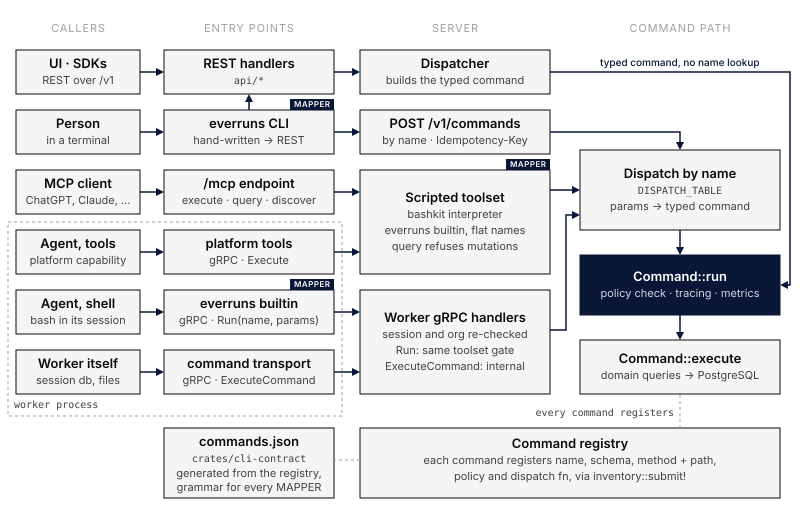

Everruns has one set of platform commands, such as `create_agent`, `update_harness` or `list_sessions`, and several ways to reach them: the REST API, the `everruns` CLI, the `/mcp` endpoint, the [Platform capability](/capabilities/platform/), and the `everruns` command inside an agent's shell. This page shows how each of those surfaces gets to a command, so you can tell what behaves the same everywhere and what does not.

## One command, one run path

Each operation is one command with a name, a parameter schema, an HTTP method and path, and an authorization policy. Every command registers itself in the server's command registry, and every surface ends at the same `Command::run`. That is where the policy check, tracing and metrics happen, so authorization works the same whichever way a caller arrived.

There are two ways into `Command::run`:

- **Typed, from a REST route.** A handler under `/v1/agents`, `/v1/sessions` and so on builds the command from the request and runs it directly.
- **By name.** Everything else looks the command up by its name and turns the JSON parameters into the typed command, using the schema the command registered. Unknown names, unknown parameters and wrong types fail here, before anything runs.

## Surfaces

| Surface | Who uses it | How it reaches a command |
|---|---|---|
| REST API (`/v1/...`) | UI, SDKs, scripts | Typed, from the route |
| `POST /v1/commands/{name}` | the CLI, any HTTP client | By name, with optional `Idempotency-Key` |
| `everruns` CLI | people in a terminal | Parses the command line locally, then calls `POST /v1/commands`; a few commands that need local files or streaming (`login`, `files`, `chat`, `agents create -f`) call REST directly |
| `/mcp` `execute` and `query` | external MCP clients | Runs a shell script in which `everruns <noun> <verb>` and the flat names (`create_agent`) are commands; `query` refuses anything that changes state |
| Platform capability | agents with the `discover`, `query`, `execute` tools | The same scripted toolset as `/mcp`, called from the worker over gRPC |
| `everruns` in the agent's shell | agents in a shell-only harness | Parses the command line in the worker, then sends the command name and parameters over gRPC |

Workers never read the database. When an agent on a worker runs a platform command, the worker sends it to the control plane, which reloads the session, checks again that the session really has the Platform capability, and runs the command as the session's owner in the session's organization. It never trusts an identity the worker sends.

## One grammar

The CLI, the scripted toolset and the agent's shell all parse `everruns <noun> <verb> --flags` with the same parser, built from a command contract that the server generates from its registry. That is why `everruns agents list --limit 10` means the same thing typed in a terminal and in an agent's shell: the same flags, the same short options, the same help, and the same errors for an unknown flag or a missing required one. See [CLI](/features/cli/#platform-commands) for the commands and [Platform](/capabilities/platform/) for the agent-facing tools.

## Where the surfaces differ

- **Hand-written CLI commands.** A few CLI commands do local work no server command can, such as reading a definition file or syncing files, so they keep their own flags. Every other CLI command comes from the contract.
- **Flat names.** `/mcp` and the Platform capability also accept flat names like `create_agent --name ...`, for scripts written before the noun-verb spelling existed.
- **Read-only mode.** `query` accepts only commands that do not change state; `execute` accepts any command the caller is allowed to run.
- **Retries.** Only `POST /v1/commands` takes an `Idempotency-Key`, because it is the surface a network sits in front of. The CLI sends one on every command and retries dropped connections with the same key. See [CLI retries](/features/cli/#retries).
