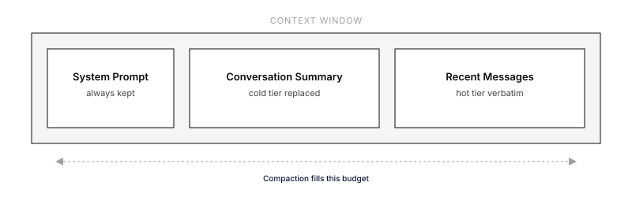
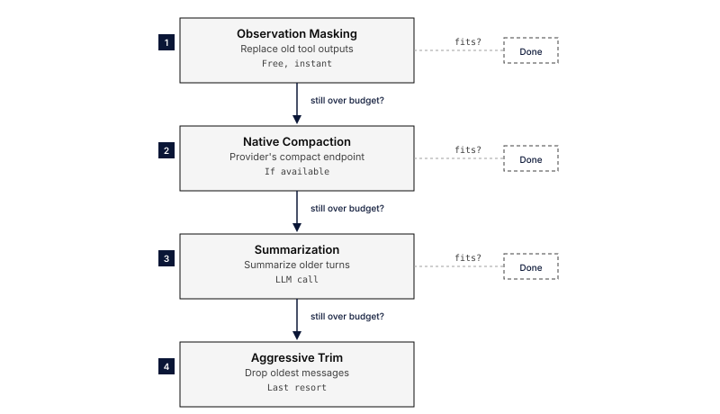
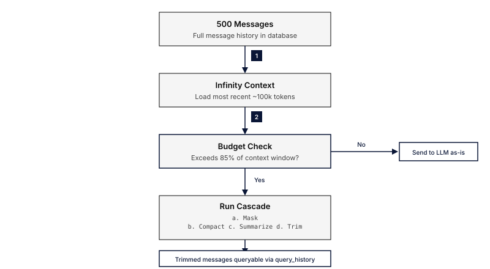
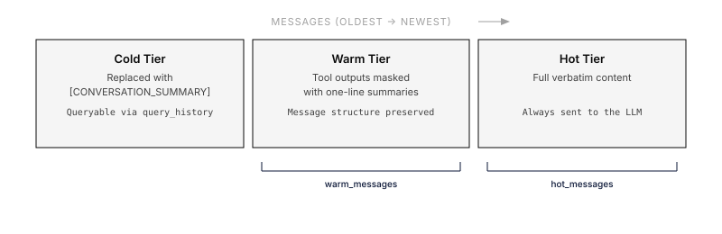

Long-running agent sessions accumulate messages until they exceed the model's context window. When that happens, the LLM rejects the request. **Context compaction** automatically reduces the conversation size so the agent can keep working without losing important information.

Everruns provides multiple compaction strategies that can be combined. The default `auto` strategy cascades through all of them in order — from cheapest (free) to most expensive (LLM call) — stopping as soon as the context fits.



## How It Works

Compaction operates at two points:

1. **Proactively** — before each LLM call, Everruns estimates the token count. If it exceeds a configurable budget threshold (default 85% of the model's context window), compaction runs *before* the call is made. This avoids the latency of a failed request.

2. **Reactively** — if the LLM still returns a `RequestTooLarge` error (estimation can undercount), the compaction cascade runs and the request is retried automatically.

In both cases, the same cascade of strategies executes:



The UI shows a divider between messages whenever compaction happens:

> **Context compacted** · 142 → 38 messages · observation_masking+summarization

Click the divider to see the cascade details — which strategies ran, how many messages each step produced, and the time taken.

## Strategies

### Auto (default)

Runs all strategies in order. Stops as soon as context fits. This is the recommended setting for most use cases.

### Observation Masking

Replaces old tool outputs with compact summaries while keeping the message structure intact. This is free (no LLM call) and preserves tool call IDs for tracing.

Two summary formats:

| Format | Example | When to use |
|---|---|---|
| `one_line` (default) | `[read_file → 47 lines, 2340 bytes]` | Most cases — minimal footprint |
| `head_tail` | First 3 lines + `... (14 lines omitted) ...` + last 3 lines | When partial output context helps |

The most recent N tool outputs are always kept verbatim (default: 5).

### Native Provider Compaction

Delegates compaction to the LLM provider's own endpoint. Currently supported by OpenAI's Responses API (`/responses/compact`). When available, this can be more intelligent than generic strategies since the provider understands its own tokenization.

### Summarization

Uses an LLM to generate a structured summary of older messages. The summary replaces those messages in context and is wrapped in `[CONVERSATION_SUMMARY]` tags so subsequent compactions can re-summarize it.

You can configure:
- Which model to use (default: same as the agent)
- What information to preserve (decisions, files modified, errors, etc.)
- Custom instructions appended to the summarization prompt

### Aggressive Trim

Last resort. Drops the oldest messages to fit within the token budget. The system prompt and the most recent messages are always preserved. This is lossy — dropped messages cannot be recovered unless Infinity Context is enabled.

## Generic Harness Defaults

The built-in **Generic** harness enables both `compaction` and `infinity_context` by default. Together they keep long sessions unbounded without manual configuration.

| Capability | Role | Default in Generic |
|---|---|---|
| **Infinity Context** | Limits how many messages are loaded from the database into the prompt; provides `query_history` for retrieval | `context_budget_tokens: 100000`, `min_recent_messages: 10` |
| **Context Compaction** | Reduces the size of messages that *are* in the prompt — masking tool outputs, summarizing, or trimming | `strategy: auto`, `proactive: true`, `budget_percent: 0.85` |

The flow for a long-running Generic session:



No configuration is needed — creating a session with the Generic harness gives you this behavior out of the box. To customize, override either capability's config on the agent or session level.

## Configuration

Compaction is a capability configured per agent or harness via `AgentCapabilityConfig`.

### Default (auto strategy, proactive)

```json
{
  "capabilities": ["compaction"]
}
```

### Custom strategy and budget

```json
{
  "capabilities": [
    {
      "ref": "compaction",
      "config": {
        "strategy": "auto",
        "proactive": true,
        "budget_percent": 0.85
      }
    }
  ]
}
```

### Observation masking only (no LLM calls)

```json
{
  "capabilities": [
    {
      "ref": "compaction",
      "config": {
        "strategy": "observation_masking",
        "observation_masking": {
          "keep_recent_tool_outputs": 10,
          "summary_format": "head_tail"
        }
      }
    }
  ]
}
```

### Summarization with a cheaper model

```json
{
  "capabilities": [
    {
      "ref": "compaction",
      "config": {
        "strategy": "summarization",
        "summarization": {
          "model": "claude-haiku-4-5-20251001",
          "preserve": ["decisions", "files_modified", "errors", "api_keys"],
          "instructions": "Focus on architecture decisions and API contract changes"
        }
      }
    }
  ]
}
```

### Full configuration with memory tiers

```json
{
  "capabilities": [
    {
      "ref": "compaction",
      "config": {
        "strategy": "auto",
        "proactive": true,
        "budget_percent": 0.80,
        "observation_masking": {
          "keep_recent_tool_outputs": 5,
          "summary_format": "one_line"
        },
        "summarization": {
          "model": null,
          "preserve": ["decisions", "files_modified", "errors", "current_plan"],
          "instructions": null
        },
        "memory_tiers": {
          "hot_messages": 20,
          "warm_messages": 100
        }
      }
    }
  ]
}
```

## Configuration Reference

### Top-level

| Field | Type | Default | Description |
|---|---|---|---|
| `strategy` | string | `"auto"` | Compaction strategy: `auto`, `native`, `observation_masking`, or `summarization` |
| `proactive` | boolean | `true` | Compact before hitting context limits (recommended) |
| `budget_percent` | float | `0.85` | Trigger proactive compaction at this fraction of the context window |

### Observation Masking

| Field | Type | Default | Description |
|---|---|---|---|
| `keep_recent_tool_outputs` | integer | `5` | Number of recent tool outputs to keep verbatim |
| `summary_format` | string | `"one_line"` | How to summarize masked outputs: `one_line` or `head_tail` |

### Summarization

| Field | Type | Default | Description |
|---|---|---|---|
| `model` | string \| null | `null` | Model for summarization. Null = same as the agent's model |
| `preserve` | string[] | `["decisions", "files_modified", "errors", "current_plan"]` | Information categories to preserve in summaries |
| `instructions` | string \| null | `null` | Custom instructions appended to the summarization prompt |

### Memory Tiers

| Field | Type | Default | Description |
|---|---|---|---|
| `hot_messages` | integer | `20` | Recent messages kept verbatim (full content) |
| `warm_messages` | integer | `100` | Older messages with observation masking applied to tool outputs |

Messages beyond hot + warm are in the **cold tier** — replaced with a conversation summary. If [Infinity Context](/capabilities/infinity-context/) is enabled, cold-tier messages remain queryable via `query_history`.

## Memory Tier Diagram



## Combining with Infinity Context

Compaction and [Infinity Context](/capabilities/infinity-context/) are complementary:

- **Infinity Context** limits how many messages are loaded from the database into the prompt, and provides `query_history` for retrieval.
- **Compaction** reduces the size of messages that *are* in the prompt — making tool outputs smaller, summarizing old turns, or trimming when nothing else works.

For long-running sessions, enable both:

```json
{
  "capabilities": [
    "infinity_context",
    {
      "ref": "compaction",
      "config": {
        "strategy": "auto",
        "proactive": true
      }
    }
  ]
}
```

With both active, the flow is:

1. Infinity Context limits messages loaded (e.g., last 100 messages)
2. Compaction masks old tool outputs in those messages
3. If still over budget, summarization or trim kicks in
4. Cold-tier messages remain accessible via `query_history`

## Events

Compaction emits two SSE events:

| Event | When | Key fields |
|---|---|---|
| `context.compacting` | Cascade starts | `reason` (proactive_budget, request_too_large, manual), `strategy`, `messages_before` |
| `context.compacted` | Cascade completes | `strategy_used`, `messages_before`, `messages_after`, `duration_ms`, `steps[]` |

Each step in the cascade is recorded with its strategy name, resulting message count, and duration.

## Best Practices

- **Start with defaults.** The `auto` strategy with `proactive: true` handles most cases well.
- **Lower `budget_percent`** (e.g., 0.70) if your agents use large tool outputs frequently — this gives more headroom before the context fills.
- **Increase `keep_recent_tool_outputs`** if your agent often references recent tool results across multiple turns.
- **Use a cheaper model for summarization** (e.g., Haiku) to reduce cost and latency when the summarization step runs.
- **Enable Infinity Context** alongside compaction for sessions that run for hours or days.
- **Customize `preserve`** to match your agent's domain — if your agent tracks database schemas or API contracts, add those to the preserve list.

## See Also

- [Infinity Context](/capabilities/infinity-context/) — Message history windowing and retrieval
- [Capabilities Overview](/capabilities/) — How capabilities are configured
- [Harnesses](/features/harnesses/) — Where capability configs are applied
- [Events](/features/events/) — SSE event streaming reference
