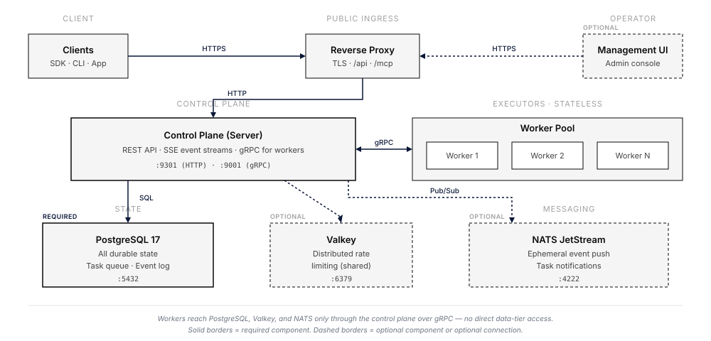

The [getting-started architecture](/getting-started/architecture/) page describes the *logical* shape of Everruns: a control plane, a worker tier, and a shared database. This page goes one level deeper and describes the *physical* components an operator actually deploys, what each one is for, when it is optional, and how data flows between them.

## Components at a glance

| Component | Role | Required | Default port |
|-----------|------|----------|--------------|
| Reverse proxy | TLS termination and route fan-out for `/api`, `/mcp`, `/.well-known/*`, UI | Yes (or equivalent ingress) | 443 |
| Control plane (server) | REST API, SSE event streams, gRPC server for workers, owns all state | Yes | 9301 (HTTP), 9001 (gRPC) |
| Worker pool | Stateless executors of the agentic loop (input → reason → act) | Yes |, (outbound only) |
| PostgreSQL 17 | Durable storage for agents, sessions, events, durable task queue | Yes | 5432 |
| NATS JetStream | Push-based ephemeral event delivery and task notifications | Optional | 4222 |
| Valkey | Distributed sliding-window rate limiting across control-plane instances | Optional | 6379 |
| Management UI | Operator interface for agent and provider configuration | Optional |, (served by proxy) |

Workers never talk to PostgreSQL, NATS, or Valkey directly. Every read and write goes through the control plane's gRPC service on port 9001. This is what lets workers run with no database credentials, no encryption keys, and no awareness of the data tier.

## PostgreSQL, the only required stateful component

PostgreSQL is the single source of truth for everything Everruns persists. There is no in-memory cache that needs warming, no secondary store that needs syncing, and no analytics database to keep consistent. If you back up PostgreSQL, you back up the entire system.

What lives in PostgreSQL:

- Agents, sessions, messages, and durable events
- The durable task queue used by the worker tier (claimed via `SKIP LOCKED`)
- Encrypted LLM provider credentials, MCP server registrations, capability config
- Per-session virtual filesystems, knowledge bases, and the event log used for SSE replay

Operational requirements:

- **PostgreSQL 17.** UUIDv7 is implemented via a custom SQL function; PG 18's native `uuidv7()` will be adopted once it is widely available on managed services.
- **Direct connection for `LISTEN/NOTIFY`.** Pooled or proxied endpoints (PgBouncer, Neon `-pooler`, RDS Proxy) interleave notification frames with query traffic. Set `DATABASE_URL` to the pooled endpoint for normal queries and `DATABASE_UNPOOLED_URL` to a direct session-scoped endpoint for listeners. Startup fails fast if the configured listener URL looks pooled.
- **Pool sizing.** With `EXPECTED_INSTANCES=N` set, each instance sizes its pool so that `pool × instances` stays under 80% of `PG_MAX_CONNECTIONS`.
- **Migrations.** Auto-applied on server startup via embedded sqlx migrations, protected by a PostgreSQL advisory lock so multiple control-plane instances can boot together without racing.

See [`docs/sre/environment-variables.md`](/sre/environment-variables/) for the full list of database-related variables.

## NATS JetStream, optional push delivery

NATS is not required, but turning it on materially reduces PostgreSQL write pressure and SSE tail latency for busy deployments.

Without NATS, Everruns uses PostgreSQL for both storage *and* delivery: ephemeral events persist to PG and SSE clients poll PG with `LISTEN/NOTIFY` wakeups; workers are notified of new tasks the same way. This works, and it is the default. The cost is write amplification, every streaming-token delta lands in PG even though no client will ever re-read it.

With `NATS_URL` set and JetStream enabled, Everruns rewires two hot paths:

- **Ephemeral event delivery.** Delta events (`output.message.delta`, `reason.thinking.delta`, `tool.output.delta`, `llm.generation`) skip PostgreSQL entirely and flow only through NATS JetStream. SSE streams subscribe to per-session subjects with short-term retention. Durable events (`output.message.completed`, `turn.started`, `tool.completed`, etc.) still persist to PG so SSE reconnection via `since_id` continues to work, missed deltas are acceptable because the completed event carries the full content.
- **Task notifications.** `task.available.{activity_type}` subjects replace PG NOTIFY for worker wakeup, dropping notification latency from ~30 ms to ~1 ms.

NATS is fail-graceful: if the connection fails at startup, the control plane logs a warning and falls back to the PG-backed paths. Only the control plane connects to NATS, workers still talk to the server via gRPC.

## Valkey, optional distributed rate limiting

Valkey is a Redis-compatible key-value store (a Linux Foundation fork of Redis). Everruns uses it for exactly one thing: sliding-window rate limiting that is coordinated across control-plane instances.

When `VALKEY_URL` is not set, rate limiting falls back to an in-memory governor, accurate per-instance, but with N instances behind a load balancer a single IP can consume up to N× the intended budget. Set `VALKEY_URL` when you run more than one control-plane instance and need a shared budget.

Connection details:

- Accepts `redis://`, `rediss://` (TLS), `valkey://`, `valkeys://` (TLS) schemes
- Uses atomic Lua scripts for sliding-window counters
- **Fail-open:** if Valkey is unreachable, the rate limiter allows the request rather than rejecting traffic on a side-channel outage
- Only the control plane connects to Valkey; workers do not need access

## Worker pool, no shared state

Workers are the most operationally boring component in the deployment. They have:

- No database connection
- No encryption key
- No NATS or Valkey access
- No durable local state

They claim a task from the control plane over gRPC, fetch the turn context in a single batched call, run the agentic loop (LLM calls, tool execution), and stream events back. If a worker crashes mid-task, the heartbeat stops, the control plane reclaims the task after 30 seconds, and another worker picks it up. Add workers for throughput; remove them to save cost.

See [Worker authentication](/sre/runbooks/durable-mode-setup/) for the `WORKER_GRPC_AUTH_TOKEN` and optional mTLS setup that secures this internal channel.

## Reverse proxy contract

A reverse proxy (or platform ingress that enforces the same routes) is mandatory in production:

| Route | Destination | Notes |
|-------|-------------|-------|
| `/api/*` | Control plane | Disable proxy buffering for SSE |
| `/mcp` | Control plane | Do **not** rewrite under `/api` |
| `/.well-known/*` | Control plane | OAuth discovery; do **not** rewrite |
| `/health` | Control plane | Health check target |
| Everything else | UI | If UI is deployed; otherwise 404 |

TLS terminates at the proxy. Worker gRPC traffic stays on the private network, never expose port 9001 publicly. See [`local/Caddyfile`](https://github.com/everruns/everruns/blob/main/local/Caddyfile) and [`examples/docker-compose-full.yaml`](https://github.com/everruns/everruns/blob/main/examples/docker-compose-full.yaml) for working configurations.

## Development modes

The same binaries collapse into smaller deployments for local work:

- **`DEV_MODE=true` (in-memory).** No PostgreSQL, no Docker. Execution runs in-process inside the server binary; the gRPC server is disabled. Data is lost on restart. Useful for UI iteration and API development.
- **`just start-all` (full local).** Brings up PostgreSQL, Valkey, and NATS as local processes (no Docker required) and starts the server + worker against them. Mirrors production wiring on a single machine.
- **Docker Compose.** The production-shaped topology in one machine; see [Docker Compose](/getting-started/docker-compose/).

## Multi-instance deployment

Multiple control-plane instances can run behind a load balancer with no session affinity:

| Concern | How it stays correct |
|---------|---------------------|
| Database connections | `EXPECTED_INSTANCES=N` divides the pool so `pool × instances ≤ 80% of PG_MAX_CONNECTIONS` |
| SSE delivery | `LISTEN/NOTIFY` or NATS subjects fan out to every instance; reconnects are idempotent |
| Task claiming | `SKIP LOCKED` on the durable task queue partitions work naturally |
| Migrations | PostgreSQL advisory lock prevents concurrent runs |
| Rate limits | Valkey-backed sliding-window counters are shared; in-memory falls back to per-instance |

Workers do not require coordination, add as many as you need, in as many regions as you need, as long as they can reach the control-plane gRPC port.

## Further reading

- [Architecture (Getting Started)](/getting-started/architecture/), the logical model
- [Environment Variables](/sre/environment-variables/), every knob and its default
- [Docker Compose](/getting-started/docker-compose/), a production-shaped local setup
- [Custom backends](/framework/custom-backends/), low-level execution-host composition
