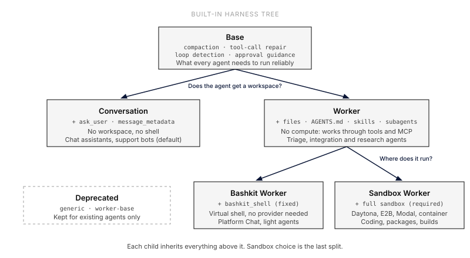

Everruns ships with built-in **harness types** and **capabilities** that provide the foundation for agent sessions.

## Harnesses

A harness defines reusable session behavior: system prompt, default model, starter files, network
policy, and bundled capabilities. Every session is assigned a harness. An Agent
[Sandbox Template binding](/features/sandbox-templates/) independently selects the filesystem and compute
target for new sessions.

| Harness | Description | Capabilities |
|---------|-------------|-------------|
| [Base](/built-ins/harnesses/base/) | System essentials every agent needs | Compaction, error disclosure, tool-call repair, loop detection, approval guidance |
| [Conversation](/built-ins/harnesses/conversation/) | Default for dialogue, no workspace | Base + structured questions, message timestamps |
| [Worker](/built-ins/harnesses/worker/) | Worker without compute | Base + files, AGENTS.md, skills, long context, budgeting, subagents, tasks |
| [Bashkit Worker](/built-ins/harnesses/bashkit-worker/) | Worker with the Bashkit virtual shell | Worker + Bashkit shell, fixed Sandbox Template |
| [Sandbox Worker](/built-ins/harnesses/sandbox-worker/) | Worker with a full sandbox | Worker + the shell of a container or managed Sandbox Template |
| [Worker Base (deprecated)](/built-ins/harnesses/worker-base/) | Deprecated legacy bundle | Files, bash, project instructions |
| [Generic (deprecated)](/built-ins/harnesses/generic/) | Deprecated legacy bundle | 25 configured |
| [Data Analyst](/built-ins/harnesses/data-analyst/) | SQL databases, charts, persistent memory | Bashkit Worker + data capabilities; available as a built-in example |

[Platform Chat](/built-ins/harnesses/platform-chat/) is a managed Agent bound to Bashkit Worker.

See the [Harnesses feature guide](/features/harnesses/) for harness selection, API management, and the prompt stack model.

## Harness Examples

Harness examples are adoptable templates. Import them when you want a preconfigured starting point, then customize the resulting org-owned harness.

| Example | Import Name | Description |
|---------|-------------|-------------|
| Coding | `coding` | Sandbox Worker + coding behavior and GitHub Scout; the Agent Sandbox Template binding selects Daytona, a container, or another full sandbox |
| Data Analyst | `data-analyst` | Bashkit Worker + SQL databases, charts, persistent memory, and curated data knowledge |

## Capabilities

Capabilities are modular units that extend what an agent can do. Each can contribute tools, system prompt additions, and UI features.

Browse the full [Capabilities reference](/capabilities/) for the complete list organized by category.
