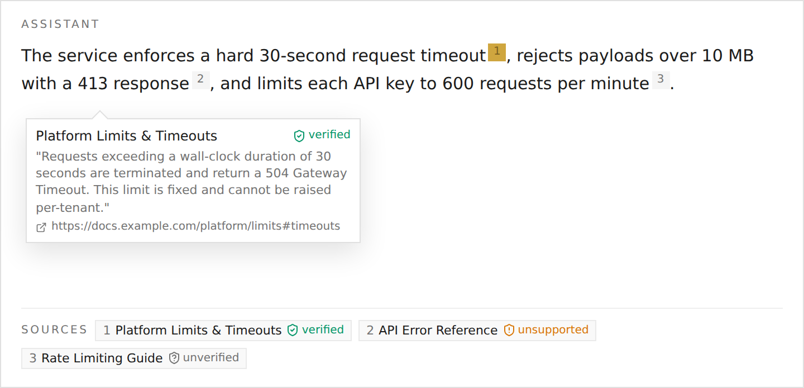

| | |
|---|---|
| **ID** | `citation_verification` |
| **Category** | Knowledge |
| **Features** | `citations` |
| **Guardrail** | Yes |
| **Dependencies** | None |

Check that each citation is **faithful**: that the source it points to actually supports the sentence it is attached to, and stamp a verdict on it. It is a guardrail capability, decoupled from the feeds: it consumes the citations collected during a turn (from [Retrieval Citations](/capabilities/citation-retrieval/) or any future feed) and verifies them uniformly, so any feed can be paired with any verifier.

It contributes **no tools** and **no system prompt**. The verdict renders in the UI as a badge on each source.

## Verdicts

Each citation gets one of three verdicts, shown as a badge on the chip preview and in the **Sources** strip:

| Verdict | Meaning |
|---|---|
| `entailed` | The source supports the claim. Rendered as a green **verified** badge. |
| `unsupported` | The source does not support the claim. Rendered as an amber **unsupported** badge. |
| `uncertain` | Support could not be established. Rendered as an **unverified** badge. |

## Modes

| Mode | Cost | Behavior |
|---|---|---|
| `heuristic` (default) | Free | Deterministic lexical entailment, token overlap between the claim span and the source snippet. No model call. A weak but honest baseline, strongest on verbatim citations. |
| `llm` | One utility-model call per citation | A utility-model judgement per claim/source pair (claim = hypothesis, snippet = premise). More accurate; falls back to the heuristic when no utility model is configured. |

## Configuration

| Field | Type | Default | Description |
|---|---|---|---|
| `mode` | `"heuristic"` \| `"llm"` | `"heuristic"` | Verification strategy (see above). |
| `threshold` | number (0–1) | `0.5` | Entailment threshold for the heuristic verdict, the fraction of the claim's distinctive tokens the source must cover to be `entailed`. |

## Notes

- **Feed-agnostic**: verifies citations from any feed via the shared render contract, so evals can hold the feed fixed and vary only the verifier.
- **Enabled by default**: `citation_verification` is part of the generic (default) harness in `heuristic` mode, so citations are verified out of the box with no model cost.
- **`llm` mode needs a utility model**: with none configured it degrades gracefully to the heuristic rather than failing.
- **No new data egress**: the verifier reasons only over text the feed already retrieved.

## See Also

- [Retrieval Citations](/capabilities/citation-retrieval/), the feed that produces the citations this verifies
- [Capabilities Overview](/capabilities/)
