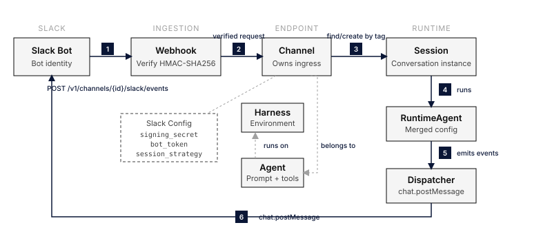
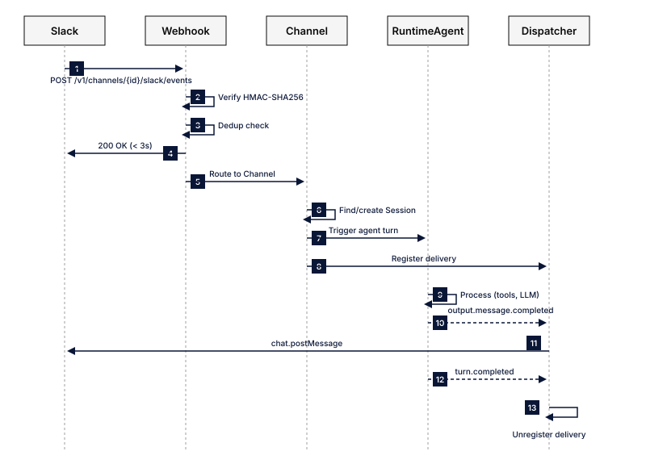

<svg xmlns="http://www.w3.org/2000/svg" viewBox="0 0 24 24" width="52.0" height="52.0" aria-hidden="true" style="float: right; margin-left: 16px;"><path d="M9 3.5L7 20.5M17 3.5l-2 17M4 8.5h16M3.2 15.5h16" fill="none" stroke="currentColor" stroke-width="1.8" stroke-linecap="round"/></svg>

Everruns connects an Agent to Slack in two parts:

- A **Slack endpoint** owned by the Agent receives Slack Events API requests, routes each conversation to a session, and posts the Agent's responses back to Slack. This is how users talk to the Agent in Slack.
- The **`slack` capability** lets the Agent act in that conversation beyond replying: reactions, message updates, file uploads, and user lookups. See [Slack actions](#slack-actions).

## What You Get

- **Conversational agents in Slack**: Users interact with the Agent in channels, threads, direct messages, or Slack's agent pane.
- **Session routing**: Conversations map to sessions by thread, channel, or user.
- **Secure webhooks**: Everruns verifies requests with Slack's signing secret.
- **Async responses**: Everruns acknowledges Slack immediately and posts the Agent's response when it is ready.
- **Per-endpoint Slack bots**: Each Slack endpoint has its own Slack app, credentials, identity, and lifecycle.

## Before You Start

- Create an active Agent.
- Give Everruns a public HTTPS origin. Set `PUBLIC_APP_URL` to that origin and restart Everruns.
- Ask a Slack workspace administrator for permission to install an app.
- An organization administrator connects your Slack workspace once; see [Connect a Slack Workspace](#connect-a-slack-workspace).

Slack cannot verify `localhost`. For local development, expose Everruns through a public HTTPS tunnel before you create the Slack app.

## Connect a Slack Workspace

Every Agent you put in Slack gets its own Slack app, with its own name and its own entry in Slack's Agents menu. Everruns creates those apps for you in your workspace. To do that it needs a Slack configuration token for the workspace, which an organization administrator adds once:

1. Open **Settings** > **Slack workspaces**.
2. Select **Open api.slack.com/apps**, signed in to the workspace you want your Agents in.
3. Scroll to **Your App Configuration Tokens**, select **Generate Token**, and pick the workspace.
4. Copy the **Refresh Token** (it starts `xoxe-1-`) and paste it into Everruns. Do not copy the access token above it.

Everruns connects the workspace as soon as you paste the token, rotates it immediately, and stores only the encrypted replacement. You do not need to repeat this for each Agent.

The token can create and change any Slack app in that workspace, and your Slack workspace may require an administrator to generate it. An organization can connect more than one workspace.

**Disconnecting a workspace** does not affect Agents already in it: each has its own Slack app and keeps working. Until you connect the workspace again, you cannot add Agents to it or update their Slack apps.

## Connect an Agent to Slack

### 1. Create a Slack Endpoint

1. Open the Agent.
2. Select **Integrations**.
3. Select **Add endpoint**.
4. Select **Slack**.
5. If your organization has connected more than one Slack workspace, choose one.
6. Choose the session strategy and reply mode. Leave the Slack credentials empty.
7. Select **Save endpoint**.

Everruns opens the endpoint editor after it saves the endpoint.

### 2. Publish the Endpoint

Select **Publish** in the endpoint editor. Publishing makes only this endpoint live.

Publish before you create the Slack app. The generated Slack manifest contains the endpoint's Request URL, and Slack verifies that URL when it creates the app.

### 3. Add the Agent to Slack

Select **Add to Slack** in the endpoint editor. Everruns creates the Agent's Slack app in the chosen workspace and opens Slack's consent screen with that workspace selected. Approve it, and Everruns stores the app's signing secret, bot token, and workspace ID on this endpoint. The endpoint then shows **Live in Slack** with an **Open in Slack** link.

If your Slack workspace requires administrators to approve apps, Slack sends an approval request instead of installing straight away.

Deployments without `SECRETS_ENCRYPTION_KEY` do not create Slack apps. If Everruns reports that one-click setup is unavailable:

1. Return to the Agent's **Integrations** tab.
2. Expand the live Slack endpoint.
3. Select **Create Slack app**.
4. Review Slack's pre-filled manifest and select **Create**.
5. Install the app to your workspace.
6. Copy the **Signing Secret** from **Basic Information**.
7. Copy the **Bot User OAuth Token** (`xoxb-...`) from **OAuth & Permissions**.
8. Select **Configure** on the endpoint, enter both values, and select **Save**.

The manifest already contains the bot scopes, event subscriptions, interactivity URL, and canonical endpoint Request URL:

```text
https://your-everruns-host/api/v1/e/{endpoint_id}/slack/events
```

Do not replace `{endpoint_id}` with an Agent ID or an App ID.

### 4. Invite and Test

1. In Slack, enter `/invite @botname` in a channel.
2. Mention the bot or send it a direct message.
3. Return to the Agent's **Integrations** tab and expand the Slack endpoint.
4. Confirm that the setup checklist records the first message.

## Configure a Slack App Manually

Use this flow only when you cannot use **Add to Slack** or **Create Slack app**.

1. Create and publish a Slack endpoint from the Agent's **Integrations** tab.
2. Copy its Request URL from the expanded endpoint row.
3. In [Slack API Apps](https://api.slack.com/apps), select **Create New App** > **From scratch**.
4. Add these bot token scopes under **OAuth & Permissions**:
   - `chat:write`
   - `channels:history`
   - `groups:history`
   - `im:history`
   - `mpim:history`
   - `app_mentions:read`
   - `users:read`
5. Add these bot events under **Event Subscriptions**:
   - `message.channels`
   - `message.groups`
   - `message.im`
   - `message.mpim`
   - `app_mention`
6. Paste the endpoint Request URL into Slack's **Request URL** field.
7. Install the Slack app to your workspace.
8. Copy the signing secret and bot token into the endpoint's **Configure manually** fields.
9. Save the endpoint.

## Existing Installs

Existing Slack installs that use `/v1/apps/{app_id}/…` URLs continue to work. Everruns keeps those routes as permanent compatibility aliases. New installs use `/v1/e/{endpoint_id}/…`, which is the canonical endpoint-owned form.

## Endpoint Configuration

| Field | Required | Description |
|-------|----------|-------------|
| `signing_secret` | Before use | Slack app signing secret for HMAC-SHA256 verification. It can be empty while you create the endpoint, but the endpoint rejects all Slack requests until it is set. |
| `bot_token` | Before use | Bot User OAuth Token (`xoxb-...`) for sending responses. It can be empty while you create the endpoint. |
| `channel_id` | No | Restrict the endpoint to one channel, such as `C0123456789`. |
| `team_id` | No | Slack workspace ID. |
| `session_strategy` | No | `per_thread` by default, `per_channel`, or `per_user`. |
| `agent_surface_enabled` | No | `false` by default. Also serve Slack's agent pane; see [Agent Surface](#agent-surface). |

## Agent Surface

Slack apps can also appear as an **agent**, a dedicated assistant pane separate from channel conversations. Enabling `agent_surface_enabled` adds this pane without changing channel replies.

The generated manifest adds:

- the `features.agent_view` block with an `agent_description` derived from the Agent;
- the `assistant:write` bot scope; and
- the `app_home_opened`, `app_context_changed`, `agent_session_stopped`, and `agent_session_title_changed` bot events.

Enabling the pane on an existing Slack app requires a reinstall because a configuration change cannot grant the new `assistant:write` OAuth scope. Generate a fresh manifest, update the Slack app, and reinstall it. Channel replies continue while you do this.

Session strategy in the pane is always `per_thread`. The configured strategy still applies to channel conversations.

### Streaming Replies

Replies in the agent pane render as the Agent produces them. Channel threads receive one finished message instead of token-by-token updates.

## Session Strategies

| Strategy | Behavior | Tag Pattern |
|----------|----------|-------------|
| `per_thread` | Each Slack thread is a separate session. | `slack:thread:{thread_ts}` |
| `per_channel` | One session serves the channel. | `slack:channel:{channel}` |
| `per_user` | One session serves each Slack user. | `slack:user:{user}` |

Use `per_thread` for most Slack bots.

## How It Works

### Architecture



### Message Flow



**Inbound path:**

1. Slack posts a message event to `/v1/e/{endpoint_id}/slack/events`.
2. The endpoint verifies the signing secret and rejects duplicates.
3. Everruns acknowledges Slack within three seconds.
4. The endpoint finds or creates a session from the configured strategy.
5. Everruns creates a user message and starts an Agent turn.

**Outbound path:**

6. The Slack delivery dispatcher watches the turn.
7. The RuntimeAgent emits completed output messages.
8. The dispatcher posts each response with `chat.postMessage`.
9. Transient delivery failures retry with exponential backoff.
10. The dispatcher unregisters when the turn completes or fails.

## Troubleshooting

### URL Verification Failed

- Confirm that the endpoint is published.
- Confirm that `PUBLIC_APP_URL` is a public HTTPS origin and that Everruns restarted after the value changed.
- Confirm that the Request URL contains `/v1/e/{endpoint_id}/slack/events`.

### Bot Does Not Respond

- Confirm that the endpoint is published and enabled.
- Invite the bot to the channel with `/invite @botname`.
- Confirm that the Slack app has the required bot events and the `chat:write` scope.
- Confirm that the endpoint has the correct signing secret and bot token.

### Request Verification Failed

- Confirm that the endpoint's signing secret matches the value under the Slack app's **Basic Information** page.
- Confirm that the Everruns server clock is accurate.

## Approvals

When an Agent pauses for approval, Slack renders **Approve** and **Decline** buttons in the thread. Only the person whose message the Agent is answering can use them.

The generated manifest already points Slack interactivity at this endpoint. A Slack app created before interactive approvals existed must save a fresh manifest once.

## Task Progress

When an Agent delegates work, Slack shows one **Tasks** message and updates it as workers finish. The message lists up to five tasks and summarizes larger groups by count.

## Slack actions

| | |
|---|---|
| **ID** | `slack` |
| **Category** | Integrations |
| **Features** | `slack_actions` |
| **Dependencies** | None |

An agent published to a Slack endpoint can reply in its thread. The `slack` capability lets it do
the rest, as the same bot the workspace invited: react to a message, rewrite one it posted, share a
file, or resolve a user ID to a name.

No second credential. The tools resolve the endpoint's own bot token server-side, so there is
nothing extra to provision, scope, or rotate.

### Requirements

The tools only work in a session a Slack message created. An agent that has the capability enabled
but is running from the API, a schedule, or another channel has no Slack endpoint to act as, and
every tool returns an error saying so rather than acting as some other endpoint's bot.

Where an agent carries two Slack endpoints, each with its own bot, the tools act as the endpoint
that created the session.

Your Slack app needs the scope for each action you use: `reactions:write` for reactions,
`chat:write` for updates, `files:write` for uploads, and `users:read` for lookups. Slack answers a
missing scope with an error the agent sees.

### Tools

#### `slack_add_reaction`

Slack messages include their exact channel and timestamp in the agent's context.
The agent uses that reference to target a reaction; a message's date or rounded
timestamp cannot identify it.

If a bot was installed before reaction permission was included, reconnect the
Slack app and approve `reactions:write`. Deploying an updated manifest does not
add permissions to an existing bot token.

Add an emoji reaction to a message. The cheapest acknowledgement available — prefer it over posting
"working on it".

| Parameter | Type | Required | Description |
|---|---|---|---|
| `channel` | string | yes | Channel ID the message is in |
| `timestamp` | string | yes | The message's `ts` |
| `name` | string | yes | Emoji name without colons (e.g. `eyes`) |

Reacting with an emoji that is already there succeeds; the result says `already_reacted`.

#### `slack_update_message`

Rewrite a message this bot posted. Use it to turn a status message into its result instead of
posting a second message.

| Parameter | Type | Required | Description |
|---|---|---|---|
| `channel` | string | yes | Channel ID the message is in |
| `timestamp` | string | yes | The `ts` of the bot message to rewrite |
| `text` | string | yes | Replacement text; Markdown is rendered |

Only messages this bot posted can be updated.

#### `slack_lookup_user`

Resolve a Slack user ID to that person's display name, real name, timezone, and whether they are a
bot.

| Parameter | Type | Required | Description |
|---|---|---|---|
| `user_id` | string | yes | Slack user ID (the `<@U…>` mention form is accepted) |

Returns only those addressing fields. Email, phone, and title are not exposed to the agent.

#### `slack_upload_file`

Share a file into the conversation. Use it for reports, diffs, and logs too long to read in a
message.

| Parameter | Type | Required | Description |
|---|---|---|---|
| `channel` | string | yes | Channel ID to share into |
| `filename` | string | yes | Filename shown in Slack, including its extension |
| `content` | string | yes | The file's text content |
| `thread_ts` | string | yes | Thread timestamp of the current conversation |
| `initial_comment` | string | no | Message posted alongside the file |

Content is capped at 8 MiB.

### Notes

- Posting to an arbitrary channel is deliberately not offered. The blast radius of "anywhere the bot
  is" is wider than "the thread that asked". The control plane verifies the channel and thread
  against trusted session metadata before sending an action to Slack.
- A retired or disabled endpoint stops acting immediately, even for a session it created earlier.
- Slack rate limits reach the agent with Slack's own retry advice rather than as a generic failure.
- The [Slack MCP server](/features/mcp/) stays supported for anything this does not cover. This
  removes the second credential for the common cases; it does not replace MCP.

## See also

- [Publish an Agent to Slack](/how-to/publish-to-slack/): a step-by-step guide.
- [Endpoints](/features/endpoints/): every endpoint type and the endpoint lifecycle.
- [Slack API Documentation](https://api.slack.com/docs) and the [Slack Events API](https://api.slack.com/events-api).
