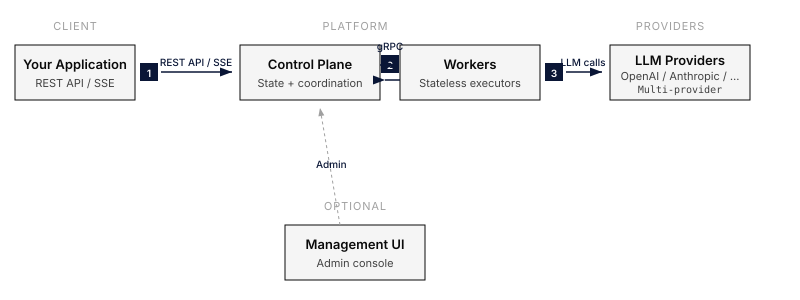

Everruns is **API-first** and **headless**. The web UI is optional, the SDKs are optional, and the entire platform is reachable through a documented REST API. This page explains why.

## Two processes, one database

A running Everruns deployment is two kinds of process plus PostgreSQL:

- The **control plane** exposes the REST API, owns auth, serves SSE event streams, and persists all state in PostgreSQL.
- **Workers** execute the agentic loop. They claim durable tasks, call LLMs, run tools, and report results back. They hold no long-lived state, restart any worker at any time and nothing breaks.

The control plane scales vertically and is fronted by a load balancer. Workers scale horizontally, add more for throughput, remove some to save cost. PostgreSQL is the only piece of stateful infrastructure.

## Why a separate worker tier?

You could run the agentic loop in the API server process and avoid the extra hop. Everruns doesn't, for three reasons:

1. **LLM calls are long.** A single turn easily spends 10–60 seconds in network I/O. Tying that to the request thread caps API throughput and makes deploys painful.
2. **Failure isolation.** A misbehaving tool that hangs the worker process should not take down the API. They're separate concerns and they get separate processes.
3. **Durability.** Workers can crash and the task gets reclaimed by another worker. Tying execution to a request would lose the work the moment the connection drops.

The control plane and workers talk over gRPC inside your VPC. End users only ever see the REST API.

## Why headless

Most agent platforms ship a chat UI and treat the API as a side-channel. Everruns inverts this: the API is the product, and the UI is one client among many (the SDK, the CLI, customer-built apps, and the bundled management UI all consume the same endpoints).

The consequences:

- Every feature has to land in the API before it lands in the UI. There are no "UI-only" features.
- You can ship Everruns as backend infrastructure for a product whose UI looks nothing like ours.
- Multitenancy, auth, and quotas are enforced at the API layer, so you cannot accidentally bypass them by using a different client.

The management UI exists for operators, configuring providers, browsing sessions, debugging events, not as the primary interaction surface.

## Why REST + SSE, not WebSockets

Sessions need a bidirectional flow: the client posts messages, the server streams events. WebSockets would be a natural fit, but Everruns uses **REST for writes and SSE for reads**.

- REST is cacheable, debuggable with `curl`, and survives every reverse proxy on the planet.
- SSE is a one-way streaming protocol that works through HTTP/1.1, HTTP/2, and HTTP/3 with no special infrastructure.
- The events you'd want to push to the server (cancel, new message) are infrequent enough that a `POST` is the right shape.

Combined with `since_id` resumption and 5-minute connection cycling, SSE gives you reconnection-as-a-feature instead of reconnection-as-a-bug.

## Multitenancy and isolation

Everruns is organization-scoped end-to-end:

- All resources (agents, sessions, capabilities, providers) belong to exactly one organization.
- API keys carry an org membership; the API enforces the boundary on every request.
- Sessions are isolated at the database row level, there is no cross-session filesystem or key-value access.
- Secrets are encrypted at rest with an organization-scoped key chain.

## Where the boundaries are

Things the control plane owns: auth, durable task queue, event log, virtual filesystem, key-value storage, capability registry, MCP catalog.

Things workers own: nothing persistent. They borrow the database, run their tasks, and report back.

Things your application owns: the agent definitions, the prompt design, and the channel-specific glue (Slack apps, webhooks, schedules). The platform is intentionally neutral about *what* you build with it.
