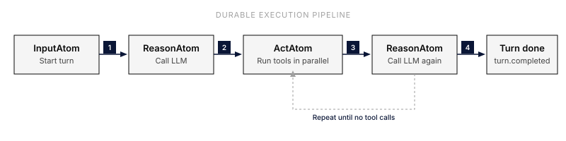

The word "durable" in "durable agentic harness engine" means a specific thing: **every step of an agent's execution survives a process restart**. This page explains why that matters, how it works, and what it costs.

## The problem

An agent turn looks simple from the outside, send a message, get a streamed response. Internally it's a chain of network calls that each take seconds:

1. Call the LLM provider.
2. Parse tool calls, dispatch them.
3. Wait for each tool to return.
4. Call the LLM again with the results.
5. ...repeat...

Anywhere in that chain, the worker process can crash, the container can be reaped, the network can blip. A naïve implementation loses all the work done so far and forces the user to retry. For a 30-second turn that already burned tokens, this is unacceptable.

## The mechanism

Everruns runs every step as a **durable task**. Each task:

- Has a typed input and output.
- Persists its result to PostgreSQL before acknowledging completion.
- Has retry and timeout policies.
- Heartbeats while running, so the control plane can detect a crashed worker.

A turn is a small state machine over those tasks. Each step (`process_input`, `reason`, `act`) is one task on the queue. When a step completes, the turn's state is checkpointed and handed to the next step's task, and the workflow's history (`durable_workflow_events`, an append-only log just for the workflow engine) records what was scheduled and how it ended. A step that is retried starts from the checkpoint of the step before it, so recovery never replays the whole turn or the whole conversation.

When a worker crashes mid-turn, the control plane sees the missed heartbeats, marks the in-flight task as failed, and re-queues it. Another worker picks it up. The application sees a momentary stall in the SSE stream, then it continues.

## Why a custom engine

The obvious alternative is Temporal (or Cadence, or Restate). Everruns deliberately built its own minimal durable engine, `everruns-durable`, instead. It is a generic, published Rust crate (task queue, event log, signals, timers, schedules, retries, dead letter queue, circuit breakers) with no agent concepts; the agent turn driver on top of it lives in `everruns-durable-engine`. The reasoning:

1. **Single dependency.** PostgreSQL is the only required stateful infrastructure (Valkey and NATS are optional). Operators don't need to run a second cluster with its own ops story.
2. **Co-located with the rest of the platform.** Workflow events and session events live in the same database, in the same transaction when needed. There's no eventual consistency between "what happened" and "what was reported."
3. **Tight scope.** Everruns runs agentic workflows specifically, limited fan-out, short-to-medium duration, well-understood failure modes. We don't need the full Temporal feature set, and the operational surface area of a tightly-scoped engine is much smaller.

The trade-off: no multi-region replication beyond what PostgreSQL itself offers, no language-agnostic SDK (the engine is a Rust library), no visual workflow designer. For agent execution these are not missed.

## Guarantees

What durable execution gives you:

- **No work lost on crash.** If a worker dies, another worker resumes from the last persisted step. Tokens already paid for are not paid for again.
- **Persisted tool results.** Tool calls are persisted by their result, not their attempt, so a tool whose result was recorded is not re-run. Execution is at-least-once: see the caveat below for a tool that completes but crashes before its result is persisted.
- **Authoritative history.** Reloading a session reads back the same persisted message sequence, which makes traces and exports authoritative.

What it doesn't give you:

- **Idempotence of side effects.** If your tool POSTs to an external API, the external API will see one call per *successful* execution but a retried-task scenario can still cause duplicates if a tool completes externally and crashes before persisting. Tools that have external side effects must include their own idempotency keys.
- **Real-time latency guarantees.** Persisting every step adds tens of milliseconds per task. For agent workloads (already dominated by LLM latency) this is invisible; for hot-loop workloads it would be costly.

## Durability in the Framework

Rust applications that embed the [Framework](/framework/) get durability from
the session's event log rather than a turn queue. With `LocalConfig` the log
outlives the process, and a turn a restart cut off continues from it: calls
that are safe to repeat run again, the rest are recorded as interrupted. Each
session runs as an actor that holds its lease while a turn runs, so processes
that share a data directory never run one session at once. See [Framework
Architecture](/framework/architecture/).

## When the database becomes the bottleneck

Everruns is designed to run on a single PostgreSQL primary. Read replicas help for reporting; write-heavy session loads are kept manageable by keeping event payloads compact.

In practice, LLM provider rate limits tend to cap throughput long before the database does.

## Further reading

- [The agentic loop](/explanation/agentic-loop/), what each step inside a turn looks like.
- [Architecture](/explanation/architecture/), how the control plane and workers interact.
