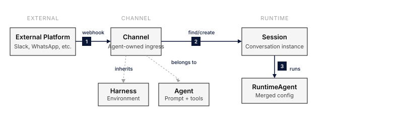

An **App** turns a Harness + Agent pair into a deployed service that responds to external messages. The App owns the channel-specific binding (such as Slack, webhook, or AG-UI), the inbound auth, the session-routing strategy, and the publish/unpublish lifecycle.

The same agent can back multiple apps (e.g., a Slack deployment and a webhook deployment), and each app's lifecycle is independent.



## How it works

1. An external channel sends a request to the app's endpoint.
2. The app verifies the request using channel-specific auth (signing secret, OIDC, mTLS, etc.).
3. A session is found or created according to the session strategy.
4. The agent processes the message and the response flows back through the channel.

## Channels

| Channel | Status | What it does |
|---|---|---|
| Slack | Available | Deploy as a Slack bot |
| AG-UI | Available | AG-UI inbound channel |
| Schedule | Deprecated | New channels are rejected; use [Agent triggers](/features/agent-triggers/) |
| Webhook | Available | HTTP-triggered invocation |
| WhatsApp | Planned |, |
| Web Widget | Planned |, |

See [Slack Integration](/integrations/slack/) for the Slack-side setup.

## Session routing

Each channel chooses how incoming messages map to sessions:

| Strategy | Behaviour | Use when |
|---|---|---|
| `per_thread` (default) | Each thread is its own session | Support bots, Q&A |
| `per_channel` | One session per channel | Persistent channel assistant |
| `per_user` | One session per user | Personal assistant |

Webhook channels use their own routing model (shared session vs. per-invocation). Agent triggers provide the same choice for scheduled runs.

## Migrating App schedules

Agent triggers are now the home for proactive scheduled execution. Existing agent-bound App schedule channels are migrated automatically with their cron expression, timezone, session mode, message, durable execution identity, and history preserved. Existing Apps without an agent are grandfathered and remain compatible.

For new scheduled work, create a trigger from the agent's **Triggers** tab. See [Agent triggers](/features/agent-triggers/#migrate-from-app-schedule-channels) for the migration details and the distinction between agent triggers, App webhooks, and session schedules.

## Lifecycle

```
draft → published → draft → archived
```

- **Draft**: configured but does not accept incoming requests.
- **Published**: live; webhook requests are processed.
- **Archived**: soft-deleted and hidden from listings.

Unpublishing stops new message processing; existing sessions remain accessible.

## Reference

| Method | Path | Description |
|---|---|---|
| POST | `/v1/apps` | Create app |
| GET | `/v1/apps` | List apps |
| GET | `/v1/apps/{app_id}` | Get app |
| PATCH | `/v1/apps/{app_id}` | Update app |
| DELETE | `/v1/apps/{app_id}` | Archive |
| POST | `/v1/apps/{app_id}/publish` | Publish |
| POST | `/v1/apps/{app_id}/unpublish` | Unpublish |

Full request/response schemas in the [API reference](/api/).

## Do something

- [Publish an agent as a Slack app](/how-to/publish-to-slack/), end-to-end deployment.
- [Slack Integration](/integrations/slack/), Slack-side manifest and OAuth setup.

## See also

- [Agent Versions](/features/agent-versions/), pin an app to a specific agent version.
- [Agent triggers](/features/agent-triggers/), run an agent proactively without an App schedule channel.
- [Concepts: Apps](/explanation/concepts/#apps-connect-agents-to-the-outside-world)
