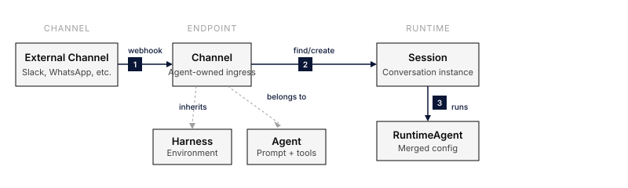

A **channel** is an Agent-owned way for an external caller to reach that Agent and get a reply. Each channel belongs to exactly one Agent and has its own transport configuration, authentication, session routing, and publish state. One Agent can have several channels, and publishing or unpublishing one does not change the others.

Use a channel when an external peer sends a request and waits for a reply. Use an [Agent trigger](/features/agent-triggers/) when a schedule or event starts Agent work without a reply channel.




## Channel types

| Type | `channel_type` | Who calls it | Canonical route | Guide |
|---|---|---|---|---|
| Slack | `slack` | Slack users, through a Slack app | `/v1/channels/{channel_id}/slack/events` | [Slack](/capabilities/slack/) |
| AG-UI | `ag_ui` | Browser and app clients that speak the AG-UI protocol | `/v1/channels/{channel_id}/ag-ui` | [AG-UI](#ag-ui) |
| A2A | `a2a` | Other agents, over the A2A protocol | `/v1/channels/{channel_id}/a2a` | [A2A](/features/a2a/) |
| FCP | `fcp` | Any HTTP client, text in and text out | `/v1/channels/{channel_id}/fcp` | [FCP](#fcp) |
| Public Chat | `public_chat` | Visitors to a hosted chat website for one Agent | `/v1/channels/{channel_id}/public-chat` | [Public Chat](#public-chat) |
| Voice | `voice` | People talking from a browser or app, over WebRTC | `/v1/agents/{agent_id}/channels/{channel_id}/voice/calls` | [Voice](/features/voice/) |
| Agent API | `api` | Your own code, with an agent key | `/v1/channels/{channel_id}` | [Agent API](#agent-api) |

Routes are relative to the API base, for example `https://your-everruns-host/api`. The channel ID in each route is the channel's own ID, not the Agent's.

## Create a channel

1. Open the Agent and select the **Integrations** tab.
2. Select **Add channel** and choose the channel type.
3. Configure the type-specific fields and select **Save channel**.
4. Select **Publish** to make the channel live.

The same operations are available over the API under `/v1/agents/{agent_id}/channels`, with `publish` and `unpublish` actions per channel. Every channel runs the Agent's current configuration.

## Channel lifecycle

Each channel has its own lifecycle:

```text
Draft ⇄ Live
Draft → Disabled
Live → Disabled
Disabled → Draft
```

- **Draft**: Configured but does not accept ingress traffic.
- **Live**: Published and able to accept traffic while its Agent is active and exposures are not suspended.
- **Disabled**: Kept for configuration but rejects ingress traffic and does not invoke the Agent.

Publishing and unpublishing require the dangerous Agent permission (Owner by default). The same permission is required to change a live channel's configuration, including its authentication and secrets, or to disable it. Members who can manage Agents can still edit Draft and Disabled channels.

A channel serves traffic only when all three hold: the channel is live, the Agent is active, and the Agent's exposures are not suspended. Suspending exposures from the Agent's **Integrations** tab takes every channel of that Agent offline at once without changing each channel's state.

Errors from public channels are sanitized so they do not expose internal state, such as whether a channel exists or why it is offline.

## AG-UI

An AG-UI channel lets a client that speaks the [AG-UI protocol](https://docs.ag-ui.com/) run the Agent and stream its events. The channel accepts AG-UI `RunAgentInput` and streams AG-UI 1.0 events over SSE. Public Chat uses the same protocol.

### Upgrade a pre-1.0 client

Use a 1.0-compatible AG-UI client for existing channels as well as new ones. The reasoning event names changed:

| Pre-1.0 event | AG-UI 1.0 event |
|---|---|
| `THINKING_START` | `REASONING_START` |
| `THINKING_TEXT_MESSAGE_START` | `REASONING_MESSAGE_START` |
| `THINKING_TEXT_MESSAGE_CONTENT` | `REASONING_MESSAGE_CONTENT` |
| `THINKING_TEXT_MESSAGE_END` | `REASONING_MESSAGE_END` |
| `THINKING_END` | `REASONING_END` |

Custom handlers must recognize the new names to render reasoning. This is a breaking wire change for clients that require `THINKING_*`; the channel does not translate events back to that vocabulary. Text messages still use `TEXT_MESSAGE_*`.

With npm `@ag-ui/core` 1.0, import validation schemas from `@ag-ui/core/schemas`:

```ts
import { EventSchemas, RunAgentInputSchema } from "@ag-ui/core/schemas";
```

Send `protocolVersion: "1.0"` in the run request to receive the version in `RUN_STARTED`. Omitting it suppresses that response field; it does not select the old protocol. Open text and reasoning messages and reasoning spans close before a terminal event. Cancelled runs finish with `outcome: { type: "cancelled" }`.

Subagent events and their activity snapshots are available when the channel enables `subagents_visible`. This setting defaults to off and stays off for Public Chat.

The agent's todo list is available as AG-UI shared state when the channel enables `state_visible`, which defaults to off and stays off for Public Chat. The state is `{ "todos": [{ "content", "activeForm", "status" }] }`: a run sends `STATE_SNAPSHOT` the first time it knows the list (at run start when the conversation already has one) and `STATE_DELTA` JSON Patches for later changes. State the client sends in the run request is not read.

### Visibility and access

AG-UI channels are public client surfaces, so they expose less than the Agent's own event stream:

- `tool_visibility` controls tool activity: `none`, `generic` (a fixed text you configure in `generic_tool_text`), or `narrated`. Raw tool names, arguments, and results are never sent.
- Reasoning summaries, token usage, subagent activity, the todo list as shared state, and client answers to tool-approval interrupts are off by default, each behind its own setting.
- Access is anonymous by default. Set a shared `token` or an `auth` block to require authentication, and `rate_limit_per_minute` to cap requests per IP.
- A thread stays resumable for `session_expiration_seconds` (6 hours by default); after that, the same thread ID starts a new session.

To serve AG-UI from a Rust application without the Platform, see [AG-UI in the Framework](/framework/ag-ui/).

## FCP

An FCP channel implements the [Free Communication Protocol](https://github.com/everruns/fcp/blob/main/SPEC.md), a minimal text-in, text-out HTTP interface:

- `GET` returns a Markdown handshake that describes what the channel can do and how to authenticate.
- `POST` takes plain text, or `{"message": "..."}`, runs one turn, and returns the Agent's final reply as Markdown. There is no streaming.

Every response, including errors, is `text/markdown` with instructions that point back to the handshake. Access is anonymous by default; set `anonymous` to `false` and a `token` to require a shared bearer token. FCP has its own rate limit and does not accept the `auth` block that AG-UI and A2A use. `response_timeout_seconds` (120 by default) bounds how long a `POST` waits for the reply.

## Public Chat

A Public Chat channel serves an isolated, hosted chat website for one Agent. Visitors see only that Agent: there is no console navigation, organization switcher, or access to other agents, channels, or sessions.

- Visitors can be anonymous, or sign in through the channel's auth configuration, such as Google sign-in. Anonymous visitors can be required to pass a Cloudflare Turnstile challenge before a session starts.
- The chat streams AG-UI events, and raw tool names, arguments, results, and internal IDs never reach the browser.
- The deployment-level `public_chat` feature flag (`FEATURE_PUBLIC_CHAT`) controls whether Public Chat routes are mounted and whether the type appears under **Add channel**.

The website reads its public configuration from `/v1/channels/{channel_id}/public-chat/config`. That response never includes channel secrets.

### Sign in with AgentID

[AgentID](https://www.agentid.com) is a sign-in for AI agents. To let agents sign in to a Public Chat channel:

1. Register an AgentID client with the redirect URI `{API base URL}/v1/agentid/callback`, then set `AGENTID_CLIENT_ID` and `AGENTID_CLIENT_SECRET` on the server. One client serves every channel in the deployment.
2. Set the channel's sign-in to **AgentID** and enter the client ID. The chat page then shows **Continue with AgentID**.

Each agent becomes its own end user in the organization, keyed by its AgentID subject; it never becomes a console user. By default one agent owner can sign in 5 agents per organization; change that with `agentid_agents_per_owner` on the organization. A sign-in lasts 15 minutes, after which the agent signs in again.

To list the agent in the AgentID directory, use `{API base URL}/v1/agentid/initiate-login` as the sign-in URL and set `AGENTID_DEFAULT_CHANNEL` to the channel it should open. Without a default channel that URL creates nothing, because it does not say which chat the agent wants. `AGENTID_OWNER_SCOPES=true` also requests the owner's name and email; leave it off unless you need to contact owners.

## Agent API

An `api` channel gives one Agent a base URL that your code calls with an **agent key**. The key reaches only this Agent's session routes, never the management API.

In the console, add an **Agent API** channel on the Agent's Integrations tab, publish it, and create a key under **Agent keys** on the channel page. Through the management API, create the channel with `channel_type: "api"`, publish it, then create a key:

```bash
curl -X POST "$EVERRUNS_API/v1/agents/$AGENT_ID/channels/$CHANNEL_ID/keys" \
  -H "Authorization: Bearer $EVERRUNS_API_KEY" -H "Content-Type: application/json" \
  -d '{"name": "Support backend"}'
```

The response carries the key's `secret` (`evr_ak_…`) once. Store it then; later reads show only its prefix. Keys belong to the organization rather than to the member who created them. Each key can `rotate` (a new secret, and the old one keeps working for an overlap of up to 168 hours, 24 by default) and `revoke` (both secrets stop working).

Every route below is relative to `/v1/channels/{channel_id}` and takes `Authorization: Bearer evr_ak_…`:

| Method | Path | What it does |
|---|---|---|
| GET | `/` | The agent card: name, description, accepted input and credentials |
| POST | `/sessions` | Start a session (optional `title`) |
| GET | `/sessions` | This key's sessions, most recently active first |
| GET | `/sessions/{session_id}` | One session's status, with `pending_questions` and `pending_approvals` while it waits |
| POST | `/sessions/{session_id}/messages` | Send a user message (text parts); starts a turn or steers the running one |
| GET | `/sessions/{session_id}/events` | Events after `after_sequence`, oldest first |
| GET | `/sessions/{session_id}/sse` | Follow events live; resume with `since_id`, or replay from `after_sequence=0` |
| POST | `/sessions/{session_id}/question-answers` | Answer the agent's `ask_user` question set |
| POST | `/sessions/{session_id}/tool-approvals` | Allow or reject held-back tool calls, when the channel lets callers decide |
| POST | `/sessions/{session_id}/cancel` | Cancel the running turn |

A key sees only the sessions it started; any other session answers `404`. Channel config decides what callers see:

- `visibility`: `messages` (user input, final assistant text, turn boundaries, and questions or approvals waiting on the caller), `activity` (default; adds tool start and finish with the channel's `tool_activity_text`, never tool names or arguments) or `full` (the raw events, for callers who own both ends).
- `errors`: `public` (default; a failed turn says only a public error code) or `detailed`.
- `session_binding`: `per_user` (default) or `session_per_invocation`; sessions are never shared between keys.
- `tool_approvals`: `operator` (default; someone with access to the Agent in Everruns decides, and the caller sees only that a call waits) or `caller` (the key holder sees the tool and its arguments and decides).
- `rate_limit_per_minute`: optional, per caller and client IP.
- `auth_methods`: your own identity providers whose access tokens the channel accepts besides agent keys, each an `oidc`, `google_oidc` or `oauth2_introspection` method, for example `{"mode": "oidc", "provider": {"type": "oidc", "issuer": "https://login.example.com"}, "requirements": {"audiences": ["api://support-agent"], "scopes": ["agent:invoke"]}}`. Everruns only validates these tokens; it never issues them.

### End users

A key acts as your application. To act for one of your application's users, create the key with `"permissions": ["end_user"]` and send `End-User: <your user id>` with each request. Sessions then belong to that user: the key acting as itself, or for another user, does not see them, and the agent's per-user connections are that user's. Your users can also call the agent directly with a token from one of the channel's `auth_methods`; each token subject is its own end user.

For a browser or mobile app, never ship the key. Your backend calls `POST /v1/channels/{channel_id}/runtime-auth` with the key and `End-User`, and hands the app the returned 15-minute `access_token`, which works on this channel only and cannot be exchanged for another. End users always get the public error codes.

The stream uses the same framing as the session API's SSE: a `connected` frame, `id:` on durable events, a heartbeat, and `disconnecting` before the server cycles the connection. A question that asks for a credential cannot be answered over this API, only declined; a person completes it in Everruns.

The same routes and shapes are served by a [serve](/framework/serve/) app at `/v1/channels/{agent}`, so one client works against both.

## Other transports

The same channel model also carries transports that do not need a reply channel:

- `webhook` runs the Agent when an authenticated HTTP call reaches `/v1/channels/{channel_id}/webhook`, and is available under **Add channel**.
- `schedule` runs the Agent on a cron schedule. Create schedules as [Agent triggers](/features/agent-triggers/), which also cover webhook, GitHub, and MCP event starts.
- `api_endpoint` gives callers an execution-only API key for the session routes under `/v1/channels/{channel_id}/sessions`.

## Existing integrations

Channels replace the former **Agent Endpoint** name. Existing channel IDs and configuration stay the same. CLI commands now use `everruns agents channels`; the management API uses `/v1/agents/{agent_id}/channels`. The former `/v1/agents/{agent_id}/endpoints` routes remain aliases, and console bookmarks under `/agents/{agent_id}/endpoints` redirect to the channel pages.

## Retired Apps

Apps are retired from Everruns management. Everruns keeps existing App records for historical attribution and compatibility, and existing installs continue to serve traffic, but the App list, detail page, create flow, and management API are retired.

The old `/v1/e/{channel_id}/…` and `/v1/apps/{app_id}/…` ingress paths remain permanent aliases. They resolve to the migrated channel and continue to work. Do not rewrite a working existing installation only to change its URL. New integrations use the channel-scoped canonical routes above.

## See also

- [Publish an Agent to Slack](/how-to/publish-to-slack/): a step-by-step Slack setup.
- [A2A](/features/a2a/): inbound A2A channels and outbound delegation.
- [Voice](/features/voice/): talk to an Agent and hear its answers.
- [Agent Triggers](/features/agent-triggers/): proactive scheduled and event-driven work.
- [Change History](/features/change-history/): see and restore earlier Agent configurations.
