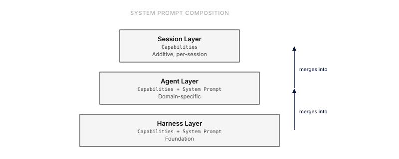

A harness defines the base environment for sessions — the system prompt, default model, and capabilities that every session starts with. Think of a harness as a "starter kit" that agents and sessions build on top of.

## Overview

When you create a session, you assign it a harness. The harness provides:

- **System Prompt**: The foundation of the prompt stack
- **Capabilities**: Tools and behaviors available to the agent
- **Default Model**: Optional default LLM model (lowest priority in the inheritance chain)

Agents add their own system prompts and capabilities on top of the harness. Sessions can add even more capabilities. The final configuration is the merged result of all three layers.

## Built-in Harnesses

Everruns ships two built-in harnesses that cover the most common starting points.

### Base

An empty harness with no capabilities. Use this when you want full control over what tools and behaviors are available.

- **Capabilities**: None
- **System Prompt**: "You are a helpful assistant."
- **Best for**: Custom configurations, testing, minimal-overhead sessions

### Generic (Recommended)

A general-purpose harness bundling the core capabilities most agents need. This is the recommended default for most use cases.

- **System Prompt**: "You are a helpful assistant."
- **Best for**: General-purpose agents, coding assistants, research workflows

**Included Capabilities:**

| Capability | What it provides |
|------------|-----------------|
| **File System** | Read, write, list, grep, and delete files in the session workspace (`/workspace`) |
| **Virtual Bash** | Sandboxed bash shell for running commands, scripts, and text processing |
| **Web Fetch** | Fetch web content with file download support (`enable_file_download: true`) |
| **Storage** | Key/value store for general data and encrypted secret storage for API keys and credentials |
| **Session** | Access session metadata and manage session title |
| **AGENTS.md** | Reads AGENTS.md from workspace and injects project-level instructions into the system prompt |
| **Skills** | Discover and activate skills from `/.agents/skills/` in the session filesystem |
| **[Infinity Context](/capabilities/infinity-context/)** | Trims older messages from the live prompt while exposing earlier history via `query_history` |
| **[OpenAI Tool Search](/capabilities/openai-tool-search/)** | Defers tool schema loading on supported OpenAI models to reduce prompt size |
| **[Context Compaction](/advanced/compaction/)** | Auto-compacts context at 85% budget via cascading strategies (observation masking → native → summarization → trim) |
| **Tool Output Persistence** | Persists full exec tool output to `/.outputs/{tool_call_id}.stdout` and `/.outputs/{tool_call_id}.stderr` before truncation, enabling lossless retrieval via `read_file` |

Infinity Context and Context Compaction work together to keep long sessions unbounded: Infinity Context windows how many messages are loaded into the prompt, while Compaction reduces the size of what's loaded. See [Context Compaction — Generic Harness Defaults](/advanced/compaction/#generic-harness-defaults) for details.

## Choosing a Harness

| Scenario | Recommended Harness |
|----------|-------------------|
| General-purpose assistant | Generic |
| Coding or scripting tasks | Generic |
| Agent that needs API keys | Generic (includes secret storage) |
| Minimal agent with one specific tool | Base + add only what you need |
| Testing capability behavior | Base |
| Custom tool composition | Base |

## Harness Naming

Every harness has two names:

- **`name`** — A stable, URL-friendly slug (e.g. `generic`, `deep-research`). Unique per org. Use this in API calls, CLI commands, and code.
- **`display_name`** — A human-readable label (e.g. "Generic", "Deep Research"). Shown in the UI.

The `name` field follows the format `[a-z0-9]+(-[a-z0-9]+)*` (max 64 chars, no consecutive hyphens) — similar to a GitHub repo name.

## Managing Harnesses

### Via API

List available harnesses:

```bash
curl http://localhost:9300/api/v1/harnesses
```

Get a harness by name or ID:

```bash
# By name
curl http://localhost:9300/api/v1/harnesses/generic

# By ID
curl http://localhost:9300/api/v1/harnesses/harness_01933b5a000070008000000000000602
```

Create a custom harness:

```bash
curl -X POST http://localhost:9300/api/v1/harnesses \
  -H "Content-Type: application/json" \
  -d '{
    "name": "research-assistant",
    "display_name": "Research Assistant",
    "description": "Harness with research capabilities",
    "system_prompt": "You are a research assistant.",
    "capabilities": [
      {"ref": "session_file_system"},
      {"ref": "web_fetch"},
      {"ref": "stateless_todo_list"}
    ]
  }'
```

Use a harness when creating a session:

```bash
# By name
curl -X POST http://localhost:9300/api/v1/sessions \
  -H "Content-Type: application/json" \
  -d '{
    "harness_name": "generic",
    "agent_id": "agent_..."
  }'

# By ID
curl -X POST http://localhost:9300/api/v1/sessions \
  -H "Content-Type: application/json" \
  -d '{
    "harness_id": "harness_01933b5a000070008000000000000602",
    "agent_id": "agent_..."
  }'
```

### Via CLI

```bash
# By name
everruns sessions create --harness generic

# By ID
everruns sessions create --harness harness_01933b5a000070008000000000000602
```

### Preview a Harness

See the merged system prompt and available tools before creating a session:

```bash
curl -X POST http://localhost:9300/api/v1/harnesses/preview \
  -H "Content-Type: application/json" \
  -d '{
    "system_prompt": "You are a helpful assistant.",
    "capabilities": [
      {"ref": "session_file_system"},
      {"ref": "virtual_bash"}
    ]
  }'
```

## How Harnesses Fit in the Prompt Stack

The system prompt is built from three layers, each wrapped in XML tags for clarity:

1. **Harness capabilities** — Foundation layer
2. **Agent capabilities** — Domain-specific layer
3. **Session capabilities** — Per-session additions

The final system prompt merges all three, with the harness system prompt at the base.


