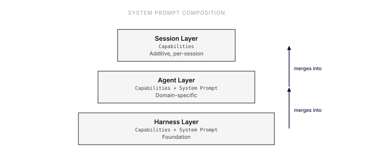

A **harness** is reusable runtime configuration: base instructions, a default model, starter files,
network policy, and a bundle of capabilities. Every session is assigned exactly one harness. Agents
and sessions then layer their own configuration on top. An Agent's
[Environment profiles](/features/environments/) select where commands run without changing that
behavior.

:::note[Harness here does not mean the agent loop]
Elsewhere in the industry, "agent harness" usually names the loop that drives the model, the thing that assembles context, calls the LLM, and dispatches tools. Everruns describes itself as a *durable agentic harness engine* in that sense.

A **Harness** (the entity on this page) is not that loop. The loop is the runtime, and you never configure it directly. A Harness is the reusable configuration a session runs on top of.
:::

The split that matters is **environment versus behavior**:

| | Answers | Owns |
|---|---|---|
| **Environment** | "Where do commands run?" | Filesystem, compute target, containment, recovery, lifecycle |
| **Harness** | "How does this runtime behave?" | Base instructions, network access, capability bundle, default model, starter files |
| **Agent** | "What role am I playing?" | Instructions, domain capabilities, the agent's voice, named Environment profiles |
| **Session** | "What is true for this one conversation?" | Per-conversation extras, overrides, a tighter network policy |

A harness exists before any agent uses it, and many agents share one.

### Who points at a harness

Both an agent and a session carry a harness reference:

- Every **agent** holds exactly one `harness_id`. It is the harness that agent's sessions run on by default. On create, an agent inherits the organization's default harness unless you pass `harness_id` or `harness_name`; an explicit choice stays pinned.
- A **session** may name its own harness and override the agent's.

Precedence when a session starts, first match wins:

1. The harness named on the session request
2. The agent's harness
3. The organization default
4. The built-in fallback

So the same agent can be run on a different harness for one session without editing the agent, while changing it for good means updating the agent.

For the design rationale (why three configuration layers exist), see [Concepts](/getting-started/concepts/#runtimeagent).

## Built-in harnesses

| Harness | What it provides | Best for |
|---|---|---|
| [Base](/built-ins/harnesses/base/) | Empty, no capabilities | Minimal agents, custom tool composition, testing |
| [Conversation](/built-ins/harnesses/conversation/) | Dialogue and context management | Simple assistants, Dad Jokes |
| [Worker Base](/built-ins/harnesses/worker-base/) | Conversation plus files, bash and project instructions | Specialized workers |
| [Worker](/built-ins/harnesses/worker/) | Worker Base plus skills, long context and delegation | General-purpose task execution |
| [Generic (deprecated)](/built-ins/harnesses/generic/) | Preserved legacy bundle | Existing bindings |
| [Data Analyst](/built-ins/harnesses/data-analyst/) | Worker Base plus SQL, charts, memory | Data workflows |

Conversation is the default. Generic remains active for existing bindings and explicit legacy references; selectors hide it until you choose Show deprecated. See the [Built-in harnesses reference](/built-ins/harnesses/base/) for the exact capability bundle each one ships with.

[Platform Chat](/built-ins/harnesses/platform-chat/) is a managed Agent with an explicit legacy Generic binding. Introductions and conversation starters belong to Agents; harnesses describe reusable execution behavior.

## Naming

Every harness has two names:

- **`name`**: stable URL-friendly slug (`conversation`, `worker-base`). Unique per org. Use this in API calls, CLI, code.
- **`display_name`**: human label shown in the UI.

`name` format: `[a-z0-9]+(-[a-z0-9]+)*`, max 64 chars, no consecutive hyphens.

## How harnesses combine with agents and sessions

The system prompt is built from three layers, each wrapped in XML tags:

1. Harness capabilities (foundation)
2. Agent capabilities (role)
3. Session capabilities (per-conversation extras)

The merge is associative: a chain of inherited harnesses produces the same `RuntimeAgent` as a single pre-merged harness.

### The base system prompt is optional

A harness bundles more than a prompt, capabilities, MCP servers, a default model, network access, and starter files. Because of that, the base `system_prompt` is **optional**. Omit it (or leave it empty) when a harness exists only to add capabilities or MCP servers on top of a parent: the effective prompt is then composed entirely from the parent harness, the agent, the session, and capability contributions. Empty or whitespace-only prompts contribute nothing, and if no layer contributes a prompt the agent runs with no base system prompt at all.

## Do something

- [Customize a harness](/how-to/customize-a-harness/), build your own as a base for many agents.
- [Equip an agent with tools](/how-to/equip-agents-with-tools/), add capabilities at the agent layer.

## See also

- [Built-in harnesses](/built-ins/harnesses/base/), reference for the shipped harnesses.
- [Environments](/features/environments/), configure Bashkit or managed Daytona compute independently of the harness.
- [Concepts](/getting-started/concepts/), entity model.
