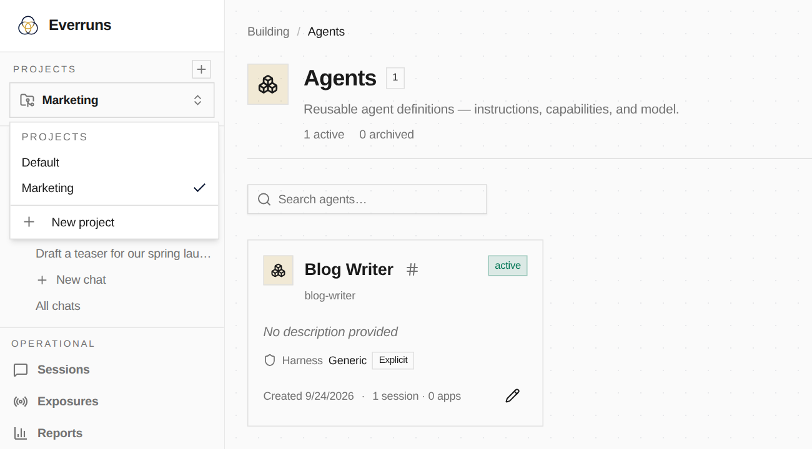

A project is the space you work in day to day. Your organization holds the people, billing, and everything the whole company shares. Projects split the organization's agents by team or purpose, so the support team sees its agents and conversations, and the marketing team sees its own.

## What belongs to a project

A project groups **agents**, and everything an agent owns comes with it:

- its chats and sessions, including the work it hands to other agents
- its endpoints and triggers
- its versions and agent memory

An agent in one project is invisible from another, and so is everything above. A running agent can only see and hand work to agents in its own project.

What stays **shared across the organization**: harnesses, models, providers, agent identities, skills, MCP servers, capabilities, knowledge, and organization memory. Set up a skill or an MCP server once, and agents in every project can use it.

Members, billing, and usage limits also stay with the organization.

## Turn on Projects

Projects is an experimental feature. Where your deployment offers it, an organization owner or admin turns it on in **Settings → Features**.

Nothing moves when you turn it on. Every organization has a **Default** project, and all existing agents and chats are already in it. Turning Projects off again hides the switcher and brings you back to the Default project; agents you made in other projects are kept and reappear when you turn it back on.

## Work in a project

The project switcher sits at the top of the sidebar. Choose a project to switch, and every page (agents, chats, sessions) shows only that project's work. The organization switcher moves to the user menu at the bottom of the sidebar, since you change it far less often.

- **Create a project:** select **+** next to *Projects*, or **New project** in the switcher. A new project starts empty.
- **Create agents and chats:** anything you create goes into the project you are in.
- **Switch back any time:** each project keeps its own agents and conversations, including its own Platform Chat.

## Using the API

The API follows the project you select, the same way it follows your organization. There is no project in the URL. Browser sessions use the selected project, and API keys can pick one with the `X-Project-Id` header. Without a selection, requests use the organization's Default project.

See [Core concepts](/explanation/concepts/#organizations-and-projects) for how projects fit with the rest of the entity model.
