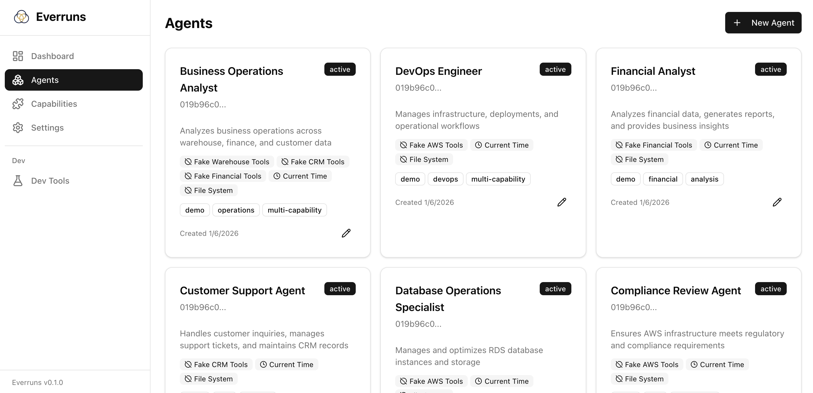

While Everruns is a headless agent platform designed for API-first integration, it provides an optional management UI for administrative tasks and session monitoring.

## Overview

The management UI is a Next.js application that provides:

- Agent management (create, edit, delete)
- Session monitoring and chat interface
- Capabilities browser
- Settings management (LLM providers, API keys, team members)
- Dashboard with system statistics

Access the UI at `http://localhost:9100` when running locally.

## Navigation

The sidebar provides access to main sections:

| Section | Description |
|---------|-------------|
| Dashboard | Overview statistics and quick actions |
| Agents | List, create, and manage agents |
| Capabilities | Browse available capabilities |
| Settings | Configure providers, API keys, and team members |
| Dev Tools | Component previews (development mode only) |

## Dashboard

The dashboard provides an at-a-glance view of your system:

- **Stats Cards**: Total agents, active sessions, and other metrics
- **Recent Agents**: Quick access to recently created or updated agents
- **Quick Actions**: Shortcuts to create agents or browse the agent list

## Agents

### Agent List

The agents page displays all agents in a card grid layout.



Each card shows:

- Agent name and status badge (active/inactive)
- Truncated ID
- Description preview
- Enabled capabilities with icons
- Tags
- Creation date
- Edit button

Click a card to view the agent details, or click the edit icon to modify the agent.

### Agent Detail

The agent detail page shows:

- **System Prompt**: Full system prompt with markdown rendering
- **Sessions List**: All sessions for this agent with status indicators
- **Capabilities**: Enabled capabilities with descriptions
- **Configuration**: Default model, description, tags, timestamps

Actions available:
- **Edit**: Modify agent configuration
- **New Session**: Create a new conversation session

### Create/Edit Agent

The agent form allows you to configure:

- **Name**: Display name for the agent
- **Description**: Optional description
- **System Prompt**: Instructions for the agent (supports markdown)
- **Default Model**: LLM model to use for conversations
- **Capabilities**: Enable/disable available capabilities
- **Tags**: Organizational tags

## Sessions

### Session View

Each session has three tabs:

#### Chat Tab

The primary interface for viewing and participating in conversations:

- Message history with user messages (dark bubbles) and agent responses
- Tool call visualization with expandable details
- Tool results displayed inline
- Message input with keyboard shortcuts (Enter to send, Shift+Enter for newline)
- Reasoning effort selector (for models that support extended thinking)

#### File System Tab

Browse and manage files associated with the session's sandboxed environment.

#### Events Tab

View raw session events for debugging:

- Sequence number
- Event type (message.user, message.agent, tool.call_completed, etc.)
- Timestamp
- JSON data payload

### Session Status

Sessions display their current status:

| Status | Badge | Description |
|--------|-------|-------------|
| started | Outline | Newly created, no messages yet |
| idle | Secondary | Ready for input |
| active | Primary | Currently processing |

## Capabilities

The capabilities page lists all available functionality modules:

- **Summary Panel**: Counts by status (available, coming soon, deprecated)
- **Category Tags**: Filter by capability type
- **Capability Cards**: Click to view details including tools and configuration

Each capability card shows:
- Icon and name
- Identifier (for API use)
- Status badge
- Description
- Category tag

## Settings

### LLM Providers

Configure language model providers:

- Add provider credentials (API keys)
- Enable/disable specific models
- Set default models for agents

### API Keys

Manage API keys for programmatic access:

- Create new API keys
- View existing keys (values hidden)
- Revoke keys

### Members

View and manage team members (when authentication is enabled).

## Development Mode

When running in development mode (`NODE_ENV=development`), additional features are available:

### Dev Tools

Access component previews and testing utilities at `/dev`:

- **Session Chat Components**: Preview chat UI elements with sample data

## Configuration

The UI connects to the Everruns API. Configure the API URL via environment variable:

```bash
# Default: http://localhost:9000
NEXT_PUBLIC_API_URL=http://localhost:9000
```

For production deployments, ensure the API URL points to your Everruns API server.

## Running the UI

### Development

```bash
cd apps/ui
npm install
npm run dev
```

The UI will be available at `http://localhost:9100`.

### Production Build

```bash
cd apps/ui
npm run build
npm start
```

### With Docker

When using the full Docker Compose setup:

```bash
./scripts/dev.sh start-all
```

The UI is automatically started alongside the API and worker.
