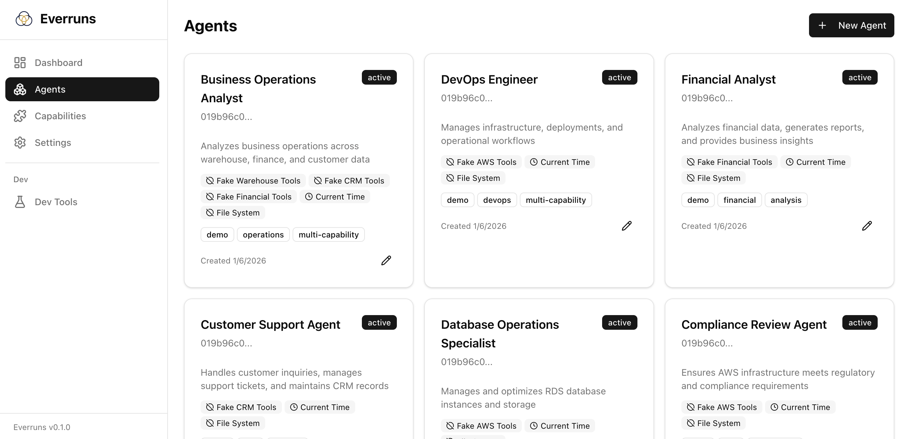

While Everruns is a headless agent platform designed for API-first integration, it provides an optional management UI for administrative tasks and session monitoring.

## Overview

The management UI is a Next.js application that provides:

- Agent management (create, edit, delete)
- Session monitoring and chat interface
- Capabilities browser
- Settings management (LLM providers, personal access tokens, team members)
- Dashboard with system statistics

Access the UI at `http://localhost:9300` when running locally.

## Navigation

The sidebar provides access to main sections:

| Section | Description |
|---------|-------------|
| Dashboard | Overview statistics and quick actions |
| Agents | List, create, and manage agents |
| Virtual users | Manage end-user and service runtime accounts |
| Capabilities | Browse available capabilities |
| Settings | Configure providers, personal access tokens, and team members |

## Chat and Threads

**Chat** opens your permanent conversation with the Platform Chat for managing
Everruns. Agent testing lives in Playground.

Organization owners and admins can opt into **Chat threads** in **Settings → Features**.
It is an adoption feature, disabled by default. With it enabled, the sidebar contains
only Chat, and a **Threads** button opens conversations and ongoing work beside the
permanent conversation. Create a **New thread**, search existing conversations, or open
work from a **View thread** card. The panel can expand and becomes a full-screen drawer
on mobile.

Idle conversations remain **Open**. **Resolve thread** puts one away without losing its
history; **Reopen thread** lets you continue. Background work shows its actual progress,
input requests, and failures. Disabling the feature restores the existing Chat interface
and preserves conversations and their URLs.

## Dashboard

The dashboard provides an at-a-glance view of your system:

- **Stats Cards**: Total agents, active sessions, and other metrics
- **Recent Agents**: Quick access to recently created or updated agents
- **Quick Actions**: Shortcuts to create agents or browse the agent list

## Agents

### Agent List

The agents page displays all agents in a card grid layout.

Each card shows:

- Agent name and status badge (active/inactive)
- Truncated ID
- Description preview
- Enabled capabilities with icons
- Tags
- Creation date
- Edit button

Click a card to view the agent details, or click the edit icon to modify the agent.

### Agent Page

The agent page reads and edits an agent in one layout. The system prompt fills the wide left pane;
a narrow column on the right holds the settings:

- **Harness**, **Capabilities** (compact chips, in precedence order), **Default model**, and **Tags**
- **Updated**, read-only
- **More**: one row each for Branding, MCP servers, Credentials, Service account, Files, Network
  access, Primary sandbox, Token usage, and Health check. Each row shows its current value and
  opens a side sheet. Service account saves immediately.

Tabs: **Agent**, **Preview**, **Integrations** (channels and triggers), **Stats**, and
**Sessions**.

#### Avatar

**Branding** starts with the agent's avatar. Drop a PNG, JPEG, GIF, or WebP image (at most 10 MB)
on the avatar, or choose one, then position and zoom the square crop. **Save avatar** uploads it
right away, without **Save changes**. The server renders the square once as square and circular
PNG presets of 32, 64, 128, 256, and 512 px.
Use **Choose preset** to browse 25 image-only avatar tiles across Watchers, Familiars, Totems,
Glyphs, and Bloom.
Search by name, role, animal, color, or style, and optionally filter by family. Select a card to
preview its circular shape, then **Use avatar** to save immediately. Names and roles describe the
artwork; they do not configure the agent. You can replace any preset with an uploaded image or
remove it.

The avatar shows on agent cards and the agent page, in the A2A Agent Card (`iconUrl`), on the MCP
agent card, and as the icon of Slack apps created with one-click setup.

Through the API, `PUT /v1/agents/{agent_id}/avatar` takes the image as the multipart field
`file`, and `DELETE` removes it. The agent's `avatar` field lists the URLs. Preset URLs look like
`/v1/avatars/{avatar_id}/circle-64.png`; they are public and cached as immutable, and a new upload
gets a new `avatar_id`. `GET /v1/avatar-presets` lists the curated catalog;
`PUT /v1/agents/{agent_id}/avatar/preset` selects one with `{"preset_id": "familiars-patch"}`.
`GET` on that selection endpoint reports the current preset ID, or `null` for a custom image
or no avatar. Preset selection uses the same agent-management permission as upload.

Header actions:
- **Edit**: switch the page into edit mode. The prompt becomes an editor and the settings take
  input; **Save changes** sends everything at once and **Discard** drops the draft. Changes apply
  to new sessions only.
- **More actions**: Copy, Export, Version history, and Archive (or Delete, for an archived agent)
- **Test in Playground**: open Playground setup with this Agent selected

Use **More > Primary sandbox** to add named Bashkit or Daytona Sandbox Template bindings. Then select the
Agent and Sandbox when starting a **New Playground chat**. Personal Chats always use the
managed Platform Chat and do not expose a sandbox selector. See [Sandbox Templates]
(/features/sandbox-templates/) for recovery and lifecycle behavior.

## Sessions

### Session View

Each session has three tabs:

#### Chat Tab

The primary interface for viewing and participating in conversations:

- Message history with user messages (dark bubbles) and agent responses
- Tool call visualization with expandable details
- Tool results displayed inline
- Message input with keyboard shortcuts (Enter to send, Shift+Enter for newline)
- Reasoning effort selector (for models that support extended thinking: Anthropic Claude, OpenAI GPT-5.x, o-series)

#### File System Tab

Browse and manage files associated with the session's sandboxed environment.

#### Events Tab

View raw session events for debugging:

- Sequence number
- Event type (input.message, output.message.completed, tool.completed, etc.)
- Timestamp
- JSON data payload

### Session Status

Sessions display their current status:

| Status | Badge | Description |
|--------|-------|-------------|
| started | Outline | Newly created, no messages yet |
| idle | Secondary | Ready for input |
| active | Primary | Currently processing |

## Capabilities

The capabilities page lists all available functionality modules:

- **Summary Panel**: Counts by status (available, coming soon, deprecated)
- **Category Tags**: Filter by capability type
- **Capability Cards**: Click to view details including tools and configuration

Each capability card shows:
- Icon and name
- Identifier (for API use)
- Status badge
- Description
- Category tag

## Settings

### LLM Providers

Configure language model providers:

- Add provider credentials (API keys)
- Enable/disable specific models
- Set default models for agents

### Personal access tokens

Manage personal access tokens for programmatic access. Tokens are tied to your
user account (not an organization) and inherit access to every organization
available to your account:

- Create new personal access tokens
- View existing tokens (values hidden)
- Revoke tokens

### Members

View and manage team members (when authentication is enabled).

## Virtual users and personal settings

Open **Virtual users** to create or manage organization-scoped accounts. Choose **End user** for a person using agents or **Service** for an agent account. The detail page has **Overview**, **Connections**, **Linked identities**, and **Sessions** tabs. Usage is fixed at creation. On an agent page, **More → Service account** selects the account.

**Settings → Account** edits your Everruns management profile. **My agent experience** edits your current organization's default virtual-user profile, runtime defaults, and connections. Switching organizations selects that organization's runtime account. **Team members** remains management membership administration. `/settings/connections` opens My agent experience.

End-user connections are private to their owner. Organization management permissions do not grant access to another end user's credentials. Service account connections require management permissions. Saved credentials are encrypted and never returned by the API.

When upgrading an account that belonged to several organizations, old connections require an explicit destination. Select the destination from **My agent experience** and move each pending connection once. A destination that already has that provider is rejected rather than overwritten. Accounts with one organization migrate automatically.

Operators upgrading an existing installation should follow the [virtual-user cutover runbook](/sre/runbooks/virtual-user-cutover/).
