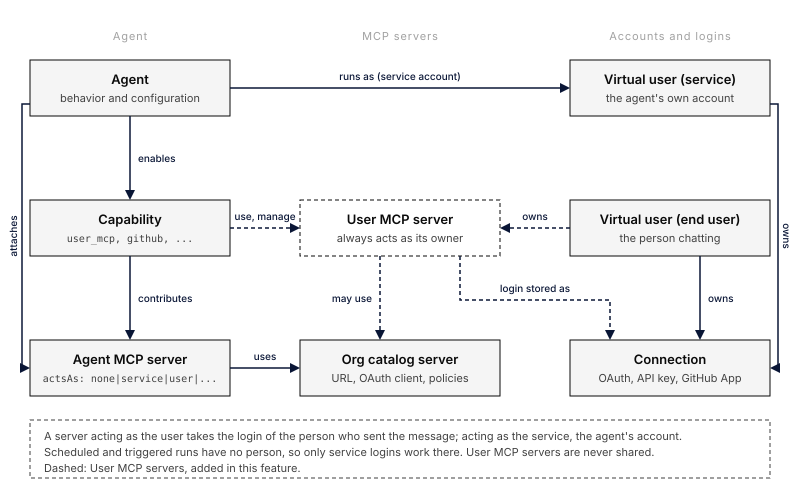

A **user MCP server** belongs to one person. You add it in your settings, sign in
to it once, and every agent that uses your MCP servers gets its tools while you
chat with that agent. Other people never see it, and agents never use it when you
are not the one talking to them.

This is the third place an MCP server can live:

| Where | Who adds it | Who it signs in as |
|---|---|---|
| Organization catalog | An admin, under **MCP Servers** | Whatever the agent attaching it chooses |
| Agent | Whoever edits the agent | The agent's service account or the user, per server ([acts as](/features/mcp/)) |
| **User** | You, for yourself | Always you |



## Add a server

Open **Settings > My agent experience > My MCP servers** and choose **Add server**.

- **From catalog**: pick a server your organization already registered, such as
  Linear. It uses the catalog entry's OAuth client, so signing in to it here and
  signing in from an agent that attaches the same entry share one login.
- **By URL**: give it a name and an HTTPS URL, then choose how it signs in:
  - **OAuth**: choose **Sign in** after adding it. Everruns discovers the
    server's OAuth settings and registers a client automatically.
  - **API key**: the key is encrypted and never shown again. You can replace it,
    not read it.
  - **None**: for servers that need no sign-in.

The name is the tool prefix agents see (`notes__search`), and it only has to be
unique among your own servers: two people can each have a `notes` server. Each
person can keep up to 50 servers.

Turn a server off to hide it from agents without losing your sign-in. Remove it
to delete both the server and your sign-in.

## Let an agent use them

Add the **User MCP Servers** capability (`user_mcp`) to the agent. With its `use`
setting on (the default), each turn adds the enabled servers of the person who
sent the message. [Platform Chat](/built-ins/harnesses/platform-chat/) has it on.

The agent gets nothing from it when:

- **nobody is chatting**: a schedule, trigger or other unattended run has no
  person to act for;
- **more than one person is in the conversation**: in a shared session, one
  person's tools would otherwise show up in everyone's turns;
- **the agent already has a server with that name**: agent and capability
  servers always win, so an agent's behaviour cannot be changed by a person
  adding a server with the same name;
- the server is turned off, or a catalog entry it came from was archived.

An OAuth server works for agents once you sign in to it; until then your list
shows it as **Needs sign-in**.

The agent's **MCP servers** sheet shows a **User servers of the person chatting**
group with these settings, and lists any of your own servers the agent skips
because one of its servers has the same name.

## Add and connect from chat

With the capability's `manage` setting on, you can ask the agent instead of
opening Settings, for example "add Linear and connect it". The agent:

1. adds the server from your organization's catalog, after you approve the
   request in chat (the card shows what it is about to add);
2. shows a **Connect** card, where you sign in in your own browser; the agent
   never sees your credentials;
3. can use the server's tools from your next message.

It can also list, turn off, turn on (after your approval) and remove your
servers. It can add a server by URL only when the agent's `allow_custom_urls`
setting is on, and never with an API key or headers. These tools only ever
change your own list, need you to be the one chatting, and do not work in
conversations with several people. Platform Chat has `manage` on.

## API

The same operations are available over the API, for yourself (`me`) or, with
virtual-user management permission, for an account you manage:

| Method | Path | Purpose |
|---|---|---|
| `GET` | `/v1/virtual-users/{id}/mcp-servers` | List your servers and their sign-in state |
| `POST` | `/v1/virtual-users/{id}/mcp-servers` | Add a server (`{"catalog":"linear"}` or `{"name","url","auth_mode"}`) |
| `GET` | `/v1/virtual-users/{id}/mcp-servers/{server_id}` | Read one server |
| `PATCH` | `/v1/virtual-users/{id}/mcp-servers/{server_id}` | Rename, turn on or off, or replace the API key |
| `DELETE` | `/v1/virtual-users/{id}/mcp-servers/{server_id}` | Remove the server and your sign-in |

Sign in with `GET /v1/virtual-users/{id}/connections/{provider}/authorize`, where
`provider` is the `connection.provider` value a server reports. The URL of a
server cannot change; remove it and add it again instead.

```bash
curl -X POST "$EVERRUNS_URL/v1/virtual-users/me/mcp-servers" \
  -H "Authorization: Bearer $EVERRUNS_API_KEY" \
  -H "Content-Type: application/json" \
  -d '{"name":"notes","url":"https://notes.example.com/mcp","auth_mode":"oauth"}'
```

## Security

- Another person's server answers `404` on every route, and only the owner can
  start its sign-in. An agent's own account can never hold a grant for it.
- Custom URLs go through the same address checks as catalog servers, so a user
  server cannot point at private or internal addresses.
- API keys and header values are write-only.
- A user server never appears in the organization catalog and cannot be attached
  to an agent by name.
