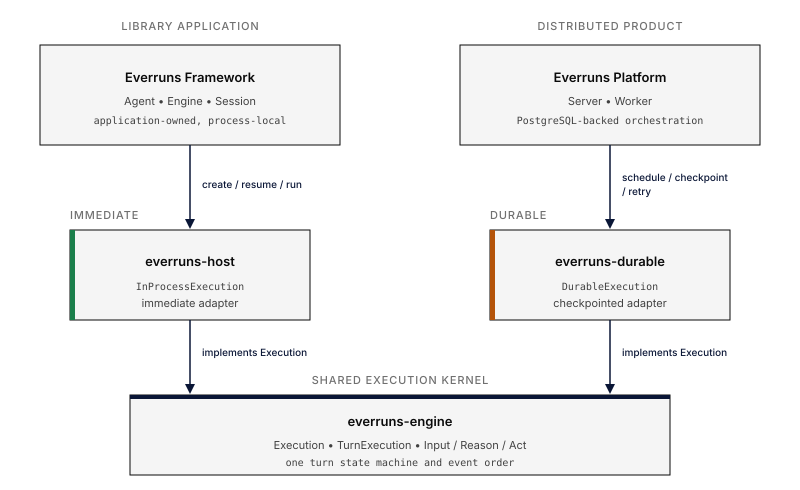

Everruns has one turn model and two ways to execute it. A library application
uses the concrete `everruns::Engine` in its own process. The Everruns Platform
uses server and worker services with durable checkpoints. Both paths converge
on the same `everruns-engine` Input/Reason/Act state machine.



## Public Framework objects

| Object | Responsibility |
| --- | --- |
| `Agent` | Immutable behavior: instructions, model and provider, tools, capabilities, files, and lifecycle hooks |
| `Engine` | Concrete process-local owner of Agent snapshots, session identity, backends, history, and resume authority |
| `Session` | First-class, engine-bound conversation used for turns, steering, events, cancellation, inspection, and history |
| `Environment` | Session resources, including one exact provider-owned workspace head and typed extensions |

New Framework code creates and resumes sessions through an Engine:

```rust
use everruns::{Agent, Engine, Model};

# async fn example() -> Result<(), Box<dyn std::error::Error>> {
let agent = Agent::builder()
    .instructions("Answer concisely.")
    .model(Model::simulated("Ready."))
    .build()?;

let engine = Engine::new();
let session = engine.create(agent);
let session_id = session.session_id();
let turn = session.send_and_wait("Begin.").await?;
assert!(turn.success);

drop(session);
let resumed = engine.resume(session_id).await?;
assert_eq!(resumed.session_id(), session_id);
# Ok(())
# }
```

`InMemoryEngine` remains a compatibility alias. It is not a second engine
implementation; use `Engine` in new 0.18 code.

## Two execution paths, one kernel

The library path is immediate. `everruns::Engine` uses `everruns-host` to run
`InProcessExecution` in the caller's process. It can be entirely volatile or
use the local profile for crash-durable canonical events.

The Platform path is distributed and checkpointed. The server schedules work,
workers resolve host services and effects, and `everruns-durable` advances a
`DurableExecution` across persisted phase boundaries. PostgreSQL remains the
source of recovery state.

Neither path owns a private copy of the turn algorithm. `everruns-engine` owns
the `Execution` contract, `TurnExecution` state, Input/Reason/Act atoms, phase
ordering, and effect production. Immediate and durable adapters select where
state lives and how work is scheduled.

## Choose a recovery boundary

- **Volatile Framework:** `Engine::new()` is offline and database-free. The
  creating Engine can resume a dropped Session, but process exit loses it.
- **Local crash-durable Framework:** `LocalConfig` stores canonical events and
  session identity locally. Rebuild the trusted Agent configuration, attach it
  to a new Engine, and resume by typed `SessionId`.
- **Distributed durable Platform:** server and workers checkpoint workflow state
  in PostgreSQL and recover across process or worker loss. Applications call it
  through the remote API or SDKs rather than configuring the facade Engine.

See [Persistence](/framework/persistence/) and [Session History and
Resume](/framework/session-history/) for the exact application lifecycle.

## Extension boundaries

Normal applications depend on `everruns`. `everruns::Engine` is concrete and is
not implemented by applications. Provider integrations implement the open
`ChatDriver` boundary, while canonical storage hosts can implement
`EventLog`/`EventReader` through `everruns-host`.

An application that is itself an execution host may compose
`everruns-engine::Execution` with `everruns-host` or `everruns-durable`. That is
an advanced deployment boundary: preserve event ordering, workspace isolation,
credential separation, cancellation, and committed effect semantics. Start
with [Custom Backends](/framework/custom-backends/) before crossing it.
