Everruns is a **headless AI agent execution platform** built for reliability and scale. It provides a REST API for managing agents, sessions, and runs with real-time event streaming via SSE.

## Platform Overview

```mermaid
%%{init: {'look': 'handDrawn'}}%%
graph LR
    subgraph Your["🖥️ Your Application"]
        App[Your App]
    end

    subgraph Platform["⚡ Everruns Platform"]
        CP[Control Plane]
        Workers[Workers]
    end

    subgraph LLM["🤖 LLM Providers"]
        Providers[OpenAI / Anthropic / ...]
    end

    subgraph Admin["🔧 Optional"]
        UI[Management UI]
    end

    App -->|REST API / SSE| CP
    CP <--> Workers
    Workers --> Providers
    UI -.->|Admin| CP
```

## Key Design Principles

| Principle | Description |
|-----------|-------------|
| **Headless / API-First** | Integrate via REST API. No UI required for production. |
| **Agentic Loop** | Core pattern: Reason → Act, repeated until task complete. |
| **Durable Execution** | Agent state survives restarts. Never lose progress. |
| **Horizontal Scaling** | Add workers to increase throughput. |
| **Provider Agnostic** | OpenAI, Anthropic, or custom LLM providers. |

## Components

### Control Plane

Central coordinator that exposes the REST API and manages all state in PostgreSQL:

- **Agents** - AI assistant configurations
- **Sessions** - Conversation state and history
- **Events** - Real-time event streaming via SSE

### Workers

Stateless executors that run the agentic loop:

```mermaid
%%{init: {'look': 'handDrawn'}}%%
graph LR
    Input[📥 Get Input] --> Reason[🧠 Reason]
    Reason --> Act[🔧 Act]
    Act --> Reason
    Act --> Done[✅ Complete]
```

Workers are:
- **Scalable** - Add more to handle concurrent sessions
- **Fault-tolerant** - Failed tasks automatically recovered
- **Stateless** - All state lives in PostgreSQL

### Management UI (Optional)

Administrative interface for platform operators. **Not required for production use.**

- Agent configuration
- Session monitoring
- LLM provider settings

See [Management UI](/features/ui) for details.

## Further Reading

- [Introduction](/getting-started/introduction) - Getting started
- [API Reference](/api) - Full API documentation
- [Capabilities](/features/capabilities) - Extend agent functionality
