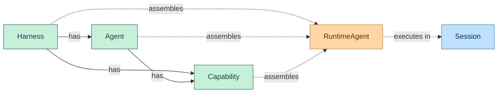
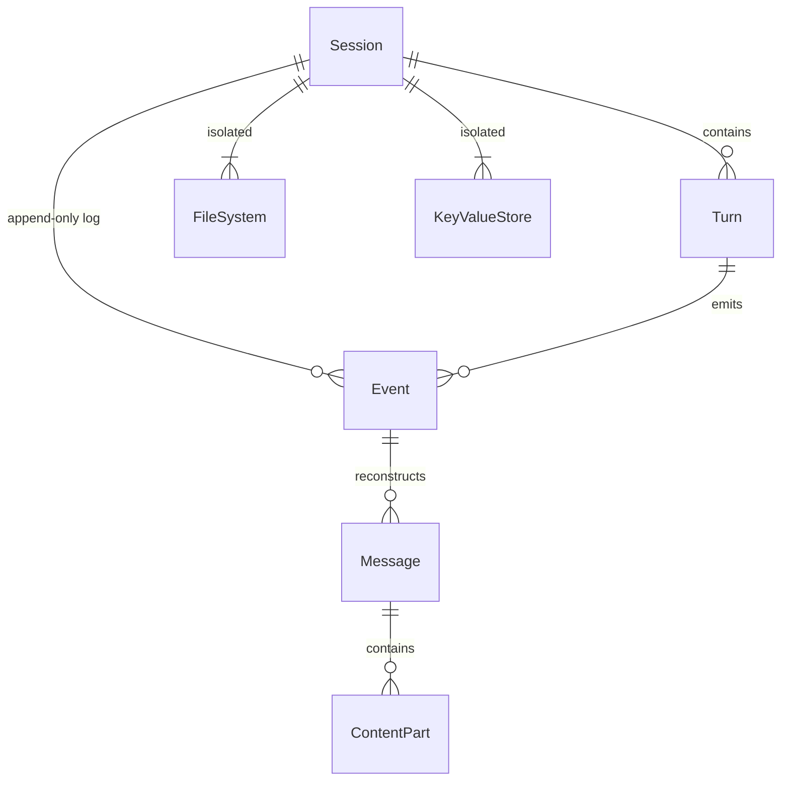
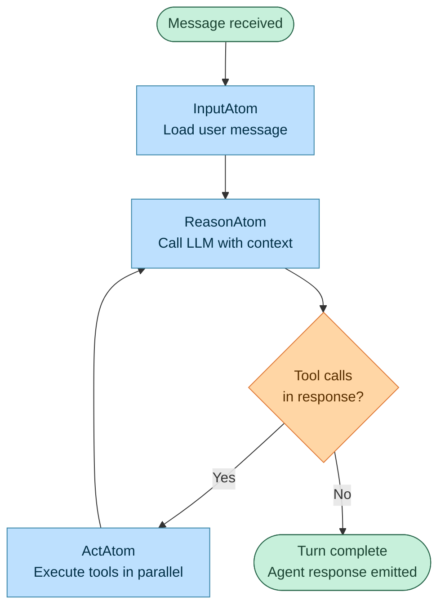
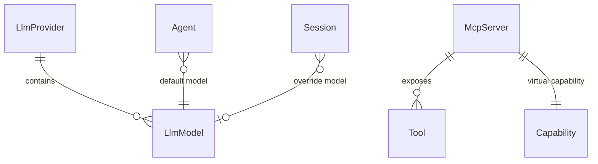

This page describes the core entities in Everruns and how they relate to each other, organized into three layers: the high-level execution model, session internals, and settings.

## High Level

Harness and Agent are **configuration containers** — they hold capabilities and define behavior. At runtime, their configuration merges into a **RuntimeAgent** which executes inside a Session.



- **Solid arrows** — configuration ownership: Harness has Agents and Capabilities, Agent has Capabilities
- **Dashed arrows** — runtime assembly: config merges into RuntimeAgent, which executes in a Session

### Harness

A Harness is the top-level entity that represents a setup for agent execution. It defines the infrastructure, defaults, and constraints under which sessions run — configuring how agents are invoked, which capabilities are available by default, and what execution environment is provided.

- There can be many harnesses in the system
- Each session has exactly one assigned harness
- A harness can have capabilities attached to it

### Agent

An Agent is a domain-specific or task-specific configuration for the agentic loop. It defines the system prompt, the default LLM model, and which capabilities are enabled.

- There can be many agents in the system
- A session may or may not have an agent assigned
- Agents can be assigned or changed during the lifetime of a session
- Each agent has capabilities with position ordering
- Each agent references a default LLM model

### Session

A Session is a working instance of an agentic loop. It is configured by its harness and, optionally, by an agent. Sessions are the primary execution context where conversations happen.

- There can be many sessions in the system
- Each session has an assigned harness
- The agent is optional and can change over the session's lifetime
- Sessions can have their own capabilities, which are additive to the agent's capabilities
- Sessions can override the LLM model
- Status flow: `started` → `active` → `idle` (sessions work indefinitely)

### Capability

A Capability is a modular, reusable configuration unit that extends the behavior of a harness, agent, or session. Each capability can contribute:

1. **System prompt additions** — text prepended to the agent's prompt
2. **Tools** — functions the agent can invoke
3. **Mount points** — files and directories populated in the session filesystem

- Can be attached to a harness, an agent, or a session
- Session capabilities are additive to agent capabilities
- Built-in capabilities use `snake_case` IDs (e.g., `current_time`, `web_fetch`)
- MCP servers appear as virtual capabilities with `mcp:{uuid}` IDs
- Capabilities can depend on other capabilities, resolved in topological order

See [Capabilities](/features/capabilities/) for a full list and configuration details.

### Tool

A Tool is a function the agent can invoke during execution. Tools are provided by capabilities.

- Built-in tools have no name prefix
- MCP tools are prefixed: `mcp_{server_name}__{tool_name}`
- Executed during the act phase of a turn

---

## Session Internals

Each session contains turns, messages, events, an isolated filesystem, and key-value storage.



### Turn

A Turn is one iteration of the agent loop: reason (call the LLM) then act (execute tools).

- Each turn belongs to a session
- A turn produces messages and emits events
- Lifecycle: `turn.started` → reason → act → `turn.completed` (or `turn.failed`)

#### The Agentic Loop

Understanding the reason-act loop is key to building effective agents. Here's what happens inside each turn:



Each iteration:

1. **Reason** — The LLM receives the full conversation history (system prompt + messages + tool results) and produces either a text response or tool calls
2. **Act** — All tool calls from the LLM are executed in parallel. Results are added to the conversation history
3. **Loop** — If there were tool calls, go back to Reason. If the LLM produced a final text response, the turn is complete

The loop runs for a maximum of **10 iterations** per turn to prevent runaway execution.

#### Durable Execution

In production mode (PostgreSQL-backed), each step is a separate durable task:

```
SetupStep → ExecuteLlmStep → ExecuteToolStep(s) → ExecuteLlmStep → ... → FinalizeStep
```

If a worker crashes mid-turn, the control plane detects the missed heartbeat and re-queues the task for another worker. Your application sees a brief delay, not a failure.

### Message

A Message is a conversation entry reconstructed from the event log. Messages are not stored in a separate table.

- Roles: `user`, `agent`, `tool_result`
- Content is an array of parts: text, image, tool_call, tool_result
- Agent messages may include extended thinking content from reasoning models (Anthropic Claude, OpenAI GPT-5.x and o-series)
- Supports per-message controls such as model override and reasoning effort

### Event

An Event is an immutable, append-only record. Events are the primary data store for conversations and SSE notifications.

- Atomic per-session sequence numbering
- Types: input, output, turn, atom, tool, LLM, session lifecycle
- Cannot be updated or deleted
- Carries correlation context: turn ID, input message ID, execution ID

See [Events](/features/events/) for the full event reference.

### File System

Each session has an isolated virtual filesystem stored in PostgreSQL.

- Paths are relative to `/workspace`
- Capabilities can mount initial files and directories
- Shared between the FileSystem and VirtualBash capabilities
- Files support an optional read-only flag

### Key-Value Store

Each session has scoped storage with two tiers:

- **Key/Value** — plain text storage for general data such as state, preferences, or intermediate results
- **Secrets** — AES-256-GCM encrypted at rest for API keys, tokens, and credentials
- Storage is session-isolated and cannot be accessed across sessions

---

## Settings

System-wide configuration for LLM providers, models, and MCP servers.



### LLM Provider

An LLM Provider is a configured API provider such as OpenAI or Anthropic. Providers store encrypted API keys and contain models.

- Provider types: `openai`, `openai_completions`, `anthropic`
- Each provider contains many models
- Default providers (OpenAI, Anthropic) are seeded on startup

### LLM Model

An LLM Model is a specific model within a provider (e.g., `gpt-4o`, `claude-sonnet-4`).

- Each model belongs to one provider
- Sources: predefined, discovered from the provider API, or manually added
- Model resolution priority: message controls → session override → agent default → system default

### MCP Server

An MCP Server is a remote server that exposes tools via the Model Context Protocol. MCP servers are integrated as virtual capabilities.

- Each server becomes a capability with ID `mcp:{server_uuid}`
- Tools are discovered at runtime and cached with a 24-hour TTL
- Tool names are prefixed to avoid conflicts: `mcp_{server}__{tool}`
- Execution happens via HTTP JSON-RPC
