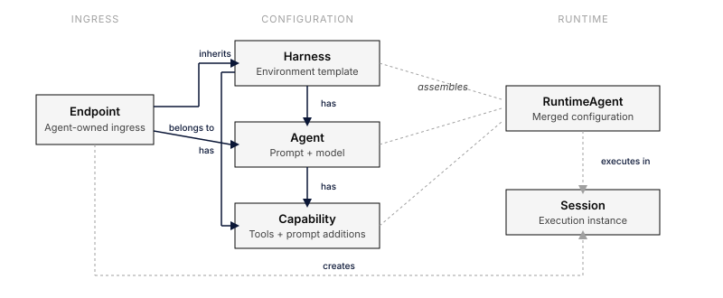
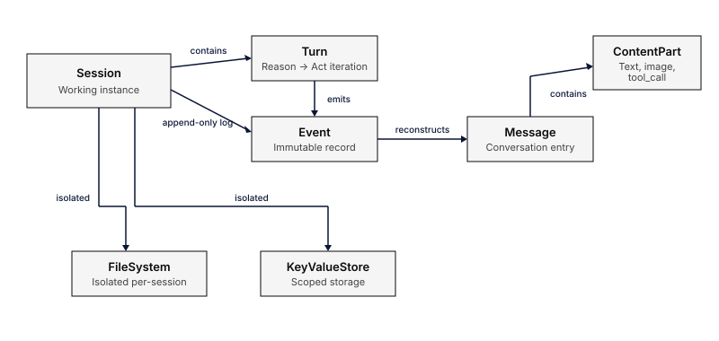
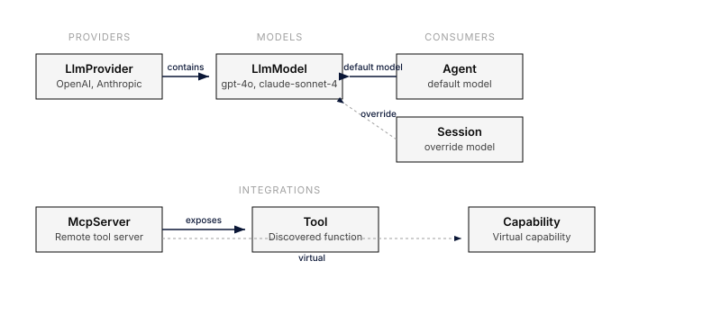

This page defines each entity you meet in Everruns and links to the page that explains it in depth. The entities fall into three layers:

| Layer | Entities | Lifetime |
|---|---|---|
| **Configuration** | Harness, Agent, Capability | Long-lived. You author these. |
| **Runtime** | Session, Turn, RuntimeAgent | Created per conversation. The server owns these. |
| **Data** | Event, Message | Append-only log produced during runtime. |

Your application creates configuration, starts runtime, and consumes data.

Solid arrows show configuration ownership: a Harness has Agents and Capabilities, and an Agent has Capabilities. Dashed arrows show runtime assembly: configuration merges into a RuntimeAgent, which executes in a Session.

## Configuration

### Harness

What an agent runs on: the execution environment, defaults, and constraints for sessions. A harness sets which capabilities are available by default, the default model, network access, and starter files.

- Each agent holds exactly one harness reference, and many agents can share one harness.
- Each session runs on exactly one harness, the agent's unless the session names another.
- A harness can have capabilities attached to it.

A Harness is not the agent loop. Elsewhere "agent harness" often means that loop, and Everruns uses the word that way when it calls itself a durable agentic harness engine. The loop is the runtime; a Harness is configuration the runtime reads. See [Harnesses](/features/harnesses/).

### Agent

A domain-specific or task-specific configuration for the agentic loop: the system prompt, the default model, and the enabled capabilities.

- A session may or may not have an agent, and the agent can change during the session.
- Each agent has capabilities with position ordering and references a default model.

### Capability

A reusable unit that extends a harness, agent, or session. A capability can contribute system prompt additions, tools, and mount points (files and directories in the session filesystem).

- Session capabilities are additive to agent capabilities.
- Built-in capabilities use `snake_case` IDs, such as `current_time` and `web_fetch`.
- MCP servers appear as virtual capabilities with `mcp:{uuid}` IDs, and registry skills as `skill:{uuid}`.
- Capabilities can depend on other capabilities. Dependencies resolve in topological order, so enabling `bashkit_shell` pulls in `session_file_system`.
- Order matters: earlier capabilities' prompt fragments appear first in the merged system prompt.

A capability exists because the tool definition, the prompt text that teaches the model when to use it, and the session state it needs travel together. See [Capabilities](/features/capabilities/).

### Endpoint

An Agent-owned way for an external caller to reach that Agent. Slack, AG-UI, A2A, FCP, and Public Chat each use an endpoint with transport-specific configuration.

- Each endpoint belongs to exactly one Agent and has its own publish state, credentials, identity, session routing, and version policy.
- An Agent can own several endpoints, each published or revoked independently.

Create and manage endpoints from the Agent's **Integrations** tab. See [Endpoints](/features/endpoints/). For proactive scheduled work, use [Agent triggers](/features/agent-triggers/) instead.

### Everruns user and virtual user

An **Everruns user** signs in to manage organizations, agents, permissions, and personal access tokens. A **virtual user** is the organization-scoped account that uses agents. It owns an agent-facing profile, preferences, and provider connections.

Each organization membership has a default end-user virtual user. Chats and **Settings → My agent experience / Connections** use that account. Verified external callers, such as an authenticated public-chat visitor or Slack user, get virtual users without becoming Everruns organization members. Provider, issuer or workspace, and subject identify each external binding; matching email addresses do not merge accounts.

A service virtual user is an agent's account for unattended execution. User connections resolve from the speaker of the current turn. Service connections resolve from the responding agent's service account. Neither inherits credentials from a session owner's management identity.

## Runtime

### RuntimeAgent

The merged configuration a session executes. When a session starts, harness, agent, and session settings fold into one `RuntimeAgent`: earlier layers form the base and later layers override or add. System prompts concatenate, capabilities are deduplicated by ID, and network policies can only narrow (allow lists intersect, blocklists union).

Each layer answers a different question. The harness answers "what environment am I running in?", the agent answers "what role am I playing?", and the session answers "what is true for this one conversation?". Operators control harnesses, application authors control agents, and end users or the runtime control sessions.

### Session

A working instance of the agentic loop and the context where a conversation happens. A session owns an isolated filesystem, a key-value store, and the full event log.

- Each session has a harness; the agent is optional.
- Sessions can add their own capabilities and override the model.
- Status flow: `started` → `active` → `idle`, with `waiting_for_tool_results` while client-side tools run and `paused` when a budget pauses work. Sessions do not terminate; they wait in `idle` for the next input.

### Turn

The agent's response to one input message: one or more iterations of the loop, each a reason step (call the model) followed by an act step (run the tools the model asked for, in parallel). The turn ends when the model produces a final answer.

- Lifecycle: `turn.started` → reason → act → `turn.completed` (or `turn.failed`).
- A turn runs at most **500 iterations** by default; set `max_iterations` on the agent or session to change it.

On the Platform each step is a separate durable task, so a turn survives a worker crash. See [The agentic loop](/explanation/agentic-loop/) and [Durable execution](/explanation/durable-execution/).

### Tool

A function the agent can invoke during the act step. Capabilities provide tools.

- Built-in tools have no name prefix.
- MCP tools are prefixed: `mcp_{server_name}__{tool_name}`.

### File system

Each session has an isolated virtual filesystem stored in PostgreSQL. Paths are relative to `/workspace`, capabilities can mount initial files, the File System and Bashkit Shell capabilities share it, and files can be marked read-only.

### Key-value store

Each session has scoped storage in two tiers: plain key/value entries for state and intermediate results, and secrets encrypted at rest with AES-256-GCM. Storage cannot be read across sessions.

## Data

### Event

An immutable, append-only record and the primary store for conversations and SSE notifications.

- Atomic per-session sequence numbering.
- Types cover input, output, turn, atom, tool, LLM, and session lifecycle.
- Events carry correlation context: turn ID, input message ID, execution ID.

See [Events as the primary store](/explanation/events/) for why the log comes first, and the [Event Reference](/event-reference/) for every type.

### Message

A conversation entry reconstructed from the event log. There is no separate messages table.

- Roles: `user`, `agent`, `tool_result`.
- Content is an array of parts: text, image, tool_call, tool_result.
- Agent messages may include extended thinking from reasoning models.
- Per-message controls include a model override and reasoning effort.

## Settings

### LLM provider

A configured API provider such as OpenAI or Anthropic. Providers store encrypted API keys and contain models. See [Providers](/providers/). On Everruns Cloud a built-in Everruns provider works without your own keys.

### LLM model

A specific model within a provider, such as `gpt-5.2` or `claude-sonnet-5`. Models are predefined, discovered from the provider API, or added manually. Resolution order: message controls → session override → agent default → system default.

### MCP server

A remote server that exposes tools over the Model Context Protocol. Each server becomes a capability with ID `mcp:{server_uuid}`. Tools are discovered at runtime and cached for 24 hours, prefixed to avoid conflicts, and executed over HTTP JSON-RPC. See [MCP Servers](/features/mcp/).

## Further reading

- [Architecture](/explanation/architecture/): control plane, workers, and the API-first design.
- [The agentic loop](/explanation/agentic-loop/): the reason-act cycle and why turns are bounded.
- [Durable execution](/explanation/durable-execution/): why agents survive crashes.
- [Events as the primary store](/explanation/events/): why the event log is the source of truth.
