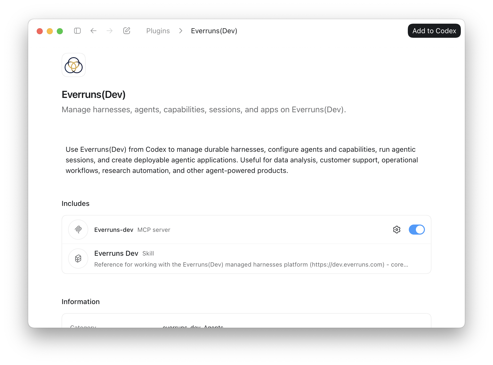

Use Everruns from the AI tools where you already work. This page starts with
Codex support through the Everruns(Dev) plugin.

## Codex

The Codex plugin connects Codex to `https://dev.everruns.com/mcp` and adds
Everruns(Dev) tools and guidance.

### Set Up the Marketplace

1. Add the Everruns plugin marketplace:

   ```bash
   codex plugin marketplace add https://github.com/everruns/everruns.git
   ```

2. Restart Codex if **Everruns(Dev)** does not appear in the plugin directory.

3. Open the Codex plugin directory, choose the **Everruns(Dev)** marketplace
   source, and install **Everruns(Dev)**.

   

   Codex discovers the marketplace from `.agents/plugins/marketplace.json`. That
   marketplace points to `plugins/everruns-dev`, which contains the Codex plugin
   manifest and MCP server configuration.

4. Complete the browser OAuth flow when Codex asks you to authenticate.

For the general Codex marketplace format, see the
[Codex plugin marketplace documentation](https://developers.openai.com/codex/plugins/build#how-codex-uses-marketplaces).

### Use Everruns

Ask Codex for an Everruns task in natural language, for example:

```text
Create an Everruns(Dev) agent that summarizes https://news.ycombinator.com/ and run it once.
```

To verify the connection, ask Codex:

```text
Check my Everruns(Dev) user and active organization.
```

To point the plugin at another Everruns deployment, update the `url` in
`plugins/everruns-dev/.mcp.json` to that deployment's `/mcp` endpoint.
