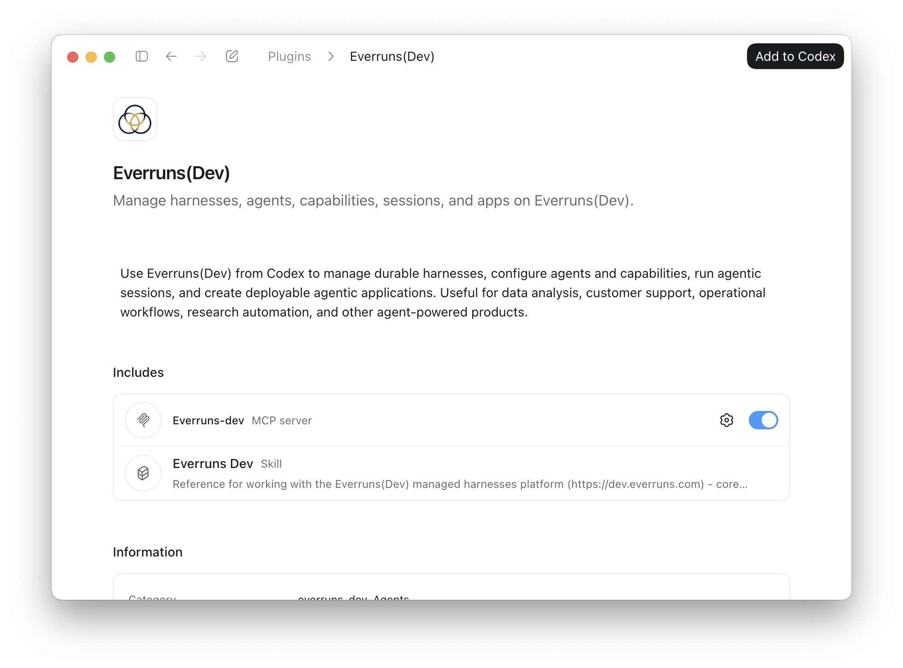

The `everruns` plugin connects Claude Code, Codex, and Cursor to Everruns over
MCP. It ships an `everruns` skill and slash commands for common session work
(`whoami`, `discover`, `query`, `execute`, `agent-run`, `agent-card`,
`session-send`, `session-status`). By default it talks to
[Everruns Cloud](https://app.everruns.com) at `https://app.everruns.com/mcp`.

## Install

**Claude Code**, from the GitHub marketplace:

```text
/plugin marketplace add everruns/everruns
/plugin install everruns@everruns
```

**Codex** discovers the plugin through the repository marketplace at
`.agents/plugins/marketplace.json`. Open the `everruns` plugin page in Codex and
choose **Add to Codex**.



**Cursor** discovers the plugin through `.cursor-plugin/marketplace.json` in the
repository root; enable it from the marketplace UI.

## First run

1. Run `/everruns:whoami` (Claude Code, Codex) or the `whoami` command (Cursor).
2. Complete the OAuth sign-in in your browser when prompted.
3. Ask for an Everruns task in natural language, for example "create a Hacker
   News summarizer agent and run it".

## Use a self-hosted deployment

The plugin reads its MCP endpoint from `plugins/everruns/.mcp.json`, which all
three hosts share. Install from a local clone and replace the `url` value with
your deployment's `/mcp` endpoint, for example `http://localhost:9300/mcp` for
the [Docker Compose](/getting-started/docker-compose/) stack:

```bash
git clone https://github.com/everruns/everruns.git
# edit everruns/plugins/everruns/.mcp.json, then:
claude plugin install ./everruns/plugins/everruns
```

## Read the docs as text

The documentation site publishes itself as plain Markdown for agents and other
tools that would rather read text than HTML.

- [`/llms.txt`](https://docs.everruns.com/llms.txt): the index: the three ways
  to run Everruns, every documentation set, and the machine-readable surfaces.
  Start here.
- [`/llms-full.txt`](https://docs.everruns.com/llms-full.txt): every prose page
  in one file (roughly 250k tokens).
- [`/llms-small.txt`](https://docs.everruns.com/llms-small.txt): the same
  corpus without the vendor- and operator-specific long tails.
- `/_llms-txt/<set>.txt`: one topic at a time, mirroring the sidebar:
  [framework](https://docs.everruns.com/_llms-txt/framework.txt),
  [getting-started](https://docs.everruns.com/_llms-txt/getting-started.txt),
  [built-ins](https://docs.everruns.com/_llms-txt/built-ins.txt),
  [guides](https://docs.everruns.com/_llms-txt/guides.txt),
  [integrations](https://docs.everruns.com/_llms-txt/integrations.txt),
  [explanation](https://docs.everruns.com/_llms-txt/explanation.txt),
  [reference](https://docs.everruns.com/_llms-txt/reference.txt),
  [operations](https://docs.everruns.com/_llms-txt/operations.txt).
  Prefer a set over the complete text.
- [`/api/openapi.json`](https://docs.everruns.com/api/openapi.json): the REST
  API as OpenAPI 3.0. The text sets carry prose only, so take endpoint shapes
  from here.

Every page in those files begins with its title, its description, and a
`Source:` line holding the canonical URL. Cite that URL, not the text file.
