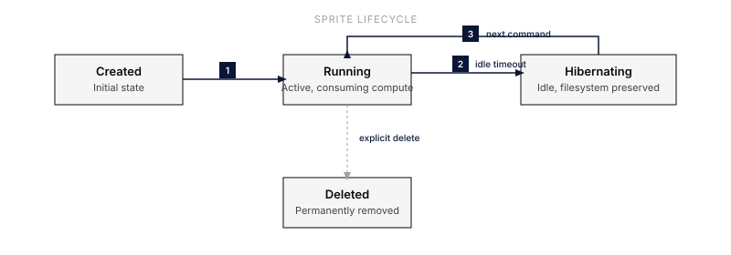

<svg xmlns="http://www.w3.org/2000/svg" viewBox="0 0 724 582" width="52.0" height="41.8" fill="currentColor" aria-hidden="true" style="float: right; margin-left: 16px;"><path d="M205.594 197.898h322.661v108.263H205.594z"/><path d="M578.582 508.799h-72.323v72.686h72.323v-72.686zm-361.614 0h-72.323v72.686h72.323v-72.686zm361.614-290.742h72.323v145.371h-72.323v72.686h-74.229 1.906v72.685H216.968v-72.685h-72.323v-72.686H72.323V218.057h72.322v-73.163h72.323V72.686h72.323v72.685h144.645V72.686h72.323v72.685h72.323v72.686zM72.323 508.799V363.428H0v145.371h72.323zm650.904 0V363.428h-72.322v145.371h72.322zM289.423 290.742h-.132.132zm-72.455-72.685h72.323v72.685h-72.323v-72.685zm216.968 0h72.323v72.685h-72.323v-72.685zM578.582 0h-72.323v72.686h72.323V0zM216.968 0h-72.323v72.686h72.323V0z"/><path d="M144.645 363.428V218.057h72.323v-72.686h289.291v72.686h72.323v72.685l-.001.001v72.685h-72.322v72.686h-72.323V508.8H289.291v-72.686h-72.323v-72.686h-72.323zm144.646-72.686h-72.323v-72.685h72.323v72.685zm216.968 0h-72.323v-72.685h72.323v72.685z"/></svg>

Everruns integrates with [Sprites](https://sprites.dev/) to provide persistent, hardware-isolated Linux microVMs powered by Firecracker. Unlike ephemeral sandboxes, Sprites maintain their filesystem across idle periods, support instant checkpoint/restore, and expose public HTTP endpoints.

## What You Get

- **Persistent Filesystem**: Full ext4 filesystem survives between sessions, backed to durable object storage
- **Hardware Isolation**: Firecracker VM-level isolation (stronger than containers)
- **Checkpoints**: Snapshot filesystem state in ~300ms for safe rollback before risky operations
- **HTTP Services**: Each sprite gets a unique public URL for exposing web services
- **Instant Wake**: Sprites wake from hibernation in <1 second
- **Multi-Sprite Sessions**: Create and manage multiple sprites per session

## Quick Start

### 1. Get Your API Token

1. Install the Sprites CLI: `curl https://sprites.dev/install.sh | bash`
2. Run `sprite login` to authenticate
3. Copy your token from the CLI output or dashboard

### 2. Connect in Everruns

1. Go to **Settings** > **Connections**
2. Find **Sprites** in the available providers
3. Click **Connect** and paste your API token

Once connected, the Sprites capability is automatically available in agent sessions.

Sprites default to `/home/sprite` as the working directory for commands and file paths.

### 3. Use in Sessions

Agents with the Sprites capability can use these tools:

| Tool | Description |
|------|-------------|
| `sprites_create_sprite` | Create a new Firecracker microVM |
| `sprites_exec` | Execute shell commands (wakes sprite if hibernating) |
| `sprites_read_file` | Read files from sprite filesystem |
| `sprites_write_file` | Write files to sprite filesystem |
| `sprites_list_sprites` | List sprites in this session |
| `sprites_manage_sprite` | Delete sprites |
| `sprites_checkpoint` | Create a filesystem checkpoint |
| `sprites_restore_checkpoint` | Restore to a previous checkpoint |
| `sprites_service_url` | Get the public HTTP URL for a sprite |

## Checkpoints

Sprites support instant filesystem checkpointing, a unique capability not found in other sandbox providers:

1. **Before risky operations**: Call `sprites_checkpoint` to snapshot the current state
2. **If something goes wrong**: Call `sprites_restore_checkpoint` to roll back
3. **Checkpoints are fast**: ~300ms without interrupting the running sprite

This makes Sprites ideal for iterative development where agents need to experiment safely.

## HTTP Services

Each sprite gets a unique public URL. To expose a web service:

1. Start a web server inside the sprite listening on **port 8080**
2. Call `sprites_service_url` to get the public URL
3. Share the URL for testing or preview

## Sprite Lifecycle

- **Running**: Active, consuming compute resources
- **Hibernating**: Idle, no compute charges, filesystem preserved on durable storage
- **Deleted**: Permanently removed, all data lost

Sprites persist indefinitely until explicitly deleted. They hibernate automatically when idle (no compute charges while idle). Always delete sprites when done to avoid storage charges.

## Pricing

Sprites bill per-second for compute and per-GB-hour for storage:

- **CPU**: $0.07/CPU-hour
- **Memory**: $0.04375/GB-hour
- **Storage**: $0.000027/GB-hour (persistent), $0.000683/GB-hour (hot NVMe cache)
- **Idle**: No compute charges (filesystem still persisted)

New users receive $30 trial credits (~500 sprite sessions).

## Security

- **Firecracker VMs**: Hardware-level isolation between sprites
- **L3 Network Policies**: Domain whitelisting for outbound connections
- **Encrypted Credentials**: API token stored in user connections (encrypted at rest)
- **Leased Resources**: Sprites registered for automatic cleanup on session end
