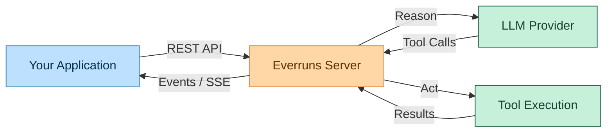
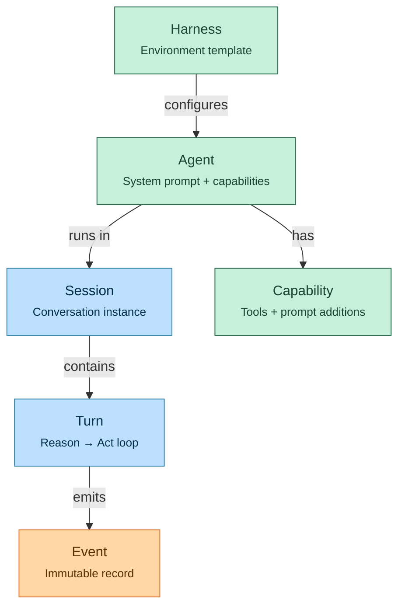
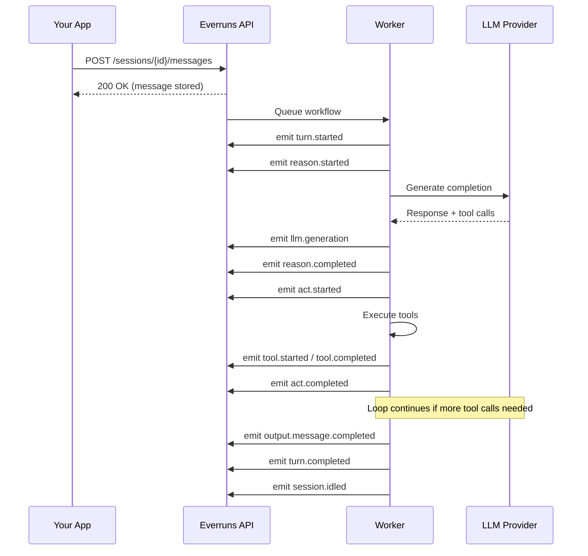
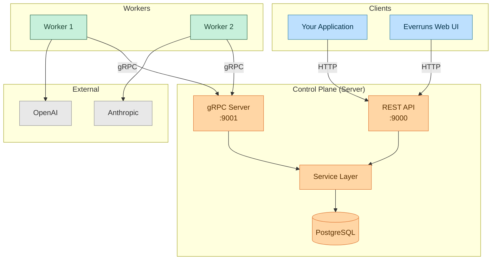

import { Tabs, TabItem } from "@astrojs/starlight/components";

This tutorial walks you through building AI agents on Everruns — from creating your first agent to orchestrating multi-turn conversations with tool execution and real-time event streaming. By the end, you'll have a working Python client that can create agents, manage sessions, send messages, and consume streaming events.

## What is Everruns?

Everruns is a **durable agentic harness engine**. It provides the infrastructure layer between your application and LLM providers, handling the agent loop — the cycle of reasoning (calling an LLM) and acting (executing tools) — with durability guarantees backed by PostgreSQL.

Think of it as the runtime that turns a language model into a reliable, stateful agent:



Unlike calling an LLM API directly, Everruns gives you:

- **Durability** — Turns survive worker crashes and are automatically retried
- **Streaming events** — Real-time SSE stream of every step the agent takes
- **Modular capabilities** — File systems, bash execution, web fetch, and more — composed per-agent
- **Multi-provider support** — Switch between OpenAI, Anthropic, or any OpenAI-compatible provider
- **Full observability** — Every LLM call, tool execution, and state transition is recorded as an immutable event

## Core Concepts

Before writing code, let's understand the entities you'll work with.



| Concept | What it is | Analogy |
|---------|-----------|---------|
| **Agent** | Configuration for the agentic loop — system prompt, default model, and enabled capabilities | A job description |
| **Session** | A running conversation with an agent. Holds state, history, and filesystem | A work session |
| **Capability** | A modular unit that provides tools and/or system prompt additions | A plugin |
| **Turn** | One iteration of the reason-act loop within a session | A single task cycle |
| **Event** | An immutable, append-only record of everything that happens | An audit log entry |

**Key insight**: Agents and capabilities are *configuration*. Sessions and turns are *runtime*. Events are *data*. Your application creates configuration, starts runtime, and consumes data.

## Prerequisites

You need:

- A running Everruns instance (see [Docker Compose quickstart](/getting-started/docker-compose))
- Python 3.9+ with the `requests` library
- An LLM provider configured (OpenAI or Anthropic API key set in the Everruns UI)

```bash
pip install requests
```

Set the base URL for your Everruns instance:

```python
import requests
import json
import time

BASE_URL = "http://localhost:9000"
API = f"{BASE_URL}/v1"
```

Verify connectivity:

```python
health = requests.get(f"{BASE_URL}/health").json()
print(f"Everruns {health.get('version', 'unknown')} — {health.get('status', 'unknown')}")
```

## Step 1: Create an Agent

An agent is a configuration container. It defines *what* the AI should do (system prompt) and *what tools* it has access to (capabilities).

```python
agent = requests.post(f"{API}/agents", json={
    "name": "Research Assistant",
    "description": "An agent that can fetch web content, manage files, and track tasks",
    "system_prompt": (
        "You are a research assistant. When given a topic, you:\n"
        "1. Create a task list to track your work\n"
        "2. Fetch relevant web pages for information\n"
        "3. Save your notes to files in /workspace\n"
        "4. Produce a concise summary of your findings"
    ),
    "capabilities": [
        {"ref": "web_fetch"},
        {"ref": "session_file_system"},
        {"ref": "stateless_todo_list"},
        {"ref": "current_time"}
    ]
}).json()

agent_id = agent["id"]
print(f"Agent created: {agent_id}")
```

### Understanding Capabilities

Each capability adds tools and/or system prompt context to the agent. Here's what we enabled:

| Capability | Tools Provided | Purpose |
|------------|---------------|---------|
| `web_fetch` | `web_fetch` | Fetch URLs and convert HTML to markdown |
| `session_file_system` | `read_file`, `write_file`, `list_directory`, `grep_files`, `delete_file` | Isolated per-session virtual filesystem |
| `stateless_todo_list` | `write_todos` | Structured task tracking in conversation |
| `current_time` | `get_current_time` | Current date/time awareness |

You can list all available capabilities:

```python
caps = requests.get(f"{API}/capabilities").json()
for cap in caps["items"]:
    status = cap["status"]
    print(f"  {cap['id']:30s} {cap['name']:25s} [{status}]")
```

### Previewing the Agent

Before running a session, you can preview what the agent looks like at runtime — the final system prompt with capability additions and all available tools:

```python
preview = requests.post(f"{API}/agents/preview", json={
    "system_prompt": "You are a research assistant.",
    "capabilities": [
        {"ref": "web_fetch"},
        {"ref": "session_file_system"}
    ]
}).json()

print("=== System Prompt ===")
print(preview["system_prompt"][:500])
print(f"\n=== Tools ({len(preview['tools'])}) ===")
for tool in preview["tools"]:
    print(f"  {tool['name']}: {tool['description'][:60]}")
```

## Step 2: Create a Session

A session is a working instance — it holds the conversation, filesystem, and execution state.

```python
session = requests.post(f"{API}/sessions", json={
    "agent_id": agent_id,
    "title": "Research: Durable Execution Engines"
}).json()

session_id = session["id"]
print(f"Session created: {session_id}")
print(f"Status: {session['status']}")
```

Sessions support additional configuration:

```python
# Override the model for this session
session = requests.post(f"{API}/sessions", json={
    "agent_id": agent_id,
    "title": "Research Session",
    "model_id": "your-model-id",           # Override agent's default model
    "capabilities": [                        # Add session-level capabilities
        {"ref": "session_storage"}           # Additive to agent capabilities
    ]
}).json()
```

**Session-level capabilities are additive** — they extend the agent's capabilities without modifying the agent configuration.

## Step 3: Send a Message

Sending a user message triggers the agentic loop. The server queues a workflow that runs the full reason-act cycle until the agent produces a final response.

```python
message = requests.post(f"{API}/sessions/{session_id}/messages", json={
    "message": {
        "content": [
            {
                "type": "text",
                "text": "Research the concept of durable execution engines. "
                        "What are the main approaches and trade-offs?"
            }
        ]
    }
}).json()

print(f"Message sent: {message['id']}")
```

The response returns immediately — it confirms the message was stored and the workflow was queued. To get the agent's response, you consume events.

## Step 4: Consume Events

Events are the heart of Everruns. Every action the agent takes — every LLM call, every tool invocation, every state transition — is recorded as an immutable event with a monotonically increasing sequence number.

### The Event Lifecycle

When you send a message, here's the typical event sequence:



### Option A: Polling Events

The simplest approach — poll the events endpoint periodically:

```python
def poll_until_response(session_id, timeout=120):
    """Poll events until the agent produces a final response."""
    url = f"{API}/sessions/{session_id}/events"
    seen = set()
    start = time.time()

    while time.time() - start < timeout:
        events = requests.get(url).json().get("data", [])

        for event in events:
            seq = event["sequence"]
            if seq in seen:
                continue
            seen.add(seq)

            event_type = event["type"]
            data = event["data"]

            # Print event type for observability
            print(f"  [{seq:3d}] {event_type}")

            # Tool calls — show what the agent is doing
            if event_type == "tool.started":
                tool = data.get("tool_call", {})
                print(f"         → {tool.get('name', '?')}({json.dumps(tool.get('arguments', {}))[:80]})")

            # Tool results
            if event_type == "tool.completed":
                status = "ok" if data.get("success") else "error"
                print(f"         ← {data.get('tool_name', '?')}: {status}")

            # Agent's final response
            if event_type == "output.message.completed":
                content = data.get("message", {}).get("content", [])
                text = "\n".join(p["text"] for p in content if p.get("type") == "text")
                return text

            # Handle failures
            if event_type == "turn.failed":
                error = data.get("error", "Unknown error")
                raise RuntimeError(f"Turn failed: {error}")

        time.sleep(0.5)

    raise TimeoutError("No response within timeout")
```

Usage:

```python
response = poll_until_response(session_id)
print("\n=== Agent Response ===")
print(response)
```

### Option B: Server-Sent Events (SSE)

For real-time streaming, use the SSE endpoint. This gives you token-by-token output and immediate tool execution feedback.

```python
def stream_events(session_id):
    """Stream events via SSE for real-time updates."""
    url = f"{API}/sessions/{session_id}/sse"
    response = requests.get(url, stream=True)

    buffer = ""
    for chunk in response.iter_content(decode_unicode=True):
        buffer += chunk
        while "\n\n" in buffer:
            message, buffer = buffer.split("\n\n", 1)
            lines = message.strip().split("\n")

            event_type = None
            data = None
            for line in lines:
                if line.startswith("event: "):
                    event_type = line[7:]
                elif line.startswith("data: "):
                    data = line[6:]

            if not event_type or not data:
                continue

            payload = json.loads(data)

            # Streaming text deltas
            if event_type == "output.message.delta":
                print(payload["data"].get("delta", ""), end="", flush=True)

            # Extended thinking (reasoning models)
            elif event_type == "reason.thinking.delta":
                pass  # Optionally display thinking content

            # Tool execution
            elif event_type == "tool.started":
                tool = payload["data"].get("tool_call", {})
                name = payload["data"].get("display_name") or tool.get("name", "?")
                print(f"\n[Tool] {name}")

            elif event_type == "tool.completed":
                status = "done" if payload["data"].get("success") else "error"
                print(f"[Tool] {payload['data'].get('display_name', '?')}: {status}")

            # Session lifecycle
            elif event_type == "session.idled":
                usage = payload["data"].get("usage", {})
                tokens_in = usage.get("input_tokens", 0)
                tokens_out = usage.get("output_tokens", 0)
                print(f"\n[Session idle] {tokens_in} input + {tokens_out} output tokens")
                return

            # Connection management
            elif event_type == "disconnecting":
                # Server is cycling the connection — reconnect with since_id
                retry_ms = payload.get("retry_ms", 100)
                time.sleep(retry_ms / 1000)
                return stream_events(session_id)  # Reconnect
```

## Step 5: Multi-Turn Conversations

Sessions persist across messages. Send follow-up messages to continue the conversation — the agent retains full context.

```python
# Follow-up question
requests.post(f"{API}/sessions/{session_id}/messages", json={
    "message": {
        "content": [{"type": "text", "text": "Compare Temporal.io vs the PostgreSQL-based approach. Save your analysis to /workspace/comparison.md"}]
    }
})

response = poll_until_response(session_id)
print(response)
```

### Reading Session Files

If the agent wrote files during the session, you can retrieve them via the session filesystem API:

```python
# List files
files = requests.get(f"{API}/sessions/{session_id}/fs").json()
for entry in files.get("entries", []):
    kind = "dir" if entry["is_directory"] else "file"
    print(f"  [{kind}] {entry['name']}")

# Read a specific file
file_content = requests.get(f"{API}/sessions/{session_id}/fs/workspace/comparison.md").json()
print(file_content["content"])
```

## The Agentic Loop in Depth

Understanding the reason-act loop is key to building effective agents. Here's what happens inside each turn:


Each iteration:

1. **Reason** — The LLM receives the full conversation history (system prompt + messages + tool results) and produces either a text response or tool calls
2. **Act** — All tool calls from the LLM are executed in parallel. Results are added to the conversation history
3. **Loop** — If there were tool calls, go back to Reason. If the LLM produced a final text response, the turn is complete

The loop runs for a maximum of **10 iterations** per turn to prevent runaway execution.

### Durable Execution

In production mode (PostgreSQL-backed), each step is a separate durable task:

```
SetupStep → ExecuteLlmStep → ExecuteToolStep(s) → ExecuteLlmStep → ... → FinalizeStep
```

If a worker crashes mid-turn, the control plane detects the missed heartbeat and re-queues the task for another worker. Your application sees a brief delay, not a failure.

## Working with Capabilities

Capabilities are the building blocks of agent functionality. Let's look at the most useful ones.

### File System (`session_file_system`)

Every session gets an isolated virtual filesystem rooted at `/workspace`. The agent can read, write, search, and organize files.

```python
# Agent with file system
agent = requests.post(f"{API}/agents", json={
    "name": "Code Writer",
    "system_prompt": "You write clean Python code. Save all code to /workspace.",
    "capabilities": [{"ref": "session_file_system"}]
}).json()
```

The agent gets these tools: `read_file`, `write_file`, `list_directory`, `grep_files`, `delete_file`, `stat_file`.

You can also interact with the filesystem directly via the API:

```python
# Write a file into the session
requests.post(f"{API}/sessions/{session_id}/fs/workspace/input.csv", json={
    "content": "name,value\nalpha,1\nbeta,2\ngamma,3",
    "encoding": "text"
})

# Then ask the agent to process it
requests.post(f"{API}/sessions/{session_id}/messages", json={
    "message": {
        "content": [{"type": "text", "text": "Read /workspace/input.csv and create a summary."}]
    }
})
```

### Virtual Bash (`virtual_bash`)

A sandboxed bash shell for code execution. Shares the `/workspace` filesystem with `session_file_system`.

```python
agent = requests.post(f"{API}/agents", json={
    "name": "Data Analyst",
    "system_prompt": "You analyze data using Python scripts executed in bash.",
    "capabilities": [
        {"ref": "session_file_system"},
        {"ref": "virtual_bash"}
    ]
}).json()
```

The agent gets a `bash` tool that can execute commands with configurable working directory and timeout.

### Web Fetch (`web_fetch`)

Fetch URLs and convert HTML to LLM-friendly markdown.

```python
agent = requests.post(f"{API}/agents", json={
    "name": "Web Researcher",
    "system_prompt": "You research topics by fetching web pages.",
    "capabilities": [{"ref": "web_fetch"}]
}).json()
```

### Session Storage (`session_storage`)

Key-value storage and encrypted secret storage, scoped to the session.

```python
agent = requests.post(f"{API}/agents", json={
    "name": "API Integrator",
    "system_prompt": "You help users integrate with external APIs. Store API keys securely.",
    "capabilities": [{"ref": "session_storage"}]
}).json()
```

The agent gets `kv_store` (plain text) and `secret_store` (AES-256-GCM encrypted) tools.

### Composing Capabilities

Real agents combine multiple capabilities. The order matters — earlier capabilities' system prompt additions appear first in the final prompt.

```python
# A fully-equipped agent
agent = requests.post(f"{API}/agents", json={
    "name": "Full-Stack Assistant",
    "system_prompt": "You are a full-stack development assistant.",
    "capabilities": [
        {"ref": "session_file_system"},
        {"ref": "virtual_bash"},
        {"ref": "web_fetch"},
        {"ref": "session_storage"},
        {"ref": "current_time"},
        {"ref": "stateless_todo_list"}
    ]
}).json()
```

## Building a Complete Client

Let's build a reusable Python client class that wraps the Everruns API.

```python
import requests
import json
import time
from typing import Optional, Generator


class EverrunsClient:
    """Minimal Python client for the Everruns REST API."""

    def __init__(self, base_url: str = "http://localhost:9000"):
        self.base_url = base_url
        self.api = f"{base_url}/v1"

    def health(self) -> dict:
        """Check server health."""
        return requests.get(f"{self.base_url}/health").json()

    # --- Agents ---

    def create_agent(
        self,
        name: str,
        system_prompt: str,
        capabilities: Optional[list[str]] = None,
        **kwargs,
    ) -> dict:
        """Create an agent with the given configuration."""
        body = {"name": name, "system_prompt": system_prompt, **kwargs}
        if capabilities:
            body["capabilities"] = [{"ref": c} for c in capabilities]
        resp = requests.post(f"{self.api}/agents", json=body)
        resp.raise_for_status()
        return resp.json()

    def list_agents(self) -> list[dict]:
        """List all agents."""
        return requests.get(f"{self.api}/agents").json().get("data", [])

    def get_agent(self, agent_id: str) -> dict:
        """Get agent by ID."""
        return requests.get(f"{self.api}/agents/{agent_id}").json()

    def delete_agent(self, agent_id: str):
        """Archive (soft-delete) an agent."""
        requests.delete(f"{self.api}/agents/{agent_id}").raise_for_status()

    # --- Sessions ---

    def create_session(
        self,
        agent_id: str,
        title: Optional[str] = None,
        **kwargs,
    ) -> dict:
        """Create a session for the given agent."""
        body = {"agent_id": agent_id, **kwargs}
        if title:
            body["title"] = title
        resp = requests.post(f"{self.api}/sessions", json=body)
        resp.raise_for_status()
        return resp.json()

    def list_sessions(self, agent_id: Optional[str] = None) -> list[dict]:
        """List sessions, optionally filtered by agent."""
        params = {}
        if agent_id:
            params["agent_id"] = agent_id
        return requests.get(f"{self.api}/sessions", params=params).json().get("data", [])

    def delete_session(self, session_id: str):
        """Delete a session."""
        requests.delete(f"{self.api}/sessions/{session_id}").raise_for_status()

    def cancel_turn(self, session_id: str):
        """Cancel the currently executing turn."""
        requests.post(f"{self.api}/sessions/{session_id}/cancel").raise_for_status()

    # --- Messages ---

    def send_message(self, session_id: str, text: str) -> dict:
        """Send a text message and trigger the agentic loop."""
        resp = requests.post(
            f"{self.api}/sessions/{session_id}/messages",
            json={"message": {"content": [{"type": "text", "text": text}]}},
        )
        resp.raise_for_status()
        return resp.json()

    def list_messages(self, session_id: str) -> list[dict]:
        """List all messages in a session."""
        return requests.get(
            f"{self.api}/sessions/{session_id}/messages"
        ).json().get("data", [])

    # --- Events ---

    def list_events(self, session_id: str) -> list[dict]:
        """List all events in a session."""
        return requests.get(
            f"{self.api}/sessions/{session_id}/events"
        ).json().get("data", [])

    def poll_response(self, session_id: str, timeout: int = 120) -> str:
        """Poll events until the agent produces a response. Returns the text."""
        seen = set()
        start = time.time()

        while time.time() - start < timeout:
            events = self.list_events(session_id)
            for event in events:
                seq = event["sequence"]
                if seq in seen:
                    continue
                seen.add(seq)

                if event["type"] == "output.message.completed":
                    content = event["data"].get("message", {}).get("content", [])
                    return "\n".join(
                        p["text"] for p in content if p.get("type") == "text"
                    )

                if event["type"] == "turn.failed":
                    raise RuntimeError(event["data"].get("error", "Turn failed"))

            time.sleep(0.5)

        raise TimeoutError("Agent did not respond within timeout")

    # --- Session Filesystem ---

    def read_file(self, session_id: str, path: str) -> dict:
        """Read a file from the session filesystem."""
        return requests.get(f"{self.api}/sessions/{session_id}/fs/{path}").json()

    def write_file(self, session_id: str, path: str, content: str):
        """Write a file to the session filesystem."""
        requests.post(
            f"{self.api}/sessions/{session_id}/fs/{path}",
            json={"content": content, "encoding": "text"},
        ).raise_for_status()

    def list_directory(self, session_id: str, path: str = "") -> dict:
        """List directory contents in the session filesystem."""
        return requests.get(f"{self.api}/sessions/{session_id}/fs/{path}").json()

    # --- Capabilities ---

    def list_capabilities(self) -> list[dict]:
        """List all available capabilities."""
        return requests.get(f"{self.api}/capabilities").json().get("items", [])
```

### Using the Client

```python
client = EverrunsClient("http://localhost:9000")

# Verify connection
print(client.health())

# Create an agent
agent = client.create_agent(
    name="Research Assistant",
    system_prompt="You are a thorough research assistant.",
    capabilities=["web_fetch", "session_file_system", "stateless_todo_list"]
)

# Start a session
session = client.create_session(agent["id"], title="SDK Tutorial")

# Send a message and wait for response
client.send_message(session["id"], "What is durable execution? Explain in 3 bullet points.")
response = client.poll_response(session["id"])
print(response)

# Continue the conversation
client.send_message(session["id"], "Save that explanation to /workspace/notes.md")
response = client.poll_response(session["id"])

# Read the file the agent created
file = client.read_file(session["id"], "workspace/notes.md")
print(file["content"])

# Cleanup
client.delete_session(session["id"])
client.delete_agent(agent["id"])
```

## Event Types Reference

Events follow the `{category}.{action}` naming convention. Here are the events you'll encounter most:

### Message Events

| Event | When | Key Fields |
|-------|------|-----------|
| `input.message` | User message stored | `data.message.content` |
| `output.message.started` | LLM generation begins | `data.model` |
| `output.message.delta` | Streaming text chunk | `data.delta`, `data.accumulated` |
| `output.message.completed` | Final agent response | `data.message.content`, `data.usage` |

### Turn Events

| Event | When | Key Fields |
|-------|------|-----------|
| `turn.started` | Agentic loop begins | `data.turn_id` |
| `turn.completed` | Loop finished | `data.iterations`, `data.duration_ms` |
| `turn.failed` | Unrecoverable error | `data.error`, `data.error_code` |
| `turn.cancelled` | User cancelled | `data.reason` |

### Tool Events

| Event | When | Key Fields |
|-------|------|-----------|
| `tool.started` | Tool execution begins | `data.tool_call.name`, `data.tool_call.arguments` |
| `tool.completed` | Tool finished | `data.tool_name`, `data.success`, `data.result` |

### Session Events

| Event | When | Key Fields |
|-------|------|-----------|
| `session.activated` | Turn started (session active) | `data.turn_id` |
| `session.idled` | Turn completed (session idle) | `data.usage` (cumulative tokens) |

### LLM Events

| Event | When | Key Fields |
|-------|------|-----------|
| `llm.generation` | After each LLM API call | `data.messages`, `data.output`, `data.metadata.usage` |

## Architecture Overview

Understanding the architecture helps you make better integration decisions.



**Control Plane** (Server) owns all state. It exposes two interfaces:
- **REST API** (port 9000) — Your application connects here
- **gRPC** (port 9001) — Workers connect here (internal)

**Workers** are stateless executors. They claim tasks from a durable queue, execute the reason-act loop, and report results back via gRPC. If a worker crashes, the task is automatically re-queued.

**Your application** only talks to the REST API. You never interact with workers or the database directly.

## Practical Patterns

### Pattern: Async Agent with Webhook

For long-running agent tasks, fire-and-forget the message and poll or stream events from a background thread:

```python
import threading

def run_agent_task(client, session_id, prompt, callback):
    """Run an agent task in the background and call back with the result."""
    client.send_message(session_id, prompt)
    try:
        response = client.poll_response(session_id, timeout=300)
        callback(session_id, response, None)
    except Exception as e:
        callback(session_id, None, str(e))

# Usage
def on_complete(session_id, response, error):
    if error:
        print(f"Session {session_id} failed: {error}")
    else:
        print(f"Session {session_id} done: {response[:100]}...")

thread = threading.Thread(
    target=run_agent_task,
    args=(client, session["id"], "Analyze the top 5 Python web frameworks", on_complete)
)
thread.start()
```

### Pattern: Multi-Agent Pipeline

Chain agents by passing output from one session into another:

```python
# Step 1: Research agent gathers information
research_agent = client.create_agent(
    name="Researcher",
    system_prompt="Research the given topic thoroughly. Save findings to /workspace/research.md",
    capabilities=["web_fetch", "session_file_system"]
)

research_session = client.create_session(research_agent["id"])
client.send_message(research_session["id"], "Research Python async frameworks")
research_output = client.poll_response(research_session["id"])

# Step 2: Writer agent creates a report from the research
writer_agent = client.create_agent(
    name="Technical Writer",
    system_prompt="Write clear, well-structured technical articles based on research provided.",
    capabilities=["session_file_system"]
)

writer_session = client.create_session(writer_agent["id"])
client.send_message(
    writer_session["id"],
    f"Write a blog post based on this research:\n\n{research_output}"
)
article = client.poll_response(writer_session["id"])
print(article)
```

### Pattern: Image Attachments

Send images to vision-capable models:

```python
# Upload an image
with open("screenshot.png", "rb") as f:
    upload = requests.post(
        f"{API}/images",
        files={"file": ("screenshot.png", f, "image/png")},
        data={"session_id": session_id}
    ).json()

# Send message with image
requests.post(f"{API}/sessions/{session_id}/messages", json={
    "message": {
        "content": [
            {"type": "text", "text": "What do you see in this screenshot?"},
            {"type": "image_file", "image_id": upload["id"], "filename": "screenshot.png"}
        ]
    }
})
```

### Pattern: Cancellation

Cancel a long-running turn:

```python
# Send a message that might take a while
client.send_message(session_id, "Analyze every Python package on PyPI")

# Changed your mind? Cancel it
time.sleep(2)
client.cancel_turn(session_id)
```

The cancellation flow emits `turn.cancelled`, adds a user message noting the cancellation, and the worker emits a final agent message confirming the work was stopped.

## MCP Server Integration

Everruns supports [Model Context Protocol (MCP)](https://modelcontextprotocol.io/) servers as virtual capabilities. When you register an MCP server, its tools become available to agents just like built-in capabilities.

MCP tools are prefixed to avoid conflicts: `mcp_{server_name}__{tool_name}`. For example, if you register a GitHub MCP server named `github`, its `search_repos` tool becomes `mcp_github__search_repos`.

## What's Next

- Browse the full [API Reference](/api/operations/) for all endpoints
- Read about [Events](/event-reference) for the complete event type catalog
- Learn about [Capabilities](/features/capabilities) to understand all available tools
- Explore [Harnesses](/features/harnesses) for environment templates
- Check out the [Architecture](/getting-started/architecture) docs for deployment details
