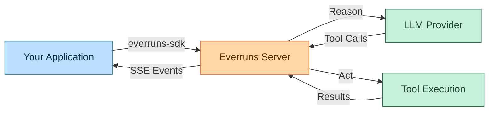
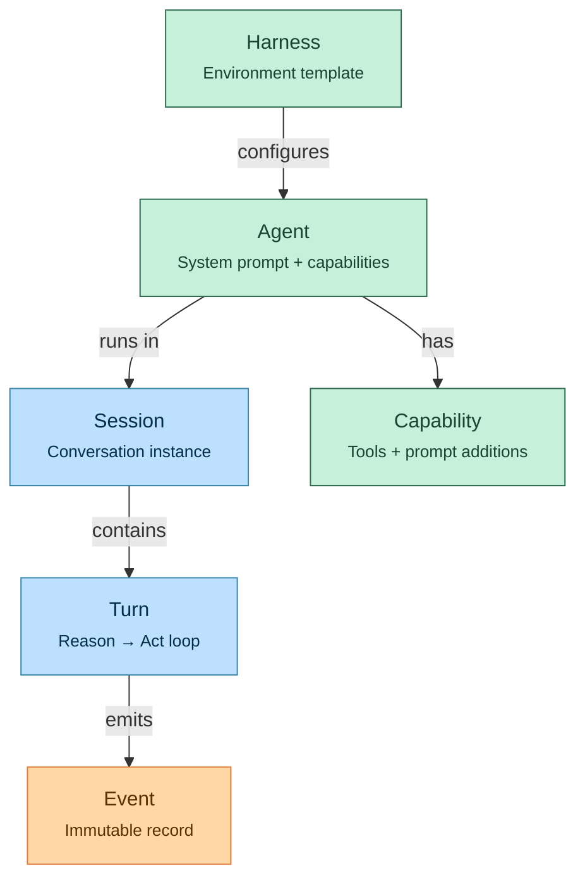
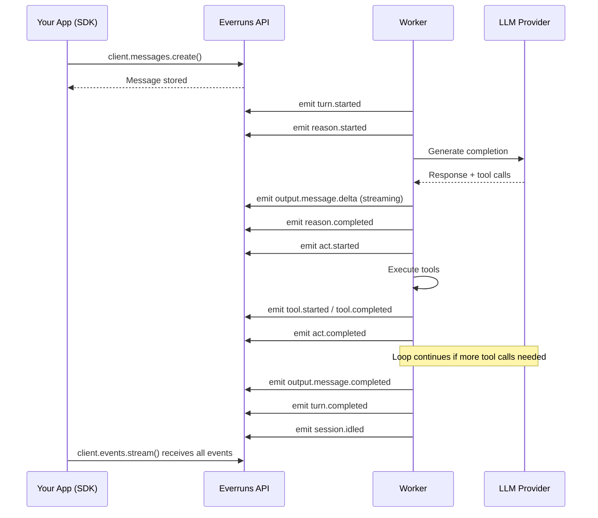
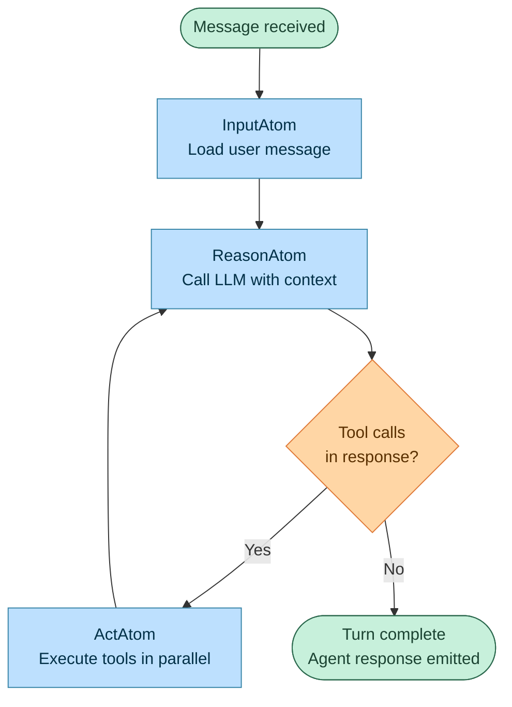
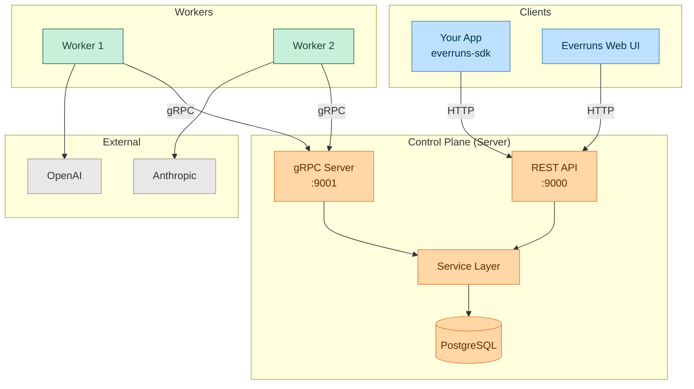

import { Tabs, TabItem } from "@astrojs/starlight/components";

This tutorial walks you through building AI agents on Everruns using the official **everruns-sdk** Python package — from creating your first agent to orchestrating multi-turn conversations with tool execution and real-time event streaming.

## What is Everruns?

Everruns is a **durable agentic harness engine**. It provides the infrastructure layer between your application and LLM providers, handling the agent loop — the cycle of reasoning (calling an LLM) and acting (executing tools) — with durability guarantees backed by PostgreSQL.

Think of it as the runtime that turns a language model into a reliable, stateful agent:



Unlike calling an LLM API directly, Everruns gives you:

- **Durability** — Turns survive worker crashes and are automatically retried
- **Streaming events** — Real-time SSE stream of every step the agent takes
- **Modular capabilities** — File systems, bash execution, web fetch, and more — composed per-agent
- **Multi-provider support** — Switch between OpenAI, Anthropic, or any OpenAI-compatible provider
- **Full observability** — Every LLM call, tool execution, and state transition is recorded as an immutable event

## Core Concepts

Before writing code, let's understand the entities you'll work with.



| Concept | What it is | Analogy |
|---------|-----------|---------|
| **Agent** | Configuration for the agentic loop — system prompt, default model, and enabled capabilities | A job description |
| **Session** | A running conversation with an agent. Holds state, history, and filesystem | A work session |
| **Capability** | A modular unit that provides tools and/or system prompt additions | A plugin |
| **Turn** | One iteration of the reason-act loop within a session | A single task cycle |
| **Event** | An immutable, append-only record of everything that happens | An audit log entry |

**Key insight**: Agents and capabilities are *configuration*. Sessions and turns are *runtime*. Events are *data*. Your application creates configuration, starts runtime, and consumes data.

## Prerequisites

You need:

- A running Everruns instance (see [Docker Compose quickstart](/getting-started/docker-compose/))
- Python 3.10+
- An LLM provider configured (OpenAI or Anthropic API key set in the Everruns UI)

```bash
pip install everruns-sdk
```

## Step 1: Initialize the SDK Client

The `Everruns` client is the entry point for all API interactions. It organizes methods into sub-clients: `agents`, `sessions`, `messages`, `events`, and more.

<Tabs syncKey="auth">
  <TabItem label="Environment Variable">
    ```python
    import asyncio
    from everruns_sdk import Everruns

    # Reads EVERRUNS_API_KEY from environment
    # Reads EVERRUNS_API_URL from environment (default: http://localhost:9000)
    client = Everruns()
    ```
  </TabItem>
  <TabItem label="Explicit Configuration">
    ```python
    from everruns_sdk import Everruns

    client = Everruns(
        api_key="your-api-key",
        base_url="http://localhost:9000"
    )
    ```
  </TabItem>
  <TabItem label="Dev Mode (No Auth)">
    ```python
    from everruns_sdk import Everruns

    # Dev mode (just start-dev) requires no real key
    client = Everruns(api_key="dev", base_url="http://localhost:9000")
    ```
  </TabItem>
</Tabs>

## Step 2: Create an Agent

An agent defines *what* the AI should do (system prompt) and *what tools* it has access to (capabilities).

```python
async def main():
    client = Everruns(api_key="dev", base_url="http://localhost:9000")

    agent = await client.agents.create(
        name="Research Assistant",
        system_prompt=(
            "You are a research assistant. When given a topic, you:\n"
            "1. Create a task list to track your work\n"
            "2. Fetch relevant web pages for information\n"
            "3. Save your notes to files in /workspace\n"
            "4. Produce a concise summary of your findings"
        ),
    )

    print(f"Agent created: {agent.id} ({agent.name})")

asyncio.run(main())
```

### Importing Agents from Markdown

Agents can be defined as markdown files with YAML front matter — a portable, version-controllable format. The front matter specifies name, capabilities, and tags. The body becomes the system prompt.

```markdown
---
name: "HackerNews Reader"
description: "An agent that browses HackerNews autonomously"
tags:
  - demo
  - hackernews
capabilities:
  - web_fetch
  - current_time
  - session_file_system
---
You are a HackerNews reader agent. You autonomously browse
Hacker News to find interesting stories, read discussions,
and research authors.
```

Import it with a single SDK call:

```python
with open("hackernews-reader.md") as f:
    agent = await client.agents.import_agent(f.read())

print(f"Imported: {agent.id} ({agent.name})")
```

This is equivalent to creating the agent with `create()` but the markdown format makes agents easy to share, review in PRs, and store in git.

### Understanding Capabilities

Each capability adds tools and/or system prompt context to the agent. Common capabilities:

| Capability | Tools Provided | Purpose |
|------------|---------------|---------|
| `web_fetch` | `web_fetch` | Fetch URLs and convert HTML to markdown |
| `session_file_system` | `read_file`, `write_file`, `list_directory`, `grep_files`, `delete_file` | Isolated per-session virtual filesystem |
| `virtual_bash` | `bash` | Sandboxed bash shell execution |
| `stateless_todo_list` | `write_todos` | Structured task tracking in conversation |
| `current_time` | `get_current_time` | Current date/time awareness |
| `session_storage` | `kv_store`, `secret_store` | Key-value storage and encrypted secrets |
| `sample_data` | *(mounts only)* | Sample JSON/YAML files in `/samples` |

## Step 3: Create a Session

A session is a working instance — it holds the conversation, filesystem, and execution state.

```python
session = await client.sessions.create(
    agent_id=agent.id,
    title="Research: Durable Execution Engines",
)

print(f"Session created: {session.id}")
```

## Step 4: Send a Message

Sending a user message triggers the agentic loop. The SDK queues a durable workflow that runs the full reason-act cycle.

```python
await client.messages.create(
    session.id,
    "Research the concept of durable execution engines. "
    "What are the main approaches and trade-offs?"
)
```

The call returns immediately — it confirms the message was stored and the workflow was queued. To get the agent's response, you consume events.

## Step 5: Stream Events with the SDK

This is where the SDK shines. Instead of manually polling or parsing SSE, the SDK provides an async iterator that handles reconnection, heartbeat detection, and event typing automatically.

```python
async for event in client.events.stream(session.id):
    if event.type == "output.message.delta":
        # Streaming text — print token by token
        print(event.data.get("delta", ""), end="", flush=True)

    elif event.type == "output.message.completed":
        # Final response — extract full text
        message = event.data.get("message", {})
        for part in message.get("content", []):
            if part.get("type") == "text":
                print(f"\n\nAgent: {part['text']}")

    elif event.type == "tool.started":
        # Tool invocation — show what the agent is doing
        tool_call = event.data.get("tool_call", {})
        tool_name = tool_call.get("name", "unknown")
        print(f"\n  [Tool] {tool_name}")

    elif event.type == "tool.completed":
        status = "done" if event.data.get("success") else "error"
        print(f"  [Tool] {event.data.get('tool_name', '?')}: {status}")

    elif event.type == "turn.completed":
        print("\n[Turn completed]")
        break

    elif event.type == "turn.failed":
        print(f"\n[Turn failed: {event.data.get('error', 'unknown')}]")
        break
```

### What the SDK Handles for You

The `client.events.stream()` method handles:

- **Automatic reconnection** — When the server cycles connections (every 5 minutes), the SDK reconnects transparently using `since_id`
- **Heartbeat-based stale detection** — Server sends heartbeat comments every 30s; if none arrive within 45s, the SDK reconnects
- **Event typing** — Each event has `.type` and `.data` attributes parsed from SSE
- **Retry with backoff** — Network errors trigger exponential backoff with jitter

### The Event Lifecycle

When you send a message, here's the typical event sequence:



## Step 6: Multi-Turn Conversations

Sessions persist across messages. Send follow-up messages to continue the conversation — the agent retains full context.

```python
# Follow-up question
await client.messages.create(
    session.id,
    "Compare Temporal.io vs the PostgreSQL-based approach. "
    "Save your analysis to /workspace/comparison.md"
)

# Stream the response
async for event in client.events.stream(session.id):
    if event.type == "output.message.completed":
        message = event.data.get("message", {})
        for part in message.get("content", []):
            if part.get("type") == "text":
                print(part["text"])
        break
    elif event.type == "turn.failed":
        print(f"Error: {event.data.get('error')}")
        break
```

### Reading Session Files

If the agent wrote files during the session, retrieve them via the SDK's filesystem sub-client:

```python
# List files in the session workspace
listing = await client.filesystem.list(session.id, "/workspace")
for entry in listing.entries:
    kind = "dir" if entry.is_directory else "file"
    print(f"  [{kind}] {entry.name}")

# Read a specific file
file = await client.filesystem.read(session.id, "/workspace/comparison.md")
print(file.content)
```

## Complete Example: HackerNews Reader

Here's a complete, runnable example that creates an agent from a markdown definition, starts a session, sends a prompt, and streams the response — all using the SDK.

```python
#!/usr/bin/env python3
"""HackerNews Reader Agent — demonstrates the everruns-sdk."""

import asyncio
import os
from everruns_sdk import Everruns

AGENT_MARKDOWN = """
---
name: "HackerNews Reader"
description: "An agent that browses HackerNews autonomously"
tags:
  - demo
capabilities:
  - web_fetch
  - current_time
  - session_file_system
---
You are a HackerNews reader agent. Use the public Firebase API:

- Top stories: https://hacker-news.firebaseio.com/v0/topstories.json
- Item detail: https://hacker-news.firebaseio.com/v0/item/{id}.json
- User profile: https://hacker-news.firebaseio.com/v0/user/{username}.json

Fetch only what's needed. Present stories in a numbered list with title,
points, and comment count.
""".strip()


async def main():
    client = Everruns(
        api_key=os.environ.get("EVERRUNS_API_KEY", "dev"),
        base_url=os.environ.get("EVERRUNS_API_URL", "http://localhost:9000"),
    )

    # Import agent from markdown
    agent = await client.agents.import_agent(AGENT_MARKDOWN)
    print(f"Agent: {agent.id} ({agent.name})")

    # Create session
    session = await client.sessions.create(
        agent_id=agent.id,
        title="HackerNews Reader Session",
    )
    print(f"Session: {session.id}\n")

    try:
        # Send message
        prompt = "What are the top 5 stories on HackerNews right now?"
        await client.messages.create(session.id, prompt)
        print(f"You: {prompt}\n")

        # Stream events
        async for event in client.events.stream(session.id):
            if event.type == "output.message.completed":
                message = event.data.get("message", {})
                for part in message.get("content", []):
                    if part.get("type") == "text":
                        print(f"Agent: {part['text']}")

            elif event.type == "tool.started":
                tool_call = event.data.get("tool_call", {})
                name = tool_call.get("name", "unknown")
                args = tool_call.get("arguments", {})
                if name == "web_fetch":
                    print(f"  -> Fetching: {args.get('url', '?')}")
                else:
                    print(f"  -> Tool: {name}")

            elif event.type == "turn.completed":
                print("\n[Turn completed]")
                break

            elif event.type == "turn.failed":
                print(f"\n[Turn failed: {event.data.get('error', 'unknown')}]")
                break

        # Interactive follow-up loop
        while True:
            try:
                follow_up = input("\nYou (or 'quit'): ").strip()
            except (EOFError, KeyboardInterrupt):
                break
            if not follow_up or follow_up.lower() in ("quit", "exit", "q"):
                break

            await client.messages.create(session.id, follow_up)
            print()
            async for event in client.events.stream(session.id):
                if event.type == "output.message.completed":
                    message = event.data.get("message", {})
                    for part in message.get("content", []):
                        if part.get("type") == "text":
                            print(f"Agent: {part['text']}")
                elif event.type == "turn.completed":
                    break
                elif event.type == "turn.failed":
                    print(f"Error: {event.data.get('error')}")
                    break
    finally:
        # Cleanup
        await client.sessions.delete(session.id)
        await client.agents.delete(agent.id)
        await client.close()
        print("\nCleaned up.")


if __name__ == "__main__":
    asyncio.run(main())
```

Run it:

```bash
# Start the Everruns server
just start-dev

# Run the example
pip install everruns-sdk
python hackernews_reader.py
```

## The Agentic Loop in Depth

Understanding the reason-act loop is key to building effective agents. Here's what happens inside each turn:



Each iteration:

1. **Reason** — The LLM receives the full conversation history (system prompt + messages + tool results) and produces either a text response or tool calls
2. **Act** — All tool calls from the LLM are executed in parallel. Results are added to the conversation history
3. **Loop** — If there were tool calls, go back to Reason. If the LLM produced a final text response, the turn is complete

The loop runs for a maximum of **10 iterations** per turn to prevent runaway execution.

### Durable Execution

In production mode (PostgreSQL-backed), each step is a separate durable task:

```
SetupStep → ExecuteLlmStep → ExecuteToolStep(s) → ExecuteLlmStep → ... → FinalizeStep
```

If a worker crashes mid-turn, the control plane detects the missed heartbeat and re-queues the task for another worker. Your application sees a brief delay, not a failure.

## Event Types Reference

Events follow the `{category}.{action}` naming convention. Here are the events you'll encounter most:

### Message Events

| Event | When | Key Fields |
|-------|------|-----------|
| `input.message` | User message stored | `data.message.content` |
| `output.message.started` | LLM generation begins | `data.model` |
| `output.message.delta` | Streaming text chunk | `data.delta`, `data.accumulated` |
| `output.message.completed` | Final agent response | `data.message.content`, `data.usage` |

### Turn Events

| Event | When | Key Fields |
|-------|------|-----------|
| `turn.started` | Agentic loop begins | `data.turn_id` |
| `turn.completed` | Loop finished | `data.iterations`, `data.duration_ms` |
| `turn.failed` | Unrecoverable error | `data.error`, `data.error_code` |
| `turn.cancelled` | User cancelled | `data.reason` |

### Tool Events

| Event | When | Key Fields |
|-------|------|-----------|
| `tool.started` | Tool execution begins | `data.tool_call.name`, `data.tool_call.arguments` |
| `tool.completed` | Tool finished | `data.tool_name`, `data.success`, `data.result` |

### Session Events

| Event | When | Key Fields |
|-------|------|-----------|
| `session.activated` | Turn started (session active) | `data.turn_id` |
| `session.idled` | Turn completed (session idle) | `data.usage` (cumulative tokens) |

### LLM Events

| Event | When | Key Fields |
|-------|------|-----------|
| `llm.generation` | After each LLM API call | `data.messages`, `data.output`, `data.metadata.usage` |

## Practical Patterns

### Pattern: Multi-Agent Pipeline

Chain agents by passing output from one session into another:

```python
async def multi_agent_pipeline(client: Everruns):
    # Step 1: Research agent gathers information
    researcher = await client.agents.create(
        name="Researcher",
        system_prompt="Research the given topic thoroughly. Write detailed notes.",
    )

    research_session = await client.sessions.create(agent_id=researcher.id)
    await client.messages.create(
        research_session.id, "Research Python async frameworks"
    )

    # Wait for research to complete
    research_output = None
    async for event in client.events.stream(research_session.id):
        if event.type == "output.message.completed":
            message = event.data.get("message", {})
            parts = message.get("content", [])
            research_output = "\n".join(
                p["text"] for p in parts if p.get("type") == "text"
            )
        elif event.type in ("turn.completed", "turn.failed"):
            break

    # Step 2: Writer agent creates a polished article
    writer = await client.agents.create(
        name="Technical Writer",
        system_prompt="Write clear, well-structured technical articles.",
    )

    writer_session = await client.sessions.create(agent_id=writer.id)
    await client.messages.create(
        writer_session.id,
        f"Write a blog post based on this research:\n\n{research_output}",
    )

    async for event in client.events.stream(writer_session.id):
        if event.type == "output.message.delta":
            print(event.data.get("delta", ""), end="", flush=True)
        elif event.type in ("turn.completed", "turn.failed"):
            break

    # Cleanup
    for sid in (research_session.id, writer_session.id):
        await client.sessions.delete(sid)
    for aid in (researcher.id, writer.id):
        await client.agents.delete(aid)
```

### Pattern: Cancellation

Cancel a long-running turn via the SDK:

```python
import asyncio

# Send a message that might take a while
await client.messages.create(session.id, "Analyze every Python package on PyPI")

# Changed your mind? Cancel it
await asyncio.sleep(2)
await client.sessions.cancel(session.id)
```

The cancellation flow emits `turn.cancelled`, adds a user message noting the cancellation, and the worker emits a final agent message confirming the work was stopped.

### Pattern: Upload Files Before Asking

Inject files into the session filesystem, then ask the agent to process them:

```python
# Upload a file into the session
await client.filesystem.create(
    session.id,
    "/workspace/input.csv",
    content="name,value\nalpha,1\nbeta,2\ngamma,3",
)

# Ask the agent to process it
await client.messages.create(
    session.id,
    "Read /workspace/input.csv and create a summary."
)
```

## Architecture Overview

Understanding the architecture helps you make better integration decisions.



**Control Plane** (Server) owns all state. It exposes two interfaces:
- **REST API** (port 9000) — The SDK connects here
- **gRPC** (port 9001) — Workers connect here (internal)

**Workers** are stateless executors. They claim tasks from a durable queue, execute the reason-act loop, and report results back via gRPC. If a worker crashes, the task is automatically re-queued.

**Your application** only talks to the REST API via the SDK. You never interact with workers or the database directly.

## SDK API Coverage

The SDK provides access to the full Everruns API through organized sub-clients:

| Sub-client | Operations |
|------------|------------|
| `client.agents` | `create`, `list`, `get`, `update`, `upsert`, `delete`, `import_agent`, `export`, `preview` |
| `client.sessions` | `create`, `list`, `get`, `update`, `delete`, `cancel` |
| `client.messages` | `create`, `list` |
| `client.events` | `list`, `stream` (SSE with auto-reconnection) |
| `client.filesystem` | `list`, `read`, `create`, `update`, `delete`, `move`, `copy`, `grep`, `stat` |
| `client.capabilities` | `list`, `get` |
| `client.llm_providers` | `create`, `list`, `get`, `update`, `delete`, `sync_models` |
| `client.llm_models` | `create`, `list`, `get`, `update`, `delete` |
| `client.mcp_servers` | `create`, `list`, `get`, `update`, `delete` |
| `client.images` | `upload`, `list`, `get`, `thumbnail`, `delete` |
| `client.scheduled_tasks` | `create`, `list`, `get`, `update`, `delete`, `pause`, `resume`, `trigger` |

### Error Handling

The SDK provides typed exceptions for common API errors:

```python
from everruns_sdk import Everruns, NotFoundError, AuthenticationError

client = Everruns()

try:
    agent = await client.agents.get("invalid-id")
except NotFoundError as e:
    print(f"Not found: {e}")
except AuthenticationError as e:
    print(f"Auth error: {e}")
```

## What's Next

- Read the [SDK documentation](/features/sdk/) for the full API reference across Rust, Python, and TypeScript
- Browse the [API Reference](/api/) for all REST endpoints
- Read about [Events](/event-reference/) for the complete event type catalog
- Learn about [Capabilities](/features/capabilities/) to understand all available tools
- Explore [Harnesses](/features/harnesses/) for environment templates
- Check out the [Architecture](/getting-started/architecture/) docs for deployment details
- See the [HackerNews Reader example](https://github.com/everruns/everruns/tree/main/examples/hackernews-reader) for a complete working project
