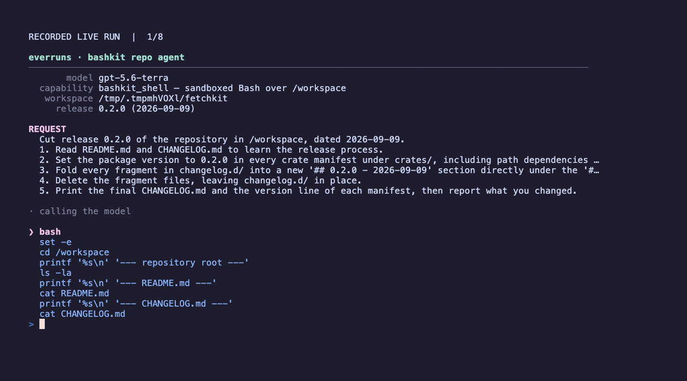

# Bashkit Repo Agent

A Framework agent that performs a real repository operation — cutting a release
— with the sandboxed [Bashkit](https://bashkit.sh) shell as its only execution
runtime. It runs against a real model (`gpt-5.6-terra`), and the host verifies
the result on disk after the turn.



## Run

```bash
OPENAI_API_KEY=... cargo run -p everruns-bashkit-repo-agent
OPENAI_API_KEY=... cargo run -p everruns-bashkit-repo-agent -- /tmp/release-run
cargo test -p everruns-bashkit-repo-agent
```

`cargo run` makes real provider calls. With no argument the working copy lives
in a temporary directory that is removed on exit; pass a path to keep it. That
directory is the agent's read-write workspace and is edited in place, so pass a
scratch path rather than a repository you care about — the runtime clamps every
shell path under it, but everything inside it is fair game. The tests never
contact the provider.

## What it does

1. The example materializes the bundled [`sample-repo/`](sample-repo) fixture —
   a two-crate Cargo workspace with a `CHANGELOG.md` and unreleased fragments in
   `changelog.d/` — into a throwaway working copy.
2. That host directory is mounted as the agent's `/workspace` with
   `WorkspacePolicy::read_write()`, and the agent gets exactly one capability:
   `BashkitShell`.
3. The agent is asked to cut `0.2.0`: bump the version in every crate manifest,
   fold the changelog fragments into a new dated section, and delete the
   fragments. It does all of it with `sed`, `grep`, heredocs, and `rm` inside
   Bashkit — there is no file tool in the session.
4. When the turn ends, the host re-reads the directory and prints a check per
   claim (`verify` in [src/main.rs](src/main.rs)), exiting non-zero if the
   release did not actually land.

## How the demo works

The screencast is a **paged replay of a recorded live run**, with provider wait
time removed. Read the [complete displayed transcript](demo.txt) at your own
pace; long scripts and command output are truncated for display only, the agent
receives the full result. The run shown hits a real edge of the sandbox — `find
-delete` is not implemented — and recovers with a portable `-exec rm -f {} \;`.

To capture a new live run, export `OPENAI_API_KEY` and run:

```bash
bash record.sh
```

Recording needs VHS, `less`, and a real provider call. Adjust the page count in
[demo.tape](demo.tape) if a new transcript is longer; `vhs demo.tape` replays
the saved transcript without API calls.

## Why Bashkit

Bashkit interprets bash in-process against the session filesystem: no
`/bin/bash`, no subprocess, no host filesystem beyond `/workspace`, no network,
and fixed limits on commands, loop iterations, and script size. The agent gets a
usable shell over the repository, and the deployment keeps a hard boundary
around it. Because it is an interpreter rather than a shell-out, `git` is not
available, so the agent works on the checked-out tree.

Agent setup, the release request, and the verification live in
[src/main.rs](src/main.rs); [src/demo.rs](src/demo.rs) subscribes to session
events and prints each shell script the agent runs with a bounded preview of its
output, colored unless `NO_COLOR` is set. The shell here operates on this
example's own throwaway copy — review what an observer prints before pointing
one at a workspace with private data.

## See also

- [Bashkit Shell capability](https://docs.everruns.com/capabilities/bashkit-shell/)
- [`coding-cli`](../coding-cli) — a full terminal coding agent that combines
  Bashkit with file, search, and skill capabilities
