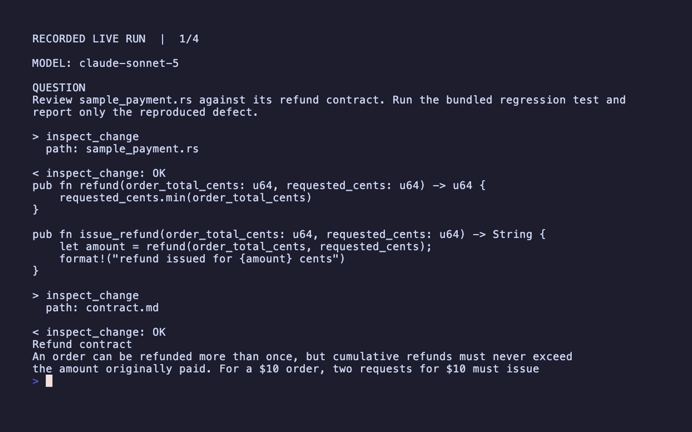

# Coding Review Agent

A self-contained Framework code-review agent. It uses Anthropic's
`claude-sonnet-5`, inspects the included `sample_payment.rs`, and produces a
real code review.

## Run



```bash
ANTHROPIC_API_KEY=... cargo run -p everruns-coding-review-agent
cargo test -p everruns-coding-review-agent
```

Pass a different review request after `--`. The test only validates agent
construction; `cargo run` makes the real provider call.

## How the demo works

Agent setup and tools live in [src/main.rs](src/main.rs). The separate
[src/demo.rs](src/demo.rs) subscribes to session events before sending the
question, prints real tool arguments and bounded result previews, and displays
the final answer. These tools expose public or demo data; review what may be
printed before adapting this observer to private data.

The screencast is a **paged replay of a recorded live run**, with provider wait
time removed. Read the [complete displayed transcript](demo.txt) at your own pace;
tool results marked `[preview]` are shortened only for display.

To capture a new live run, export the keys above and run:

```bash
bash record.sh
```

Recording needs VHS and `less`. Adjust the page count in `demo.tape` if a new
answer is longer; `vhs demo.tape` replays the saved transcript without API calls.
