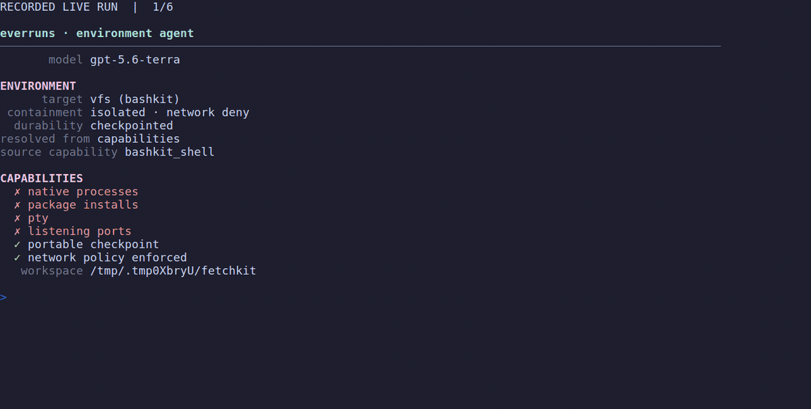

# Environment Agent

Choose where an agent's commands run, and say so before it runs any. This is a
real `gpt-5.6-terra` agent, not a scripted turn.



## What you learn

Selecting a session's execution environment, reading the capability set that
comes with it, and reporting that profile to a caller before the first turn —
the same view `GET /v1/sessions/{id}/environment` returns, resolved in-process
against the Framework's own types.

## The model

Two independent questions, which older sandbox APIs tangled together:

- **Target** — *where* commands run: `vfs` (Bashkit), `container`, `managed`
  (Daytona, E2B), `host`, `machine`, or no target at all.
- **Containment** — *what they may touch*: `none`, `native` (a kernel policy),
  or `isolated` (a separate kernel, VM, or interpreter), plus a network policy.

A target also declares its **durability** — whether anything recovers the
working filesystem if the compute is lost — and a **capability set** that tools
and UI are assembled from. Nothing here is inferred: a target that cannot run
native binaries says so, rather than accepting every command and failing on all
of them.

## Scenario and expected outcome

The bundled `src/resources/project/` is a small library carrying four `TODO`
markers across two of its three modules. The agent must count them, write
`AUDIT.md` ranking the files, and total them. The host then re-reads the working
copy and fails the process if the report is missing, mis-ordered, or wrong.

The same audit succeeds in either environment; what changes is how. With the
sandboxed shell the agent writes a bash counting loop. With file tools only it
reads each file. The profile printed before the turn says which is possible,
so a caller never has to learn it from a failing tool call.

## Run it

Install Rust/Cargo, clone the repository, and run from its root. This folder is
self-contained **within the workspace**: its manifest references local Framework
crates, so copying the folder alone is not sufficient.

```bash
git clone https://github.com/everruns/everruns.git
cd everruns
export OPENAI_API_KEY="your-key"

# The sandboxed Bashkit shell (default).
cargo run -p everruns-environment-agent

# File tools only: nothing executes.
cargo run -p everruns-environment-agent -- --environment files

# Every target this build can offer, and a reason for each it cannot.
cargo run -p everruns-environment-agent -- --targets
```

`--targets` needs no credentials. The configured model is `gpt-5.6-terra`; a
funded OpenAI account is required and live runs can incur charges. The working
copy is a temporary directory removed on exit.

## What it prints

```text
ENVIRONMENT
      target vfs (bashkit)
 containment isolated · network deny
  durability checkpointed
resolved from capabilities
source capability bashkit_shell

CAPABILITIES
  ✗ native processes
  ✗ package installs
  ✗ pty
  ✗ listening ports
  ✓ portable checkpoint
  ✓ network policy enforced
```

Selecting `--environment files` reports `target — nothing executes` with every
capability false. That is the honest answer for a session that only reads and
writes files: claiming `isolated` would invent a boundary around something that
never runs.

## Build the agent

The environment is not a prompt variable. It is the set of capabilities the
agent is given, which is exactly what the profile is derived from.

```rust
let builder = Agent::builder()
    .name("environment-agent")
    .instructions(include_str!("instructions.md"))
    .provider(provider)
    .model(MODEL)
    .workspace(workspace)
    .workspace_policy(WorkspacePolicy::read_write());

match target {
    Runnable::Bashkit => builder.capability(BashkitShell::new()).build(),
    Runnable::Files => builder.build(),
}
```

## The host target

`host` runs commands on the machine the process is already running on, with
nothing between the command and the filesystem. It is the target Everruns never
had, and it is honest about itself: `ContainmentLevel::None` and
`Durability::None`, so a caller needing recovery is refused rather than misled.

```bash
cargo run -p everruns-environment-agent --features host-compute -- --environment host
```

Built that way the example constructs a real `HostCompute` and reads its
capabilities, containment, and durability straight off the `Compute` trait —
the printed profile says `resolved from: compute` rather than `capabilities`.
It then **refuses to run**, with its reason: no capability routes agent tool
calls through `Environment::compute()` yet, so a host agent would carry a
declared target and no way to use it. Wiring a compute-backed shell capability
is the next slice, not something this example pretends to have.

## Validate the behavior

```bash
cargo test -p everruns-environment-agent
cargo test -p everruns-environment-agent --features host-compute
```

Tests validate agent construction for both runnable targets, the derivation
rules, the fixture's marker counts, and the host-side assertions, without
contacting OpenAI. CI does not grade live model quality.

## Adapt it

Replace `src/resources/project/`, `audit_request`, and `verify` with a
disposable fixture and independent assertions for your workflow. Keep the
mounted root narrow, start read-only unless mutation is required, and validate
important claims from host state after the turn. When you add a target, add its
row to `environment.rs` rather than teaching the UI or the API separately —
one table is what keeps them from drifting into three different opinions about
what a sandbox can do.

## Boundaries

Environment profiles are derived from capabilities, not stored configuration,
which is what `resolved_from: "capabilities"` records. Selecting a target at
session-create time, the `machine` target, kernel containment, and the managed
providers behind the `Compute` contract are all scoped but not built. The
session itself is in-memory.

## Source map

`src/main.rs`: selection, profile reporting, run, and verification;
`src/environment.rs`: the target table and derivation rules; `src/agent.rs`:
capability sets per target; `src/sample_project.rs`: fixture materialization;
`src/resources/project/`: input project; `src/instructions.md`: agent
instructions. `examples/demo-support::shell` handles terminal presentation;
`src/record.sh` and `src/render_demo.py` handle recording.

## Demo and recording

`src/demo.txt` is output from a successful live run. `src/render_demo.py`
automatically creates readable pages and durations; VHS replays them without
another API call.

```bash
cd examples/environment-agent
bash src/record.sh
```

Recording needs Python 3, VHS, ffmpeg, a VHS-compatible browser, and funded
OpenAI credentials. The script preserves the previous successful transcript if
the provider run fails. VHS captures frames reliably but its own GIF output
silently produces nothing in some environments, so `record.sh` encodes the
frames with ffmpeg rather than leaving it implied. Inspect recordings before
sharing when adapting this example to private repositories.

## See also

- [`bashkit-repo-agent`](../bashkit-repo-agent) — one sandboxed repository
  mutation, verified from the host
- [`coding-cli`](../coding-cli) — a full terminal coding agent combining Bashkit
  with file, search, and skill capabilities
- [Bashkit Shell capability](https://docs.everruns.com/capabilities/bashkit-shell/)
