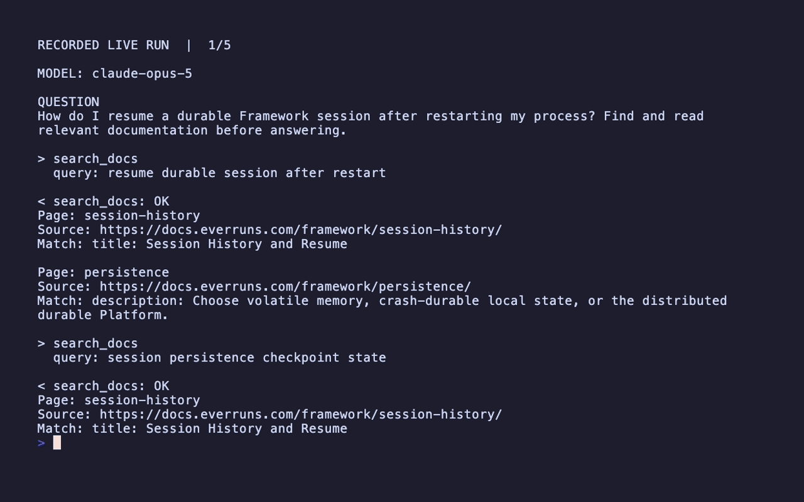

# Everruns Support Agent

Answer a Framework question by searching and reading a small, inspectable corpus of official documentation. This demonstrates retrieval before answering, rather than routing a few keywords to hardcoded links.

## What you learn

A two-step search/read tool interface, citable evidence, and an explicit boundary around the available knowledge.

## Scenario and expected outcome

The default question asks how to resume a session after a process restart. The agent must distinguish reopening an in-memory session from persistence across restarts.

Search for persistence/resume, read the relevant pages, explain the persisted session/catalog and agent reattachment requirements supported by that snapshot, and cite the public documentation URLs. Do not imply that `Engine::new()` alone survives a process restart.

## Run it

Install Rust/Cargo, clone the repository, and run from its root. These folders are self-contained **within the workspace**: their Cargo manifests reference the local Framework crates, so copying one folder alone is not sufficient.

```bash
git clone https://github.com/everruns/everruns.git
cd everruns
export ANTHROPIC_API_KEY="your-key"
cargo run -p everruns-framework-support-agent
```

The configured model is `claude-opus-5`. Provider access and funded credits are required; a model identifier alone does not grant access. Keep keys in your environment, not in source control. Missing variables, provider errors, or unsuccessful turns exit nonzero.

Try a contrasting question:

```bash
cargo run -p everruns-framework-support-agent -- "How do I register a custom provider?"
cargo run -p everruns-framework-support-agent -- "How can a tool return a structured error?"
```

## Build the agent

This is the actual builder from `src/main.rs`. The prompt is `src/instructions.md`. Tools/capabilities supply evidence and actions; the model chooses how to use them.

```rust
let agent = Agent::builder()
    .name("everruns-support-agent")
    .instructions(include_str!("instructions.md"))
    .provider(everruns_anthropic::provider("anthropic", api_key))
    .model(MODEL)
    .max_iterations(12)
    .tool(tools::search_docs())
    .tool(tools::read_doc())
    .build()?;
```

## Send, observe, and wait

The Framework interaction stays readable in `main.rs`. The shared demo helper subscribes before sending, filters events to this turn, shows bounded tool previews, waits for completion, and rejects unsuccessful turns. It changes presentation only; use `session.send_and_wait(question).await?` when you do not need the live tool timeline.

```rust
let engine = Engine::new();
let session = engine.create(agent);
println!("MODEL: {MODEL}");
demo::run(&session, question).await?;
```

This engine is in-memory. It does not demonstrate durable session storage; the Everruns Support example can explain that API, but does not itself persist its session.

## How the tools work

`search_docs` ranks matches against the actual text of five bundled pages and returns page IDs, URLs, and matching excerpts. `read_doc` returns the complete selected page. It accepts only corpus IDs, never arbitrary filesystem paths.

## Validate the behavior

```bash
cargo test -p everruns-framework-support-agent
python3 examples/everruns-support-agent/src/render_demo.py --check
```

Tests exercise content-based search, no-match and empty-query behavior, complete citable page reads, and path rejection. A live run is still needed to evaluate whether the answer faithfully reflects those pages.

CI runs these offline checks without provider credentials. Live model behavior is evaluated separately; passing tests is not proof of answer quality.

## Demo and recording



Read the [captured transcript](src/demo.txt) at your own pace. The GIF is a paginated
replay of an actual provider run, with waiting time removed. It is not
interactive and does not show model reasoning. Result excerpts are shortened
only for display.

With credentials exported and Python 3, VHS, ffmpeg, and a VHS-compatible browser installed:

```bash
cd examples/everruns-support-agent
bash src/record.sh
```

The script captures a successful run, generates correctly wrapped pages and page durations, and renders `src/demo.gif`. It preserves the previous transcript when the provider run fails. To replay an existing transcript without another model call, run `(cd src && python3 render_demo.py && vhs demo.tape)`. `src/demo.txt` retains the displayed output; `.demo-pages/` is generated and ignored. Inspect results before sharing: public/demo data is safe here, but adapting tools may expose private data.

## Adapt it

Replace the bundled corpus with a versioned documentation index, retain separate search and read operations, and attach source/version metadata. Expand the corpus deliberately rather than silently answering outside it.

## Boundaries

The corpus is a five-page snapshot from 2026-09-08, not a live website search. Provenance is in `docs/README.md`; it can lag current APIs. No-match results should be reported honestly.

## Source map

`src/main.rs`: agent and session; `src/tools.rs`: lexical search and safe page reads; `src/docs/`: complete official page snapshots and provenance; `src/instructions.md`: evidence and citation rules. `examples/demo-support` handles shared terminal presentation; `src/record.sh` and `src/render_demo.py` handle recording.
