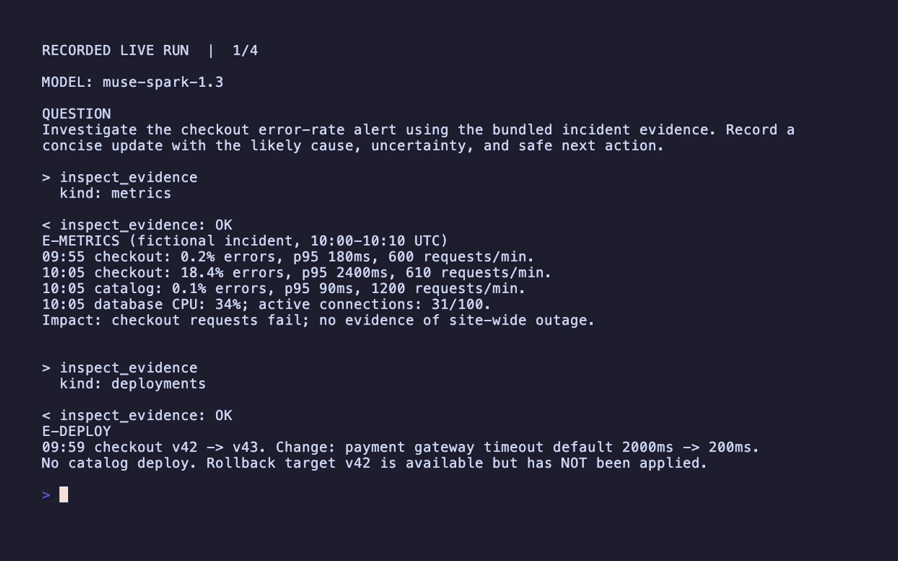

# Incident Commander Agent

A self-contained Framework incident-coordination agent. It attaches a typed,
bounded incident-log tool and runs an approval-aware incident workflow through
`Engine`.

## Run



```bash
cargo run -p everruns-incident-commander-agent
cargo test -p everruns-incident-commander-agent
```

The scripted simulator records an incident update before the final response, so
CI exercises the agent tool loop. For production, configure Meta Model API in
the embedding application and select `muse-spark-1.3` or the
newest compatible profile.
