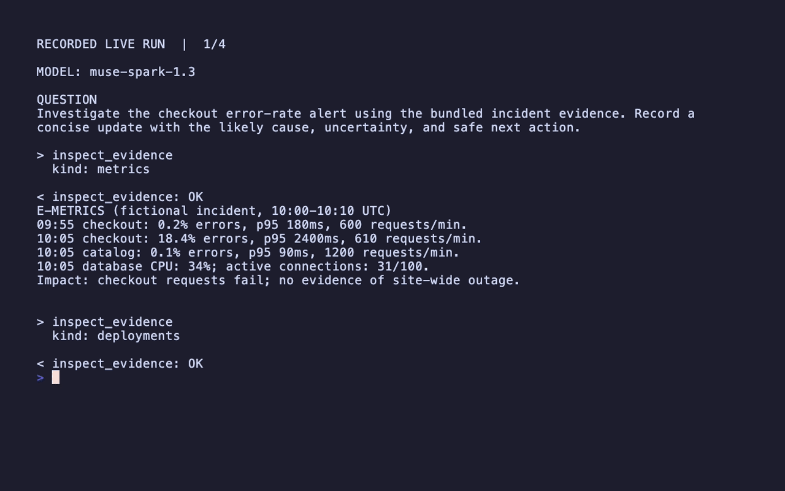

# Incident Commander Agent

Investigate a fictional checkout alert using contrasting metrics, deployment history, logs, and a runbook; then persist an evidence-backed status update. The agent must investigate before recommending action.

## What you learn

Multi-tool evidence gathering, distinguishing correlation from causation, and a narrowly scoped append-only side effect.

## Scenario and expected outcome

Checkout errors rise from 0.2% to 18.4% after v43 reduces the payment timeout from 2,000 ms to 200 ms. Catalog traffic and database metrics stay normal; sampled logs show requests timing out just beyond the new deadline.

Read metrics, deployments, logs, and the runbook. Identify the timeout reduction as a likely cause, not proven causation. Propose on-call ownership and approval for rollback consideration. Record that conclusion locally without claiming any production mitigation occurred.

## Run it

Install Rust/Cargo, clone the repository, and run from its root. These folders are self-contained **within the workspace**: their Cargo manifests reference the local Framework crates, so copying one folder alone is not sufficient.

```bash
git clone https://github.com/everruns/everruns.git
cd everruns
export MODEL_API_KEY="your-key"
cargo run -p everruns-incident-commander-agent
```

The configured model is `muse-spark-1.3`. Provider access and funded credits are required; a model identifier alone does not grant access. Keep keys in your environment, not in source control. Missing variables, provider errors, or unsuccessful turns exit nonzero.

Try a contrasting question:

```bash
cargo run -p everruns-incident-commander-agent -- "Investigate checkout and explain what evidence argues against a database-wide incident. Record a concise update."
```

## Build the agent

This is the actual builder from `src/main.rs`. The prompt is `src/instructions.md`. Tools/capabilities supply evidence and actions; the model chooses how to use them.

```rust
let agent = Agent::builder()
    .name("incident-commander-agent")
    .instructions(include_str!("instructions.md"))
    .provider(everruns_meta::provider("meta", api_key))
    .model(MODEL)
    .max_iterations(12)
    .tool(tools::inspect_evidence())
    .tool(tools::record_incident_update())
    .build()?;
```

## Send, observe, and wait

The Framework interaction stays readable in `main.rs`. The shared demo helper subscribes before sending, filters events to this turn, shows bounded tool previews, waits for completion, and rejects unsuccessful turns. It changes presentation only; use `session.send_and_wait(question).await?` when you do not need the live tool timeline.

```rust
let engine = Engine::new();
let session = engine.create(agent);
println!("MODEL: {MODEL}");
demo::run(&session, question).await?;
```

This engine is in-memory. It does not demonstrate durable session storage; the Everruns Support example can explain that API, but does not itself persist its session.

## How the tools work

`inspect_evidence` exposes only four named fixture categories. `record_incident_update` appends a non-empty update of at most 500 UTF-8 bytes to this example's `src/incident.log`, normalizing newlines. There is deliberately no production rollback tool.

## Validate the behavior

```bash
cargo test -p everruns-incident-commander-agent
python3 examples/incident-commander-agent/src/render_demo.py --check
```

Tests verify that updates survive multiple writes, oversized/empty updates are rejected before a file is created, and evidence access is scoped. A live run should show all evidence reads followed by a persisted update that matches the observed facts.

CI runs these offline checks without provider credentials. Live model behavior is evaluated separately; passing tests is not proof of answer quality.

## Demo and recording



Read the [captured transcript](src/demo.txt) at your own pace. The GIF is a paginated replay of an actual provider run, with waiting time removed. It is not interactive and does not show model reasoning. Result excerpts are shortened only for display.

With credentials exported and Python 3, VHS, ffmpeg, and a VHS-compatible browser installed:

```bash
cd examples/incident-commander-agent
bash src/record.sh
```

The script captures a successful run, generates correctly wrapped pages and page durations, and renders `src/demo.gif`. It preserves the previous transcript when the provider run fails. To replay an existing transcript without another model call, run `(cd src && python3 render_demo.py && vhs demo.tape)`. `src/demo.txt` retains the displayed output; `.demo-pages/` is generated and ignored. Inspect results before sharing: public/demo data is safe here, but adapting tools may expose private data.

## Adapt it

Replace each fixture with a read-only monitoring/deployment API scoped to the relevant service. Keep investigation separate from action. Add explicit approval and an audit trail before introducing any production mutation.

## Boundaries

All telemetry is fictional. The log is a real local append-only artifact, ignored by Git; it contains exercise text and does not change production. Filesystem permissions and rotation are the application's responsibility.

## Source map

`src/main.rs`: agent and session; `src/tools.rs`: evidence allowlist and local recording; `src/metrics.txt`, `src/deployments.txt`, `src/logs.txt`, `src/runbook.md`: inspectable incident data. `examples/demo-support` handles shared terminal presentation; `src/record.sh` and `src/render_demo.py` handle recording.
