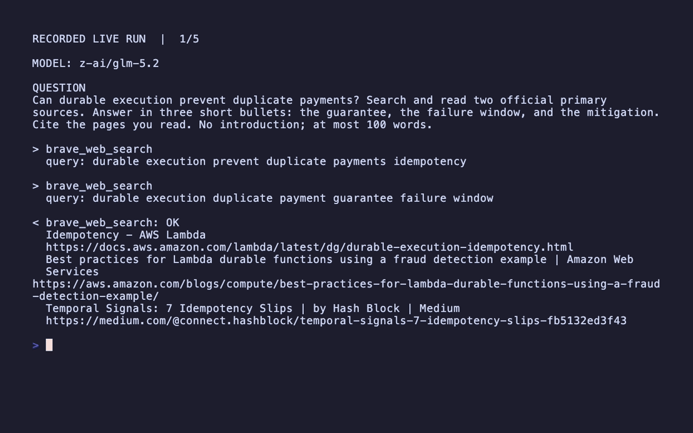

# Research Agent

A self-contained Framework research agent. It attaches a typed source-recording
tool and runs the evidence-first research workflow through `Engine`.

## Run



```bash
cargo run -p everruns-research-agent
cargo test -p everruns-research-agent
```

The scripted simulator records a source before the final report, so CI
exercises the agent tool loop. For production, connect an OpenRouter provider
and select `z-ai/glm-5.2` or the newest compatible GLM
profile.
