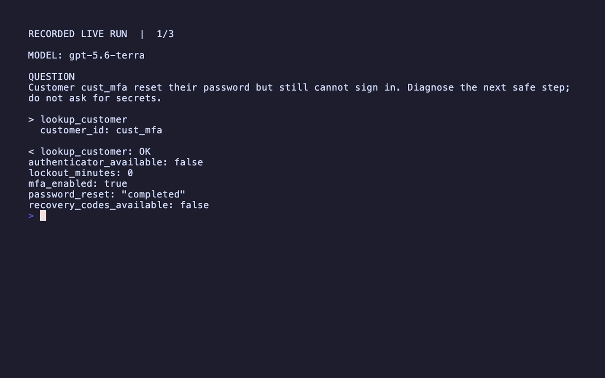

# Support Agent

A self-contained Everruns Framework customer-support agent. It uses OpenAI's
`gpt-5.6-terra`, looks up the safe demo customer record through a typed tool,
and answers a real support question.

## Run



```bash
OPENAI_API_KEY=... cargo run -p everruns-support-agent
cargo test -p everruns-support-agent
```

Pass a different support question after `--`. The test only validates agent
construction; `cargo run` makes the real provider call.
