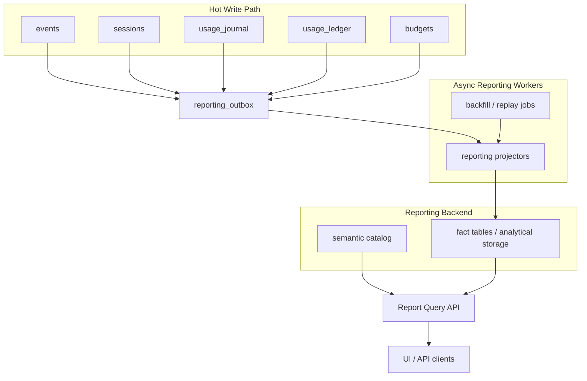

# Reporting

## Abstract

Built-in reporting provides dynamic analytical queries over session activity,
token usage, budgets, tools, and capabilities without putting denormalization
on the hot write path. Canonical operational tables remain the source of truth.
Reporting is an asynchronous projection layer with a semantic query API and a
backend abstraction so reads do not assume PostgreSQL forever.

## Goals

- Report token usage by agent, user, principal, harness, session, model, and provider.
- Report session count, duration, status, and turn execution trends.
- Report budget spend, credits, balances, and subject-level usage.
- Report tool usage by tool, capability, agent, user, harness, status, and duration.
- Report capability usage with explicit meanings: configured, resolved, exposed, invoked, and effect-run.
- Keep normal session, event, usage, and budget writes fast. Reporting lag is acceptable.
- Keep tenant isolation structural across outbox rows, facts, saved reports, and query execution.
- Support future non-PostgreSQL analytical backends behind explicit traits.

## Non-Goals

- Arbitrary user SQL.
- Strongly consistent real-time reporting.
- Replacing `events` for SSE replay or conversation reconstruction.
- Replacing `usage_journal` / `usage_ledger` as metering and budget sources.
- Phase 3 analytics backends in the first implementation.

## Source Of Truth

Reporting facts are derived from canonical sources:

| Source | Purpose |
|---|---|
| `events` | Durable execution lifecycle events and event context |
| `sessions` | Session ownership, agent, harness, app, status, and timestamps |
| `usage_journal` | Raw metering facts |
| `usage_ledger` | Rated budget and usage postings |
| `budgets` | Budget configuration and current operational balance |
| `agent_capabilities` | Agent-level configured capabilities |
| `harness_capabilities` | Harness-level configured capabilities |
| `sessions.capabilities` | Session-level configured capabilities |

Reporting is derived and replayable. It must never become the only source for
operational enforcement, budget balances, session status, or event replay.

## Architecture



Canonical writes only create minimal durable projection work. Heavy extraction,
enrichment, aggregation, and backend-specific writes happen asynchronously.

## Async Projection

Add a durable outbox, `reporting_outbox`, defined in
[`crates/server/migrations/040_reporting_foundation.sql`](../../crates/server/migrations/040_reporting_foundation.sql).
It records what changed (source type, id, version), why (reason), and the retry state (status,
attempts, next attempt, last error) so projection can be retried without re-reading the world.

`source_type` is one of `event`, `session`, `usage_journal`, `usage_ledger`,
`budget`, `agent_capabilities`, `harness_capabilities`, or future durable
source names. Append-only sources usually use the source row id as
`source_version`. Mutable sources use `updated_at`, a version column, or a
content hash.

Outbox writes must be small and transactionally tied to the canonical source
when practical. If an outbox write fails after canonical state commits, a
periodic reconciler must be able to discover and enqueue missing projection
work from canonical tables.

Projectors:

- Poll pending rows by `org_id`, `status`, and `next_attempt_at`.
- Claim rows with a lease or `SKIP LOCKED` equivalent.
- Load canonical sources from the operational store.
- Emit fact batches through `ReportingProjectionSink`.
- Mark outbox rows complete after the sink commit succeeds.
- Retry with bounded backoff and store non-secret errors in `last_error`.
- Release stale `processing` claims before polling so a server crash cannot
  strand rows forever.

NATS or another push channel may wake projectors, but durable polling remains
the correctness mechanism.

The server runs a built-in reporting background task for PostgreSQL storage. It
is controlled by `REPORTING_BACKGROUND_ENABLED`,
`REPORTING_PROJECTOR_INTERVAL_SECS`, `REPORTING_PROJECTOR_LIMIT`,
`REPORTING_REPAIR_INTERVAL_SECS`, and `REPORTING_REPAIR_LIMIT`. Periodic repair
walks supported event sources in bounded, indexed slices behind a durable
watermark, checks exact fact source keys, and wraps after reaching the current
tail. It does not run a full historical backfill. Full backfill remains an
explicit admin operation.

## Idempotency

Every fact has a stable source key:

| Fact | Source key |
|---|---|
| LLM generation | `event:<event_id>` or existing `llm_generations.event_id` |
| Tool call | `event:<event_id>` or `session:<session_id>:tool:<tool_call_id>` |
| Turn | `session:<session_id>:turn:<turn_id>` |
| Session snapshot | `session:<session_id>:version:<source_version>` |
| Budget posting | `usage_ledger:<ledger_id>` |
| Capability usage | `session:<session_id>:turn:<turn_id>:capability:<capability_id>:<usage_kind>` |

Projection writes are upserts by source key. Replaying a source row must produce
the same logical fact or supersede the earlier version. Backfills can safely
rerun over any time range.

## Fact Datasets

Facts are mostly flat and denormalized. They carry IDs plus stable display
snapshots to avoid backend-specific joins and to preserve history after rename
or delete.

Common dimensions:

- `org_id`
- `session_id`
- `turn_id`
- `user_id`
- `principal_id`
- `agent_id`
- `agent_name_snapshot`
- `harness_id`
- `harness_name_snapshot`
- `app_id`
- `blueprint_id`
- `created_at`
- `time_bucket_day`

Avoid message content, raw tool arguments, raw tool results, prompts, API keys,
secret names, and other sensitive payloads in reporting facts.

### `fact_llm_generation`

Measures:

- `input_tokens`
- `output_tokens`
- `cache_read_tokens`
- `cache_creation_tokens`
- `total_tokens`
- `duration_ms`
- `time_to_first_token_ms`
- `success_count`
- `error_count`

Dimensions:

- common dimensions
- `model`
- `provider`
- `finish_reason`

### `fact_tool_call`

Measures:

- `call_count`
- `success_count`
- `error_count`
- `timeout_count`
- `cancelled_count`
- `duration_ms`

Dimensions:

- common dimensions
- `tool_name`
- `tool_display_name_snapshot`
- `tool_status`
- `capability_id`
- `capability_name_snapshot`

### `fact_turn`

Measures:

- `turn_count`
- `duration_ms`
- `iterations`
- token totals
- tool call counts
- success/error counts

Dimensions:

- common dimensions
- `turn_status`

### `fact_session`

Measures:

- `session_count`
- `duration_ms`
- `turn_count`
- token totals
- tool call counts

Dimensions:

- common dimensions
- `session_status`
- `started_at`
- `finished_at`
- `last_active_at`

This fact is versioned or replaced by session source key. It represents the
latest analytical snapshot of a session unless a report explicitly requests
historical snapshots.

### `fact_budget_posting`

Measures:

- `amount`
- debit / credit counts

Dimensions:

- common dimensions
- `budget_id`
- `budget_subject_type`
- `budget_subject_id`
- `currency`
- `meter_source`
- `ref_type`

`fact_budget_posting` derives from `usage_ledger`. Budget balances for
enforcement remain owned by the budgeting domain.

### `fact_capability_usage`

Capability usage has multiple meanings and must not be collapsed into one
ambiguous counter.

| Usage kind | Meaning |
|---|---|
| `configured` | Capability was directly configured on agent, harness, or session |
| `resolved` | Capability was present after dependency resolution for a session or turn |
| `exposed` | Capability contributed prompt, tools, features, mounts, or hooks to a generation |
| `invoked` | A tool contributed by the capability was called |
| `effect_ran` | A non-tool capability behavior ran, such as a hook, guardrail, filter, or budget check |

Measures:

- `usage_count`
- optional duration/count fields for hook-like effects

Dimensions:

- common dimensions
- `capability_id`
- `capability_name_snapshot`
- `capability_usage_kind`
- `tool_name`

The runtime must preserve tool-to-capability attribution when tool definitions
are assembled. If an MCP server or skill contributes a virtual capability, its
virtual capability ID is used as `capability_id`.

## Semantic Query API

Reports use a constrained semantic model instead of SQL:

```json
{
  "dataset": "tool_calls",
  "time_range": {
    "from": "2026-05-01T00:00:00Z",
    "to": "2026-05-06T23:59:59Z"
  },
  "dimensions": ["agent", "tool", "day"],
  "measures": ["call_count", "success_count", "avg_duration_ms"],
  "filters": [
    { "field": "harness", "op": "eq", "value": "harness_..." }
  ],
  "order_by": [{ "measure": "call_count", "direction": "desc" }],
  "limit": 100
}
```

The server validates:

- dataset exists
- dimensions belong to the dataset
- measures belong to the dataset
- filters use allowed fields and operators
- query has a bounded time range unless a privileged caller requests otherwise
- `limit` is bounded

The query compiler injects tenant scope. Clients cannot provide or override
`org_id`.

Saved reports store this semantic query shape, not backend SQL. Saved report
definitions are org-scoped resources.

## Backend Abstraction

Reporting has separate write and read interfaces:

```rust
pub trait ReportingProjectionSink {
    async fn upsert_facts(&self, batch: FactBatch) -> Result<()>;
    async fn supersede_source(&self, source: SourceKey) -> Result<()>;
}

pub trait ReportingQueryBackend {
    async fn query(&self, scope: ReportScope, query: ReportQuery) -> Result<ReportResult>;
}
```

`ReportScope` is mandatory:

```rust
pub struct ReportScope {
    pub org_id: i64,
    pub caller: Caller,
}
```

The first backend is PostgreSQL. It implements both traits using reporting fact
tables and generated SQL from the semantic query plan. The reporting domain must
not call operational repositories directly while serving a report except for
permission checks, catalog metadata, or small display lookups explicitly outside
the analytical result set.

## Org Isolation

Tenant isolation is structural:

- Every outbox row includes `org_id`.
- Every fact row includes `org_id`.
- Every saved report and dashboard includes `org_id`.
- Every query requires `ReportScope.org_id`.
- The query compiler always injects `org_id = scope.org_id`.
- User-provided filters cannot reference raw `org_id`.
- Cross-org reporting is a separate platform-only surface with an explicit
  `ReportScope` variant and policy.

PostgreSQL tables should index facts by `(org_id, created_at)` or
`(org_id, time_bucket_day)`, plus dataset-specific high-cardinality dimensions.
RLS may be added later as defense in depth, but the application must not depend
on RLS as the only tenant boundary.

## Domain Boundaries

Reporting is a first-class server domain:

```text
crates/server/src/domains/reporting/
  mod.rs        -- policies and domain exports
  commands.rs   -- report query, saved reports, backfill commands
  queries.rs    -- semantic validation helpers and small lookup helpers
  types.rs      -- ReportQuery, ReportResult, DatasetCatalog DTOs
  catalog.rs    -- datasets, dimensions, measures, filter operators
  service.rs    -- projector orchestration and semantic planning
```

Storage-specific code stays under storage:

```text
crates/server/src/storage/reporting/
  outbox.rs
  postgres_sink.rs
  postgres_query_backend.rs
  models.rs
```

Cross-cutting traits and DTOs that are shared with workers or future backends
belong in `everruns-core` only if they are not server-specific:

```text
crates/core/src/reporting.rs
```

Initial implementation should keep backend implementations in
`everruns-server`. Future external backend crates may implement the same traits
without changing the reporting domain API.

Do not spread reporting handlers into `api/*` beyond thin HTTP adapters. HTTP,
MCP, and future platform commands should dispatch through the reporting domain
commands, following `knowledge/foundations/domains.md`.

## Permissions

Add reporting policies:

- `REPORT_VIEW`: view reports and run semantic queries for the caller's org.
- `REPORT_MANAGE`: create, update, delete saved reports and dashboards.
- `REPORT_ADMIN`: run backfills, inspect projector failures, and manage
  reporting backend configuration.

All query execution goes through `Command::run` policy enforcement. Backfill and
administrative commands require `REPORT_ADMIN`.

## Operational Behavior

Freshness:

- Reports are eventually consistent.
- API responses include `as_of` and optional `freshness_lag_ms`.
- UI should label reports with their last projected time when useful.

Backfills:

- Backfills enqueue outbox work by source type, org, and time range.
- Backfills are idempotent and resumable.
- Backfills must be rate-limited per org and globally.
- The initial backfill/reconciler enqueues missing event, session,
  LLM-generation, and usage-ledger work from canonical tables. Full historical
  reconciliation is available as an admin operation. The background task only
  performs bounded event repair using its durable cursor.

Retention:

- Canonical retention and reporting retention are separate policy decisions.
- Reporting may keep aggregate facts longer than raw events.
- If facts contain display snapshots with PII, retention must match privacy and
  deletion requirements for that data class.

Failure:

- Projector failure does not block canonical writes.
- Stuck outbox rows are visible through admin reporting diagnostics.
- Reconciliation jobs detect missing facts for append-only source ranges.

## Security And Privacy

Threat surfaces:

- `TM-TENANT`: every query and fact must be org-scoped.
- `TM-AUTHZ`: report commands require explicit policies.
- `TM-API`: semantic queries need bounded dimensions, measures, filters, and limits.
- `TM-SQL`: backend SQL must be generated from catalog metadata, never user SQL.
- `TM-DOS`: enforce time-range, row, grouping, and concurrency limits.
- `TM-OBS`: do not put secrets, prompts, raw messages, tool args, or tool results
  into reporting facts.

Reporting facts may carry user, agent, harness, capability, and tool display
snapshots. These are operational metadata, not secret data, but they can still
be sensitive. Avoid email snapshots unless a product surface explicitly needs
them; prefer IDs and display names.

## Phasing

### Phase 1: PostgreSQL Reporting Foundation

- Add reporting domain skeleton and policies.
- Add `reporting_outbox`.
- Add Postgres fact tables for LLM generations, tool calls, turns, sessions,
  and budget postings.
- Add projectors for existing durable event and usage sources.
- Add semantic catalog and report query API.
- Return `as_of` and freshness metadata.

### Phase 2: Capability Reporting And Saved Reports

- Preserve tool-to-capability attribution during runtime assembly.
- Add `fact_capability_usage`.
- Add saved reports and dashboard definitions.
- Add report export support.
- Add admin diagnostics for projector lag and failed outbox rows.

### Phase 3: Reference Backends Only

Phase 3 is reference material for future backend implementations. It is not
part of the initial product commitment. See
[`knowledge/evaluation/reporting-backends.md`](reporting-backends.md) for the full evaluation,
adoption tests, and recommendation.

Candidate backends:

- **StarRocks**: best for always-on, multi-user OLAP dashboards with high
  concurrency and low-latency grouped aggregations.
- **DuckDB over S3-compatible object storage**: best for lightweight embedded
  analytics, batch reports, exports, and cheap long-term Parquet storage.

The phase 1 and phase 2 contract must remain backend-neutral: semantic queries,
`ReportingProjectionSink`, `ReportingQueryBackend`, org-scoped facts, and
idempotent projectors. A phase 3 backend plugs into those traits without
changing canonical tables or public report query shapes.

## Open Questions

- Whether `llm_generations` should remain as-is or become an implementation of
  `fact_llm_generation` in phase 1.
- Whether saved reports should support shared dashboard folders in phase 2 or
  wait for a broader workspace organization model.
- Which display snapshots are allowed for user identity under privacy deletion
  requirements.
- Whether phase 1 should include MCP exposure for report queries or HTTP only.
