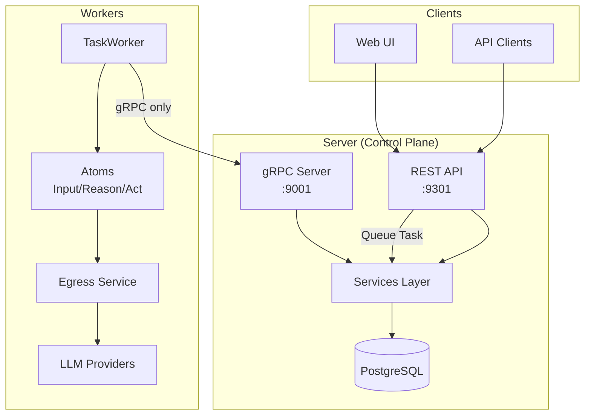
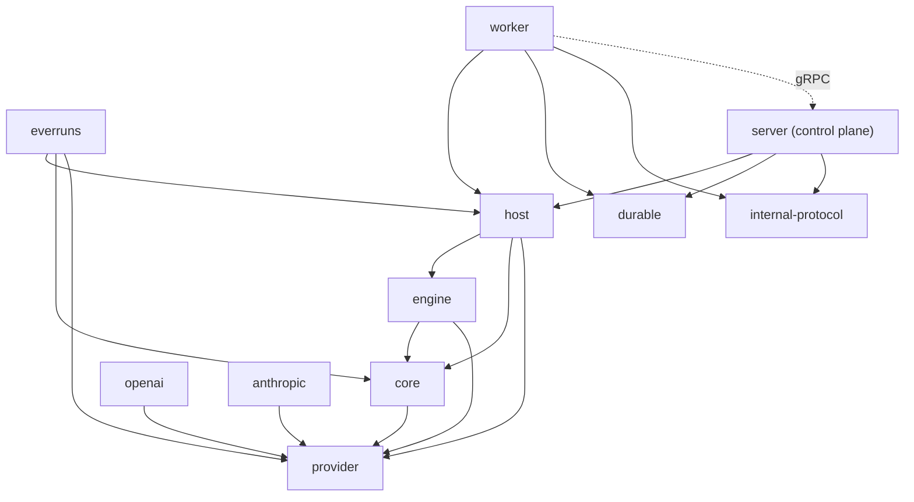
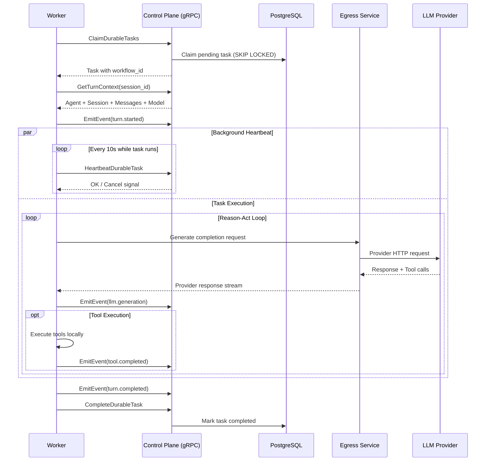

# Architecture Specification

## Abstract

Everruns is a durable agentic harness engine built on Rust with a PostgreSQL-backed durable execution engine. It provides APIs for managing agents, threads, and runs with streaming event output via SSE. The architecture prioritizes durability, observability, and developer experience.

## System Architecture



**Key Design Decision**: Workers communicate with the control-plane **exclusively via gRPC** (port 9001). Workers have no direct database access - all storage operations go through the gRPC service layer. This provides:
- Clear separation between control-plane (owns state) and workers (stateless executors)
- Workers don't need database credentials or encryption keys
- Simplified worker deployment and scaling

### Event Delivery

Events are delivered to SSE clients via the `EventDelivery` abstraction (`crates/server/src/event_delivery.rs`), which follows the same enum dispatch pattern as `StorageBackend`:

- **InMemory** (dev mode): Partitioned `broadcast::channel` — zero external dependencies
- **NATS JetStream** (production): Per-session subjects with short-term retention for replay

Events are classified as **ephemeral** or **durable**:

| Category | Examples | Storage | Delivery |
|---|---|---|---|
| Ephemeral | `output.message.delta`, `reason.thinking.delta`, `tool.output.delta` | EventDelivery-only when the backend supports ephemeral skip; otherwise PostgreSQL + EventDelivery | EventDelivery only |
| Durable | `llm.generation`, `output.message.completed`, `turn.started`, `tool.completed` | PostgreSQL | PG + EventDelivery |

`EventService.emit()` routes automatically based on `EventRequest::is_ephemeral()`. With NATS-backed delivery, ephemeral delta events skip PostgreSQL, reducing write pressure significantly. In-memory dev delivery still persists events to PG. SSE reconnection replays durable events from PG; missed deltas are acceptable since the completed event has the full content.

Durable events and usage rows can also feed asynchronous analytical projections
for built-in reporting. Reporting is not part of the hot event delivery path;
see [knowledge/evaluation/reporting.md](../evaluation/reporting.md).

### Listener Transport Boundary

Push-style PostgreSQL listeners are intentionally separated from the ordinary sqlx query pool.

- regular reads and writes may use pooled database connections
- PostgreSQL `LISTEN/NOTIFY` listeners must use a direct session-scoped connection
- `DATABASE_UNPOOLED_URL` is the deployment-facing override for those listener paths when `DATABASE_URL` points at a pooler/proxy

Reasoning:

- `LISTEN/NOTIFY` is bound to a backend session, not just a database endpoint
- pooled/proxied PostgreSQL endpoints can surface `NotificationResponse` frames on connections that the application expects to be ordinary query channels
- when that happens, the failure appears as intermittent query protocol errors rather than an obvious deployment misconfiguration

Production event routing therefore prefers:

- NATS JetStream for event push delivery when `NATS_URL` is configured
- no legacy PostgreSQL event wakeup listener when NATS event delivery is active
- direct PostgreSQL listener connections only for the remaining PostgreSQL-backed push paths, such as notification SSE and task notification fallback

## Requirements

### Core Architecture

1. **Monorepo Structure**: Single repository with Cargo workspace containing multiple crates
2. **Crate Separation** (folder → package name):
   - `server/` → `everruns-server` - **Control plane**: HTTP API (axum) + gRPC server (tonic), SSE streaming, database layer
   - `worker/` → `everruns-worker` - TaskWorker, WorkerAdapters, activities, gRPC adapters, durable task execution
   - `core/` → `everruns-core` - Transport- and persistence-neutral execution contracts, tools, events, portable projections, and current atom interfaces. Depends privately on the contract-only provider surface and does not re-export it.
   - `provider/` → `everruns-provider` - LLM/provider abstraction that the provider crates depend on instead of core: `ChatDriver`, the shared OpenAI/OpenResponses protocol drivers, model profiles, retry/stream helpers, typed IDs, credential form schema, and the LLM error taxonomy
   - `engine/` → `everruns-engine` - Abstract execution contract, state machine, atoms, and turn planning
   - `everruns/` → `everruns` - The application-facing Everruns Framework crate
   - `host/` → `everruns-host` - Low-level in-process execution host and reusable host-phase execution shared by the facade, worker, and advanced hosts
   - `macros/` → `everruns-macros` - Framework tool-macro implementation re-exported through `everruns::tool`
   - `internal-protocol/` → `everruns-internal-protocol` - gRPC protocol for worker ↔ server
   - `durable/` → `everruns-durable` - PostgreSQL-backed durable execution engine
   - `openai/` → `everruns-openai` - OpenAI LLM provider implementation
   - `anthropic/` → `everruns-anthropic` - Anthropic LLM provider implementation
   - `integrations/docker/` → `everruns-integrations-docker` - Docker container integration (auto-registered via `inventory` plugin system)
   - `integrations/daytona/` → `everruns-integrations-daytona` - Daytona cloud sandbox integration (auto-registered via `inventory` plugin system)
   - `integrations/e2b/` → `everruns-integrations-e2b` - E2B cloud sandbox integration (auto-registered via `inventory` plugin system)
   - `integrations/deno/` → `everruns-integrations-deno` - Deno sandbox integration (auto-registered via `inventory` plugin system)
3. **Frontend**: Next.js application in `apps/ui/` for management and chat interfaces
   - Exports providers, components, hooks, and lib modules via `package.json` `exports` field for SaaS wrapper consumption
4. **Documentation Site**: Astro Starlight in `apps/docs/` deployed to https://docs.everruns.com/
   - See [knowledge/ui/documentation.md](../ui/documentation.md) for detailed specification

### Project Structure

```
everruns/
├── apps/
│   ├── ui/               # Next.js Management UI
│   └── docs/             # Astro Starlight Documentation
├── crates/
│   ├── server/           # Control plane: HTTP API + gRPC server + storage
│   ├── worker/           # Durable worker with gRPC client
│   ├── core/             # Neutral execution contracts and portable projections
│   ├── provider/         # LLM/provider abstraction (ChatDriver, protocol drivers, model profiles)
│   ├── engine/           # Shared turn planning and execution coordination
│   ├── everruns/         # Application-facing Framework crate
│   ├── host/             # Low-level in-process host and reusable host phases
│   ├── macros/           # everruns-macros implementation crate
│   ├── internal-protocol/# gRPC protocol definitions
│   ├── durable/          # Durable execution engine
│   ├── openai/           # OpenAI provider
│   └── anthropic/        # Anthropic provider
├── integrations/
│   ├── docker/           # Docker container (inventory plugin)
│   ├── daytona/          # Daytona cloud sandbox (inventory plugin)
│   ├── e2b/              # E2B cloud sandbox (inventory plugin)
│   └── deno/             # Deno sandbox (inventory plugin)
├── docs/                 # Documentation content (symlinked to apps/docs)
├── knowledge/            # OKF design and product knowledge
├── test_cases/           # Manual test cases
├── local/                # Docker Compose for local dev
└── scripts/              # Dev scripts
```

### Crate Dependency Graph



### Platform Composition

Everruns runtime composition is centered on `HostComposition` in `crates/host/src/composition.rs`.

`HostComposition` is the shared bundle for:

- Capabilities
- LLM drivers
- Outbound egress service
- Utility LLM service
- Session filesystem factory
- Type-keyed host extensions

The server and worker builders both accept an explicit `HostComposition`. If none is supplied, they fall back to crate-local presets:

- `everruns_server::oss_host_composition()`
- `everruns_worker::default_host_composition()`

This keeps the existing OSS execution surface as the default while allowing
embedders to remove integrations, add custom capabilities, register different
LLM drivers, or replace effect implementations without forking Everruns
internals.

### Embedded Runtime

Embedders who want to execute Everruns harnesses directly inside their own
process should use `everruns-host`.

`everruns-host` provides:

- `InProcessRuntimeBuilder`
- in-memory session/filesystem/storage/message backends
- turn execution via `everruns-engine::TurnExecution` and
  `everruns-host::InProcessExecution`
- direct seeding of harnesses, agents, sessions, and files
- engine-owned Input/Reason/Act algorithms composed by the host

`everruns-worker` provides the first-party adapter bridge from worker backends
into that host contract via `WorkerRuntimeHost`, so both the immediate and
durable paths reuse the same engine phase wiring.

See [knowledge/foundations/runtime.md](runtime.md) for the public embedded runtime contract.

### Integration Plugin Force-Linking

Integration crates (`docker`, `daytona`, `e2b`) register capabilities at startup via `inventory::submit!`. The `inventory` crate uses linker sections — if the crate is not explicitly referenced, Rust's linker will optimize it out and the `submit!` registrations silently disappear.

**Both `crates/server/src/lib.rs` and `crates/worker/src/lib.rs` must have `extern crate` statements for every integration crate** (see those files for the current list).

Adding a new integration crate requires:
1. Create the crate under `integrations/`
2. Add it as a dependency in `crates/server/Cargo.toml` and `crates/worker/Cargo.toml`
3. Add `extern crate` to both `crates/server/src/lib.rs` and `crates/worker/src/lib.rs`

Without step 3, the crate compiles but its capabilities are never registered. There is no compile-time error — the integration simply does not appear at runtime.

Important: inventory discovery is now confined to default presets. Embedders can bypass those presets entirely by constructing `HostComposition` directly.

### Server Entrypoint

The server binary (`main.rs`) uses `ServerAppBuilder` from the library crate. The builder pattern enables SaaS wrappers and embedders to compose their own binary with custom auth, routes, event listeners, background tasks, and a custom `HostComposition`.

See `crates/server/src/app_builder.rs` for `ServerAppBuilder` — composable builder with `auth()`, `host_composition()`, `routes()`, and `run()` methods. Key modules in lib crate: `app_builder`, `server` (config + router), `seed` (database seeding), `grpc_service` (WorkerService), `platform` (default OSS preset).

The worker binary mirrors this pattern through `WorkerAppBuilder` in `crates/worker/src/app_builder.rs`, which also accepts `host_composition()`.

### Data Layer

1. **Database**: PostgreSQL 17 with custom UUID v7 function
   - Decision: Using PostgreSQL 17 because PostgreSQL 18 is not yet available on managed services like AWS Aurora RDS. This is temporary; we will migrate to PostgreSQL 18 with native uuidv7() when it becomes widely available.
2. **UUID Strategy**: All IDs use UUID v7 (time-ordered, better indexing, naturally sortable)
3. **Migrations**: Auto-applied on server startup via embedded sqlx migrations
   - Files in `crates/server/migrations/`
   - Multi-instance safe via PostgreSQL advisory locks
   - Disable with `--no-migrations` flag
4. **String Columns**: Use `TEXT` instead of `VARCHAR(n)` for string columns
   - In PostgreSQL, TEXT and VARCHAR have identical performance
   - TEXT avoids artificial length limits that may cause issues later
   - No need to guess the "right" length for model names, provider names, etc.

### Database Conventions

1. **Primary Keys**: All tables MUST use `UUID PRIMARY KEY DEFAULT uuidv7()` unless explicitly documented otherwise
   - UUIDv7 provides time-ordering for better B-tree index performance
   - Enables keyset pagination via `WHERE id > $cursor ORDER BY id`
   - Never use `gen_random_uuid()` for primary keys

2. **No Database Triggers**: Business logic MUST be implemented in Rust, not in PostgreSQL triggers
   - Triggers are invisible to application code and hard to debug
   - Triggers don't work in DEV_MODE (in-memory storage)
   - Triggers create hidden coupling between tables
   - Use EventListener pattern for event-driven side effects instead

### Execution Layer

1. **Runner Abstraction**: `AgentRunner` trait provides the execution backend interface
2. **Durable Execution**: Workflows run via PostgreSQL-backed durable execution engine
3. **Workflow Isolation**: Backend concepts (workflow IDs, task queues) never exposed in public API
4. **Event Streaming**: SSE for real-time event delivery via PostgreSQL-backed durable events plus `EventDelivery` push channels

See [knowledge/operations/durable-execution-engine.md](../operations/durable-execution-engine.md) for the durable engine architecture.

### Worker ↔ Control-Plane Communication

Workers communicate with the control-plane via gRPC instead of direct database access:

1. **gRPC Service** (port 9001):
   - `WorkerService` - Internal service for worker operations
   - Batched operations: `GetTurnContext` (agent + session + messages + model in one call)
   - Streaming: `EmitEventStream` for efficient event emission
   - Individual operations for messages, files, providers

2. **gRPC Client Adapters** (in worker crate):
   - `GrpcAdapter` - Implements session-scoped message, event, filesystem, task, and budget effects via gRPC
   - `GrpcOrgAdapter` - Implements organization-scoped agent, session, provider, platform, and scheduling effects via gRPC
   - `WorkerRuntimeHost` - Bridges worker adapters into `everruns-host` host execution
   - `GrpcDurableStore` - Implements durable workflow operations via gRPC

3. **Durable Execution gRPC Operations**:
   - `ClaimDurableTasks` - Workers poll for pending tasks
   - `CompleteDurableTask` / `FailDurableTask` - Report task outcome
   - `HeartbeatDurableTask` - Liveness signal for long-running tasks
   - `CreateDurableWorkflow` / `GetDurableWorkflowStatus` - Workflow lifecycle

4. **Benefits**:
   - Workers don't need database credentials or encryption keys
   - Clear boundary between control-plane (owns state) and workers (stateless executors)
   - Batched operations reduce round trips (4 DB calls → 1 gRPC call)

5. **Security** (see `knowledge/security/threat-model.md` TM-DURABLE-002):
   - Bearer token auth (`WORKER_GRPC_AUTH_TOKEN`) required in production
   - Optional mutual TLS (mTLS) via `WORKER_GRPC_TLS_*` env vars for transport encryption + identity verification
   - Workers are intentionally cross-org — they process tasks from any org's queue; org-scoping enforced at HTTP API layer

### Worker Communication Flow



**Note**: Workers send periodic heartbeats while executing tasks. If heartbeats stop (worker crash), the control-plane reclaims stale tasks after 30 seconds and re-queues them for another worker.

### Task Worker Architecture

The `TaskWorker` provides a unified worker implementation that works with both in-memory (DEV_MODE) and database-backed (production) storage:

```
┌─────────────────────────────────────────────────────────────────┐
│                         TaskWorker<S, A>                         │
│  Generic over: S = WorkflowEventStore, A = WorkerAdapters       │
├─────────────────────────────────────────────────────────────────┤
│  ┌─────────────────┐  ┌──────────────────┐  ┌───────────────┐  │
│  │ Configuration   │  │ Task Polling     │  │ Heartbeating  │  │
│  │ - worker_id     │  │ - claim_task()   │  │ - 10s interval│  │
│  │ - concurrency   │  │ - complete_task()│  │ - liveness    │  │
│  │ - poll_interval │  │ - fail_task()    │  │               │  │
│  └─────────────────┘  └──────────────────┘  └───────────────┘  │
│                                                                  │
│  ┌──────────────────────────────────────────────────────────┐   │
│  │               Activity Execution                          │   │
│  │  ┌──────────┐    ┌───────────┐    ┌─────────┐           │   │
│  │  │  input   │ →  │  reason   │ ⟷  │   act   │           │   │
│  │  │ activity │    │ activity  │    │ activity│           │   │
│  │  └──────────┘    └───────────┘    └─────────┘           │   │
│  └──────────────────────────────────────────────────────────┘   │
└─────────────────────────────────────────────────────────────────┘
```

**Key Types**:

1. **`WorkerAdapters` trait** - Unified interface for data operations
   - `get_agent()`, `get_session()`, `load_messages()`
   - `emit_event()`, `get_model_with_provider()`
   - `read_file()`, `write_file()`, `edit_file()` (session filesystem)
   - `load_turn_context()` - Batched context loading
   - `storage_store()`, `platform_store()`, `connection_resolver()`, `schedule_store()` — **required**, non-optional
   - `sqldb_store()` — optional with default `None` until gRPC support added (EVE-44)

2. **Implementations**:
   - `DirectWorkerAdapters` - Direct storage access (in-process workers), including budget-check parity for runtime tools
   - `GrpcWorkerAdapters` - gRPC access (external workers)

3. **Deployment Modes**:

| Mode | Store | Adapters | Use Case |
|------|-------|----------|----------|
| DEV_MODE | `InMemoryWorkflowEventStore` | `DirectWorkerAdapters` | Local development |
| Production | `PostgresWorkflowEventStore` | `GrpcWorkerAdapters` | External workers |

**Adapter Parity Principle**: Both `DirectWorkerAdapters` and `GrpcWorkerAdapters` must implement every `WorkerAdapters` method. The trait enforces this at compile time: store accessors have no default implementations, so adding a new store requires updating both adapters or the build fails. Methods return `Arc<dyn T>` (non-optional) to guarantee the store is available in both backends. The only exception is `sqldb_store()` which returns `Option` with a default `None` until gRPC support is added (tracked in EVE-44).

**Benefits of Unified Architecture**:
- Single codebase for activity implementations (input, reason, act)
- `everruns-engine` owns the shared turn planner and phase algorithms, so in-process and gRPC-backed workers use the same reason/act continuation, event ordering, and tool-results pause/resume policy
- Shared task scheduling logic
- Easy to test with mock adapters
- Consistent behavior across deployment modes
- Compile-time enforcement of adapter parity

### Core Abstractions (`everruns-core`)

The core crate provides DB-agnostic agent abstractions with pluggable backends:

1. **Trait-Based Design**:
   - `MessageRetriever` - Retrieve conversation messages (get, load methods). Retrieval-only; messages are stored via EventEmitter.
   - `LlmProviderStore` - Resolve LLM models and providers
   - `ToolExecutor` - Execute tool calls
   - `AgentStore` - Load agent configurations
   - `SessionStore` - Load session configurations

2. **Injected execution contracts**:
   - `MessageRetriever`, `TurnContextResolver`, `EventEmitter`, and `ToolExecutor`
   - durability, filesystem, connection, image, and utility-service ports grouped by concern
   - `PreToolUseHook` and `PostToolExecHook` capability contracts

3. **ExecutionContext** (Execution Tracking):
   - `session_id` - The conversation session
   - `turn_id` - Unique identifier for the current turn
   - `input_message_id` - User message that triggered this turn
   - `exec_id` - Unique identifier for this phase execution

### Shared Execution Kernel (`everruns-engine`)

`everruns-engine` owns the `Execution` contract, serializable `TurnExecution`
state machine, concrete `InputAtom`, `ReasonAtom`, and `ActAtom` algorithms,
their phase values, post-act helpers, tool scheduler, infrastructure hooks, and
pure turn planner. There is no generic public `Atom` trait. `everruns-host`
retains state in `InProcessExecution`; `everruns-durable` checkpoints the same
state through `DurableExecution`. Hosts inject core/provider contracts and keep
deployment composition outside the engine.

4. **Concrete In-Memory Implementations**:
   - `everruns-host` owns application stores and canonical event history
   - `everruns-test-support` owns writable deterministic message/event fixtures
   - `everruns-core` exposes traits and values, not concrete public backends

### OpenAI Provider (`everruns-openai`)

OpenAI-specific LLM provider implementation:

1. **Implements the driver trait**: `ChatDriver` trait from `everruns-provider`
2. **OpenAI + Azure OpenAI Support**: Supports OpenAI-hosted and Azure-hosted OpenAI v1 endpoints
3. **Streaming Support**: Full SSE streaming with tool call support
4. **Native API Access**: Direct methods for OpenAI-specific functionality

### Open Responses Protocol

Everruns implements the [Open Responses specification](https://www.openresponses.org/) -
a vendor-neutral, open-source API standard for multi-provider LLM interfaces.

1. **Specification**: https://www.openresponses.org/specification
2. **GitHub**: https://github.com/openresponses/openresponses

**Key Benefits**:
- **One spec, many providers**: Same API works with OpenAI, Anthropic, Gemini, and local models
- **Agentic loop support**: Native tool calls, state machines, and semantic streaming events
- **Better caching**: 40-80% better cache utilization vs Chat Completions API
- **Provider-agnostic**: Events and responses follow a standardized format

**Driver Selection**: `OpenAIChatDriver` (Responses API, recommended) or `OpenAICompletionsChatDriver` (Chat Completions). See `crates/openai/src/driver.rs` and the protocol implementations in `crates/provider/src/`.

### LlmSim Driver (Testing)

For integration testing without real API keys, Everruns uses [llmsim](https://github.com/chaliy/llmsim) - a simulated LLM driver:

1. **Provider Type**: `llmsim` - registered as `DriverId::LlmSim`
2. **No API Keys Required**: Tests can run without external dependencies
3. **Configurable Responses**: Supports fixed responses, echo mode, lorem ipsum generation, and tool call simulation
4. **Latency Simulation**: Optional latency profiles for realistic timing
5. **Usage**: Create an `llmsim` provider and model in tests, then use it as the agent's default model

See integration tests in `crates/core/tests/` for usage examples.

### Capabilities System

Capabilities are modular functionality units that extend Agent behavior. See [knowledge/execution/capabilities.md](../execution/capabilities.md) for detailed specification.

1. **External to Agent Loop**: Capabilities are resolved at the service/API layer, not inside the loop
2. **Composition Model**:
   - Capabilities contribute system prompt additions
   - Capabilities provide tool definitions
   - Multiple capabilities can be enabled per agent
3. **Resolution Flow**:
   - Fetch agent's capabilities from `agent_capabilities` table
   - Look up internal capability definitions from registry
   - Merge system prompts and tools into `RuntimeAgent`
   - Execute Agent Loop with configured RuntimeAgent

### API Design

1. **RESTful**: Standard REST conventions for CRUD operations
2. **Versioning**: API versioned under `/v1/` prefix
3. **Documentation**: OpenAPI 3.0 spec generated via `./scripts/export-openapi.sh`

### Infrastructure

1. **Local Development**: Docker Compose in `local/` for Postgres, Valkey
2. **Dev Mode**: In-memory storage mode for quick local development without PostgreSQL
3. **CI/CD**: GitHub Actions for format, lint, test, smoke test, Docker build
4. **License Compliance**: cargo-deny for dependency license checking
5. **Secrets Management**: [Doppler](https://www.doppler.com/) for development secrets (API keys, tokens). Project: `everruns-dev`, config: `dev`. Use `doppler run -- <command>` to inject secrets into processes.
6. **Valkey**: Redis-compatible key-value store (Linux Foundation fork) for distributed rate limiting across control-plane instances. Optional — when `VALKEY_URL` is not set, rate limiting falls back to in-memory governor (per-instance). See `crates/server/src/valkey.rs`.

### Development Mode (DEV_MODE)

For rapid local development without infrastructure dependencies:

```bash
# Start in dev mode (no Docker/PostgreSQL required)
DEV_MODE=true cargo run -p everruns-server

# Or use the convenience command
just start-dev
```

**DEV_MODE behavior:**
- Uses in-memory storage (data lost on restart)
- Execution happens in-process (no separate worker)
- gRPC server disabled (not needed without workers)
- No migrations required

**Use cases:**
- Quick UI development and testing
- API endpoint development
- Debugging without infrastructure setup

**Limitations:**
- No persistence
- No worker/gRPC functionality
- Single-instance only

See [docs/sre/environment-variables.md](../../docs/sre/environment-variables.md) for configuration details.

### Observability

1. **OpenTelemetry Integration**: Distributed tracing via OpenTelemetry with OTLP export
2. **Gen-AI Semantic Conventions**: LLM operations instrumented with [gen-ai semantic conventions](https://opentelemetry.io/docs/specs/semconv/gen-ai/)
3. **Environment Configuration**:
   - `OTEL_EXPORTER_OTLP_ENDPOINT` - OTLP endpoint (e.g., `http://localhost:4317`)
   - `OTEL_SERVICE_NAME` - Service name for traces
   - `OTEL_ENVIRONMENT` - Deployment environment label

See [docs/sre/environment-variables.md](../../docs/sre/environment-variables.md) for full configuration options.

#### Event-Listener Architecture

Observability is decoupled from business logic through the `EventListener` trait (see `crates/core/src/event_listeners.rs`).

**Key components**:
- `EventListener` trait — Interface for observability backends
- `OtelEventListener` (`crates/observability/src/otel.rs`) — Generates OTel spans from events
- `EventService` (`server/src/services/event.rs`) — Notifies listeners after event persistence

**Event-to-span mapping** (following gen-ai semantic conventions):
- `llm.generation` → `chat {model}` span with tokens, finish_reasons, response_id
- `tool.started/completed` → `execute_tool {name}` span
- `turn.started/completed` → `invoke_agent {turn_id}` span

**Benefits of event-listener architecture**:
- Business logic (LLM drivers, atoms) emits events, not spans
- Observability backends are pluggable (OTel, metrics, logging)
- Single source of truth: events are stored, then converted to spans
- Easy to add new backends without modifying core code

### Code Organization Conventions

#### Layer Separation

The control-plane follows a strict layered architecture:

```
┌─────────────────────────────────────────────────────────┐
│                    Transport Layer                       │
│  ┌─────────────────────┐  ┌─────────────────────────┐  │
│  │   HTTP API (axum)   │  │   gRPC Server (tonic)   │  │
│  │     Port 9301       │  │       Port 9001         │  │
│  │   (Public REST)     │  │   (Internal Workers)    │  │
│  │  HTTP/2 flow ctrl   │  │                         │  │
│  └──────────┬──────────┘  └────────────┬────────────┘  │
└─────────────│──────────────────────────│───────────────┘
              │                          │
              ▼                          ▼
┌─────────────────────────────────────────────────────────┐
│                    Services Layer                        │
│  ┌──────────────┐ ┌───────────────┐ ┌────────────────┐ │
│  │ AgentService │ │ SessionService│ │ EventService   │ │
│  └──────────────┘ └───────────────┘ └────────────────┘ │
│  ┌──────────────────┐ ┌─────────────────────────────┐  │
│  │WorkspaceFileService│ │ LlmResolverService          │  │
│  └──────────────────┘ └─────────────────────────────┘  │
│                    (Business Logic)                      │
└────────────────────────────┬────────────────────────────┘
                             │
                             ▼
┌─────────────────────────────────────────────────────────┐
│                    Storage Layer                         │
│  ┌─────────────────────────────────────────────────┐   │
│  │                   Database                        │   │
│  │         (PostgreSQL via sqlx)                    │   │
│  └─────────────────────────────────────────────────┘   │
│                   (Raw SQL Operations)                   │
└─────────────────────────────────────────────────────────┘
```

**Key Principle**: Both HTTP API and gRPC handlers access storage through domain
commands/queries or explicit infrastructure helpers.
No direct database access from transport layer handlers.

**HTTP/2 Flow Control**: The HTTP server uses `hyper_util::server::conn::auto::Builder` instead of `axum::serve` to expose HTTP/2 configuration knobs. This is critical for high-concurrency SSE: the default 65 KB per-stream flow control window exhausts under many slow-reading clients, blocking streams and causing cascade timeouts. Configuration:

| Env Variable | Default | Description |
|---|---|---|
| `HTTP2_STREAM_WINDOW_SIZE` | 2 MB | Per-stream flow control window |
| `HTTP2_CONNECTION_WINDOW_SIZE` | 16 MB | Per-connection flow control window |
| `HTTP2_MAX_CONCURRENT_STREAMS` | 256 | Max concurrent streams per connection |

Adaptive flow control is enabled (hyper auto-adjusts windows based on throughput). HTTP/2 PING keepalive runs every 20s to detect dead connections.

1. **Storage Layer** (`server/src/storage/`):
   - Database models use `Row` suffix (e.g., `AgentRow`, `SessionRow`, `EventRow`)
   - Input structs for create operations use `Create` prefix + `Row` suffix (e.g., `CreateEventRow`)
   - Update structs use `Update` prefix (e.g., `UpdateAgent`)
   - Repositories handle raw database operations only
   - Migrations in `server/migrations/`
   - Note: Messages are stored as events (see `knowledge/foundations/models.md`)

2. **Core Layer** (`core/` → `everruns-core`):
   - Contains shared domain types used across layers (e.g., `ContentPart`, `Controls`, `Message`)
   - Contains domain entity types (e.g., `Agent`, `Session`, `LlmProvider`, `Event`, `Capability`)
   - Provides trait definitions (`MessageRetriever`, `EventEmitter`, `LlmProvider` trait, `ToolExecutor`)
   - `MessageRetriever` is retrieval-only; messages are stored via `EventEmitter`
   - Provides tool types (`ToolDefinition`, `ToolCall`, `ToolResult`, `BuiltinTool`)
   - Domain types are DB-agnostic and serializable
   - Types that need OpenAPI support use `#[cfg_attr(feature = "openapi", derive(ToSchema))]`

3. **Domain Layer** (`server/src/domains/`):
   - **Single point of user-facing business logic** - HTTP, MCP, and gRPC call domain commands/queries
   - Each domain owns its command types, validation, policies, and persistence orchestration
   - Shared read/write helpers stay in domain-local `queries.rs`
   - Some domains also include domain-local helper modules (for example `service.rs`) when multiple commands or internal callers need the same orchestration, but those helpers live under the owning domain instead of a global service layer

4. **Infrastructure Helpers** (`server/src/services/`):
   - Cross-cutting or internal-only modules, not a separate business-logic layer
   - Examples:
     - `EventService` - event persistence + delivery fanout
     - `LlmResolverService` - model resolution with decrypted API keys
     - `ModelSyncService` - provider model discovery / sync
     - `CapabilityService` - capability registry/read helpers
     - listeners and validators such as `UsageTrackingListener`, `scoped_mcp`, `capability_validation`

5. **Transport Layer** (`server/src/api/`, `server/src/grpc_service.rs`):
   - **HTTP API** (axum) on local direct port 9301 - public REST API behind Caddy in local dev
   - **gRPC Server** (tonic) on port 9001 - internal WorkerService
   - API contracts (DTOs) are collocated with their routes in the same module
   - Handlers handle protocol concerns only, delegating user-facing logic to domains
   - Input types for user-facing APIs use `Input` prefix (e.g., `InputMessage`, `InputContentPart`)
   - Request/response wrappers use `Request`/`Response` suffix

6. **Internal Protocol Layer** (`internal-protocol/` → `everruns-internal-protocol`):
   - gRPC protocol definitions (proto files)
   - Generated Rust types via tonic-build
   - Conversion functions between proto types and core types

#### Type Flow Example

Both HTTP and gRPC follow the same pattern through domains:

```
HTTP API Flow:
Controller (HTTP)  →  Domain Command / Query  →  Repository (Storage)
       ↓                      ↓                           ↓
CreateAgentRequest  →   CreateAgentRow             →   Database
       ↓                      ↓                           ↓
      JSON              Core types used                  SQL

gRPC Service Flow:
gRPC Handler  →  Domain Command / Query  →  Repository (Storage)
       ↓                      ↓                           ↓
  Proto types   →   Core/Row types          →   Database
       ↓                      ↓                           ↓
   Protobuf         Core types used                  SQL
```

For HTTP agents endpoint:
- Controller receives `CreateAgentRequest` (API request type)
- Controller passes request directly to `AgentService.create(req)`
- Service converts `CreateAgentRequest` → `CreateAgentRow` (storage type)
- Service calls repository to store and returns `Agent` (domain type)

For gRPC session operations:
- gRPC handler receives `GetSessionRequest` (proto type)
- Handler calls `SessionService.get(session_id)`
- Service queries database and returns `Session` (domain type)
- Handler converts `Session` to `proto::Session` for response

For messages (both HTTP and gRPC):
- `CreateMessageRequest` (API) → contains `InputMessage` with `InputContentPart[]`
- Service converts `InputContentPart` → `ContentPart` (core type)
- Service creates `CreateEventRow` (storage) with message data as JSON
- Repository stores event to database (messages stored as events)

#### Naming Conventions

| Layer | Pattern | Example |
|-------|---------|---------|
| Storage Row | `{Entity}Row` | `AgentRow`, `EventRow` |
| Storage Create | `Create{Entity}Row` | `CreateEventRow` |
| Storage Update | `Update{Entity}` | `UpdateAgent` |
| Core Domain | `{Entity}` | `Message`, `ContentPart` |
| API Input | `Input{Entity}` | `InputMessage`, `InputContentPart` |
| API Request | `{Action}{Entity}Request` | `CreateMessageRequest` |
| Service | `{Entity}Service` | `AgentService`, `SessionService` |

#### Content Types

Message content uses a unified `Vec<ContentPart>` representation across all layers:

- `ContentPart` - Core enum for all content types (text, image, tool_call, tool_result)
- `InputContentPart` - Restricted enum for user input (text, image only)
- `From<InputContentPart> for ContentPart` - Safe conversion from input to full type

This ensures:
- Users can only send allowed content types (text, images)
- System can store all content types (including tool calls, results)
- No conversion needed between storage and core layers

## Multi-Instance Deployment

Multiple control-plane instances can run behind a load balancer for HA.

### What's Already Multi-Instance Safe

| Component | Reason |
|-----------|--------|
| PostgreSQL database | Shared, connection pool per instance |
| Migrations | Advisory lock protected |
| Task claiming (SKIP LOCKED) | Naturally partitions work |
| Worker registration | Database-backed, any server can serve any worker |
| PgListener (task_available) | Each instance runs its own listener; all receive NOTIFY |
| PgListener (event_available) | Same; SSE clients on any instance see all events |
| Rate limiting (Valkey) | Shared sliding-window counters when `VALKEY_URL` set |

### Configuration (`EXPECTED_INSTANCES`)

Set `EXPECTED_INSTANCES=N` to inform each instance about the total count:

- **SSE connection limits**: Global and per-org limits divided by N. Per-session limits unchanged.
- **Database pool sizing**: Set `DATABASE_POOL_MAX = pg_max_connections / N - margin`. A startup warning fires if pool × instances exceeds 80% of `PG_MAX_CONNECTIONS` (default 100).
- **Metrics**: Each instance maintains its own ring buffer. The `/v1/durable/metrics/timeseries` response includes `instance_count` when >1.

### Load Balancer Requirements

- HTTP/1.1 or HTTP/2 for SSE (long-lived connections)
- Health check: `GET /health`
- No session affinity required (stateless API; SSE reconnects are idempotent)
