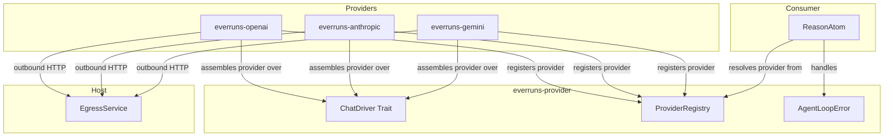
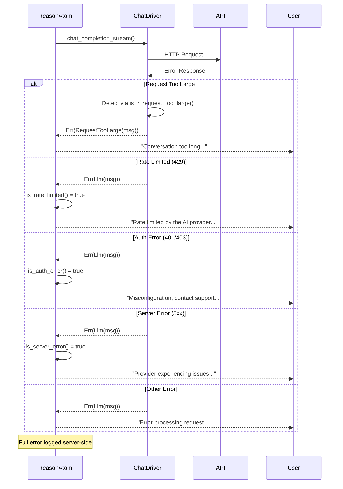

# LLM Drivers Specification

> **Domain model note:** the canonical provider domain model (drivers, services,
> providers, models, model profiles) is [providers.md](providers.md). That
> `ChatDriver` is the chat wire-protocol contract. Service identity, endpoint,
> headers, and authentication belong to runtime providers as specified in
> [providers.md](providers.md).

## Abstract

LLM drivers implement reusable wire protocols. Runtime providers bind those
drivers to concrete services. Core business logic resolves a credential-free
model specification and runtime provider independently, then passes the
provider-owned endpoint into the protocol driver.

Official driver packages are physically grouped under
[`crates/drivers/`](../../crates/drivers/README.md). The folder is only a
repository organization boundary: every child remains an independently
versioned crate, and `everruns-provider` remains the neutral SPI they
implement.

## Architecture



## Requirements

### ChatDriver Trait

1. **Trait Definition**: See `crates/provider/src/driver_registry.rs` for `ChatDriver` trait, `LlmStreamEvent`, `ProviderType`, and `LlmCallConfig`.

2. **Streaming Response**: Drivers return a stream of `LlmStreamEvent` (TextDelta, ToolCalls, ThinkingDelta, ThinkingSignature, Done, Error). In-band provider failures use `LlmStreamError` so stable provider code and HTTP status survive the driver boundary.

3. **Provider independence**: the trait contains no service/vendor identity,
   default hostname, or credential. The same driver instance may serve multiple
   provider keys with different endpoints, headers, and auth.

### Error Types (Contract)

Drivers MUST use the following error types from `AgentLoopError`:

1. **`Llm(String)`** - Generic LLM provider error
   - Use for: network errors, authentication failures, invalid requests, server errors
   - Example: `AgentLoopError::llm("OpenAI API error (500): Internal server error")`

2. **`RequestTooLarge(String)`** - Context length or token limit exceeded
   - Use for: context length exceeded, token limits hit, prompt too long
   - Drivers MUST detect provider-specific error responses and convert to this type
   - Example: `AgentLoopError::request_too_large("OpenAI API error (429): Request too large...")`

### Error Detection Requirements

Each driver MUST implement provider-specific error detection to classify context-length and token-limit errors as `RequestTooLarge`. See the individual driver crates for the detection logic:
- `crates/drivers/openai/src/`, OpenAI error detection
- `crates/drivers/anthropic/src/`, Anthropic error detection
- `crates/drivers/gemini/src/`, Gemini error detection

### Provider registry and 0.17 compatibility catalog

Applications register concrete runtime providers in `ProviderRegistry`, keyed
by open `ProviderKey`. Official integration crates expose ready-made provider
assemblies; downstream code may construct the same public `Provider` directly.

`DriverDescriptor`/`DriverRegistry` remain as the hosted provider-management
catalog and the host-facing surface for `everruns-host`. Descriptor factories
compose runtime providers and route into the same registry/execution path; they
are not a second driver semantics layer.

### Host-Owned Transport

Protocol drivers and model discovery use direct provider HTTP clients. They are
host-owned platform services: provider endpoints and credentials come from
deployment/org provider configuration, not from agent-authored URLs or
tenant/agent egress policy. Runtime providers own endpoint, auth, and service
headers. Drivers own protocol request construction, streaming parse logic,
retry classification, and error mapping. Shared clients disable redirects and
pin DNS only after private-range validation.

### Message Types

1. **LlmMessage**: Provider-agnostic message format
   - `role`: System, User, Assistant, Tool
   - `content`: Text or multipart (text, images, audio)
   - `tool_calls`: Optional tool calls (assistant messages)
   - `tool_call_id`: Optional tool call reference (tool messages)

   **Image Content in Tool Results**: When a tool returns images (via `ToolResultImage`), they become `LlmContentPart::Image` entries in the Tool message's content. Provider-specific handling:
   - **Anthropic**: Tool results with images use array `content` in `tool_result` block (text + image blocks)
   - **OpenAI Chat Completions**: Tool messages include `image_url` content parts alongside text
   - **OpenAI Responses API**: Images not supported in `function_call_output` (text only, images dropped with warning)

2. **LlmCallConfig**: Configuration for LLM calls
   - `model`: Model identifier
   - `temperature`: Optional sampling temperature
   - `max_tokens`: Optional token limit
   - `tools`: Tool definitions
   - `reasoning_effort`: Optional reasoning level (low, medium, high)
   - `speed`: Optional speed selector (flex, default, priority), sent as OpenAI `service_tier`
   - `verbosity`: Optional verbosity selector (low, medium, high), sent as OpenAI `verbosity`
   - `metadata`: Optional request metadata for provider-side correlation
   - `previous_response_id`: Optional OpenAI Responses continuation handle
   - `provider_opaque_context`: Optional losslessly serializable, ordered native
     compact output; mutually exclusive with `previous_response_id`
   - `tool_search`: Optional deferred tool-loading config
   - `prompt_cache`: Optional provider-agnostic prompt-cache config

### Prompt Cache Request Contract

Prompt caching is modeled as request intent on `LlmCallConfig.prompt_cache`. Drivers may ignore it when the provider or model does not support cache controls, but they must not fail a request solely because prompt caching was enabled.

Current provider mappings:

- **OpenAI Responses API**: derives a deterministic `prompt_cache_key` within OpenAI's 64-character request limit from stable cache-family inputs, not the changing per-turn transcript
- **Anthropic**: adds bounded `cache_control: { type: "ephemeral" }` breakpoints to stable/high-value request sections instead of every text block: the tool array, the system prompt, and the **two** most recent stable messages. The pair on the transcript is what makes caching incremental, the newest marks where this turn's history is written, the one behind it sits where the previous turn already wrote, so each turn reads its predecessor's cache instead of re-paying for the transcript. Four total, Anthropic's per-request maximum. Volatile trailing content (a live `<facts>` block) is skipped so the cached prefix does not diverge every turn
- **Gemini**: uses `cachedContent` when the config includes an existing cached-content resource name; otherwise the request remains in implicit/default Gemini behavior

`llm.generation.metadata.request_options.prompt_cache` records which provider-specific mode the driver actually attempted.

### Per-Request Headers

`LlmCallConfig.extra_headers` carries caller-supplied HTTP headers for a single
call, distinct from the provider-owned service headers on `ProviderEndpoint`
(which describe the service, not the call). Drivers apply them through
[`merge_request_headers`](../../crates/provider/src/driver_helpers.rs): matching
is case-insensitive and a caller header **replaces** the driver's or provider's
value instead of appending a second copy, so a call can override a protocol
header (for example `anthropic-version`) without producing a duplicate. Headers
that describe the connection rather than the call (`host`, `content-length`,
`transfer-encoding`, `connection`, `upgrade`) are dropped: taking them from
config would corrupt the request, and `host` would repoint an SSRF-guarded
connection at another virtual host.

Applied by the Anthropic driver, the Gemini driver, and the shared Chat
Completions / Open Responses protocols (so every driver built on them).

Callers do not set this by hand in the product: a provider connection stores its
headers and diagnostics opt-in in `settings.request_options`, and
`DriverRegistry::create_chat_driver` wraps the constructed driver so those
options are stamped onto every call's `LlmCallConfig`. See the request-options
section in [providers.md](providers.md#provider).

### Prompt Cache Diagnostics

`LlmCallConfig.cache_diagnostics` asks the provider to explain an unexpected
cache miss instead of leaving `cache_read_tokens` silently at zero. Today only
Anthropic implements it (`cache-diagnosis` beta): the driver sends the beta
flag, serializes `diagnostics.previous_message_id` (explicitly `null` on the
first turn, which is how a request opts in without a prior message to compare
against), and returns the provider's `diagnostics` payload verbatim on
`LlmCompletionMetadata.cache_diagnostics` plus the message id on
`response_id` — the id the next request passes as `previous_message_id`.

The payload shape is provider-owned, so the runtime carries it without
interpreting it. Drivers without a diagnostics protocol ignore the config
rather than failing the call.

When the opt-in comes from a provider connection, `previous_message_id` is
chained automatically from the call's `previous_response_id`, which is the
previous generation of the same turn (tool loops), so the comparison the
provider reports is against the request that immediately preceded it.

### Default `max_tokens` Policy

When `config.max_tokens` is `None`, drivers resolve the default from model profile metadata rather than hardcoding a value:

1. Look up the model via `get_model_profile(provider_type, model_id)`
2. Use `profile.limits.output` as the default `max_tokens`
3. If no profile is found, fall back to a safe default (Anthropic: 16,384; Gemini: 8,192)
4. OpenAI drivers omit `max_tokens` entirely (API decides)

Anthropic requires `max_tokens` in every request (cannot be omitted), so the driver always resolves a value.

**Stale profile fallback**: If the Anthropic API returns 400 because `max_tokens` exceeds the model's actual limit (e.g., stale profile data), the driver retries once with 16,384 and logs a warning to update the model profile. If the retry also fails, the error propagates normally.

Agents can override `max_tokens` via agent config. Cost guardrails should be configurable per-agent or per-org, not baked into driver code.

3. **LlmMessage Extended Fields**:
   - `thinking`: Optional thinking content from extended thinking models
   - `thinking_signature`: Opaque token for multi-turn thinking context (provider-specific)

### Extended Thinking Support

Extended thinking allows models to perform chain-of-thought reasoning before generating responses. Supported by both Anthropic Claude and OpenAI o-series/GPT-5 models.

Anthropic has two thinking request forms, selected per model family by the driver. Recent Claude families (Fable 5, Opus 4.8/4.7, and the 4.6 family) take adaptive thinking (`thinking.type = "adaptive"` plus `output_config.effort`); the budget-based `budget_tokens` form is removed on Fable 5 and Opus 4.8/4.7 and returns 400 there. Older Claude models keep budget-based extended thinking. The family list lives in `crates/drivers/anthropic/src/driver.rs` and must stay in sync with the adaptive-thinking profiles in `crates/provider/src/model_profiles.rs`.

#### Stream Events

When `reasoning_effort` is configured, drivers emit additional stream events:
- `ThinkingDelta(String)` - Incremental thinking/reasoning content
- `ThinkingSignature(String)` - Opaque token for multi-turn context preservation

#### Multi-turn Thinking Contract

Both providers require preserved thinking context for multi-turn conversations. Every assistant message with thinking MUST include both `thinking` (content text) and `thinking_signature` (opaque token). The signature MUST be sent back in subsequent API calls to preserve reasoning context.

| Field | Anthropic | OpenAI (o-series) |
|-------|-----------|-------------------|
| `thinking` | Chain-of-thought text | Reasoning summary text |
| `thinking_signature` | Cryptographic signature | `encrypted_content` token |

Provider-specific wire format details live in the driver implementations:
- `crates/drivers/anthropic/src/driver.rs` -- thinking form selection (adaptive vs budget-based), beta headers, signature capture, message ordering
- `crates/drivers/openai/src/driver.rs` -- reasoning config, encrypted content, reasoning item format

#### Reasoning Guard Logic

Reasoning parameters are validated at two levels to prevent API errors from non-thinking models:

1. **ReasonAtom (`reason.rs`)**: Before building the LLM call config:
   - Strips `reasoning_effort` when value is `"none"` (no-op)
   - Looks up model profile via `get_model_profile()`, if `reasoning: false`, strips reasoning_effort with a warning log
   - Unknown models (no profile) pass through to let the API decide

2. **Driver level**: Both OpenAI drivers filter out `effort: "none"` before sending:
   - Responses API: omits `reasoning` object entirely
   - Chat Completions API: omits `reasoning_effort` field

   The Anthropic driver additionally drops `temperature` for models whose
   profile marks it unsupported (sampling parameters are removed from Opus 4.7
   on; the API rejects them with a 400).

The UI also prevents setting reasoning on non-thinking models (checks `profile.reasoning` and `profile.reasoning_effort`).

### Speed (Service Tier)

The speed selector maps to OpenAI's `service_tier` request parameter: `flex` trades latency for batch-rate pricing, `priority` buys faster and more consistent latency at a premium, `default` pins the standard tier. The API rejects values outside the closed set at message creation. It is resolved per turn from the latest user message's `controls.speed` and guarded like reasoning effort: ReasonAtom strips the value (with a warning log) when the model profile carries no `speed` config, and unknown models pass through. When unset, the field is omitted so the provider keeps its default (`auto`) routing.

Per-model availability lives in the model profile's `speed` config, sourced from OpenAI's official tier tables, the API pricing page for Flex, the Priority-processing docs for first-party priority models, and the specialized Codex priority table (models without a tier row get no config). Profiles mask the config for every provider surface except first-party OpenAI, Azure and gateways have their own capacity models. Both OpenAI drivers (Responses and Chat Completions) serialize the value verbatim as `service_tier`; other drivers ignore it.

### Verbosity

The verbosity selector maps to OpenAI's `verbosity` request parameter (`low`, `medium`, `high`): a hint for how expansive the final answer should be, orthogonal to reasoning effort (which tunes how much the model thinks). The API rejects values outside the closed set at message creation. It is resolved per turn from the latest user message's `controls.verbosity` and guarded like speed: ReasonAtom strips the value (with a warning log) when the model profile carries no `verbosity` config, and unknown models pass through. When unset, the field is omitted so the provider keeps its default (`medium`).

The two OpenAI drivers place the field differently: the Responses API nests it under `text.verbosity`, while the Chat Completions API takes it as a top-level `verbosity` field. Other drivers ignore it. Per-model availability lives in the model profile's `verbosity` config (currently the GPT-5.5 and GPT-5.6 series).

### Completion Metadata

`LlmCompletionMetadata` returned on stream completion. Token buckets are
disjoint (drivers normalize inclusive providers at the boundary; see
[usage-tracking](../security/usage-tracking.md#disjoint-bucket-convention)):
- `total_tokens`: Total tokens used (non-cached prompt + cache + completion)
- `prompt_tokens`: Non-cached input tokens (cached reads excluded)
- `completion_tokens`: Output tokens
- `cache_read_tokens`: Tokens from cache, additive (not part of `prompt_tokens`)
- `cache_creation_tokens`: Tokens written to cache (Anthropic)
- `model`: Actual model used
- `finish_reason`: Why generation stopped
- `response_id`: Provider generation id (Anthropic message id, OpenAI response id)
- `cache_diagnostics`: Provider prompt-cache diagnostics, verbatim, when requested

### Realtime Voice Driver

Realtime voice does not use `ChatDriver::chat_completion_stream()` because a
voice connection is a long-lived bidirectional provider session, not a bounded
request/response generation. Voice support adds a separate Realtime provider
adapter owned by the server voice domain. See [voice.md](../operations/voice.md).

V1 adapter requirements:

- OpenAI only, model `gpt-realtime-2`.
- Mint client secrets through `/v1/realtime/client_secrets` or proxy SDP through
  `/v1/realtime/calls`.
- Prefer WebRTC proxy bootstrap for browser voice so the server can capture the
  provider call ID and open a sideband control channel.
- Set `OpenAI-Safety-Identifier` on the trusted server request that creates the
  provider realtime session.
- Open a sideband WebSocket when a provider call ID is known.
- Convert effective Everruns capabilities into provider tool definitions and
  execute tool calls through the normal server-side capability path.
- Map provider transcript and lifecycle events into Everruns `voice.*`,
  `input.message`, `output.message.*`, and `tool.*` events.
- Never log or persist standard API keys, client secrets, raw SDP, or raw audio.

`gpt-realtime-2` model profiles should mark the model as a realtime reasoning
voice model with configurable reasoning efforts (`minimal`, `low`, `medium`,
`high`, `xhigh`). It should not appear in normal text chat model pickers unless
the UI is explicitly rendering a voice-capable picker.

## Error Handling Flow



### Automatic recovery contract

Provider failures are classified at the provider boundary before the runtime
decides whether to recover. Transport loss, a stream that makes no output
progress, overload, ordinary rate limiting, and retryable server failures may
be retried. Invalid credentials, exhausted billing quota, unavailable models,
invalid/unsafe requests, and long-horizon usage limits fail fast with their
specific classification.

Recovery is bounded by both attempts and elapsed wall-clock time. Backoff is
exponential with jitter, honors reasonable provider retry hints, and lower
driver layers report consumed retries so the reason loop cannot multiply the
budget. A retry is permitted only before assistant output commits. Act phases
and completed tool results remain outside the retry boundary, preserving
exactly-once side effects and provider-visible tool-call/output pairing.

For a stateful Responses continuation rejected because provider state is
missing a tool call or output, the driver may retry once without the opaque
continuation handle. That fallback replays the locally persisted transcript
through the same atomic tool-pair repair used by stateless requests; it never
re-executes a completed tool.

## Implementation Location

| Component | Location |
|-----------|----------|
| ChatDriver trait | `crates/provider/src/driver_registry.rs` |
| AgentLoopError | `crates/provider/src/error.rs` |
| OpenAI driver | `crates/drivers/openai/src/driver.rs` |
| Open Responses protocol | `crates/provider/src/openresponses_protocol.rs` |
| Chat Completions protocol | `crates/provider/src/openai_protocol.rs` |
| Anthropic driver | `crates/drivers/anthropic/src/driver.rs` |
| Gemini driver | `crates/drivers/gemini/src/driver.rs` |
| Bedrock driver | `crates/drivers/bedrock/src/driver.rs` |
| Microsoft MAI driver | `crates/drivers/mai/src/driver.rs` |
| Fireworks AI driver | `crates/drivers/fireworks/src/driver.rs` |
| Meta Model API driver | `crates/drivers/meta/src/driver.rs` |
| Error handling | `crates/engine/src/execution/reason.rs` |

## OpenAI Driver Variants

The OpenAI crate provides three driver implementations:

1. **OpenAIChatDriver** (`ProviderType::OpenAI`)
   - Uses Open Responses API (https://www.openresponses.org/)
   - Recommended for new projects
   - Wraps `OpenResponsesProtocolChatDriver`

2. **OpenAICompletionsChatDriver** (`ProviderType::OpenAICompletions`)
   - Uses Chat Completions API (`/v1/chat/completions`)
   - For backward compatibility with legacy integrations
   - Wraps `OpenAIProtocolChatDriver`

3. **OpenRouterChatDriver** (`ProviderType::OpenRouter`)
   - Uses OpenRouter's OpenAI-compatible Responses API
   - Defaults to `https://openrouter.ai/api/v1/responses`
   - Wraps `OpenResponsesProtocolChatDriver` with the OpenRouter provider profile

The Responses drivers share the same base URL handling and can work with
OpenAI-compatible endpoints while keeping provider-specific request features
gated by the resolved provider type.

Both OpenAI protocol variants adapt model-facing tool JSON Schemas at the
provider boundary. Supported constraints pass through unchanged. Regex
lookaround, which OpenAI rejects, is translated when an equivalent supported
pattern is known (including the practical Zod email validator); otherwise only
that unsupported model-facing pattern is omitted and the tool remains the
authoritative validation boundary. This keeps third-party MCP discovery live
without mutating or weakening unrelated schemas.

## Meta Model API Driver (`everruns-meta`)

Meta Model API serves Muse models at `https://api.meta.ai/v1`. The dedicated
driver uses the shared Responses protocol, preserves server-managed continuation
through `previous_response_id`, and discovers models from the host-gated
`/v1/models` endpoint. Profile gating enables Meta's native message phases and
hosted tool search only on the direct `meta` surface; gateway aliases fall back
to client-side transcript replay and tool search.

## Microsoft MAI Driver (`everruns-mai`)

Microsoft MAI models (e.g. `mai-code-1-flash`) are served via Azure AI Foundry
behind an OpenAI-compatible Chat Completions API. The `everruns-mai` crate is a
standalone, crates.io-publishable provider crate that wraps the shared
`OpenAIProtocolChatDriver` (from `everruns-provider`) and tags it with
`DriverId::Mai`. Model ids resolve
to the Microsoft-vendor profiles in `crates/provider/src/model_profiles.rs` (the
`MICROSOFT_MAI` surface).

### Model Discovery

Foundry exposes an OpenAI-compatible `/models` endpoint, but it is **bare**
(`id`/`created`/`owned_by` only, no capabilities, limits, or cost), exactly
like OpenAI's. So `list_models` syncs model/deployment **ids** with
`discovered_profile: None` and relies on the built-in profile registry to supply
capabilities by matching the id at sync time (the OpenAI/Azure OpenAI pattern).
Rich capability metadata lives only in the separate Foundry model *catalog* API
(different host/auth, reflects the catalog not the deployment) and cost is never
provider-reported, so neither is used for profiling. The discovery request is
authenticated with the same runtime `ProviderAuth` as chat (so it works for both
api-key and OAuth) and is gated to recognized Foundry hosts
(`*.services.ai.azure.com` / `*.openai.azure.com`); custom proxy URLs return
`None`. Project-scoped Foundry endpoints (`.../api/projects/<project>`) expose
`/openai/v1/chat/completions` but **not** a `/models` catalog, a 404 (or 501)
on the listing endpoint is treated as "discovery not supported" (`Ok(None)`),
not an error, so model sync degrades gracefully. **Caveat:** Azure deployment
names are operator-chosen, so a deployment id that does not match a known
profile (e.g. `mai-code-1-flash`) falls back to a minimal profile, the same
limitation Azure OpenAI has.

### Authentication storage and end-to-end OAuth

`MaiAuth::from_driver_config` resolves auth in two ways. In-process / embedder
callers may pass an Entra OAuth block in `ProviderMetadata.extra`. Server-stored
providers carry their secret as the driver's declared typed credential fields,
**either** a plain Azure AI Foundry `api_key` **or** discrete Entra OAuth fields
(`tenant_id`, `client_id`, `client_secret`, optional `scope` / `authority`),
which the operator enters as separate inputs (no hand-authored JSON). These
fields are assembled into the encrypted credential document and parsed back into
the typed `DriverConfig::credentials` map (`parse_credential_document`), so OAuth
works end-to-end for **both** chat execution and model sync with no
provider-metadata forwarding, and the fail-closed key-resolution contract is
preserved (a stored credential is still required; nothing falls back to env).
Existing rows that stored OAuth as a JSON document keep resolving, since that
document parses into the same typed fields.

### Provider-owned authentication

MAI deployments accept either an Azure AI Foundry **API key** (`api-key`
header) or a Microsoft **Entra ID (OAuth)** bearer token. Both are runtime
`ProviderAuth` implementations attached to a provider over the reusable Chat
Completions protocol. `ProviderAuth::headers` is async and receives the method,
URL, service headers, and exact serialized body on every HTTP attempt. This
supports refreshable OAuth and body-aware signing without teaching a protocol
driver about service identity. Bedrock keeps the AWS SDK client in
provider-owned `BedrockAuth`, preserving SDK SigV4 signing and event-stream
framing.

The four request boundaries are deliberately separate and compose as follows:

- **Credential storage / resolution** (`CredentialProvider`,
  `crates/core/src/credential_provider.rs`) resolves a *static*
  `ProviderCredentials` (`api_key`, `base_url`) **before** the driver is built.
  It cannot mint or refresh request-time tokens.
- **Request auth** (`ProviderAuth`) runs **per HTTP attempt** and may return
  multiple headers. This is the boundary for static, refreshable, and signed auth.
- **Request decoration** (`OpenResponsesRequestExtension`, Open Responses only)
  layers provider-specific *non-auth* body fields and headers (routing,
  attribution, `session_id`, `OpenAI-Beta`, `originator`, account ids). It must
  not set auth headers.
- **Precedence:** the driver applies decoration headers first, then inserts the
  resolved auth header, so **auth always wins on a header-name conflict**.

The MAI crate ships two providers built on that hook:

- **API key**: emits `("api-key", <key>)`.
- **Entra ID OAuth**: client-credentials grant against
  `{authority}/{tenant_id}/oauth2/v2.0/token` (default scope
  `https://cognitiveservices.azure.com/.default`). Minted bearer tokens are
  cached and refreshed ~120s before expiry.

`MaiAuth::from_driver_config` selects the scheme: an Entra OAuth block in
`ProviderMetadata.extra` (`tenant_id`, `client_id`, `client_secret`, optional
`scope`/`authority`) wins; otherwise the configured `api_key` is used; neither
present is a fail-closed configuration error. Because OAuth needs no `api_key`,
`DriverId::Mai` is exempt from the registry's mandatory-api-key check (like
`External`). New schemes (managed identity, workload identity federation) are
additive: implement `ProviderAuth` without touching the protocol driver.

### Model Discovery and Capability Profiles

`list_models` runs only for hosts known to expose a usable `/models` endpoint
(`api.openai.com`, Azure OpenAI, and `openrouter.ai`); other custom base URLs
(self-hosted proxies) return `None` and are not synced.

OpenAI's `/models` response is bare (`id`, `created`, `owned_by`) and yields no
profile. OpenRouter returns richer metadata, notably a `supported_parameters`
array, which the driver parses into an `LlmModelProfile`: `reasoning` (or the
legacy `reasoning_effort` alias) maps to `profile.reasoning` plus a low/medium/high
`reasoning_effort` config, and `tools`/`response_format`/modalities map to the
corresponding capability flags. This matters because most OpenRouter models
(e.g. NVIDIA Nemotron) have no hardcoded profile; without discovery the UI cannot
tell they support reasoning and hides the effort selector. The discovered profile
is persisted via the model-sync pipeline and surfaces on existing rows on the next
sync. Cost is left to hardcoded profiles.

OpenRouter-specific routing controls (`models`, `route`, `provider`, and `plugins`) are
represented as typed `LlmCallConfig` fields inside `OpenRouterRoutingConfig`. The Open
Responses protocol driver serializes them only when the resolved provider type is
OpenRouter, so ordinary OpenAI-compatible requests do not receive non-standard OpenRouter
routing extensions.

For OpenRouter session tracking, the driver forwards the Everruns session id as a
top-level `session_id` request field, sourced from `config.metadata["session_id"]`. This
groups all generations from one Everruns session into a single session in the OpenRouter
dashboard. Like the routing controls, it is emitted only for OpenRouter requests; direct
OpenAI / Azure ignore the field, so it is omitted there. The same id also rides along
inside the `metadata` map for provider-side correlation, the top-level field is what
OpenRouter's session feature reads.

`OpenRouterRoutingConfig.plugins` exposes optional OpenRouter plugin activations:

- **Web-search plugin** (`OpenRouterWebSearchPlugin`): instructs OpenRouter to retrieve web
  search results before the model sees the prompt. Accepts `max_results: Option<u32>` and
  `search_prompt: Option<String>`.
- **File-reader plugin** (`OpenRouterFilePlugin`): instructs OpenRouter to read and attach
  file contents before the prompt. No options yet.

### OpenRouter Workspace Policy Inspection

The `openrouter_workspace` capability contributes two host-facing tools for reading workspace constraints and detecting incompatibilities before routing decisions are made:

- **`inspect_openrouter_workspace`**: calls OpenRouter's `/api/v1/auth/key` endpoint and returns structured `OpenRouterKeyInfo` (label, usage, limit, tier, rate-limit). The raw API key is never included in the response.
- **`check_openrouter_policy_compatibility`**: fetches workspace info and compares it against caller-supplied routing parameters (`min_remaining_budget_usd`, `requires_paid_features`), returning a `PolicyCompatibilityReport` with a list of `WorkspacePolicyDrift` entries.

Drift kinds:
- `budget_exhausted`, workspace spend cap is reached.
- `budget_below_threshold`, remaining budget is below the requested threshold.
- `free_tier_restriction`, workspace is on the free tier but paid-tier features were requested.

The check is read-only and does not modify workspace state. Results should be treated as advisory; operators are responsible for acting on detected drifts.

Plugins serialize as a `plugins` array on the wire, each entry carrying an `"id"` field
(`"web"` or `"file"`) plus any plugin-specific options. The field is omitted entirely for
non-OpenRouter providers and when no plugins are configured.

### OpenRouter Server Tools

OpenRouter "server tools" (beta) are provider-executed tools the model may invoke during a
request (`web_search`, `web_fetch`, `datetime`, `image_generation`, `apply_patch`, `fusion`,
`advisor`, `subagent`). Unlike client-executed function tools and unlike the `plugins`
mechanism (which always runs *before* the prompt), server tools are model-decided and run
**server-side by OpenRouter**, which loops internally and returns the final answer. The agent
loop therefore never dispatches them; the only client-visible artifact is
`usage.server_tool_use`.

- **Request shape**: each enabled tool is appended to the request `tools` array (alongside any
  function tools) as `{"type": "openrouter:<name>"}`, with optional tool-specific
  `parameters` (e.g. web_search `max_results`). `OpenRouterRoutingConfig.server_tools`
  (`OpenRouterServerTool` / `OpenRouterServerToolKind`) is the typed representation;
  `OpenRouterRequestExtension` appends the entries. Emitted only for OpenRouter requests.
- **Runtime configuration**: the `openrouter_server_tools` capability exposes per-agent
  toggles (`config_schema`) and compiles the selection into
  `RuntimeAgent.openrouter_routing.server_tools` during capability collection, the same path
  `prompt_caching` uses. It contributes *request intent only*, no executable tools. Because
  `web_search` and `web_fetch` run outside Everruns' egress boundary, the capability is
  `RiskLevel::High` and uses the admin-only assignment gate. Enabling it on a
  non-OpenRouter agent is a harmless no-op (the routing config is ignored).
- **Usage accounting (follow-up)**: `usage.server_tool_use` is not yet surfaced in
  `LlmCompletionMetadata`; capturing it for cost tracking requires extending that shared
  cross-provider struct and is tracked separately.

### OpenRouter Capacity Strategy

`OpenRouterRoutingConfig.capacity_strategy` lets callers express an organization-level
allocation intent without encoding raw OpenRouter provider flags directly:

| Variant | Behaviour |
|---------|-----------|
| `SharedCapacity` (default / `None`) | No changes, uses OpenRouter's shared capacity pool as-is. |
| `ByokFirst` | Sets `provider.allow_fallbacks = true` (if not already set) so OpenRouter tries BYOK providers first and falls back to shared capacity when exhausted. |
| `ByokOnly` | Requires `provider.only` to list at least one BYOK provider slug; sets `provider.allow_fallbacks = false` so no fallback to shared capacity occurs. Returns an error at request time if `provider.only` is empty. |

The strategy is compiled into the low-level `OpenRouterProviderRouting` by
`apply_capacity_strategy()` before the request is serialized. The
`capacity_strategy` field itself is never sent to the API.

`is_empty()` treats `SharedCapacity` and `None` as equivalent (both represent the
default, no-op state) and returns `false` for `ByokFirst`/`ByokOnly` so those
configs are not silently discarded.

### OpenRouter Routing Presets

`OpenRouterRoutingConfig.presets` accepts a list of `OpenRouterRoutingPreset` values that
express routing quality, cost, privacy, and capability intent at a higher level than raw
`OpenRouterProviderRouting` flags. Multiple presets may be combined.

`apply_presets()` compiles the preset list into `OpenRouterProviderRouting` flags and
clears `presets` from the resulting config. The driver calls this before serializing any
routing fields to the request wire format. Explicit `provider` fields always override
preset-derived values; when multiple presets target the same field, later ones win.

Presets are applied before capacity strategy, `apply_presets()` runs first, then
`apply_capacity_strategy()` runs on the result.

| Preset | Wire effect |
|--------|-------------|
| `CheapestWithTools` | `require_parameters = true`, `sort = price` |
| `LowestLatencyReview` | `sort = throughput` |
| `ZdrOnly` | `zdr = true` |
| `ByokFirst` | `allow_fallbacks = true` (if not already set) |
| `NoDataCollection` | `data_collection = deny` |
| `StrictJson` | `require_parameters = true` |
| `ReasoningRequired` | `require_parameters = true` |
| `MaxPrice { prompt_usd_per_million, completion_usd_per_million }` | `max_price.prompt`, `max_price.completion` (converted from USD/M to per-token) |

`apply_presets()` returns `Err` for invalid inputs (e.g. negative `MaxPrice` values).
When `presets` is empty the driver skips calling `apply_presets()` entirely (clone-free fast path).

### Stateful Continuation Invariant

When a request to the OpenAI Responses API sets `previous_response_id`, the provider already holds the prior transcript server-side. The request must NOT also carry the full reconstructed transcript in `input`, that double-counts context and inflates prompt-cache keys.

Invariant: **a request with `previous_response_id` only carries delta items in `input`**: typically tool results (`function_call_output`) for the prior assistant turn plus any fresh user messages. Prior assistant messages, reasoning items, and the assistant's own function calls are dropped because they live in server-side state. `instructions` (system message) is sent separately and is exempt. Empty `input` is allowed.

`OpenResponsesProtocolChatDriver` enforces this by trimming `input` via `compute_delta_input_items` whenever `previous_response_id` is `Some(_)` (see `crates/provider/src/openresponses_protocol.rs`).

### Provider-declared statefulness

Server-side continuation only works where the endpoint actually stores responses. OpenAI-compatible gateways that expose a stateless `/responses` shim, e.g. OpenRouter and Google Gemini's compat endpoint, *accept* `previous_response_id` but silently ignore it (`store: false`). Chaining against them drops the conversation from turn 2 onward (only the latest tool output reaches the model), so the agent loses the task and loops on exploration.

Statefulness is service semantics, not a hostname property. The provider
assembly explicitly enables it for OpenAI, Azure OpenAI, and Meta. Stateless
assemblies such as OpenRouter leave it disabled, so the driver drops
`previous_response_id` and replays the **full** transcript. Custom services opt
in only when their endpoint actually persists Responses state. No protocol
driver contains a host-based service dispatch.

## Automatic Retry for Transient Errors

LLM drivers implement automatic retry with exponential backoff for transient errors. This follows official SDK behavior from OpenAI and Anthropic.

### Retry Configuration

Default retry config (matches official SDKs):
- **max_retries**: 2
- **initial_backoff**: 1 second
- **max_backoff**: 60 seconds
- **backoff_multiplier**: 2.0
- **jitter_factor**: ±25%

### Transient Error Detection

The following HTTP status codes trigger automatic retry:
- `408` - Request Timeout
- `409` - Conflict
- `429` - Too Many Requests (Rate Limited)
- `5xx` - Server Errors (except 501 Not Implemented)

In-band stream errors inside an accepted response are retried only when all of
the following hold:

- no text, thinking, tool call, or completion output has been produced
- the structured provider code or HTTP status classifies the error as transient
- the bounded default retry budget has not been exhausted

Provider code is authoritative, followed by HTTP status; message matching is a
compatibility fallback for legacy drivers. `processing_error`, provider server
errors, ordinary rate limits, and transient HTTP statuses receive bounded retry.
Authentication, invalid-request, and exhausted billing/quota errors fail fast.
Once output exists, the runtime preserves it as a partial success instead of
replaying the generation and risking duplicate visible output.

A provider stream stall, the runtime's stream-liveness watchdog aborting a
stream that produced no tokens within its window, is treated the same way as an
in-band transient error: before any output it is classified transient and routed
through the same bounded retry path, re-issuing the identical request with no
artificial history; after output, or once the retry budget is exhausted, it
fails the turn. See `crates/engine/src/execution/reason.rs`.

### Rate Limit Header Support

Drivers parse provider-specific headers to determine retry timing:

**Standard Headers:**
- `retry-after` - Seconds to wait (integer or HTTP-date)
- `retry-after-ms` - Milliseconds to wait (used by OpenAI)

**Anthropic-specific:**
- `anthropic-ratelimit-requests-remaining`
- `anthropic-ratelimit-requests-reset`
- `anthropic-ratelimit-tokens-remaining`
- `anthropic-ratelimit-tokens-reset`

**OpenAI-specific:**
- `x-ratelimit-remaining-requests`
- `x-ratelimit-remaining-tokens`
- `x-ratelimit-reset-requests`
- `x-ratelimit-reset-tokens`

### Retry Metadata

On successful completion after retries, `LlmCompletionMetadata` includes retry info (attempts, total wait time, rate limit info). The `llm.generation` event also includes retry info. See `crates/provider/src/driver_registry.rs` for `RetryMetadata`.

### Implementation Details

1. **Retry-after cap**: Maximum wait time from `retry-after` headers is capped at 60 seconds
2. **Exponential backoff**: When no `retry-after` header, uses exponential backoff with jitter
3. **Rate limit type detection**: Distinguishes between request-based and token-based rate limits

## Context Compaction (OpenAI Responses API)

The `/v1/responses/compact` endpoint is a context-compression feature for the OpenAI Responses API. It reduces conversation context size when approaching the model's context window limit.

### How It Works

1. Send the current conversation window (the `input` items from `/v1/responses` calls)
2. The endpoint returns a compacted window where:
   - All prior **user messages** are kept verbatim
   - Prior assistant messages, tool calls/results, and encrypted reasoning are replaced by one encrypted **compaction item**
3. Use the returned `output` array as the `input` for the next `/v1/responses` call

The two request modes are intentionally disjoint:

- Compact by stateful handle: `previous_response_id` is present and `input` is
  empty.
- Compact by standalone transcript: `input` is present and
  `previous_response_id` is absent.

After either mode succeeds, the returned `output` is carried in
`ProviderOpaqueContext::OpenResponsesCompact` and reused, in its original
order, as the next Responses `input`. That retry omits `previous_response_id`
and bypasses transcript-delta trimming and tool-structure pruning. The context
enum supports lossless serialization for durable runtime checkpoints and uses
a payload-redacting `Debug` implementation.

If a later compact call replaces a restored checkpoint, the prior compact
output is converted item-for-item to compact input and placed before the raw
suffix. The compact request is standalone and omits `previous_response_id`;
this ordering rule is identical for proactive and reactive compaction.

### ChatDriver Compact Methods

The `ChatDriver` trait includes `supports_compact()` and `compact()` methods. See `crates/provider/src/driver_registry.rs` for `CompactRequest`, `CompactInputItem`, `CompactResponse`, and `CompactOutputItem` types.

The trait also exposes an optional effective context-window boundary. A driver
whose runtime model aliases or profiles are not represented in Everruns'
built-in provider/model table returns its authoritative context limit there.
Host proactive policy prefers that value and falls back to the built-in profile
only when the driver has no override. This keeps external drivers such as
`openai-codex` provider-neutral while preventing a guessed 128k fallback from
driving compaction policy.

The host records the raw source boundary before each proactive native call.
When a driver fails or returns a result without material token/byte reduction,
the host suppresses another call for that session/provider/model until estimated
input grows by at least 4,096 tokens and 5%. The source boundary remains the
monotonic identity, while an input-prefix fingerprint rejects watermarks from an
abandoned branch. Drivers do not need to implement this negative backoff
themselves. Attempt watermark I/O is advisory and fails open; an unavailable
external store must not prevent either compaction or the subsequent model call.
Material reduction means at least 5% and 32 measured tokens/bytes, providing
useful headroom instead of accepting any merely smaller response.

### Provider Support

| Provider | Compact Support |
|----------|----------------|
| OpenAI (Responses API) | Yes |
| OpenAI (Completions API) | No |
| Anthropic | No |
| Gemini | No |
| Bedrock | No |
| LlmSim | No |

## Key Resolution Contract (Fail-Closed)

This section is the single source of truth for **where provider credentials may
come from**. Read it before touching any provider assembly, `DriverConfig`
builder, provider store, or resolver. Violating it can silently fund tenant
execution from platform credentials, a cost-runaway and trust boundary
incident, not a cosmetic bug.

### The one rule

> **Driver code never reads provider *credentials* from the process
> environment.** No `std::env::var` for an API key, secret, or endpoint base URL
> in any `crates/drivers/openai`, `crates/drivers/anthropic`, `crates/drivers/gemini`,
> `crates/drivers/openrouter`, `crates/drivers/bedrock`, `crates/drivers/mai`, or the protocol drivers in
> `crates/core` (`openai_protocol.rs`, `openresponses_protocol.rs`). Credentials
> only ever arrive through a runtime provider assembly or a `DriverConfig`
> compatibility/catalog adapter.
>
> Scope: this bans reading *credentials* from env, not all environment access. A
> driver may still read a non-credential tuning knob from env (e.g.
> `OPENAI_IMAGE_TIMEOUT_SECS` in `crates/drivers/openai/src/images.rs`).

There are exactly **two** sanctioned ways credentials reach a driver. Every code
path must be one of them; there is no third option and no fallback between them.

| # | Path | Who uses it | Where credentials come from | Reads env? |
|---|------|-------------|-----------------------------|------------|
| 1 | **Server / tenant** | org-scoped agent + embedding execution | encrypted DB row, decrypted by the resolver | **Never** |
| 2 | **Standalone / dev / CLI** | `just start-dev`, examples, CLI tools, embedders | a `CredentialProvider` the caller injects | only via `EnvCredentialProvider`, constructed explicitly by that caller |

```
                         credentials for a driver
                                   │
              ┌────────────────────┴────────────────────┐
   org/tenant execution?                       standalone / dev / CLI?
              │                                           │
   resolve_provider_api_key()                  caller injects a CredentialProvider
   (encrypted DB, fail-closed)                 (EnvCredentialProvider for env vars)
              │                                           │
        DriverConfig ─────────────► runtime Provider ◄──────── Provider assembly
              (no env reads anywhere on either path)
```

### Path 1, Server-Side Tenant Path

All API key resolution for tenant/org-scoped execution flows through
`crates/server/src/services/provider_resolver.rs`. The contract is **fail-closed**:

1. If the provider has an encrypted key in the database and the encryption service
   is available, decrypt and return it. If decryption fails the call returns `Err`
   (not `None`).
2. If the provider has an encrypted key but the encryption service is unavailable,
   log a warning and return `None` (not `Err`).
3. If no database key is stored at all, return `None`.
4. Callers receiving `None` MUST NOT fall through to environment variable
   reads. A selected provider may still be assembled into a credential-gated
   driver so configuration commands can inspect the turn and repair settings.
   The gate rejects chat, model-listing, and compaction operations locally as
   an authentication/configuration error before any provider network I/O.

`ProviderStore::get_provider_config` has no default implementation. A custom
host must explicitly return its credential-bearing `ProviderConfig`, or return
`None` to declare that credentials are owned by a directly registered runtime
provider or are currently absent. This makes the credential boundary a
compile-time integration decision without putting secrets back into
`ModelSpec` or provider selection.

**Why**: With a platform-level `DEFAULT_*_API_KEY` present on the server host, an
implicit env fallback silently funds tenant execution from platform credentials.
Fail-closed prevents accidental cost-runaway under open signup.

### Path 2, Dev / CLI / Standalone Path

Env-based credential loading is an explicit, injected concern routed through a
single shared boundary in `crates/core/src/credential_provider.rs`:

- **`CredentialProvider`** (trait), the injectable source. Its one method,
  `resolve(&DriverId) -> Option<ProviderCredentials>`, returns the `api_key` and
  optional `base_url` for a driver, decoupled from where they came from. Drivers
  and dev stores depend on this trait, not on the environment.
- **`ProviderCredentials`**: `{ api_key: Option<String>, base_url: Option<String> }`.
- **`EnvCredentialProvider`**: the shared library implementation of the
  env-based source, and the **sanctioned pattern** for any caller that wants
  env-driven credentials. It is the only *library/shared* component that reads
  provider credential env vars; new env-credential code belongs here, not in a
  driver. (Some standalone examples and `#[ignore]` live integration tests still
  read `*_API_KEY` directly to gate themselves; those are caller-side and should
  prefer this provider, but they are not part of the driver/library surface this
  contract governs.) Recognized variables:

  | Driver | API key | Base URL |
  |--------|---------|----------|
  | `openai`, `openai_completions` | `OPENAI_API_KEY` | `OPENAI_BASE_URL` |
  | `openrouter` | `OPENROUTER_API_KEY` | `OPENROUTER_BASE_URL` |
  | `anthropic` | `ANTHROPIC_API_KEY` | `ANTHROPIC_BASE_URL` |
  | `gemini` | `GEMINI_API_KEY` | `GEMINI_BASE_URL` |

  Every other driver (Azure OpenAI, Bedrock, MAI, external) returns `None`; supply
  its dev credentials explicitly.

Standalone/dev/CLI entrypoints opt in by constructing `EnvCredentialProvider` and
passing it where credentials are needed, e.g.
`everruns_host::InMemoryProviderStore::from_credential_provider(&EnvCredentialProvider)`, the
in-memory dev store used by `just start-dev`. **The server path never constructs
an `EnvCredentialProvider`.**

Note: the `DEFAULT_*_API_KEY` env vars are a *separate* mechanism (Path 1 seed
materialization, below), not this provider. They are read at startup and written
into the DB, never read by a driver.

### Do / Don't

**Do**

- Attach credentials/auth and the endpoint to a runtime `Provider`; protocol
  driver constructors remain credential-free.
- In a standalone/dev/CLI entrypoint, construct `EnvCredentialProvider` (or any
  other `CredentialProvider`) and inject it.
- Add a new env var mapping for an existing driver in `EnvCredentialProvider`,
  that one file, if dev ergonomics need it.

**Don't**

- ❌ Read a credential (`*_API_KEY`, secret, or endpoint base URL) from
  `std::env::var(...)` in any driver crate or protocol driver. (Non-credential
  knobs are fine.)
- ❌ Reintroduce a `Driver::from_env()` / `*Store::from_env()` constructor. These
  were removed deliberately; their name invites use on the server path.
- ❌ Construct `EnvCredentialProvider` anywhere reachable from org-scoped
  execution, or otherwise let a `None` from the resolver fall through to env.

### Adding a new driver

A new driver inherits the contract for free: implement only credential-taking
constructors, never an env read. If the driver should be configurable from the
environment for dev/CLI use, add its env var mapping to the `match` in
`EnvCredentialProvider::resolve_with` (`crates/core/src/credential_provider.rs`)
and a unit test beside the existing ones, do **not** add a `from_env` to the
driver crate.

### Single-Tenant / Dev: Startup Materialization

The resolver itself stays fail-closed everywhere; it never gains an env fallback.
To keep `DEFAULT_*_API_KEY` working for single-tenant self-hosted deploys and
`just start-dev` **without** re-opening the hot path, the server *materializes*
those env vars into the **default org's** seed provider rows at startup
(`seed::seed_default_provider_keys_from_env`). The key is encrypted and written
to the DB, so org-scoped execution resolves it through the same fail-closed DB
path as any user-configured key.

Rules:

- Only the **default org's** seed providers are filled, and only slots that have
  **no** key, a key configured via UI/API is never overwritten.
- Requires the encryption service (`SECRETS_ENCRYPTION_KEY`); if absent, the step
  is skipped with a warning.
- Gated by `materialize_env_provider_keys_allowed`:
  - `SEED_DEFAULT_PROVIDER_KEYS_FROM_ENV` unset → defaults to `DeploymentGrade::is_dev()`
  - `true`/`1`/`yes` → enabled only when the deployment is dev or built-in auth
    cannot self-provision users into `DEFAULT_ORG_ID` (for example, full auth
    with signup disabled and no built-in OAuth providers, admin-only auth, or
    external auth)
  - anything else → disabled
- Multitenant/open-signup deployments leave this disabled, so platform-level keys
  are never seeded into an org that untrusted users can join and spend from. New
  orgs created at runtime (`seed_all` via the org CRUD path) do **not**
  materialize env keys.

### Invariant

> A tenant turn or tenant-triggered embedding that resolves without a database key
> must fail with a clear error, regardless of which environment variables are set
> on the host process.

This invariant is verified by the unit tests `resolve_provider_api_key_env_key_set_does_not_leak`
and `resolve_provider_credentials_env_key_set_does_not_leak` in
`crates/server/src/services/provider_resolver.rs`. The complementary rule, that
drivers never read env, is anchored by `EnvCredentialProvider` being the sole
env reader, with unit tests in `crates/core/src/credential_provider.rs`.

## Testing

1. **Unit Tests**: Each driver MUST have tests for error detection functions
2. **LlmSim**: Use `ProviderType::LlmSim` for integration tests and offline product demos without real API keys. The production-safe driver lives in `everruns-llmsim` (`crates/drivers/llmsim/src/lib.rs`); core carries no simulation code, and product consumers depend on the simulator rather than test-support. `LlmSimConfig::scripted(...)` supports deterministic multi-turn scenarios with assistant text, tool calls, mixed turns, injected errors, and configurable exhaustion behavior. `everruns-test-support` uses the driver for its in-memory loop and keeps 0.17 simulator paths only as a 0.18 migration bridge.
3. **Error Detection Tests**: Cover all documented error patterns for each provider
4. **Parametrized Integration Tests**: Use `rstest` matrix in `crates/core/tests/`:
   - `llm_test_matrix/mod.rs`, shared `ProviderModelConfig` structs and `all_providers_registry()`
   - `agent_run_basic.rs`, basic completion + tool call, parameterized over all providers
   - `agent_run_with_thinking.rs`, extended thinking, parameterized over thinking-capable providers
   - Add new providers: one `const` in `llm_test_matrix` + one `#[case]` per test function
   - Tests skip gracefully when provider API key env var is not set
