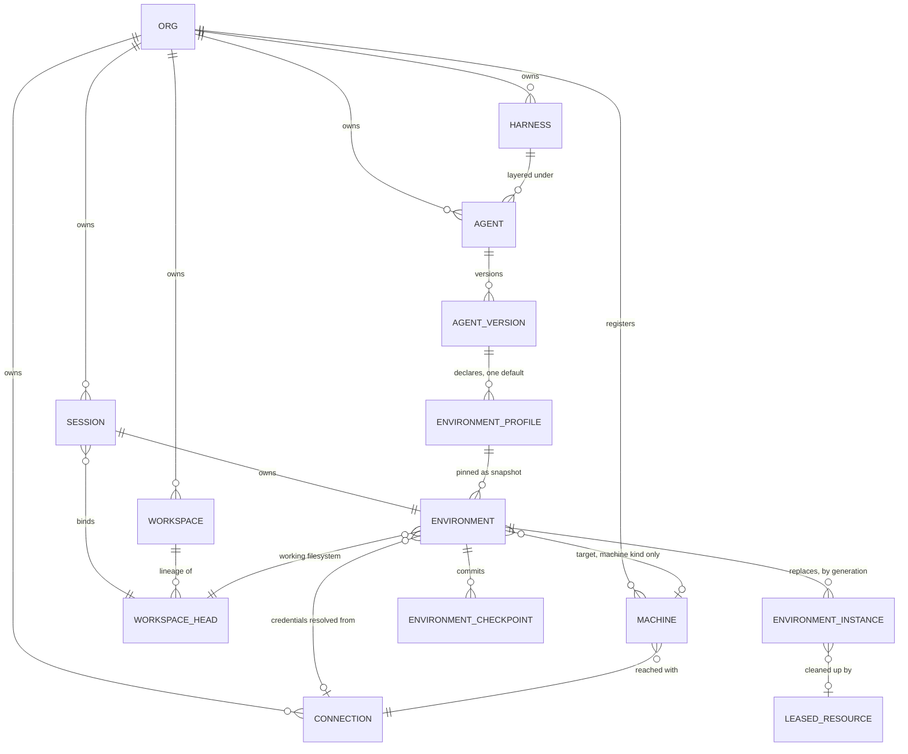

# Execution environments

Status: first slice implemented, the rest proposed. Extends, does not replace,
[Sandbox Abstraction](sandbox-abstraction.md).

What exists in code today:

- the Framework contract, `crates/host/src/compute.rs`: `Compute`,
  `ComputeSession`, `ComputeCapabilities`, `Containment`, `Durability`, and
  `Environment`'s named `compute` and `containment` members with the validation
  rule below;
- the `host` target, `HostCompute`, behind `everruns/host-compute`;
- a read-only control-plane surface, `GET /v1/sessions/{id}/environment` and
  `GET /v1/environment-targets`, derived from a session's effective
  capabilities because profiles are not stored yet, which the response says with
  `resolved_from: "capabilities"`;
- the Workspace-tab environment panel in the UI.

Not yet: environment profiles as agent configuration, the machine target,
kernel containment, and the provider ports. That concept solved the durable
logical sandbox: one working filesystem, provider-neutral drivers, checkpoints,
and physical-loss recovery. This proposal adds the two things it left out, then
folds Yolop into the same contract:

1. an environment where nothing is contained (the machine the agent is already
   running on), and
2. a containment axis, so "no sandbox", "kernel-contained host", and "remote
   VM" are positions on one scale rather than unrelated products.

## Problem

### The word "sandbox" carries two meanings

Everruns uses it for **where code runs**, and answers that question by which
capability the harness enables. Bashkit, `container_sandbox`, Daytona, and E2B
are four independent capabilities with four tool families and four state
formats. `SessionSandboxProvider` (`crates/platform/src/session_sandbox.rs`) is
the newer provider-neutral attempt at the same question, but it is behind an
internal feature flag and Daytona is its only implementation. Containment is not
a field anywhere: it is whatever the chosen capability happens to give, so
Bashkit is default-deny by construction while a Daytona VM is wide open inside
itself.

Yolop uses it for **what code may touch**. `SandboxProvider`
(`src/exec/sandbox.rs`, `SandboxMode` in `src/config/mod.rs`) always runs on the
local machine and varies only the kernel policy: `read-only`,
`workspace-write`, `danger-full-access`, enforced with Seatbelt and Landlock.

Neither system can express the other's question. Everruns cannot say "run on
this box but deny the network". Yolop cannot say "run this somewhere else".
Both are asked for exactly that.

### Selecting an environment means selecting a harness

`coding-container`, `coding-daytona`, and `coding-session-sandbox` differ in one
capability each, and then repeat roughly a hundred lines of near-identical
system prompt with provider tool names spelled into the text
(`sandbox_exec` vs `daytona_exec` vs `sandbox_read_file`). Changing where a
session runs currently means changing its behavior, its prompt, and its tool
names at once.

### Five tool namespaces for the same six operations

`read_file`/`write_file`/`edit_file` (session VFS), `bash` (Bashkit),
`sandbox_*` (container and session sandbox), `daytona_*`, `e2b_*`. The model
learns a different vocabulary per provider for read, write, exec, and lifecycle.

### There is no honest "no sandbox"

The nearest thing today is a Daytona VM with a shell, or Bashkit, which is not a
real Linux process environment at all. An operator who wants the agent to build
on the machine they already trust, a CI runner, their dev box, a GPU host, has
no supported answer. Yolop's answer is its default mode and it is the whole
product.

## Model

Two orthogonal axes plus a negotiated capability set.

```text
                 containment:  none        native         isolated
                               (trusted)   (kernel)       (VM / interpreter)
target: host                   yolop        yolop           n/a
        (this machine)         default      --sandbox
        machine                ssh, agent   ssh + remote    n/a
        (registered box)       daemon       policy
        container              n/a          n/a            Docker
        managed                n/a          n/a            Daytona, E2B, ...
        vfs                    n/a          n/a            Bashkit
```

**Target** answers *where*: which filesystem and which process namespace the
tools address. **Containment** answers *what may be touched*: filesystem roots,
network, and the escalation path. "No sandbox" is `target: host,
containment: none`, an ordinary cell in the table, not a missing feature.

The two axes are not independent in the sense that every cell is reachable. They
are independent in the sense that a profile must state both, and neither may be
inferred from the other. A Daytona VM being `isolated` at the target level says
nothing about whether its egress is allowlisted; that is the containment field's
job.

### What containment means

Containment is the answer to *what may this process touch*: which paths it can
write, whether it can reach the network, and whether anything actually enforces
that. It is a separate question from where the process runs, because the same
machine can answer it several ways. Yolop is the whole illustration: always the
local machine, but `read-only`, `workspace-write`, and `danger-full-access` are
three different answers, enforced by Seatbelt and Landlock.

For most targets it is not a choice. Bashkit and a Daytona VM each fix it by
construction, so the field is descriptive there: it records what the target
already enforces, which is what lets a profile be compared, validated, and
displayed uniformly. It becomes a real choice only for `host` and `machine`,
where the same box can run a command wide open or under a kernel policy. So the
axis earns its place because of those two rows, not because every provider needs
a knob.

Every target therefore has an implied default, and stating the field is how a
profile confirms rather than assumes it:

| Target | Implied | Choice available |
|---|---|---|
| bashkit | isolated, network default-deny | none, fixed by the target |
| daytona, e2b, container | isolated | egress policy only |
| host, machine | none | `native` kernel policy, later |

Naming note: `sandbox` is the plainer wire name for this field, and it makes the
original request sayable literally, `sandbox: none`. The tradeoff is that
"sandbox" then means the security property in one place and, colloquially, the
whole environment everywhere else. Worth settling before the field ships.

### Naming

The Framework already named this. `Environment` in
`crates/host/src/workspace.rs` is "session execution resources", a workspace
head plus a type-keyed extension seam, and `EnvironmentBuilder::workspace_extension`
documents that seam for "process, container, or remote mount" providers that
must address the same head as the file tools. Compute was left as a future
extension; this proposal fills it in.

Decision: **Environment** is the resource name on both surfaces. The Framework
promotes compute and containment from anonymous extensions to named members of
`Environment`, and the control plane's durable resource, the one
[Sandbox Abstraction](sandbox-abstraction.md) calls a Sandbox, is renamed to
Environment and becomes the projection of the same thing. "Sandbox" is retained
only for the security property, which is what makes `containment: none` sayable
without contradiction, and `/v1/sessions/{id}/sandbox` becomes
`/v1/sessions/{id}/environment` with the old route kept as a compatibility
alias for its deprecation window.

The durable resource, generations, checkpoints, and reconciliation from
[Sandbox Abstraction](sandbox-abstraction.md) are unchanged.

### Environment profile

The sandbox profile in [Sandbox Abstraction](sandbox-abstraction.md) gains an
explicit containment block and an honest durability class:

```json
{
  "target": { "kind": "managed", "provider": "daytona" },
  "containment": {
    "level": "isolated",
    "filesystem": { "writable_roots": ["/home/daytona/workspace"] },
    "network": { "mode": "allowlist", "allowed_hosts": ["crates.io"] },
    "escalation": "approval"
  },
  "durability": "checkpointed",
  "lifecycle": { "...": "unchanged" },
  "bootstrap": { "...": "unchanged" }
}
```

`durability` is declared, never assumed: `checkpointed` (Everruns owns a
portable workspace checkpoint, eligible for durable-agent recovery),
`provider_snapshot` (fast restore only), `none` (a real machine; loss is loss).
An environment whose durability is `none` is not offered as a durable-agent
backend. It is not given a fake checkpoint either.

`escalation` says who may widen containment mid-session: `never`, `approval`
(human in the loop, Yolop's existing gate), or `auto` for trusted operator
setups.

### Capabilities stay negotiated

Extend the capability set already proposed with the containment facts the model
and the UI need: kernel-enforced boundary, network policy actually enforced,
native process execution, package installation, PTY, ports. Tools and UI are
assembled from this set. An unsupported operation is absent, never emulated.
Bashkit advertising "no native binaries" is the load-bearing example: it must
not look like a Linux shell that happens to be failing.

## Domain model

Configuration is authored on the Agent version and is *desired* state.
Everything below the Session line is *observed* state the control plane owns.



Entities, and which of them are rows:

| Entity | Kind | Owns |
|---|---|---|
| `ENVIRONMENT_PROFILE` | embedded value on the Agent version | target, containment, durability, lifecycle, bootstrap |
| `ENVIRONMENT` (`env_`) | durable row, one per Session | pinned profile snapshot, desired/observed state, generation, current checkpoint |
| `ENVIRONMENT_INSTANCE` | disposable row, many per Environment | provider resource id, provider state, generation, observed state |
| `ENVIRONMENT_CHECKPOINT` | row | kind (`provider_native` or `portable`), workspace revision, source tool call |
| `WORKSPACE_HEAD` | existing Framework type | the bytes every tool addresses |
| `MACHINE` | row | transport and address of a registered box |
| `CONNECTION` | existing row | the credential, never copied anywhere else |
| `LEASED_RESOURCE` (`resource_`) | existing row | external-resource cleanup, subordinate to the Environment |

Four rules the shape encodes:

**A profile is pinned, not referenced.** `ENVIRONMENT` stores a snapshot of the
profile it resolved at session start. Editing the Agent version afterwards
cannot change the environment a running session is executing in; the next
session picks up the new one.

**The Environment is durable, its instances are not.** Physical loss increments
`generation` and creates a new `ENVIRONMENT_INSTANCE`. Every provider call
carries the generation as a fencing token, so a late reply from a lost
incarnation cannot overwrite current state. The Session, the conversation, and
the files survive; RAM, processes, and PTYs do not.

**The filesystem lineage outlives the environment.** `WORKSPACE_HEAD` belongs to
the Workspace, not to the Environment. That is what lets a replacement
incarnation resume the same files after physical loss, and what lets a second
session on a different environment bind the same Workspace. For Bashkit the
working filesystem *is* that head, so a checkpoint is nearly free; for Daytona
the live worktree is instance-local and mirrored into a committed checkpoint at
each mutating step.

**Credentials live in exactly one place.** `ENVIRONMENT` references a
`CONNECTION` and resolves the token at operation time. No profile snapshot,
provider state, checkpoint manifest, event, or lease metadata carries a bearer
credential.

Two consequences worth stating, because they are where the diagram stops being
symmetric: a `host` or `machine` Environment has instances but no checkpoints,
which is what `durability: none` means; and a `bashkit` Environment has an
instance row for lifecycle symmetry but no external provider resource, so it
needs no lease.

## Model-facing surface

One toolset for every cell of the table: `bash`, `read_file`, `write_file`,
`edit_file`, `glob`, `grep`. Provider-prefixed families
(`daytona_*`, `e2b_*`, `sandbox_*`) leave the agent-execution path and survive
only as advanced or operations tooling for workflows that genuinely manage
several environments as data.

Environment facts reach the model as live context, not prompt text. Yolop
already does this with `<environment_context>`, reporting effective mode and
network access while keeping the stable prompt free of live values. Everruns
adopts the same block: target, containment, network, writable roots,
capabilities, durability. One `coding` harness then replaces three, because the
only thing that differed between them was the environment.

## Who chooses the environment

Decision: the **caller**, when creating the session, or the **agent**, as
configuration. Never the model at runtime.

An agent version declares named environments and a default:

```json
{
  "environments": {
    "default": "scratch",
    "profiles": {
      "scratch": { "target": { "kind": "vfs", "provider": "bashkit" } },
      "build":   { "target": { "kind": "managed", "provider": "daytona" } },
      "here":    { "target": { "kind": "host" }, "containment": { "level": "none" } }
    }
  }
}
```

A session inherits the default, names one of the profiles, or inlines its own.
That is the whole selection mechanism, and it keeps the model's tool schema
fixed for the life of a session.

The rejected alternative is worth recording, because it is the obvious next
request. Give the model one control tool, `use_environment { name }`, argument
constrained to that map, and an agent that hits `cargo build` inside Bashkit can
move itself to `build` instead of failing. It is rejected for the first version
because a session's environment does not change once it starts, for the reasons
below. An agent that needs a different one is a new session against the same
Workspace, and that is a decision for a human or an application.

Two invariants hold whoever is choosing. Selection is always *from* a set of
profiles a human authored: model input never becomes provider configuration, an
image, a resource id, or a containment relaxation. And widening access always
needs configuration or a human, never a runtime decision by the agent.

Escalation, Yolop's `require_escalated` path with its once-or-session approval
grant, belongs to the same later phase as kernel containment: there is nothing
to escalate while every target fixes its own boundary.

### An environment does not change under a session

Rejected: a switch operation that moves a running session from one environment
to another. It was invented to rescue a model stuck in the wrong place, and with
selection settled at session creation nothing needs it. It also does not survive
contact with the targets.

Daytona to Bashkit cannot work at all. What makes a Daytona worktree useful is
installed packages, caches, compiled artifacts, and running processes; Bashkit
runs no native binaries, so the files would arrive somewhere that cannot use
them. Bashkit to Daytona is coherent, but it is only "copy these bytes into a
fresh machine", which is what creating a session against the same Workspace
already does. A switch operation, its transfer modes, a new link relation, and a
mid-session tool-schema refresh buy one direction of one pair, badly.

The honest mechanism already exists. A Workspace outlives any one session, and
`POST /v1/sessions` takes `workspace_id`, so a new session on a different
environment binds the same files. Where the conversation matters too, fork the
session (see [Forking sessions](../runtime-resources/forking-sessions.md)) and
give the fork a different environment.

```http
POST /v1/sessions
{ "agent_name": "coding",
  "environment": { "use": "build" },
  "workspace_id": "wsp_01933b5a00007000800000000000001" }
```

This states plainly what a switch would have blurred: files come with you,
machine state does not. Nothing carries installed packages, caches, background
processes, servers, PTYs, or shell state across that boundary, and no operation
should imply otherwise.

## The machine target

A registered machine is a first-class target: a developer box, a CI runner, a
GPU host, or localhost for an embedded host like Yolop. Transport is SSH or a
small Everruns agent daemon; the credential is an ordinary connection record
with an owner, exactly like a Daytona API key.

Against the driver contract from [Sandbox Abstraction](sandbox-abstraction.md),
a machine is unremarkable: `WorkingFileSystem` over SFTP or the daemon,
`SandboxCompute` over an exec channel. What differs is honesty about
capabilities. Provision and delete are refused or become connect and disconnect,
because Everruns does not own the hardware. Durability is `none` unless the
operator opts into an rsync-style portable export. Native processes, packages,
PTY, and ports are all available, which is exactly why people want it.

`host` is the degenerate case of `machine`: same contract, in-process transport,
already half-built. `RealDiskFileStore` in `crates/host/src/real_disk.rs` is the
working filesystem, and the missing half is a compute implementation plus the
containment providers below.

## Yolop

Yolop is this proposal's `target: host` row, already shipped and further along
on containment than the platform is. Its
[sandboxing spec](https://github.com/everruns/yolop/blob/main/knowledge/specs/sandboxing.md)
anticipates the convergence explicitly: a provider boundary rather than
OS-specific policy in the tool, and a sketched `SandboxSession` extension for
providers with virtual filesystems, snapshots, or remote lifecycle.

The proposal is a trade in both directions.

**Everruns takes Yolop's containment layer.** Seatbelt and Landlock providers
move into a crate both consume, most likely under `everruns-host`, and become
the implementation of `containment.level = "native"` for the host and machine
targets. Everruns has nothing comparable today; Yolop has it tested on both
platforms in CI.

**Yolop takes Everruns' target layer.** Yolop's `SandboxProvider` keeps
answering "what may this process touch". A separate, optional target selection
answers "where does it run", implemented as the `SandboxCompute` and
`WorkingFileSystem` pair rather than the speculative `SandboxSession` in its
spec. A `yolop --env daytona` or `--env bashkit` then needs no new tool schemas,
because Yolop's `bash` and structured file tools already are the unified
surface this proposal wants everywhere.

Two Yolop invariants must survive the move, and both are already stated in its
spec: model input may never choose a host executable or silently widen mounts,
and startup fails closed when a required OS primitive is unavailable rather than
falling back to an unsandboxed host.

## Framework API

Proposed signatures, not implemented. They extend the existing `Environment`
seam rather than adding a parallel one, and follow the promotion rule in
[Application API Boundaries](../framework/application-api.md): `everruns-host`
owns the traits, `everruns` re-exports the value types an application composes.

### No sandbox, on this machine

The Yolop and coding-CLI position. Containment is stated, never defaulted,
because an omitted containment field that silently means `none` is how a
trusted-operator default becomes an accident.

```rust
use everruns::{Agent, Compute, Containment, Environment, InMemoryEngine};

let environment = Environment::builder()
    .workspace(head)                    // existing: WorkspaceHead
    .compute(Compute::host())           // this machine, in-process
    .containment(Containment::none())   // explicit
    .build()?;

let session = engine.create(agent).environment(environment).start().await?;
```

### Same machine, kernel containment

`Containment::native()` is Yolop's Seatbelt and Landlock policy, moved into the
shared crate. It fails closed: if the OS primitive is unavailable, `build()`
returns an error rather than degrading to the host.

```rust
let environment = Environment::builder()
    .workspace(head)
    .compute(Compute::host())
    .containment(
        Containment::native()
            .writable_root(head.path()?)
            .network(Network::Deny)
            .escalation(Escalation::Approval(approval_gate)),
    )
    .build()?;
```

### Bashkit

Bashkit brings its own filesystem and its own boundary, so it supplies both
halves. Asking for weaker containment than a target enforces is a build error,
not a silent upgrade.

```rust
let environment = Environment::builder()
    .compute(Compute::bashkit())        // provides the working filesystem too
    .build()?;

assert_eq!(environment.containment().level(), ContainmentLevel::Isolated);
```

### Daytona

```rust
let environment = Environment::builder()
    .compute(Compute::provider("daytona", daytona::Compute::small()
        .snapshot("everruns-rust")
        .workspace_path("/home/daytona/workspace")))
    .containment(Containment::isolated()
        .network(Network::allowlist(["crates.io", "static.crates.io"])))
    .durability(Durability::Checkpointed)
    .build()?;
```

### A registered machine

```rust
let environment = Environment::builder()
    .compute(Compute::machine(MachineTarget::ssh("build-01.internal")
        .connection(connection_id)      // credentials live in the connection
        .workspace_path("/srv/agent")))
    .containment(Containment::none())
    .build()?;

// Refused: the machine target advertises no portable checkpoint.
assert!(matches!(
    environment.durability(),
    Durability::None,
));
```

### Capabilities are asked, never assumed

```rust
let caps = session.environment().capabilities();
if !caps.native_processes {
    // Bashkit: `cargo build` will not work here. Say so.
}
```

### Named environments

The set is authored by the application. A session takes the default or names
one; the model is not given a tool to change it.

```rust
let agent = Agent::builder()
    .instructions("You are an expert software developer.")
    .model(Model::openai("gpt-5.2"))
    .environments([
        ("scratch", scratch_environment),   // bashkit, cheap, no native binaries
        ("build",   daytona_environment),   // real Linux, network allowlist
    ])
    .default_environment("scratch")
    .build()?;

let session = engine.create(agent).environment_named("build").start().await?;
```

Needing the other environment means a new session on the same files, never a
mutation of this one:

```rust
let build = engine
    .create(agent)
    .environment_named("build")
    .workspace(head)            // same head, different compute
    .start()
    .await?;
```

### Implementing a target

Two small traits, mirroring the driver contract in
[Sandbox Abstraction](sandbox-abstraction.md). A provider implements what it
has; absent capabilities are absent, not stubbed.

```rust
#[async_trait]
pub trait Compute: Send + Sync {
    fn capabilities(&self) -> ComputeCapabilities;
    async fn connect(&self, head: &WorkspaceHead) -> Result<ComputeHandle, ComputeError>;
}

#[async_trait]
pub trait ComputeSession: Send + Sync {
    async fn exec(&self, request: ExecRequest, sink: OutputSink) -> Result<ExecResult, ComputeError>;
    async fn cancel(&self, execution_id: &str) -> Result<(), ComputeError>;
}
```

`Containment` stays a separate, narrow trait so a target and a policy compose
independently: it maps a policy plus a resolved workspace root to a launch
decision, which is exactly Yolop's existing `SandboxProvider::command`
generalized past the local process case.

## Control-plane API

Today the whole surface is `GET`/`POST /v1/sessions/{session_id}/sandbox`
(`crates/server/src/api/session_sandbox.rs`), whose response mixes
configuration, lifecycle, and provider identity into one flat body with
`configured` and `exists` booleans. Proposed shapes follow
[API Conventions](../execution/api-conventions.md), including `allowed_actions`
computed from current state.

### Environments are agent configuration

```http
POST /v1/agents
```

```json
{
  "name": "coding",
  "harness": "coding",
  "environments": {
    "default": "scratch",
    "profiles": {
      "scratch": {
        "target": { "kind": "vfs", "provider": "bashkit" },
        "containment": { "level": "isolated", "network": { "mode": "deny" } },
        "durability": "checkpointed"
      },
      "build": {
        "target": { "kind": "managed", "provider": "daytona",
                    "options": { "size": "small", "snapshot": "everruns-rust" } },
        "containment": { "level": "isolated",
                         "network": { "mode": "allowlist", "allowed_hosts": ["crates.io"] } },
        "durability": "checkpointed",
        "lifecycle": { "idle_after_seconds": 180, "idle_action": "checkpoint_and_stop" }
      },
      "build-01": {
        "target": { "kind": "machine", "connection_id": "conn_...",
                    "options": { "workspace_path": "/srv/agent" } },
        "containment": { "level": "none", "escalation": "never" },
        "durability": "none"
      }
    }
  }
}
```

Validation is where the honesty is enforced: a `durability: none` profile on an
agent that requires durable recovery is a `422`, and a containment level a
target cannot enforce is a `422`, both with the `retry` error rel and a `hint`
naming the offending field.

### Create a session on Bashkit

Today the request says nothing about where commands will run. Bashkit happens
because `generic` carries the `bashkit_shell` capability:

```http
POST /v1/sessions
{ "harness_name": "generic", "title": "Rename the config module" }
```

Getting Daytona instead means `"harness_name": "coding-daytona"`, which also
changes the system prompt and every tool name. Three proposed forms, in
increasing order of how much the caller decides.

**Inherit the agent's default.** The common case. The agent declares `scratch`
as its default profile, so the caller says nothing:

```http
POST /v1/sessions
{ "agent_name": "coding", "title": "Rename the config module" }
```

**Name one of the agent's profiles.** Selection is bounded by what the agent
declares, so a caller cannot reach an environment it does not offer:

```http
POST /v1/sessions
{ "agent_name": "coding", "environment": { "use": "scratch" } }
```

**Inline a profile.** For callers with no agent-level configuration. This is an
operator authoring a profile, not the model, and it is validated against org
policy the same way an agent's profiles are:

```http
POST /v1/sessions
```

```json
{
  "harness_name": "coding",
  "title": "Rename the config module",
  "workspace_id": "wsp_01933b5a00007000800000000000001",
  "environment": {
    "target": { "kind": "vfs", "provider": "bashkit" },
    "containment": { "level": "isolated", "network": { "mode": "deny" } },
    "durability": "checkpointed"
  }
}
```

The existing `workspace_id` field keeps its meaning and binds the working
filesystem. For Bashkit the environment's filesystem *is* that workspace, which
is the point: no second filesystem, no split brain between `read_file` and
`bash`.

Response:

```json
{
  "self_url": "https://api.example/v1/sessions/session_01933b5a00007000800000000000001",
  "view_url": "https://app.example/sessions/session_01933…/chat",
  "id": "session_01933b5a00007000800000000000001",
  "status": "started",
  "harness_id": "harness_01933b5a00007000800000000000002",
  "title": "Rename the config module",
  "environment": {
    "self_url": "https://api.example/v1/sessions/session_01933…/environment",
    "name": "inline",
    "target": { "kind": "vfs", "provider": "bashkit" },
    "containment": { "level": "isolated", "network": { "mode": "deny" } },
    "durability": "checkpointed",
    "capabilities": {
      "native_processes": false,
      "packages": false,
      "pty": false,
      "ports": false,
      "portable_checkpoint": true,
      "network_enforced": true
    },
    "desired_state": "ready",
    "observed_state": "absent",
    "generation": 0,
    "workspace_id": "wsp_01933b5a00007000800000000000001"
  },
  "created_at": "2026-09-09T15:24:00Z",
  "updated_at": "2026-09-09T15:24:00Z"
}
```

`observed_state: "absent"` at creation is correct, not an error: Bashkit
provisions lazily on first use and has no billed warm compute to start. The
`configured` and `exists` booleans on today's sandbox response disappear;
`desired_state` and `observed_state` carry that information without conflating
"the harness opted in" with "an instance exists".

`capabilities` in the creation response is the payoff. A caller learns before
the first turn that this session cannot run `cargo build`, rather than after a
tool call fails inside a shell that looks real. A UI can grey out the right
affordances, and a client that needs native processes can fail fast or create
the session on `build` instead.

```bash
curl -sS -X POST https://api.example/v1/sessions \
  -H "Authorization: Bearer $EVERRUNS_API_KEY" \
  -H "Content-Type: application/json" \
  -d '{
        "agent_name": "coding",
        "environment": { "use": "scratch" },
        "title": "Rename the config module"
      }'
```

The Framework equivalent binds the same environment before the session starts,
which is the existing `EnvironmentSessionBuilder` path:

```rust
let session = engine
    .create(agent)
    .environment(Environment::builder().compute(Compute::bashkit()).build()?)
    .start()
    .await?;
```

What the model then sees is one context block, identical in shape for every
target:

```text
<environment_context>
target: bashkit (virtual filesystem)
containment: isolated, network denied
native processes: no
packages: no
</environment_context>
```

### Session environment

```http
GET /v1/sessions/{session_id}/environment
```

```json
{
  "self_url": "https://api.example/v1/sessions/session_.../environment",
  "name": "build",
  "environment_id": "env_...",
  "target": { "kind": "managed", "provider": "daytona" },
  "containment": { "level": "isolated", "network": { "mode": "allowlist" } },
  "durability": "checkpointed",
  "capabilities": {
    "native_processes": true, "packages": true, "pty": true,
    "ports": true, "portable_checkpoint": true, "network_enforced": true
  },
  "desired_state": "ready",
  "observed_state": "ready",
  "generation": 17,
  "current_checkpoint_id": "sbxcp_...",
  "last_activity_at": "2026-09-09T10:31:02Z",
  "allowed_actions": [
    { "rel": "pause",  "method": "POST", "operation_id": "manage_session_environment",
      "href": ".../environment", "hint": "Checkpoint and stop the instance." },
    { "rel": "delete", "method": "POST", "operation_id": "manage_session_environment",
      "href": ".../environment", "hint": "Discard the instance and its working filesystem." },
    { "rel": "reset", "method": "POST", "operation_id": "manage_session_environment",
      "href": ".../environment", "hint": "Discard the instance and rebuild it from the pinned profile." }
  ]
}
```

`pause`, `resume`, and `delete` reuse existing rels, so the closed vocabulary in
[API Conventions](../execution/api-conventions.md) needs no new word. There is
deliberately no switch endpoint: a session's environment is fixed once it
starts, and moving work elsewhere is a new session against the same
`workspace_id`.

### Targets this deployment can actually offer

The UI cannot render an honest picker from provider names alone.

```http
GET /v1/environment-targets
```

```json
{
  "items": [
    { "kind": "vfs", "provider": "bashkit", "available": true,
      "capabilities": { "native_processes": false, "packages": false, "pty": false,
                        "ports": false, "portable_checkpoint": true },
      "containment_levels": ["isolated"] },
    { "kind": "managed", "provider": "daytona", "available": true,
      "requires_connection": true,
      "capabilities": { "native_processes": true, "packages": true, "pty": true,
                        "ports": true, "portable_checkpoint": true },
      "containment_levels": ["isolated"] },
    { "kind": "host", "available": false,
      "reason": "host execution is disabled for this deployment",
      "containment_levels": ["none", "native"] }
  ]
}
```

### Escalation

An in-session request to widen containment surfaces as an event and is resolved
over the API, which is Yolop's approval gate with an HTTP front end.

```json
{ "type": "environment.escalation_requested", "escalation_id": "esc_...",
  "command": "cargo publish", "requested": { "network": { "mode": "allow" } },
  "reason": "publishing requires crates.io access" }
```

```http
POST /v1/sessions/{session_id}/environment/escalations/{escalation_id}
{ "decision": "approve_once" }
```

A `scope: session` grant of one level never implies a higher one, matching
Yolop's rule that a sandbox-scoped grant does not license full access later.

### Machines

```http
POST /v1/machines
{ "name": "build-01", "transport": "ssh", "address": "build-01.internal",
  "connection_id": "conn_..." }
```

Credentials stay in the connection record. A machine row carries no token, and
the profile references it by id, keeping the "no bearer credential in sandbox
rows, checkpoints, events, or logs" criterion from
[Sandbox Abstraction](sandbox-abstraction.md) intact.

### Events

`environment.instance_lost` and `environment.recovered` join the session event
stream, so a UI and a durable agent learn about a replaced incarnation the same
way.

## What this removes

- `coding-container`, `coding-daytona`, `coding-session-sandbox` collapse into
  one `coding` harness plus environment profiles. Three duplicated prompts
  become one.
- `daytona_*`, `e2b_*`, `sandbox_*` leave the default agent toolset.
- `docker_container` is deleted, as
  [Sandbox Abstraction](sandbox-abstraction.md) already decided.
- Prompt text describing lifecycle, tool names, and idle timeouts, replaced by
  the live environment context block.

## Phasing

This sequences alongside the existing migration plan rather than restarting it.

**P0, containment field and capability catalog.** Add the containment block,
the durability class, and the containment capabilities to the profile; promote
compute and containment to named members of the Framework's existing
`Environment`; add `GET /v1/environment-targets`. No new providers. Exit: a
profile can express `host + none` and `daytona + isolated + allowlist`, and
validation rejects a durable-agent agent pinned to `durability: none`.

**P1, host target.** Compute implementation for the in-process host, joined to
the existing `RealDiskFileStore`, declaring `containment: none` and
`durability: none` honestly. Kernel containment is explicitly *not* in this
phase: Bashkit and Daytona fix their own boundary, so nothing in the first
release needs Seatbelt or Landlock. Exit: an Everruns session runs `bash` on the
worker host, and the API refuses to pin a durable agent to it.

**P2, environment sets.** Named environments on the agent version and selection
at session creation, inherited, named, or inlined. No switch operation, no
model-facing control tool. Exit: two sessions bound to one Workspace, one on
Bashkit and one on Daytona, read and write the same files.

**P3, machine target and consolidation.** SSH or daemon transport, then port
E2B, Deno, Sprites, and container behind the driver contract as already planned.

**Later, kernel containment.** Yolop's Seatbelt and Landlock providers become
`containment: native` for the host and machine targets, extracted into a crate
both repositories consume. This is the phase that makes containment a choice
rather than a description, and nothing before it depends on it.

P1 and P2 are independent of the Daytona durability work in
[Sandbox Abstraction](sandbox-abstraction.md) Phase 2 and can run beside it.

## Risks

- Extracting Yolop's containment providers couples two release trains. The crate
  boundary must be small enough that Yolop can pin a published version, as it
  already does for Tuika and `everruns-host`.
- A machine target invites treating someone's laptop as durable agent
  infrastructure. The `durability: none` declaration must be enforced at
  validation time, not documented as a caveat.
- Two sessions on one Workspace are two writers. Everruns already owes shared
  workspaces an exclusive-writer answer; environments do not change that
  question, but they make it easier to reach by accident.

## Open questions

1. Is `sandbox` the better wire name for the containment field, given that
   `sandbox: none` says the original request literally?
2. When kernel containment does arrive, where does the shared crate live: inside
   `everruns-host`, or its own publishable crate that both repositories pin, the
   way Yolop already pins Tuika?
3. Does the Environment row own a workspace head, or reference one the Session
   already bound? The domain model takes the second reading, which is what lets
   a second session on another environment bind the same files.
