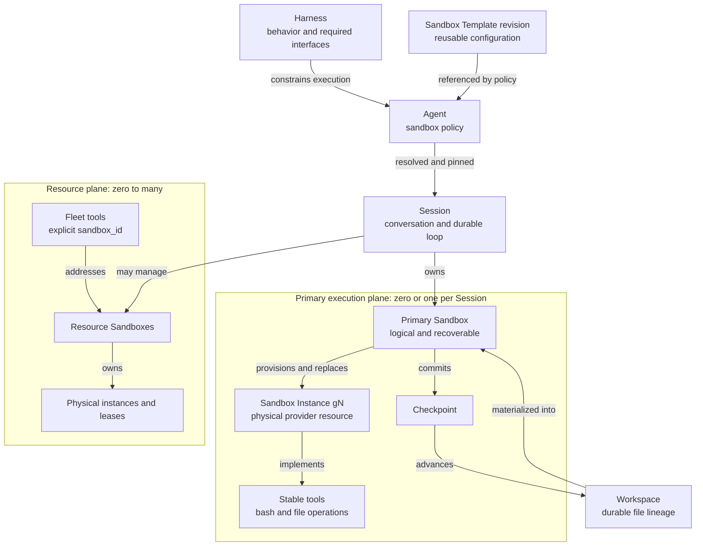
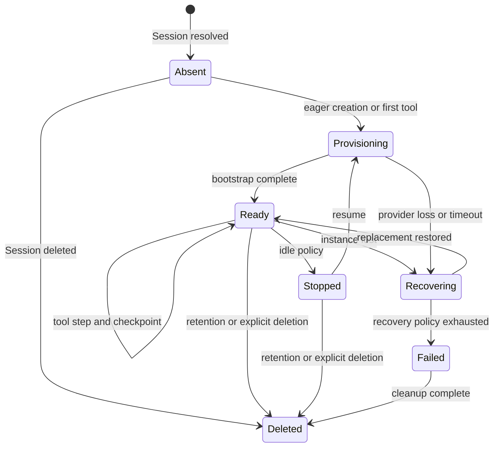

# Sandbox platform architecture

Status: implemented baseline. The target model and current public contract are
documented here and in [Sandbox Templates](sandbox-templates.md). The implementation provides
provider-neutral tools, logical/physical separation, generation fencing,
checkpoint recovery, and Bashkit and Daytona adapters. This proposal keeps that
machinery while correcting its product vocabulary, ownership boundaries, and
selection policy.

## Decision

Separate five concepts that the current model partially combines:

1. A **Harness** defines reusable agent-loop behavior and the execution
   interfaces that behavior needs.
2. A **Sandbox Template** is reusable, versioned configuration for creating a
   sandbox: target, containment, limits, lifecycle, bootstrap, and credential
   references.
3. A **Workspace** is durable file lineage. It can outlive a Session and every
   physical compute instance used to work on it.
4. A **Sandbox** is a logical execution resource. A Session may own zero or one
   primary Sandbox, and an agent may explicitly create additional resource
   Sandboxes.
5. A **Sandbox Instance** is one disposable physical incarnation supplied by
   Bashkit, Daytona, or another provider.

`Sandbox` names the computer-like resource. `Containment` names its security
boundary. `Environment` remains a Framework-internal execution context; it is
not a hosted product resource or live Session resource.



## Invariants

- A Session has at most one primary Sandbox. Its identity and Sandbox Template
  snapshot do not change during the Session.
- The primary Sandbox is the only filesystem and command namespace addressed by
  ordinary `bash`, `read_file`, `write_file`, `edit_file`, `glob`, and `grep`.
- A physical instance may disappear without terminating the Session. Recovery
  creates a new generation and restores the last committed Workspace revision.
- A Harness- or Agent-fixed Sandbox Template cannot be overridden by Session input.
- Additional Sandboxes are explicit resources. Every operation names a logical
  `sandbox_id`; they never silently redirect the primary tools.
- Credentials stay in Connections and are resolved by the control plane. They
  are never copied into Sandbox snapshots, Workspace checkpoints, resource
  metadata, or model-visible provider state.
- Conversation durability and Sandbox durability are separate. A surviving
  transcript does not imply surviving RAM, processes, PTYs, or uncheckpointed
  files.

## Why the current model is difficult to use

The current implementation has the right low-level recovery mechanics but the
wrong product compression:

- the legacy Worker Base directly contained `session_file_system` and `bashkit_shell`.
- an Agent embeds a map of named Sandbox Template bindings plus a default;
- Session creation may choose a named profile or submit a caller-authored inline
  profile even when the Agent did not authorize that override mode;
- selecting a profile rewrites the effective capability list, replacing one
  compute capability with another;
- legacy contracts named the live logical runtime Environment while also using
  environment for reusable desired configuration;
- provider tools, the Session resource registry, and leased resources form a
  second path for agents that manage several sandboxes.

The result makes several different questions look like one:

- What behavior does this agent have?
- What execution interface does that behavior require?
- Who chooses the primary runtime?
- What files survive physical loss?
- May the model create other sandboxes?

Those questions need independent answers.

## What stays

This is a refactor of ownership and product contracts, not a rewrite of the
runtime. Retain and generalize:

- `WorkspaceBackend`, `SessionFileSystem`, and `Compute` contracts;
- the provider-neutral Bashkit and Daytona adapters;
- logical state, instance rows, generations, and fencing;
- checkpoint-before-success for mutating operations;
- physical-loss detection and replacement;
- Workspace lineage and session-to-workspace binding;
- `SessionResourceRegistry` for visibility;
- `LeasedResourceStore` for cleanup of external provider resources;
- resource ownership checks that prevent cross-Session access by guessed IDs;
- target and containment as separate facts;
- stable provider-neutral model tools.

## Harness execution contract

A Harness remains a reusable capability foundation. It may additionally
constrain the primary execution plane. The execution contract has two
independent parts:

- `requirement`: `none`, `optional`, or `required`;
- `binding`: `unbound` or `fixed` to an immutable Sandbox Template revision.

The valid combinations are:

| Requirement | Binding | Meaning |
|---|---|---|
| `none` | `unbound` | The Harness has no primary execution plane. |
| `optional` | `unbound` | An Agent may opt into primary execution. |
| `required` | `unbound` | An Agent must provide a compatible policy, or the platform resolves its documented default. |
| `required` | `fixed` | Every Session uses the Harness-owned Sandbox Template revision. |

A fixed binding is sealed. Agent configuration, Session creation, and child
Harnesses cannot replace it. A different fixed runtime must derive from an
unbound foundation instead of overriding a sealed parent.

The execution split is the last layer of the harness tree
([harness types](harness-types.md)):

- Base, Conversation and Worker have no execution requirement. Worker has
  working files but no compute unless an Agent policy adds one.
- Bashkit Worker fixes the primary Sandbox to managed Bashkit.
- Sandbox Worker requires a full (container or managed) Sandbox Template and
  rejects Bashkit-only policies; with none available, session creation fails
  instead of falling back.

Custom harnesses inherit the rule of their nearest built-in ancestor.

### Bashkit Worker

Add one managed built-in Harness:

```text
stable name: bashkit-worker
display name: Bashkit Worker
parent: Worker
execution requirement: required
execution binding: fixed to the managed Bashkit Sandbox Template revision
```

Its product description is:

> Full Worker capabilities with a fixed Bashkit virtual filesystem and shell.
> Fast and recoverable, without native binaries or system package installation.

The provider name is intentional. Bashkit is part of this Harness's behavioral
and security contract, not an interchangeable implementation detail. The Agent
and Session cannot select Daytona or submit inline Sandbox Template configuration.

Platform Chat's managed Agent migrates from deprecated Generic to Bashkit
Worker. This preserves its single Bashkit shell while moving it onto the
canonical Worker hierarchy. Generic is not aliased to Worker: every
Generic-only capability Platform Chat still needs is first made explicit on the
managed Agent or its dedicated child Harness. Generic remains available only
for existing explicit bindings during its deprecation window.

## Sandbox Template resources

A Sandbox Template is an organization-scoped reusable template. It is managed
independently from Agents and Sessions and has immutable revisions. A revision
contains:

- target class and provider;
- containment and network policy actually enforced by that target;
- durability class;
- resource limits and provider options;
- lifecycle and retention intent;
- reproducible bootstrap configuration;
- references to Connections, never credential values.

An Agent or fixed Harness references a specific Sandbox Template revision.
A Session stores both that revision identity and a resolved non-secret snapshot.
Updating a Sandbox Template creates a revision that an Agent must be re-pointed to;
it cannot silently move an existing Agent or Session to different compute.

The platform provisions a managed Bashkit Sandbox Template named **Bashkit Virtual
Workspace**. Bashkit Worker is fixed to its managed revision.

Sandbox Template availability is deployment-specific. A stored Daytona template
does not imply that every deployment has a Daytona provider or Connection. The
control plane validates availability before accepting a policy or creating a
Session.

## Agent sandbox policy

An Agent owns one explicit policy for its primary Sandbox:

| Policy | Session behavior |
|---|---|
| `none` | No primary Sandbox. Sandbox input is rejected. |
| `fixed` | Use one Sandbox Template revision. Sandbox input is rejected. |
| `selectable` | Choose from an authored allowlist, with an optional default. |
| `configurable` | Select an allowed Sandbox Template or submit one-off configuration within authored constraints. |

The common path is `none` or `fixed`. `selectable` and `configurable` are
advanced modes for products that intentionally let callers choose compute.
They are not represented as several simultaneously attached Sandbox Templates.

Valid advanced use cases include:

- Bashkit scratch versus a full Linux build environment;
- CPU versus GPU;
- cloud versus self-hosted or customer-network execution;
- region or compliance choices;
- deliberate provider comparison.

An Agent does not need multiple Sandbox Template bindings merely because it can
create multiple resource Sandboxes. Fleet management is a separate capability.

### Resolution and authority

Resolution is a constraint process, not last-layer-wins overlay:

1. The Harness states whether primary execution is absent, optional, required,
   or sealed to a Sandbox Template revision.
2. A sealed Harness binding is final.
3. An unbound Harness permits the Agent to declare a compatible policy.
4. If required execution remains unspecified, the hosted platform may resolve
   its documented Bashkit default; the Session records that decision.
5. Session input may act only when the Agent policy is `selectable` or
   `configurable`.
6. Organization and deployment policy may narrow provider, connection, size,
   network, and containment choices at every step.

Supplying a Sandbox override to a fixed Harness or fixed Agent is an
error, even when the submitted value is equivalent. Rejecting it preserves
clear provenance and auditability.

## Session creation

Session creation resolves and pins these values before accepting work:

1. effective Harness and Agent (with its history revision);
2. Harness execution constraint and Agent sandbox policy;
3. Sandbox Template revision or validated one-off snapshot;
4. existing or newly created Workspace;
5. primary Sandbox identity, when the resolution requires one;
6. effective tools derived from the resolved execution interfaces.

For coding-style managed Sandbox Templates, provisioning begins when the Session is
created so the first tool call does not pay the full cold-start cost. An
Sandbox Template may explicitly choose lazy provisioning for workloads where that
tradeoff is preferable.

The Sandbox choice is immutable after creation. To use another primary
runtime, create or fork a Session against the same Workspace. Files can follow;
RAM, installed machine state, background processes, open ports, PTYs, and shell
state do not.

## Workspace and the working filesystem

Workspace owns durable file lineage. Sandbox owns the active working tree.
`SessionFileSystem` remains the internal port that makes both look like one
namespace to tools and the UI; it is not itself a product resource.

- In Bashkit, the working filesystem is backed directly by the Workspace, so a
  checkpoint is cheap.
- In Daytona, the active tree is provider-local under `/workspace`; successful
  mutating steps commit a portable revision back to the Workspace.
- When no instance is running, reads use the last committed Workspace revision.
- When an instance is running, file operations route through that instance and
  commit through the same Sandbox manager. The UI must not edit a second VFS
  beside the model's working tree.

Synchronous mutating tools commit before returning success. Idle transition and
orderly stop commit again. Background processes are not durable; their later
filesystem writes become recoverable only after an explicit or lifecycle
checkpoint.

The capability with wire id `session_file_system` becomes a compatibility
wrapper around that runtime port, not a selectable storage product.
`bashkit_shell` becomes a Bashkit adapter and legacy capability alias, not the
way an Agent chooses its primary runtime.

## Primary Sandbox lifecycle

The Sandbox is durable state owned by Everruns. Instances are replaceable
provider resources.



Each replacement increments `generation`. Provider calls, checkpoint writes,
and lease updates carry that generation so a late response from an old instance
cannot overwrite current state.

Recovery performs these steps:

1. mark the current instance lost and fence its generation;
2. select the last committed portable Workspace revision;
3. create a new provider instance;
4. restore the Workspace into the provider's working directory;
5. apply the pinned bootstrap revision idempotently;
6. publish `sandbox.recovered` and resume the durable agent turn.

If recovery is temporarily unavailable, the durable loop reschedules or pauses;
it does not terminate merely because a provider resource ID disappeared.

Provider-native stop, pause, snapshot, and archive remain optimizations. The
durability contract is the declared Sandbox durability, not optimistic
interpretation of a provider state name.

## Resource Sandboxes and fleets

An agent that needs several sandboxes receives the opt-in `sandbox_fleet`
capability. It does not receive several primary Sandbox Templates.

Resource Sandboxes reuse the same logical Sandbox aggregate, provider drivers,
instances, checkpoints, generation fencing, and ownership checks as the primary
Sandbox. They differ by role and tool surface:

- `primary`: at most one per Session; implicitly addressed by ordinary shell
  and file tools;
- `resource`: zero to many per Session; every operation explicitly names the
  logical Sandbox ID.

The provider-neutral fleet vocabulary covers create, list, inspect, execute,
file operations, checkpoint, stop, and delete. Raw Daytona, E2B, and container
IDs never become the stable model contract.

There is no global `use_environment` or `select_sandbox` operation that mutates
where ordinary `bash` points. That state is unsafe under parallel tool calls,
retries, and subagents. The agent selects a resource by passing `sandbox_id` on
each operation. A subtask may persist that ID in its own task state, but the
Session's primary binding remains unchanged.

The control plane performs provider API calls outside the primary Bashkit
runtime. A Bashkit Worker can therefore manage a Daytona fleet without exposing
the Daytona credential or granting Bashkit network access.

### Registry and lease roles

The logical Sandbox row is authoritative product state.

- `SessionResourceRegistry` projects resource visibility for the Session and
  the model.
- `LeasedResourceStore` handles expiry, cleanup retry, and provider teardown for
  physical external instances.
- a lease is subordinate to an instance; it is not the Sandbox identity;
- released resources remain observable for audit and cleanup outcomes.

## Use cases

| Use case | Harness | Primary Sandbox policy | Session choice | Resource Sandboxes |
|---|---|---|---|---|
| Managed coding agent | Sandbox Worker or coding derivative | Fixed recoverable Daytona | Usually locked | Optional |
| Platform Support | Bashkit Worker | Fixed by Harness | Rejected | None by default |
| Agent loop and tools only | Conversation or Base | None | Rejected | Only with explicit fleet capability |
| Bashkit fleet orchestrator | Bashkit Worker | Fixed by Harness | Rejected | Many, through explicit IDs |
| Caller-configured Playground | Worker or Sandbox Worker | Selectable or configurable | Playground chooses within policy | Optional |
| Preconfigured product Agent | Any compatible Harness | Fixed by Agent | Rejected | Independent of primary binding |

## Security boundaries

The trusted Everruns loop and provider control plane remain outside generated
code. A physical sandbox contains the code and commands produced by the model.
Bashkit supplies interpreter and VFS isolation; it is not a Linux VM and must
not advertise native processes or package installation. Daytona supplies a
different containment and persistence profile. The model receives the facts of
the resolved target rather than a generic promise that every sandbox is equal.

Sandbox Template configuration separates:

- **target**: where filesystem and commands execute;
- **containment**: what that execution may touch;
- **durability**: which state Everruns can restore after physical loss.

Model behavior is not a security boundary. Network allowlists, writable roots,
resource limits, credential brokerage, ownership checks, and approval policy
must be enforced below the tool layer.

## Product surfaces

### Sandbox Template management

Organizations can create, inspect, revise, archive, and test reusable
Sandbox Templates. The page shows target, provider, containment, durability,
lifecycle, bootstrap, resource limits, Connection health, and deployment
availability. Secret values are never displayed or embedded.

### Agent configuration

The Agent runtime section offers the common choices first:

- No Sandbox;
- Fixed Sandbox Template.

Advanced settings enable caller selection or constrained one-off configuration.
When the Harness is fixed, the control is read-only and says, for example,
`Bashkit Virtual Workspace · locked by Bashkit Worker`.

### Playground

Playground owns Agent testing and Session setup. It shows Sandbox Template and
Workspace controls only when the Agent policy permits them. A fixed Agent shows
the resolved runtime as read-only. Personal Chats remain bound to the managed
Platform Chat and expose no Harness or Sandbox selector.

### Session

The Session workspace surface shows:

- primary Sandbox status, Sandbox Template revision, generation, checkpoint, and
  recovery events;
- the active Workspace and committed revision;
- separately, resource Sandboxes and other Session resources.

The primary Sandbox is not presented as one item in an undifferentiated fleet.

## Deprecations and migration

### Deprecate as authoring surfaces

- embedded Agent `SandboxPolicy` maps as the default product model;
- unconditional inline Sandbox overrides on Session creation;
- the legacy live Session resource name Environment;
- `bashkit_shell`, `session_sandbox`, `daytona`, `e2b`, and container
  capabilities as ways to select primary execution;
- provider-prefixed model tools for ordinary one-sandbox execution;
- separate Session VFS and managed-sandbox filesystem namespaces;
- provider-specific coding Harnesses;
- any runtime tool that switches the primary Sandbox in place.

Provider-specific tools may remain temporarily for operations workflows and are
replaced by the provider-neutral fleet surface when that surface reaches parity.

### Stored-data migration

- A single Agent Sandbox Template spec becomes a fixed Agent policy.
- Multiple profiles become a selectable policy preserving the old default.
- An Agent without profiles on the legacy Worker moves to Bashkit Worker, which
  keeps its Bashkit default; one with a full sandbox policy moves to Sandbox
  Worker.
- Platform Chat moves to Bashkit Worker.
- Existing Sessions retain their pinned logical state, effective tools,
  Workspace, instances, and checkpoint lineage.
- The current logical Sandbox row becomes a Sandbox projection without
  replacing its identity or recovery history.
- Existing provider leases remain attached to their current instance and are
  cleaned up through the existing worker.

Compatibility readers may accept legacy profile and capability configuration
during migration. New writes use Sandbox Template resources, Agent sandbox policy,
and Harness execution binding only.

## Delivery plan

### Phase 1: contracts and migration

- add versioned Sandbox Template resources and the managed Bashkit template;
- add Harness execution requirement and fixed binding;
- add Agent sandbox policy and deterministic resolution;
- define the primary/resource Sandbox role without duplicating lifecycle state;
- migrate stored Agent configuration and preserve existing Sessions.

### Phase 2: Bashkit Worker

- provision the managed Bashkit Worker as a child of Worker;
- bind it to the managed Bashkit Sandbox Template revision;
- audit Generic-only behavior, make Platform Chat's required opt-ins explicit,
  and then move it to Bashkit Worker;
- reject Agent and Session overrides under fixed Harnesses;
- show binding provenance in API and UI.

### Phase 3: product management

- add Sandbox Template management;
- replace the multi-profile-first Agent editor with fixed-first sandbox policy;
- add conditional Sandbox Template and Workspace setup to Playground;
- keep personal Chats free of runtime selectors;
- update Session views to distinguish primary Sandbox from resources.

### Phase 4: runtime binding

- make `SessionFileSystem` and `Compute` the primary runtime ports;
- route shell, files, Workspace UI, checkpointing, and recovery through the same
  Sandbox manager;
- demote `session_file_system`, `bashkit_shell`, and `session_sandbox` to
  compatibility adapters;
- keep existing Bashkit and Daytona recovery tests as provider conformance
  coverage.

### Phase 5: sandbox fleets

- add the `sandbox_fleet` capability and provider-neutral tools;
- reuse Sandbox instances, checkpoints, leases, registry projection, and
  ownership enforcement;
- migrate intentional provider-resource workflows;
- remove raw provider tools from ordinary Agent execution.

### Phase 6: compatibility retirement

- stop accepting legacy SandboxPolicy and primary-compute capability writes;
- remove legacy provider namespaces once no stored references remain;
- remove temporary route and response aliases;
- keep durable audit history for retired instances and checkpoints.

The foundational model is not a permanent feature flag. Deployment may stage
new UI and write paths, but mixed-mode compatibility must be bounded and the
canonical persisted contract must converge.

## Acceptance criteria

- An Agent using Conversation can run with no Sandbox.
- Bashkit Worker always produces one Bashkit primary Sandbox and rejects every
  Agent or Session override.
- A Worker Agent fixed to Daytona receives one recoverable primary Sandbox with
  one filesystem shared by shell, file tools, and the Workspace UI.
- A selectable Agent permits only its authored Sandbox Template revisions.
- A configurable Agent cannot exceed organization or deployment constraints.
- Physical provider loss replaces the instance and resumes from the last
  committed Workspace revision without changing Session or Sandbox identity.
- A Bashkit Worker with `sandbox_fleet` can create and operate several Daytona
  resource Sandboxes without seeing provider credentials.
- Every resource operation rejects a Sandbox owned by another Session.
- Ordinary `bash` never changes target because a resource Sandbox was created or
  used.
- Existing Sessions and Workspaces survive migration without provider state or
  file lineage being duplicated.
- Platform Chat retains its shell, files, memory, authorization, and permanent
  conversation behavior after moving from Generic to Bashkit Worker.

## Sources

- [Vercel eve](https://vercel.com/blog/introducing-eve): the harness stays
  separate from adapter-backed sandbox execution.
- [LangChain Deep Agents backends](https://docs.langchain.com/oss/python/deepagents/backends):
  filesystem and execution share a backend, with separate routing for other
  durable paths.
- [Claude Managed Agents environments](https://platform.claude.com/docs/en/managed-agents/environments):
  a Sandbox Template is reusable configuration and each Session receives an
  isolated sandbox.
- [Claude Managed Agents sessions](https://platform.claude.com/docs/en/managed-agents/sessions):
  Session creation binds Agent and Sandbox Template and begins provisioning.
- [Daytona persistence](https://www.daytona.io/docs/en/persistence/): provider
  filesystem, memory, snapshot, and volume guarantees are distinct.
- [Session Resource Registry](../runtime-resources/session-resources.md):
  visibility and lease projections already used by provider resources.
