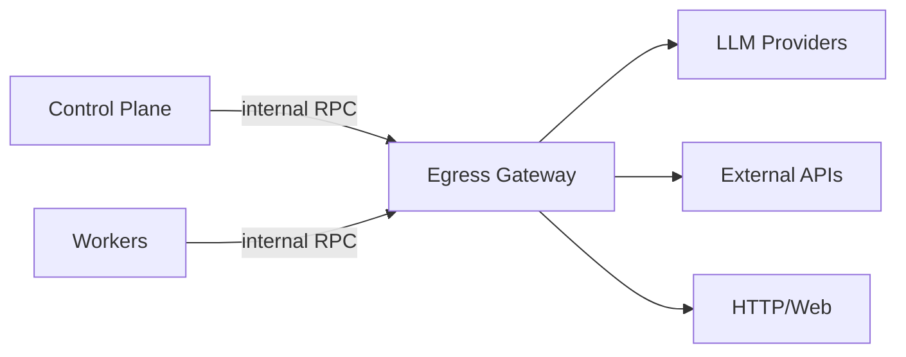

# Egress Service

## Intent

Provide one host-owned boundary for tenant/agent-directed outbound network
traffic.

The egress service owns runtime HTTP/API traffic whose destination is selected
by an agent, a user-authored configuration surface, a capability, MCP, plugin
fetching, or similar tenant-controlled execution. Host-owned platform services
such as LLM provider transports, utility LLM, system email, and sandbox provider
APIs (for example Daytona lifecycle/toolbox APIs) use direct provider clients
outside `EgressService`.

## Terminology

The service name is **Egress Service**. The future physical deployment component
is the **Egress Gateway**.

Reasoning:

- "egress" is the standard infrastructure term for outbound traffic.
- "service" fits the existing `EmailSender` and `UtilityLlmService` platform
  service pattern.
- "gateway" is reserved for the future process or network component that both
  control-plane and workers call inside an airgapped deployment.

## Goals

1. Give every outbound call site the same policy, audit, signing, retry, and
   observability boundary.
2. Keep provider credentials and signing keys inside host-owned services, not
   agent/session/tool configuration.
3. Support a default direct implementation for local/dev/self-hosted use.
4. Support a future remote gateway implementation so workers and control-plane
   processes can run without direct internet egress.
5. Preserve existing network access allowlist/blocklist semantics for
   agent-authored URLs.
6. Allow requests to opt into platform-managed signing.

## Core Contract

`everruns-core` owns the abstraction:

- `EgressService` is the async trait.
- `EgressRequest` is the provider-neutral outbound HTTP request.
- `EgressResponse` is the provider-neutral response body, status, and headers.
- `EgressStreamResponse` is the streaming response body used by LLM SSE and
  other long-lived HTTP responses.
- `EgressRequestKind` labels runtime egress traffic as `capability`,
  `integration`, `mcp`, or `other`; legacy/system labels may exist in code for
  compatibility but host-owned services must not use this boundary.
- `EgressSigning` expresses whether signing is disabled, optional via platform
  default, or required.
- `EgressError` separates invalid requests, network access denial, unavailable
  signing, and transport failures.
- `HostComposition` carries the active `Arc<dyn EgressService>`.
- Runtime tool execution threads the service into `ToolContext`.

The neutral `HostComposition` default is `DisabledEgressService` and fails
closed. Hosted server/worker composition explicitly installs
`everruns_host::DirectEgressService` (feature `direct-egress`), which performs outbound HTTP directly;
advanced embedders can install that host implementation or a remote gateway.

## Required Usage

New tenant/agent runtime outbound code must use `EgressService` instead of
constructing `reqwest::Client`, provider SDK clients, or toolkit-specific HTTP
transports directly.

This applies to:

- capability tools, including library-backed tools such as fetchkit and bashkit
  HTTP support, when they fetch agent/user-selected URLs.
- integration crates for external APIs when the API target is tenant/agent
  selected rather than a fixed host-owned service endpoint.
- remote MCP servers (tool discovery and tool execution).
- background tasks that call tenant/agent-selected external APIs.

Exceptions:

- inbound HTTP servers and gRPC servers are not egress.
- loopback-only test servers and unit-test clients may use direct HTTP clients
  inside tests.
- database, NATS, Valkey, and control-plane worker gRPC links are internal
  infrastructure traffic, not internet egress.
- host-owned platform services such as LLM provider drivers/model discovery,
  utility LLM, system email, sandbox provider APIs (including Daytona), cloud
  infrastructure APIs, and other fixed deployment-owned transports use direct
  provider clients. Their credentials and endpoints are deployment/platform
  configuration, not tenant/agent egress policy.

## Network Access

Agent/session `NetworkAccessList` remains a runtime policy, not an egress
implementation detail. Call sites that send agent-authored or
capability-configured URLs must pass the merged access list into
`EgressRequest.network_access`.

The egress service enforces the policy before making the request. Individual
capabilities may still perform earlier validation when they need better
user-facing errors, but the egress boundary is the final enforcement point.

System-owned fixed endpoints, such as configured email, LLM, Daytona, or cloud
provider URLs, do not use `EgressService` unless that endpoint is derived from
agent/session/user input.

An optional deployment-wide allowlist (`knowledge/operations/system-allowlist.md`) sits at the
same boundary for tenant/agent-directed egress. When enabled, it constrains
capabilities, MCP, integrations, and generic runtime HTTP to a curated set of
public resources. Host-owned system transports stay outside that policy because
they do not route through `EgressService`.

## Signing

Requests can set:

- `disabled`, send without signatures.
- `platform_default`, sign when the platform has an egress signer configured.
- `required`, fail if the platform cannot sign the request.

V1 keeps the request shape provider-neutral. The concrete signer can implement
HTTP Message Signatures, vendor-specific signatures, or both. Existing fetchkit
bot-auth signing should move behind the egress service rather than remain a
capability-local signing path.

## Future Egress Gateway

The remote implementation will replace direct tenant/agent internet egress in
workers and control-plane processes:

Deployment properties:

- CP and workers need only internal network access to the gateway for
  tenant/agent runtime egress paths.
- The gateway owns runtime outbound allowlists, signatures, proxy
  configuration, audit logs, and tenant/agent transport policy.
- In airgapped deployments, the gateway can be disabled, replaced with an
  approved relay, or bound to a preapproved network route.

## Migration Order

1. Introduce `EgressService` and platform/runtime threading.
2. Move fetchkit/web_fetch and bashkit HTTP onto it.
   *Done for web_fetch*: runtime contexts route through
   `integrations/web-fetch/src/egress_transport.rs`; the fetchkit direct
   client remains only as the fallback for contexts without an egress service
   (see `knowledge/execution/fetchkit.md`).
   *Done for bashkit*: curl/wget (opt-in via the `bashkit_shell` capability's
   `enable_http` config) route through
   `integrations/bashkit/src/egress_transport.rs` with no
   direct-client fallback, without an egress service the shell stays offline
   (see `knowledge/operations/network-access.md`).
3. Move tenant/agent-selected integration clients onto it.
4. Add the remote Egress Gateway implementation and make worker/CP direct
   tenant/agent internet egress removable by deployment policy.

Each migration should leave tests that prove the call path uses injected egress
instead of a direct client.
