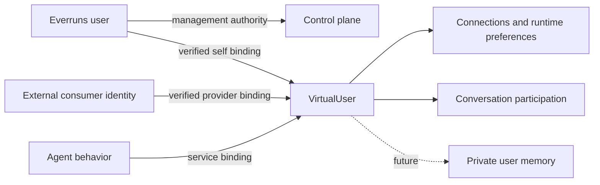

# Virtual Users and Everruns Users

Status: implemented. The pre-refactor analysis below was recorded against `origin/main` at `980cba967`, 2026-09-29.
The implementation replaces agent identities and global runtime credentials with org-scoped virtual users.
Organization scope is accepted: virtual users and their connections are org-scoped.

## Intent

An Everruns user operates the platform. A virtual user uses agents on it.
The same person may do both, but the accounts have different responsibilities.
Agent-facing connections, preferences, conversation identity, and eventually
private memory belong to the virtual user. Console authentication, organization
membership, management permissions, and personal access tokens belong to the
Everruns user.

There must be one runtime identity model. Extend and replace the existing
agent-identity/principal machinery rather than introduce another identity store
beside human connections, agent connections, and synthetic external principals.

## Pre-refactor model

| Existing concept | Actual responsibility | Coupling or gap |
|---|---|---|
| Everruns account (`users`, `AuthUser`, `Caller`) | Console/API authentication, org membership, management authorization | Also supplies runtime connections, participant identity, chat filtering, and private-memory ownership. |
| Principal | Org-scoped durable resource ownership and execution provenance | A `user` principal can refer to either a real management account or a synthetic external speaker. Human lineage is also consumed as runtime identity. |
| Agent identity | Persistent service actor, separate from Agent behavior; profile, lifecycle, connections | Already close to the required runtime aggregate, but currently centered on unattended execution. |
| External actor | Per-message channel speaker, such as a Slack user | Slack ensures a synthetic principal; the speaker has no first-class connection/settings account. |
| Public Chat visitor | Verified endpoint-auth subject or anonymous visitor cookie | Visitor identity is represented in routing tags; sessions retain endpoint ownership. |
| Persona | Agent instructions or plugin prompt contribution | No standalone Persona entity, persistence, or ownership API was found. |

Two meanings of “external user” must stay distinct. `AUTH_MODE=external` and
`users.external_id` describe a management account authenticated by an external
IdP. `ExternalActor` and Public Chat subjects describe people using an agent
without becoming console members.

Evidence and implementation entry points:

- [Auth account storage](../../crates/server/src/storage/models/mod.rs),
  [AuthUser](../../crates/server/src/auth/middleware/mod.rs), and
  [external auth contract](../../crates/server/src/auth/backend.rs).
- [Principal value types](../../crates/contracts/src/runtime/principal.rs),
  [principal aggregate](../../crates/server/src/records/principal.rs), and
  [principal service](../../crates/server/src/services/principal.rs).
  External principal identity currently hashes `source:actor_id`; provider realm
  metadata is not part of that key.
- [Agent identity](../../crates/server/src/records/virtual_user.rs), its
  [current contract](agent-identities.md), and
  [identity connections](../../crates/server/src/api/virtual_user_connections.rs).
  API-key connections exist, and MCP service OAuth also writes identity grants
  through the [OAuth handlers](../../crates/server/src/api/user_connections/mod.rs).
- [User connections](../integrations/user-connections.md) are private
  to a management account and usable across its orgs. They are not org-scoped.
  Both connection paths already share connector registration and encryption.
- [Connection resolver](../../crates/server/src/storage/connection_resolver/mod.rs)
  enforces MCP `actsAs` selection without user/service fallback. Generic
  non-MCP lookup still prefers identity connections and falls back to the
  session's resolved management owner.
- [Slack participants](../../crates/server/src/channels/slack/events/inbound.rs),
  [ExternalActor](../../crates/contracts/src/runtime/message.rs), and
  [Public Chat visitor binding](../../crates/server/src/channels/public_chat.rs).
- [Chats](../../apps/ui/src/hooks/use-chat-threads.ts) are ordinary sessions.
  [Client selection](../../apps/ui/src/lib/chat-threads.ts) uses the auth user;
  [server `mine` filtering](../../crates/server/src/domains/sessions/commands/mod.rs)
  uses the management owner. Pins are personal projections.
- [User preferences](../../crates/server/src/api/user_preferences.rs) are
  arbitrary console/UI settings and persist across orgs. Do not classify every
  existing preference as runtime state.
- [Private memory](../../crates/server/src/domains/session_files/memory_mounts.rs)
  resolves from the management owner today. Memory functionality is outside
  this proposal's feature scope.
- [Platform command authorization](../../crates/server/src/grpc_service/worker/commands.rs)
  and [policy resolution](../../crates/server/src/grpc_service/worker/policy.rs)
  reconstruct the management caller from session ownership.
- [Plugin agents](../integrations/plugins.md) contribute persona/instructions;
  they are behavior, not a credential-bearing identity.

Some knowledge prose describes older behavior. In particular, the blanket
identity-first connection description does not describe today's MCP resolver.
The source distinctions above govern this proposal.

## Proposed model

VirtualUser denotes one entity type, not one shared account. Alice, Bob, and an
agent's service account are separate instances with separate grants.

### Everruns user: management account

Retain the existing auth account and org-membership system. “Everruns user” is
the domain name for that account, not a new login table. Existing
`is_platform_user` continues to mean access to global/system management
surfaces; it must not be reused to distinguish runtime consumers.

Management-account identity owns console security and administration. It can
create/manage virtual users according to org policy, but being their creator,
administrator, or billing owner does not authorize execution with their grants.

### Virtual user: one runtime aggregate

Refactor AgentIdentity into VirtualUser. Reuse its org scope, lifecycle,
presentation/defaults, principal integration, and connector machinery. Virtual
users can exist without an Everruns account, an Agent, or a chat session.

There are two usages within this one aggregate:

- **End user:** the consumer using an agent, including a console operator's
  consumer identity, an embedded application's customer, or a channel speaker.
- **Service:** the account an agent acts as for its own external-service work;
  existing agent identities migrate here.

These usages share one lifecycle, connection store, and management surface.
They are an enforceable authorization distinction: an end-user account cannot
be assigned as a service account merely to make its personal grants available
to unattended work. Converting that usage is an explicit, audited operation
that invalidates prior execution bindings and requires grants appropriate for
service use. Conversion UI is not needed for the initial refactor.

Agent remains behavior/configuration. Persona remains instructions. An Agent's
service virtual-user binding does not identify the person talking to it.
One service virtual user may serve several agents where explicitly configured;
one end user may use many agents and sessions.

### Bindings and principals

Use one canonical virtual user with several independently verified bindings:

- A console self binding resolves a default end-user virtual user for an
  Everruns account in an org. Enforce uniqueness in storage and provision it
  idempotently. The initial UI uses that default without a new account switcher.
- A provider binding resolves a channel/customer identity to a virtual user.
  Its uniqueness includes org, provider, provider realm/issuer, and subject.
  Slack workspace and OIDC issuer matter; display name/email do not establish
  identity. Trusted application customer IDs also require an application realm.
- An agent or endpoint binding selects a service virtual user for execution.

Multiple verified external bindings may resolve to one virtual user; never
merge accounts automatically by email/name. Keep `ExternalActor` as ingress
and historical provenance, then resolve it to the canonical virtual user.
Shared endpoint tokens identify an application, not an individual end user.
Anonymous visitors get a bounded visitor binding and lifetime, not membership
or management authority. Provisioning needs per-org limits and inactive-visitor
retention so ingress cannot create unbounded durable accounts.

An AgentID agent is a provider binding like any other (provider `agentid`,
realm `https://auth.agentid.com`, subject `sub`) and an end-user virtual user,
never a management user. Its AgentID `owner_sub` is kept beside it so an org
can cap agents per human owner; see [AgentID](../integrations/agentid.md).

Retain Principal as the ownership/provenance reference layer. Management user,
virtual user, and system principals have distinct meanings. Both runtime usages
refer to virtual-user principals; agent identity is no longer a separate kind.
External speakers no longer masquerade as management `user` principals.
Preserve principal IDs wherever possible so existing references stay valid.

Principal lineage can answer who administers or funds a resource. It must never
answer which consumer is speaking or whose credential to spend. A virtual user
without a human management owner is valid.

## Request, session, and execution contracts

Resolve management authority and runtime identity independently at the ingress
boundary. Capture them durably before starting work:

- authenticated transport/management actor, when one exists;
- org, endpoint/application scope, and authorized session access;
- initiating end-user virtual user, when this invocation has one;
- active agent's service virtual user, when configured;
- selected acting principal and explicit credential usage for each operation.

Names here express responsibilities, not a finalized API/struct schema. Workers
must receive a validated invocation/turn reference and the server must derive
the binding from it; accepting arbitrary subject IDs from a worker or request
would bypass the boundary. Retry/resume uses the stored context. An autonomous
schedule starts with service context; it does not revive the last human turn's
personal authority. A delegated child receives only explicitly permitted
runtime authority, never its creator's management permissions by inheritance.

Session ownership remains durable resource ownership. A private consumer chat
uses its virtual-user principal. A shared endpoint conversation can retain
endpoint ownership while several virtual users participate. The initiating
user is a turn property, not a session-owner lookup. Bob speaking in a session
created by Alice must not spend Alice's grants.

Agent host/member participants continue to represent behavior and addressed
turn routing. User participants resolve to virtual-user principals. An addressed
guest's service actions use the responder's authorized service binding; they
must not silently borrow the host's service account. Audit records preserve
initiator, acting principal, authorizing actor, and operation scope separately.

## Connections: one owner and resolver

Replace `user_connections` and `agent_identity_connections` with one
virtual-user-owned connection implementation. Reuse provider registration,
forms, validation, encryption, GitHub App token minting, OAuth discovery/PKCE,
refresh single-flight, atomic token rotation, and revocation behavior.
Connection ownership does not imply that every runtime operation may use it.

| Requested credential usage | Canonical source | Missing grant |
|---|---|---|
| End user (`actsAs: user`) | Invoking end user's authorized virtual-user grant | Connect that virtual user; never borrow the management or service account. |
| Service (`actsAs: service`) | Active responder's service virtual-user grant | Configure that service account; never borrow the end user's grant. |
| None | No virtual-user connection lookup | Preserve the declared public/static-auth behavior. |

Use this distinction for generic providers too. Remove implicit identity-first
fallback from GitHub, sandbox providers, and other consumers. Explicit session
secrets/grants may override only within the same authorized subject and usage;
a session-wide credential must not become another participant's credential.
Preserve MCP's existing stripping of service/catalog authorization when acting
as the end user.

Every create/read/update/delete goes through org scope and connection-specific
policy. Self-service uses a verified end-user binding. Service setup uses the
appropriate management permission. Managing another consumer's profile is not
permission to connect a personal provider account on their behalf. Any approved
operator-assisted setup records who authorized the grant and its runtime use.
Provider tokens remain write-only to UIs and absent from model/audit payloads.
Connection uniqueness must be a database invariant; resolve existing duplicate
rows before imposing it. Multi-account selection is outside the initial scope.

OAuth state must bind the authorizing actor/capability, org, target virtual user,
provider, usage, optional session/agent/channel, expiry, and return destination.
Recheck authorization and active bindings at callback; consume the state once.
An org/account switch while the popup is open cannot retarget the grant. For
external consumers, issue a narrowly scoped setup capability from verified
runtime auth, so connecting does not require a console account.

Remote-resource cleanup stores the creating virtual user and provider, and
retains pending grant provenance during cutover. It cannot resolve the session's current owner or
fall back after account replacement. This replaces the human-only assumptions
in [leased resources](../../crates/contracts/src/runtime/leased_resource.rs) and
[worker connection RPCs](../../crates/server/src/grpc_service/worker/connections.rs).

## Console proxy and settings

Existing Chats and Settings > My agent experience resolve through the default self
binding and call the same virtual-user services used by external consumers.
Legacy `/user/connections` routes may be thin adapters during cutover; they
must not keep separate storage, resolver rules, or writes. Cache keys include
org and virtual-user identity. Lists, pins, starter-chat uniqueness, and
connection-required/setup links use that identity as well.

Keep console profile/login, PATs, org selection, navigation/dismissal preferences,
and management notifications on the Everruns account. Put agent-facing profile,
language/timezone defaults, and conversation preferences on the virtual user.
Split existing preference keys by purpose rather than copying the entire
arbitrary preference bag. Console/profile edits do not continuously overwrite
the virtual user's profile after initial seeding.

Platform Chat remains an operator tool. Its runtime side uses the default virtual
user, while management commands require explicit authorization from the signed-in
Everruns user. At command time recheck membership and permissions. Bind that
authority to the operator conversation/invocation, including a validated chain
for authorized child work. Do not reconstruct it through virtual-user ownership
or grant it to an external consumer who reaches a management-capable harness.

## Proposed API

The [API proposal](../runtime-resources/virtual-users-api.md) maps the model
onto existing resource families. Virtual users have one canonical API with
self-service shortcuts; management and runtime auth remain distinct authorities
at the shared command boundary. Existing Agent, Session, and channel ingress
families remain, with validated runtime identity captured for each invocation.
External consumers gain bounded self-service access without management accounts.
Legacy connection/identity routes are adapters during cutover, not another store.

## Proposed UI

Keep everyday chat and connection setup familiar. Introduce virtual-user
management by replacing the current Identities surface, and make org/account
scope visible where it affects which account an action uses.

| Surface | Proposed experience |
|---|---|
| Chats | Uses the current org's default end-user virtual user automatically. Retain threads, pins, archives, and the agent picker. No routine virtual-user picker. |
| Settings: Account | Management profile, security/PATs, and console preferences. Sidebar footer continues to show the signed-in Everruns account. |
| Settings: My agent experience | Chat profile, language/timezone defaults, and Connections for the default virtual user. Show the selected org. Preserve the existing connections URL as a shortcut to this view. |
| Settings: Members | Label as Team members to identify console operators and organization roles. |
| Identities navigation | Replace with Virtual users, scoped to the selected org. Search/filter by end-user/service usage, lifecycle, and identity source. |
| Virtual-user detail | Overview, Connections, Linked identities, and Sessions. Show usage, lifecycle, and links to assigned agents for service accounts. |
| Agent detail | **More → Service account** selects the binding and links to its virtual-user detail. Distinguish tools that use the initiating end user's grants from those using the service account. |
| Session inspector | Participants and per-operation acting identity. Show management authorization separately in audit details. |
| External chat/setup | Consumer-facing profile and connection setup through verified runtime auth. No console navigation or org membership requirement. |

My agent experience and Virtual users > detail > Connections render the
same connection component over the same virtual-user service. `/settings/connections`
redirects to My agent experience. Permissions and
available actions depend on self-service versus service-account administration;
the current management policy must not expose every end user's private grants.
Administrative inspection is not impersonation, and there is no generic
“Chat as this user” action in this refactor.

For normal console chat, the org and default profile establish the identity
without adding another permanent account selector. Show a “Chatting as” label
when profile differences would otherwise make attribution ambiguous. Shared
conversations show their participants; service tool actions identify the
service account when that helps explain an external action. Setup prompts say
whether the connection is for the consumer or the agent's service account.

Reuse the existing OAuth/API-key forms, adding target profile and org context.
An OAuth popup retains its original target through navigation or org switching.
Switching orgs updates thread lists, profile, and grants together, without
showing cached values from the prior virtual user.

During migration, unresolved multi-org grants get a one-time destination/setup
flow instead of disappearing silently or being copied to every org. Do not add
a Memory tab until the separate memory work defines its behavior.

## Memory boundary

Future user memory attaches to VirtualUser, not the management account, an
Agent persona, or a provider ID. No new memory capability, extraction, UI, or
automatic sharing is in this work.

Existing private memory must not regress during the identity cutover. Until a
separate memory migration rekeys its physical ownership, an adapter may resolve
the old storage key only from the proven console self binding of the initiating
virtual user. Never use management-owner lineage for a service or external
consumer. Preserve existing redaction and shared-workspace restrictions, and
do not mount private consumer memory into multi-consumer conversations. This is
a compatibility boundary for existing data, not a second runtime user model.

## Scope decision: organization boundaries

Accepted decision: virtual users are org-scoped, matching existing agent
identities, principals, memories, endpoints, and runtime resources. The same
person in two orgs has two separate virtual users. Each console self binding
is unique per Everruns user and org. Connections and runtime preferences stay
with that org's virtual user; every runtime binding and resource reference
must resolve within the same org.

This deliberately changes today's globally user-scoped connection behavior.
Switching organizations selects that org's default virtual user and connections.
Cross-org identity federation and grant reuse are outside this refactor. There
is no management-user fallback, automatic linking, or hidden token copying.

Single-org users migrate directly.
Multi-org users need a deterministic, reviewable destination selection for each
existing grant and reconnect/explicit authorization in other orgs. Do not infer
consent from organization membership or silently fan out credentials. This is
the main visible migration tradeoff, not a database renaming detail.

## Refactor and cutover

Deliver small slices with a defined removal point; temporary schema expansion
is acceptable, permanently independent runtime identities are not.

1. **Identity foundation:** Generalize AgentIdentity into VirtualUser and add
   verified self/provider bindings. Retain management authentication. Backfill
   existing service identities and external principals, preserving references.
   Create defaults idempotently for existing console users. Switch runtime
   participant/provenance resolution and retire synthetic management-user creation.
2. **Execution authority:** Persist validated per-turn subjects/usages. Switch
   workers, schedules, delegation, active-agent selection, and Platform Chat
   authorization. Keep management/billing ownership distinct. Existing autonomous
   work with no service identity gets a service binding, never an end-user one.
3. **Connections:** Migrate both stores into canonical virtual-user grants.
   Apply the accepted org scope and explicitly resolve multi-org grant destinations.
   Preserve encryption, provider identity,
   refresh data, installation ownership, and leased-resource cleanup references.
   Cut over all provider consumers and OAuth/API-key writes together; block old
   writers before draining or deploying mixed versions. No dual-write reality.
4. **Console proxy:** Switch chats, server filtering, pins, starter uniqueness,
   runtime settings, and setup flows to default virtual users. Preserve thread
   URLs, history, archives, and opt-outs. Adopt existing starters before enforcing
   the new key so account backfill cannot create duplicate Platform Chats.
5. **Removal:** Delete old runtime user/identity DTOs, repository/resolver paths,
   unused credential tables, and ownership-derived runtime authority. Update SDK,
   CLI, OpenAPI, protobuf, storage-memory backend, tests, and owning knowledge
   contracts. Read aliases may remain only as adapters to the canonical model.

Historical events need not be rewritten. Preserve referenced principal IDs and
resolve old serialized kind/subject formats through read-only compatibility.
Backfill session subjects only when provenance is unambiguous. Shared sessions
must not acquire a single consumer from their administrator's identity.
Ambiguous rows are reported for repair and denied personal grant use meanwhile.

Archive prevents new bindings/execution/setup. Delete retains provenance
tombstones and revokes active setup capabilities. Removing a management account
revokes its login and management/self authorization without silently deleting
independent external/service virtual users. Private data retention and remote
cleanup must be resolved before destructive identity removal.

## Acceptance bar

- A consumer with no Everruns login can connect a provider and run an agent
  through verified runtime auth; console management remains inaccessible.
- Console chat and settings see the default virtual user's exact same grants
  and state. Concurrent default provisioning creates one account and one starter.
- Switching orgs selects a separate virtual user and grant set. Cross-org
  bindings, resource references, and credential lookups fail closed even when
  the same Everruns account belongs to both orgs.
- End-user and service grants for the same provider coexist without fallback;
  missing/wrong-purpose grants fail closed for MCP and non-MCP consumers alike.
- Alice and Bob in a shared conversation spend only the initiating turn's
  authorized grants. Addressed guest agents use the correct service identity.
- A schedule, retry, handoff, or owner change cannot borrow management or prior
  end-user authority. Legitimate delegated child work retains its bounded grant.
- OAuth popup account/org switches, target archival/rebinding, state replay,
  issuer/workspace collisions, and cross-tenant IDs cannot retarget connections.
- Existing remote resources clean up with the creating grant; refresh,
  reconnect, revocation, and rejected-credential handling still work.
- Existing chat history, pins, archive behavior, starter uniqueness, and
  private-memory redaction survive migration without reintroducing duplicates.
- Platform Chat keeps authorized management workflows; external and service
  virtual users gain no management rights from ownership or harness selection.
- Post-cutover audits find no independent legacy writes or runtime reads via
  `resolved_owner_user_id`. That field may remain for management/billing only.

The detailed API/storage shapes belong in the implementation. This design owns
the identity boundaries, replacement strategy, and observable success bars.

## Cutover implementation

The canonical model is implemented in [virtual-user storage](../../crates/server/src/storage/runtime_identity/mod.rs),
[resource commands](../../crates/server/src/domains/virtual_users/commands.rs),
[runtime authority](../../crates/server/src/auth/runtime.rs), and
[connection selection](../../crates/server/src/storage/connection_resolver/mod.rs).
The [API contract](../runtime-resources/virtual-users-api.md) links the exact route and schema owners.

Existing identity IDs retain their `identity_` prefix. Usage is immutable in ordinary profile updates.
Single-org legacy credentials move once; multi-org credentials remain in a restricted migration queue
until their owner chooses an org in Settings → My agent experience. The queue is never a runtime credential source.
Associated leases retain their organization-scoped runtime owner. Cleanup pauses until that owner has an explicit grant; selecting a destination cannot transfer another organization's resources.

Runtime credentials expire after 15 minutes, bind one live endpoint and verified binding, and permit
self profile, preferences, and connection setup only. OAuth captures its target before redirect and
rechecks the same actor's current authority on callback. Org selection changes cannot retarget setup.
The current invocation persists the actual consumer and responding agent. An autonomous invocation
has no consumer or management authority. Platform tools recheck the recorded management actor's
current membership and permissions; historical ownership never supplies that authority.

The upgrade regression preserves archived starter uniqueness, chat URLs, participant IDs, pins,
service grants, external realm bindings, encrypted payloads, and ambiguous lease provenance.
Future memory and consumer identity-linking UI remain separate work; existing externally verified
identities establish their bindings through authenticated ingress.
