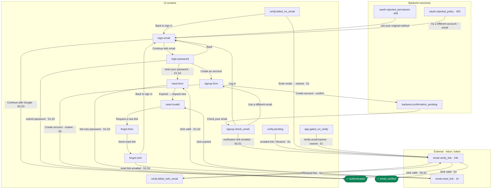

# Authentication Specification

## Abstract

This document defines the authentication system for Everruns, supporting flexible authentication modes for different deployment scenarios.

## Requirements

### Authentication Modes

Everruns supports four authentication modes:

1. **None** (`AUTH_MODE=none`): No authentication required. All requests use a well-known anonymous user (`ANONYMOUS_USER_ID = 00000000-0000-0000-0000-000000000001`). This is a real database user seeded at startup, so all code paths (org membership, personal access tokens, etc.) work uniformly without special-casing. The anonymous user has admin role and belongs to the default organization. **Local development only:** because `none` disables authentication, it is permitted **only in dev deployments** — `AuthConfig::from_env()` panics at startup if `none` is selected (explicitly or by omitting `AUTH_MODE`) when the deployment grade is not `dev`. Set `DEPLOYMENT_GRADE=dev` (or `DEV_MODE=true`) to opt into no-auth dev mode. Unrecognized `AUTH_MODE` values are likewise rejected at startup rather than falling back to `none`, so a typo such as `AUTH_MODE=production` cannot silently disable auth.

2. **Admin** (`AUTH_MODE=admin`): Single admin user via environment variables. Suitable for local development with basic access control.

3. **Full** (`AUTH_MODE=full`): Complete authentication with user registration, OAuth, and personal access tokens. Suitable for production deployments.

4. **External** (`AUTH_MODE=external`): Authentication managed by a third-party provider (e.g., PropelAuth, Auth0, Clerk). The external provider handles login, registration, and user management. Built-in password auth, OAuth, and signup are disabled. Personal access token authentication is supported. Suitable for SaaS deployments with external identity providers.

### Authentication Methods

When authentication is enabled, the following methods are supported:

#### 1. Bearer Token (JWT)

```
Authorization: Bearer <access_token>
```

- Access tokens are short-lived (default: 15 minutes)
- Refresh tokens stored in database for revocation
- Tokens include user ID, email, name, and roles

#### 2. Personal Access Token

```
Authorization: Bearer <personal_access_token>
```

- Personal access tokens are **user-scoped** (tied to a person, never org-scoped). A token inherits access to all organizations the user belongs to. The name (GitHub/GitLab convention) and the `evr_pat_` prefix both make the user-scoped meaning explicit, and disambiguate these from the unrelated LLM-provider / integration / MCP "API key" concepts elsewhere in the product.
- Organization context is resolved per-request via `X-Org-Id` header, `everruns_org` cookie, or single-org convenience fallback — same mechanism as session (JWT) auth.
- Personal access tokens are prefixed with `evr_pat_` for identification — the prefix distinguishes them from JWTs within the `Bearer` scheme
- Auth scheme matching is case-insensitive per RFC 7235 (`bearer`, `BEARER`, `Bearer` all accepted)
- Full token shown only at creation, stored hashed (SHA-256)
- Expiration is supported and enforced. Scopes are **not yet enforced** on the
  request path — a validated token authenticates with the owning user's full
  authority regardless of stored scopes. To avoid advertising a control that is
  not honored, token creation only accepts the full-access wildcard (`scopes`
  omitted or `["*"]`); any narrower scope is rejected with `unsupported_pat_scopes`
  until per-request scope enforcement exists. See EVE-701.
- Used for programmatic access
- Non-`Bearer` formats (`Authorization: evr_pat_...`, `Authorization: ApiKey evr_pat_...`) are also accepted for non-Bearer clients
- `metadata` JSONB column stores creation context: `source` (cli_login, web_ui, api), `hostname`, `os`, `ip`
- Stored in the `personal_access_tokens` table (`token_hash`, `token_prefix` columns)

##### Token scope: user, not organization

There is exactly **one** programmatic credential type, and it represents a
**user**. Everruns has no org-owned token, service-account token, or
machine credential.

- A personal access token is owned by a single user via
  `personal_access_tokens.user_id`. There is no `org_id` on the token —
  the column was deliberately dropped (see migration history) so the token
  cannot be bound to one organization.
- Authorization is the union of the owning user's memberships: the token can
  act in **every** organization that user belongs to, and only those. It
  gains and loses org access exactly as the user does. Revoking the token, or
  removing the user from an org, immediately changes what the token can reach
  (validation re-reads membership from the DB on every request).
- The target org for a given request is selected per-request (`X-Org-Id`
  header / `everruns_org` cookie / single-org fallback), never baked into the
  token. The same token is used across orgs by changing that selector.
- Implication: treat a personal access token as equivalent to the user's own
  full access (hence the "Full account access" warning in the UI). It is not a
  way to grant narrow, org-scoped, or non-human access. If org-scoped or
  service credentials are ever needed, they would be a new, separate concept —
  not a variant of this one. The first such concept is the app-scoped,
  execution-only **App API key**; see [`app-api-keys.md`](../integrations/app-api-keys.md).

The naming reinforces this: "personal access token" (and the `evr_pat_`
prefix) signals user ownership, and disambiguates it from the unrelated
LLM-provider / integration / MCP "API key" credentials elsewhere in the
product, which are org-scoped configuration, not auth principals.

#### 3. CLI Login (localhost OAuth callback)

Interactive CLI authentication via `everruns login`. Flow:

1. CLI calls `POST /v1/auth/cli/start` with `redirect_port`
2. Server creates a pending `cli_auth_sessions` row (state + exchange_code, 5-min TTL)
3. Server returns `auth_url` pointing at the login page with `return_to=<api-prefix>/v1/auth/cli/callback?state=...` — the same `return_to` resume parameter used by every other login flow (see [Login Page Contract](#login-page-contract) below)
4. CLI opens browser and starts one-shot localhost HTTP server
5. User logs in; the login page navigates to the `return_to` path, which hits `/v1/auth/cli/callback` on the server (through the frontend's standard API proxy). The server looks up the session by `state`, associates the authenticated user, and redirects to `localhost:{port}/callback?code=...`
6. CLI receives code, redirects browser to `/cli/login-success` (branded success page)
7. CLI calls `POST /v1/auth/cli/exchange` with code + hostname + os
8. Server creates a personal access token with metadata, returns token + user + orgs
9. CLI prompts for org selection (if multiple), stores credentials in the platform config file (`~/.config/everruns/credentials.json` on Linux, `~/Library/Application Support/everruns/credentials.json` on macOS)

Endpoints: `POST /v1/auth/cli/start`, `GET /v1/auth/cli/callback`, `POST /v1/auth/cli/exchange`, `GET /cli/login-success`

The server identifies the CLI session via the opaque `state` token from `cli_auth_sessions`, not via a callback URL embedded in the login-page contract. This keeps the public login-page contract uniform across all auth flows.

See `crates/server/src/auth/cli_auth.rs` for implementation.

#### 4. Cookie-based Session

- `access_token` cookie with JWT
- `refresh_token` cookie (HTTP-only, secure)
- Suitable for web UI authentication

### Login Page Contract

The login page accepts exactly one public query parameter for auth resume:

- `return_to` — browser-relative path on the frontend origin that the UI navigates to after the user authenticates.

**Rules:**

- `return_to` is always a **relative path** on the frontend origin (starts with `/`, never `//`, never a scheme). Absolute URLs are rejected.
- No other resume/redirect parameter is accepted. Historic names like `redirect_to` are not part of the contract and MUST NOT be emitted by any caller.
- Backend-facing paths are valid `return_to` values — the login page triggers a full-page navigation so the reverse proxy / frontend root forwards them to the backend route. Concrete prefixes the UI treats as backend-facing:
  - `/oauth/...` — MCP OAuth handlers mounted at the server root.
  - `/api/...` — backend mounted under the standard `/api` API prefix (default deployment layout).
  - `/v1/...` — backend mounted at the frontend origin root with **no** API prefix (used when `frontend_url == base_url`, so the API prefix derived by `build_cli_callback_path` is empty).
- Workflow-specific continuations (CLI login, OAuth authorize handshakes) MUST NOT leak raw callback URLs into the login-page contract. Instead, they use an opaque server-issued token (e.g. the CLI auth session `state`) encoded in a backend path, and the server resolves that token to complete the workflow.

**Callers that emit `return_to`:**

- UI middleware / main layout when redirecting unauthenticated users (via `getLoginRedirectPath`).
- MCP OAuth `GET /oauth/authorize` when the caller has no session.
- `POST /v1/auth/cli/start` when building the CLI login URL.

**External auth backends:** External login pages only need to honor `return_to` — no other parameter. There is no need for a separate `redirect_to` path.

An operator may set `AUTH_LOGIN_ORIGIN` to delegate the login page to a
trusted remote HTTP(S) origin. When configured, unauthenticated browser flows
use `{AUTH_LOGIN_ORIGIN}/login`; when absent, they preserve the existing
same-origin relative `/login` behavior. The configured value is validated at
startup as an origin only (no credentials, path, query, or fragment), is
exposed read-only as `login_origin` from `GET /v1/auth/config`, and is never
derived from request or query input. Absolute login URLs use full-page browser
navigation, never the Next.js client router.

`return_to` remains a sanitized relative path. Configuring a login origin does
not permit absolute or protocol-relative continuation targets. Server-authored
login redirects, including MCP OAuth authorization and CLI login, use the same
configured origin.

Implementations: `apps/ui/src/lib/auth-redirect.ts` (`sanitizeReturnTo`) and `apps/ui/src/app/(auth)/login/page.tsx`.

### Unified Entry (Log In or Sign Up)

`/login` is the single door for both returning and new users; `/register`
forwards there (preserving `return_to`). The screen is SSO-primary (OAuth
buttons first, email + password as the secondary path behind an email →
password two-step). Login vs signup is the same action: the UI authenticates,
and when the server returns 401, signup is enabled, and the password meets the
registration minimum, it retries the same credentials against
`POST /v1/auth/register`. Server contracts are unchanged — the unification is
purely a UI-flow decision.

Enumeration stance: the door never reveals whether an email has an account.
Every failure path renders the same generic message, and the login→register
fallback exposes nothing the public register endpoint doesn't already (its
failures are equally generic). The visible difference between "logged in" and
"account created" is inherent to open signup, not an oracle.

### External Mode and OAuth Providers

`AUTH_MODE=external` and the built-in OAuth flow are mutually exclusive. External mode delegates user identity to a third-party provider (PropelAuth, Auth0, Clerk, etc.); the platform's own OAuth handlers (`/v1/auth/oauth/{provider}`, `/v1/auth/callback/{provider}`) are disabled.

To prevent silent 401s for hybrid deployments that accidentally configure both at once, `AuthConfig::validate()` runs at startup (inside `AuthConfig::from_env()`) and **panics with a clear message** when `AUTH_MODE=external` and any of the following are set:

- `AUTH_GOOGLE_CLIENT_ID` / `AUTH_GOOGLE_CLIENT_SECRET`
- `AUTH_GITHUB_CLIENT_ID` / `AUTH_GITHUB_CLIENT_SECRET`

The error names both the conflicting mode and the specific env vars, and points operators to remove the OAuth env vars or switch `AUTH_MODE=full`. The repo-access GitHub App config (`GITHUB_APP_ID` / `GITHUB_APP_PRIVATE_KEY`) is **not** affected — it powers per-user repo connections, not the login flow, so External mode + GitHub App is supported.

This is a fail-fast validation: operators see the misconfiguration at deploy time, not during a built-in OAuth login attempt on `/v1/auth/oauth/{provider}` or its callback `/v1/auth/callback/{provider}` after rollout. See `crates/server/src/auth/config.rs::validate` for the implementation and the top-of-file decision comment.

### OAuth Providers

When configured, supports OAuth2 with:

- **Google**: OpenID Connect with email profile
- **GitHub**: OAuth2 with user:email and read:user scopes

Account linking by email is supported (same verified email = same account),
including across configured OAuth providers. Provider identities are additive:
linking Google to an account first created through GitHub does not replace the
GitHub login. The callback only links after the provider has verified the email
and the existing Everruns account has already verified that same address.

### Email Identity (case-insensitive)

Email is the account identity key across register, login, OAuth account
linking, and password recovery. It is treated **case-insensitively**: the
stored value is canonicalized (trimmed and lowercased) at the storage trust
boundary — both storage backends' `create_user*` and `get_user_by_email` — so
`John@x.com` and `john@x.com` are one account, matching the normalization the
rate limiters and org-invitation matching already use. A case-insensitive
unique index on `users(lower(email))` enforces "one account per mailbox" in the
database even against write paths that bypass the application (EVE-704).

### Password Requirements

- Newly set passwords (signup, reset): minimum 12 characters including at
  least one number, maximum 128 characters (the cap bounds Argon2 hashing
  work; login rejects oversized inputs with the generic credential failure
  before any hashing). Existing passwords are never re-validated — login is
  unaffected by policy changes.
- Hashed with Argon2id (default parameters)

### Signup Email Confirmation (`AUTH_SIGNUP_EMAIL_CONFIRM`)

Off by default (self-host keeps instant-session signup). When enabled,
email/password signup is an explicit, enumeration-safe two-step flow:

- `POST /v1/auth/register` never creates a session. A fresh address creates
  an unverified account and emails a confirmation link; an already-registered
  address sends a "you already have an account" email instead. Both cases
  return the same `200 { "ok": true }` — the emailed body is the only place
  the two outcomes diverge.
- `POST /v1/auth/verify-email` consumes the single-use token and marks the
  email verified. It does not mint a session; after confirmation the user signs
  in explicitly so verification links cannot overwrite another browser's
  existing session.
- `/v1/auth/config` advertises `signup_email_confirm` so the UI renders the
  "Check your email" landing (identical copy for new and existing addresses)
  instead of expecting tokens.
- Requires a configured email sender; enabling it without one makes email
  signup a dead end by design (operators own that pairing).

### Password Reset

Self-service recovery for local (password) accounts. Two endpoints:

- `POST /v1/auth/forgot-password` `{ email }` — always returns `200 { "ok": true }` regardless of whether the email exists (account-enumeration safe). For an existing local account it creates a single-use reset token (1-hour TTL) and emails a `{FRONTEND_URL}/reset-password?token=…` link. OAuth-only accounts are skipped silently. Email delivery is best-effort: a disabled/unconfigured sender or a transport failure is logged, never surfaced.
- `POST /v1/auth/reset-password` `{ token, password }` — consumes the token (atomic single-use), enforces the same 12-character minimum as registration, updates the password hash, and **revokes all of the user's refresh tokens** so any sessions established before the reset are invalidated. Invalid/expired/used tokens return a generic `400`.

Token model: the raw token is emailed once and never stored; only its SHA-256 hash is persisted (`password_reset_tokens`, migration 089). Single-use is enforced via `used_at` set in one atomic `UPDATE … WHERE used_at IS NULL AND expires_at > now()`.

Because reset is skipped silently for OAuth-only accounts, the login-failure
alert also names the OAuth alternative ("Signed up with Google or GitHub? Go
back and use that instead"), shown to everyone so it reveals nothing — without
it, an OAuth-only user who tried a password and then reset would dead-end on a
"Check your inbox" screen for an email that never arrives.

### Email Verification

Confirms a user controls the email they registered with. On successful `POST /v1/auth/register`, a verification token is created and a `{FRONTEND_URL}/verify-email?token=…` link is emailed (best-effort; never fails registration). Endpoints:

- `POST /v1/auth/verify-email` `{ token }` — consumes the token and sets `users.email_verified = true`. Invalid/expired/used tokens return a generic `400`.
- `POST /v1/auth/resend-verification` `{ email }` — account-enumeration safe (`200 { "ok": true }` always); issues a new token only for an existing local account whose email is not yet verified.

Token model is identical to password reset (hashed, single-use, short TTL; `email_verification_tokens`, migration 089) but with a 24-hour TTL. Both recovery and verification routes share the registration rate limiter (per client IP).

Login does **not** gate on `email_verified`, so a signed-in user can be
unverified. To avoid stranding them (the original 24h token may have expired,
and re-signup sends a "log in" email, not a fresh link), `email_verified` is
exposed on `GET /v1/auth/me` and drives a persistent in-app **verify-email
banner** (`components/layout/verify-email-banner.tsx`) with an inline resend —
the surfaced path a signed-in unverified user needs before they hit the
invite-accept gate (TM-AUTH-023). The `/verify-email` dead-link state (no
token, no email) likewise accepts an email and resends in place rather than
directing the user to a screen that does not exist.

### Abuse Limits

Beyond the per-IP limiter (TM-AUTH-001), the auth surface enforces:

- **Per-account login throttle** — login attempts are additionally keyed on
  the submitted email (lowercased) across all source IPs, so distributed
  credential stuffing against one account is capped. Over-limit returns a
  generic 429.
- **Per-address email budget** — forgot-password and resend-verification
  share a per-address send budget (1/minute plus a small daily cap). Over
  budget the endpoints return the normal enumeration-safe success without
  sending (the throttle is not an oracle).
- **OAuth endpoints** share the login-tier per-IP limiter (the callback
  performs an outbound token exchange per hit).
- **Logout revokes server-side** — `POST /v1/auth/logout` deletes the
  refresh-token row (best-effort) in addition to clearing cookies.
- **Captcha (optional)** — setting `AUTH_TURNSTILE_SITE_KEY` +
  `AUTH_TURNSTILE_SECRET_KEY` requires a Cloudflare Turnstile token
  (`captcha_token`) on register / forgot-password / resend-verification.
  `/v1/auth/config` advertises `captcha: { provider, site_key }` so the UI
  renders the widget only when configured. Fail-closed: invalid → generic
  403; siteverify outage → 500-class retryable error.

### OAuth Callback Failure UX

`GET /v1/auth/callback/{provider}` is only ever hit by a browser, so every
failure redirects to `{FRONTEND_URL}/login?error=<category>` instead of
returning raw JSON. Categories are coarse by design; specifics stay in logs
and the audit trail. Provider error bounces (`?error=access_denied`) are
handled the same way rather than failing query extraction.

| Category | When | Copy intent |
|----------|------|-------------|
| `oauth_cancelled` | user declined at the provider | transient — try again |
| `oauth_not_permitted` | 403 identity gate (Google `email_verified=false`, domain allow-list) | permanent for this account — use a different one |
| `oauth_account_exists` | 409: the verified email matches an unverified local twin that must not be auto-linked per TM-AUTH-012, or the provider identity conflicts with an existing binding | permanent — **sign in with your original method**, not "try again" |
| `oauth_failed` | anything else | transient — try again |

`oauth_account_exists` is separated from `oauth_failed` deliberately: the
caller completed the provider handshake and thus owns the mailbox, so naming
the existing account is not enumeration, and folding a *permanent* refusal
into the transient "didn't complete, try again" bucket sent users into a
retry loop with no way out (see Flow Reachability below).

### Flow Reachability (State Machine)

The auth surface is a state machine spanning three layers — **UI** screens,
**backend** outcomes (session vs confirmation, OAuth link-refusal categories),
and **external** events (a link sitting in an inbox, its TTL, single-use
consumption). Its contract is one invariant: **from any (goal, account-state)
situation there is always a path to the goal via an affordance that actually
works for that account** — no dead ends, no surfaced remediation that silently
no-ops.

This is modelled and enforced in code, not just prose:

- `apps/ui/src/lib/auth-flow/machine.ts` — states, account states (`none`,
  `local_unverified`, `local_verified`, `oauth_only`), layer-tagged nodes, and
  guarded transitions (`worksFor` restricts an edge to the account states it
  genuinely advances — the absence of a guard is how a trap is encoded).
- `machine.test.ts` — two invariants with a ratchet: **structural
  reachability** (BFS reaches each goal) and **no misleading remediation** (a
  registry of surfaced-but-broken affordances). Both are asserted empty; any
  new dead end fails CI.

The flow map below is derived from the `EDGES` table in `machine.ts`; edge
labels carry the affordance and, where an edge is guarded, the account states it
actually advances (`worksFor`). Unlabelled guards mean the edge works for every
account state — a guard that omits a reachable account state is exactly how a
trap is encoded, so the omissions are the load-bearing part. Account states:
**S0** `none`, **S1** `local_unverified`, **S2** `local_verified`, **S3**
`oauth_only`. This is an illustrative snapshot; `machine.ts` + `machine.test.ts`
remain the source of truth — regenerate it when the transition table changes.



Backend transitions themselves (confirm-mode `ConfirmationSent` vs `Session`,
single-use/expiry token semantics, enumeration parity) are additionally
enforced by the Rust tests in `crates/server/src/auth/routes.rs`.

**Enumeration-safety is not traded away to close dead ends.** Every recovery
affordance is either generic copy shown to *everyone* (e.g. the login-failure
alert naming OAuth as an alternative — an `oauth_only` account's reset silently
no-ops, so without it those users dead-ended), an action on the user's *own*
authenticated account (the in-app verify-email banner), or addressed to a
caller who has *already proven* mailbox ownership (`oauth_account_exists`).
None reveals account existence to an unauthenticated party.

### Environment Variables

| Variable | Description | Default |
|----------|-------------|---------|
| `AUTH_MODE` | Authentication mode: `none`, `admin`, `full`, `external`. Unknown values are rejected at startup. `none` is allowed only in dev deployments (`DEPLOYMENT_GRADE=dev`/`DEV_MODE=true`); a non-dev deployment that omits or sets `AUTH_MODE=none` fails startup. | `none` (dev only) |
| `PUBLIC_APP_URL` | Public browser origin for the app | `http://localhost:9300` |
| `FRONTEND_URL` | Browser redirect origin; set only when different from `PUBLIC_APP_URL` | `PUBLIC_APP_URL` |
| `AUTH_LOGIN_ORIGIN` | Trusted HTTP(S) origin hosting `/login`; server and UI deployments must receive the same value | Not set (same-origin `/login`) |
| `AUTH_BASE_URL` | Base URL for OAuth callbacks, including API prefix | `PUBLIC_APP_URL` + `API_PREFIX` |
| `AUTH_ADMIN_EMAIL` | Admin user email (admin mode) | - |
| `AUTH_ADMIN_PASSWORD` | Admin user password (admin mode) | - |
| `AUTH_JWT_SECRET` | JWT signing secret (required for admin/full) | - |
| `AUTH_JWT_ACCESS_TOKEN_LIFETIME` | Access token lifetime in seconds | `900` (15 min) |
| `AUTH_JWT_REFRESH_TOKEN_LIFETIME` | Refresh token lifetime in seconds | `2592000` (30 days) |
| `AUTH_DISABLE_PASSWORD` | Disable password authentication | `false` |
| `AUTH_DISABLE_SIGNUP` | Disable user registration | `false` |
| `AUTH_SIGNUP_EMAIL_CONFIRM` | Email signup requires clicking the emailed confirmation link before a session exists (see above) | `false` |
| `AUTH_GOOGLE_CLIENT_ID` | Google OAuth client ID | - |
| `AUTH_GOOGLE_CLIENT_SECRET` | Google OAuth client secret | - |
| `AUTH_GOOGLE_REDIRECT_URI` | Google OAuth redirect URI | `{AUTH_BASE_URL}/v1/auth/callback/google` |
| `AUTH_GOOGLE_ALLOWED_DOMAINS` | Comma-separated allowed email domains | - |
| `AUTH_GITHUB_CLIENT_ID` | GitHub OAuth client ID | - |
| `AUTH_GITHUB_CLIENT_SECRET` | GitHub OAuth client secret | - |
| `AUTH_GITHUB_REDIRECT_URI` | GitHub OAuth redirect URI | `{AUTH_BASE_URL}/v1/auth/callback/github` |
| `GITHUB_CONNECTION_CLIENT_ID` | GitHub OAuth App client ID (for connections, NOT login) | - |
| `GITHUB_CONNECTION_CLIENT_SECRET` | GitHub OAuth App client secret (for connections) | - |
| `GITHUB_CONNECTION_REDIRECT_URI` | Callback URL for connections OAuth | `{AUTH_BASE_URL}/v1/user/connections/github/callback` |
| `CORS_ALLOWED_ORIGINS` | Comma-separated allowed CORS origins (only if cross-origin) | Not set |

### Database Schema

See `crates/server/migrations/001_base_schema.sql` for `users`, `personal_access_tokens` (originally `api_keys`; renamed in `047_personal_access_tokens.sql`), and `refresh_tokens` table DDL.

#### Anonymous User (seeded at startup)

For `auth=none` mode, a well-known anonymous user is seeded via `crates/server/src/seed.rs`. Constants in `crates/platform/src/organization.rs`: `ANONYMOUS_USER_ID`, `ANONYMOUS_USER_EMAIL`, `ANONYMOUS_USER_NAME`. The anonymous user has admin role and belongs to the default organization.

#### Default-Org Membership (single-tenant only)

`register` and `oauth_callback` add a brand-new user to `DEFAULT_ORG_ID` **only when `AuthConfig.auto_join_default_org` is set** (`AUTH_AUTO_JOIN_DEFAULT_ORG=true`). It is **off by default**, because auto-joining the shared default org is a single-tenant convenience (single-binary / small self-host where everyone shares one org). In any multi-tenant deployment it MUST stay off: a fresh signup must own **no** org so the zero-org onboarding flow creates the user's *own* org — otherwise every tenant lands in `DEFAULT_ORG_ID` together (a tenant-isolation failure). The admin-mode bootstrap owner is unaffected: `login` always seeds the admin into the default org regardless of this flag.

#### Default-Org Harness-Seed Guarantee

The server's background seed task (`seed::spawn_seed_task_with_host_composition`) provisions the operator-composed built-in harnesses for every organization — including `DEFAULT_ORG_ID` — using the harness set resolved by `ServerAppBuilder` (EVE-881: built-in templates moved off `HostComposition` into server composition). The task runs asynchronously with a 500 ms initial delay, so there is a window on cold boot where a user could register via `register` or `oauth_callback` before `DEFAULT_ORG_ID` has its harnesses.

When default-org auto-join is enabled (above), both handlers re-run `initialize_org_harnesses_with_definitions(db, DEFAULT_ORG_ID, state.built_in_harnesses)` as a safety net after adding the user to the default org (the re-run is gated together with the membership). Invariants:

- **Correctness**: every newly-signed-up user lands in an org that has built-in harnesses, even if the async seed task has not completed. The provisioner is idempotent (upsert keyed on harness name), so the second call is a no-op once seeding is done.
- **No operator override**: the safety net drives from `state.built_in_harnesses` (the operator-configured set carried by `BuiltinAuthBackend`, threaded from `ServerAppBuilder::built_in_harnesses`), **not** from `oss_built_in_harnesses()`. This preserves the fix from PR #1462 — public signup cannot reintroduce OSS harnesses that a custom composition removed. Tracked as threat-model entry `TM-AUTH-016` in `knowledge/security/threat-model.md` and originally surfaced in EVE-390.
- **Non-fatal on failure**: if the provisioner errors, the signup still succeeds (user is already created). The failure is logged at warn level so operators can diagnose seeding issues without blocking onboarding.

The admin-bootstrap path (first-admin login in `login`) uses the same safety net for the same reasons.

### Security Considerations

1. **JWT Secret**: Must be a secure random string (minimum 32 bytes recommended)
2. **Cookie Security**: Refresh tokens use HTTP-only, Secure (in production), SameSite=Strict cookies with `Path=/` so the cookie is sent through the UI's `/api` proxy
3. **Personal Access Token Storage**: Only hash is stored, full token shown once at creation
4. **Password Storage**: Argon2id with secure defaults
5. **Token Revocation**: Refresh tokens can be revoked by deleting from database
6. **Token Auto-Refresh**: The UI API client intercepts 401 responses and attempts a silent token refresh before failing (skips `/v1/auth/` endpoints to avoid loops; concurrent 401s are deduplicated into a single refresh request)

### Error Responses

```json
{
  "error": "Unauthorized"
}
```

- `401 Unauthorized`: Missing or invalid credentials
- `403 Forbidden`: Valid credentials but insufficient permissions

## UI Integration

### Configuration Discovery

The UI fetches authentication configuration from `GET /v1/auth/config` on startup (returns mode, password/OAuth/signup status).

### Conditional Rendering

Based on `mode`:

- **none**: Skip authentication entirely, show app directly
- **admin/full**: Require login before accessing protected routes
- **external**: Auth required (like full), but login/signup managed by external provider
- Protected routes fail closed while auth bootstrap state is unknown: if `/v1/auth/config` fails, or `/v1/auth/me` fails for reasons other than `401 Unauthorized`, the UI shows a blocking auth-unavailable state instead of rendering the app shell or redirecting to login

### UI Components

| Component | Path | Description |
|-----------|------|-------------|
| Login Page | `/login` | Email/password form + OAuth buttons |
| Register Page | `/register` | User registration (if `signup_enabled`) |
| User Menu | Sidebar | Profile, personal access tokens link, logout |
| Personal Access Tokens | `/settings/personal-access-tokens` | Create, list, delete personal access tokens |

### Authentication Flow

1. App loads, fetches `/v1/auth/config`
2. If `mode === "none"`, render app without auth
3. Otherwise, check if user is authenticated via `/v1/auth/me`
4. If auth bootstrap fails (`/v1/auth/config` error or non-401 `/v1/auth/me` error), block protected routes with an auth-unavailable state
5. If `/v1/auth/me` returns `401 Unauthorized`, redirect to `/login?return_to=<current_path>` or configured `{AUTH_LOGIN_ORIGIN}/login?return_to=<current_path>` (preserving the user's location)
6. After login, cookies are set automatically (HTTP-only) and the user is redirected back to `return_to` (default: `/dashboard`)
7. Subsequent requests include cookies via `credentials: "include"`
8. On 401 response, the API client silently attempts `POST /v1/auth/refresh` (using the HttpOnly `refresh_token` cookie) and retries the request

### Token Refresh

The `POST /v1/auth/refresh` endpoint accepts the refresh token from two sources (checked in order):

1. **JSON body** `{ "refresh_token": "..." }` — for programmatic clients
2. **HttpOnly cookie** `refresh_token` — primary flow for browser clients (cookie is set at login with `Path=/`)

On success, the old refresh token is deleted (rotation) and a new token pair is returned (both in JSON body and Set-Cookie headers).

### OAuth Flow

1. User clicks OAuth button (e.g., "Continue with Google")
2. If a `return_to` URL is present, the UI persists it in `sessionStorage` (key: `everruns_return_to`) so it survives the redirect chain
3. Browser redirects to `GET /v1/auth/oauth/{provider}`
4. API redirects to provider's authorization page
5. After user authorizes, provider redirects to callback
6. API handles callback, sets cookies, redirects to `/`
7. The main layout checks `sessionStorage` for a pending `return_to` and redirects the user back

### Protected Routes

All routes under `/(main)/*` are protected:
- `/dashboard`
- `/agents`
- `/settings`

Auth pages under `/(auth)/*` are public:
- `/login`
- `/register`

### State Management

Authentication state is managed via:

1. **AuthProvider** - React Context providing auth state
2. **React Query** - Caching auth config and user info
3. **HTTP-only Cookies** - Secure token storage (managed by server)

### API Client Configuration

All requests go through `/api` prefix with `credentials: "include"` for cookie-based auth. The `/api` prefix is stripped by the proxy (Next.js in dev, reverse proxy in prod) before reaching the backend.

## Pluggable Authentication Backend

The auth system uses a trait-based pluggable backend so external auth providers (PropelAuth, Auth0, Keycloak) can be used without modifying OSS code. OSS ships `BuiltinAuthBackend` as the default.

### AuthBackend Trait

See `crates/server/src/auth/backend.rs` for the `AuthBackend` trait. Key methods: `validate_token()`, `validate_mcp_token()`, `validate_personal_access_token()`, `auth_routes()`, `auth_config_response()`.

`validate_token()` is the general `/api/*` path and MUST reject MCP-scoped access tokens. `validate_mcp_token(token, resource)` is the separate `/mcp` path and accepts only resource-bound `mcp_access` tokens (audience binding). This split prevents an OAuth confused-deputy where a token authorized only for `/mcp` could act as a full user token on the REST API (TM-MCP-006). The default `validate_mcp_token` fails closed; wrappers that issue MCP OAuth tokens override it. See `knowledge/integrations/mcp.md#access-tokens`.

### BuiltinAuthBackend (OSS Default)

See `crates/server/src/auth/builtin.rs`. Wraps JWT + password + personal access token logic. Auth route handlers use `BuiltinAuthBackend` as axum state directly with `FromRef<BuiltinAuthBackend> for AuthState`.

Token validation is a fresh-state boundary: `auth_user_from_claims` reloads the subject's DB user row (already required to reject deleted subjects) and derives the resolved identity — `name`, `email`, `roles`, and `is_platform_user` — from that row, not from the JWT claim payload. JWT claims still carry these fields for the token's lifetime, but they never drive request-time authorization or the profile shown by `/v1/auth/me`. So a profile rename (or role/email change) surfaces on the next request within the same access-token session, with no re-login and no token reissue (roles: EVE-703; name/email: EVE-715). The personal-access-token path reads the same DB row per request for the same reason.

### AuthState

`AuthState` holds `Arc<dyn AuthBackend>`. The `extract_auth_user()` middleware delegates to `backend.validate_token()` and `backend.validate_personal_access_token()`. OSS convenience: `AuthState::builtin(config, db)`.

### External Identity Support

Nullable `external_id` columns on the `users` and `organizations` tables (added in `001_base_schema.sql` and `007_v0.8.6.sql`) map external provider IDs to internal IDs. OSS: unused (NULL). SaaS: populated by auth backend sync.

See `crates/server/src/storage/` for lookup/upsert methods: `get_user_by_external_id()`, `get_organization_by_external_id()`, `upsert_org_by_external_id()`, `ensure_membership()`.

### UI Context Exports

`AuthContext` and `AuthContextValue` are exported from `providers/auth-provider.tsx` so SaaS wrappers can provide custom auth context values without forking the component.
