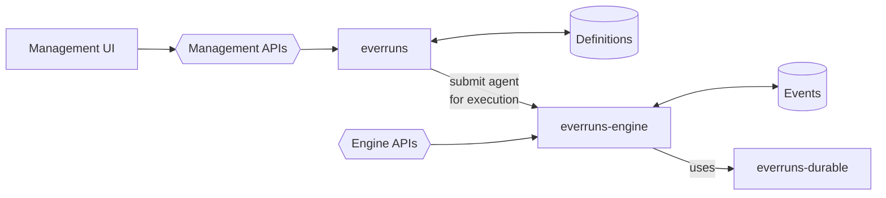

# Proposal: split `everruns`, `everruns-engine`, and `everruns-durable`

Status: draft design note (pre-spec). Answers "can Everruns be split into a
management service, a separate agent-execution engine, and the existing durable
execution engine — and what is the contract between them?" On acceptance this
becomes a spec in `knowledge/foundations/` plus a phased set of Linear issues
under EVE.

Validated against `origin/main` at `54fce13`. Target topology follows Mike's
architecture sketch.

## Summary

Everruns already runs as two processes (`everruns-server`, `everruns-worker`)
with a hard "workers never touch the database" rule. That is a **deployment**
split, not a **domain** split. The worker is not an execution engine; it is a
remote procedure body for the control plane, reaching back over 117 gRPC
methods for everything from harness lookup to SQLite page reads.

The target split is different, and orthogonal to the existing one:

| Service | Owns | Front door |
|---|---|---|
| **`everruns`** | builder + management: harnesses, agents, capabilities, MCP servers, models/providers, apps, triggers, credentials, budgets, org policy, engine registrations. The **Definitions** store. | Management APIs (+ UI) |
| **`everruns-engine`** | running agents: turns, tool execution, session runtime state, the **Events** store. Accepts a distilled agent and executes it. | Engine APIs |
| **`everruns-durable`** | workflow instances, task queue, retries, timers, signals, circuit breakers | used by the engine |

Two load-bearing ideas:

1. **Distillation.** `everruns` resolves harness chain + agent + session +
   capability registry + MCP catalog + model + provider into one self-contained
   `AgentSpec`, and **submits it for execution**. The engine never learns what a
   harness is. Today that resolution happens *inside the worker*
   (`crates/core/src/runtime_context.rs:287`), which is exactly why the worker
   needs the whole configuration surface over gRPC.

2. **The engine is a product, not a subordinate.** It has its own public API and
   its own event store. You can submit a distilled agent to it without
   `everruns` in the picture at all. That is a stronger claim than "extract the
   worker", and it is what makes the dependency arrow point one way only.

Everything else follows from those two.

## Part 1 — What exists today

### Process topology

`crates/server` is the control plane: axum REST on 9301, tonic gRPC on 9001,
PostgreSQL via sqlx, migrations, encryption keys, SSE fan-out. `crates/worker`
claims durable tasks and executes `input` / `reason` / `act` atoms. The worker
holds no database credentials; every read and write goes through
`WorkerService` (`crates/internal-protocol/proto/worker.proto`, 2329 lines,
117 RPCs).

Both binaries build from the same workspace and force-link the same integration
crates. `crates/server` even depends on `crates/worker` for the `AgentRunner`
trait (`crates/server/Cargo.toml:108`), so the control plane cannot be built
without the executor.

### Where the 117 RPCs actually belong

Classifying every method in `worker.proto` by post-split owner:

| Bucket | Count | Examples | Post-split home |
|---|---|---|---|
| Configuration reads that distillation deletes | 7 | `GetAgent`, `GetHarness`, `GetResolvedModel`, `GetDefaultModel`, `GetMcpServerByPrefix`, `PlatformListCapabilities`, config half of `GetTurnContext` | gone — folded into `AgentSpec` |
| Session runtime state | 63 | messages, events, compaction checkpoints, 8× session file, 8× session KV/secret, 7× session SQL, 9× session task, 6× leased resource, 4× session resource, 5× image artifact, 5× session schedule | `everruns-engine`, internal |
| Durable engine | 18 | `ClaimDurableTasks`, `CompleteDurableTask`, `SendDurableWorkflowSignal`, `RegisterDurableWorker`, circuit breakers, `SubscribeTaskNotifications` | `everruns-durable` |
| Authority and secrets | 8 | `GetConnectionToken`, `GetDefaultProviderCredentials`, `CheckBudgetsForSession`, `CheckOutboundToolRateLimit`, `ExecuteMachinePayment`, `AuthorizeSessionCreation` | contested — see Part 5 |
| Management-as-a-tool (`platform` capability) | 21 | `ExecuteCommand`, `ListCommands`, `InvokePlatformCommandSurface`, `Platform*Harness/Agent/Session`, `InvokeAgentTrigger` | `everruns` public API, called as an ordinary client |

Two thirds is session runtime state that the worker manipulates but the server
stores. That is the real coupling — not configuration. Under the target
topology those 63 become *internal* to the engine and stop being a protocol at
all, which is the single biggest simplification available here.

### The re-distillation constraint

Distillation is not a once-per-session act. Three in-flight paths re-resolve
configuration mid-session, from inside tool execution:

- `agent_handoff` folds host and guest overlays and fetches harness chains and
  agents through `PlatformStore`
  (`crates/core/src/capabilities/agent_handoff.rs:478`)
- `subagents` builds a fresh `RuntimeAgent` for the child
  (`crates/core/src/capabilities/subagents.rs`)
- compaction installs a checkpoint that changes the effective message window

Under a submit-only contract the engine cannot resolve these itself — it has no
harnesses, no agents, no registry. This is the central design tension of the
split and Part 5 addresses it directly.

## Part 2 — Target architecture



The properties that matter:

- **One arrow between the services, pointing right.** `everruns` submits to
  `everruns-engine`. The engine does not call back into management for
  configuration. If it needs to, the spec was incomplete.
- **The engine has its own front door.** `Engine APIs` is a first-class public
  surface, not an internal protocol. Submitting a distilled agent is a
  supported operation for anyone, not a privilege of `everruns`. This is what
  makes the engine independently deployable, independently sellable, and
  testable without a control plane.
- **Two stores, split by kind.** Definitions on the management side, Events on
  the engine side. Not one database with a fence down the middle.
- **Durable is under the engine, not beside it.** The engine uses it; nothing
  else does. That matches the current durable crate's design (self-contained,
  PostgreSQL-only) and removes the durable RPCs from any cross-service protocol.

### Naming

`Engine` is the execution service. The management-side record that points at a
deployed engine is an **engine registration** — endpoint, version, advertised
capabilities, supported sandbox flavors, placement labels, limits. That record
is what lets `everruns` pick a target and refuse to submit a spec requiring a
capability the engine cannot execute. It is a pointer, not the thing.

Worth settling early: an engine registration overlaps conceptually with
Harness, which today "represents a setup for agent execution"
(`knowledge/foundations/concepts.md:48`). The line to hold is *harness =
what configuration the agent runs with; engine = what runs it*. If that line
does not survive review, the harness/engine boundary needs a naming pass before
any of this ships.

## Part 3 — The distilled agent: `AgentSpec`

The one new artifact, and the entire contract of the submit call.

```
AgentSpec {
  spec_id            // content hash of everything below; stable = cache key
  spec_version       // wire schema version
  issued_at, expires_at

  // resolved from harness chain + agent + session overlay
  system_prompt      // fully composed, capability contributions included
  model              // resolved model name + driver id + endpoint + parameters
  tools[]            // full ToolDefinition set: builtin + capability + MCP + client-side
  capabilities[]     // resolved configs, dependency-expanded, topologically ordered
  initial_files[]    // merged, path-normalized
  network_access     // merged (intersect allow, union block)
  max_iterations, temperature, max_tokens, parallel_tool_calls
  tool_search, prompt_cache, openrouter_routing
  locale

  // resolved external attachments
  mcp_servers[]      // logical name, endpoint, transport, tool prefix, credential ref
  sandbox            // flavor, image, resource class

  // see Part 5
  credentials[]      // scoped, expiring material or handles

  // opaque to the engine; carried for audit and correlation
  provenance { harness_chain_ids[], agent_id, agent_version_id,
               capability_registry_version, org_id, resolved_at }
}
```

Design rules:

- **No entity IDs on the execution path.** `provenance` is a logging and
  correlation payload. The engine must never dereference it — there is nothing
  to dereference it against.
- **Content-addressed.** `spec_id` lets the engine cache a spec across turns and
  lets `everruns` re-submit "same spec, new input" cheaply. It also pins eval
  reproducibility exactly: a spec hash fixes the entire configuration.
- **Distillation is pure.** Same entities + same registry version → same spec.
  The resolver becomes independently testable against golden specs, which is a
  test-surface win before any topology changes.

`RuntimeAgent` (`crates/core/src/runtime_agent.rs`) is already ~70% of this and
is already `Serialize + Deserialize`. It lacks provenance, resolved MCP
endpoints, capability runtime configs, initial files, locale, and credentials.
`AgentSpec` should live in a small shared crate (`crates/agent-spec`) that both
services depend on — not in `everruns-core`, which is where the current
coupling lives. `RuntimeAgent` becomes a projection of `AgentSpec` for the
loop's internals rather than a parallel type.

## Part 4 — Engine APIs

Because the engine is directly addressable, its API is a product surface, not a
worker protocol. Minimum viable shape:

| Operation | Purpose |
|---|---|
| `POST /runs` | submit an `AgentSpec` + input; returns a run handle |
| `GET /runs/{id}` | status |
| `GET /runs/{id}/events` | stream (SSE); the engine's Events store is the source |
| `POST /runs/{id}/messages` | steer an in-flight run |
| `POST /runs/{id}/cancel` | cancel |
| `POST /runs/{id}/tool-results` | return client-side tool results |
| `GET /capabilities` | what this engine build can execute |
| `GET /health` | liveness, version, capacity |

`everruns` becomes the first and most important client of this API, not a
privileged peer. Its session model maps onto engine runs; its SSE endpoint
proxies or subscribes to engine events.

This surface also answers "what does an engine registration validate against" —
`GET /capabilities` is the advertisement, checked against
`AgentSpec.capabilities` and `AgentSpec.sandbox` at submit time so a mismatch
fails fast instead of as a mid-turn tool error.

## Part 5 — The three things the one-way arrow costs

A submit-only contract with no callback is the cleanest possible boundary. It
is not free. Three current behaviors depend on the engine reaching back.

### 5.1 Re-distillation (handoff, subagents)

An agent in flight decides to hand off to another agent, or spawn a subagent.
Today it walks harness chains through `PlatformStore`. With no callback it
cannot.

Options:

- **(a) Bundle reachable specs.** `everruns` resolves the handoff/subagent
  targets declared in the capability config and ships them inside the submitted
  spec. Works because handoff targets are configured, not invented at runtime.
  Fails for dynamic target selection.
- **(b) Suspend and resubmit.** The engine emits a `spec_required` event and
  parks the run; `everruns` resolves and submits the new spec against the same
  run. Preserves the one-way arrow at the cost of a round trip through the
  event stream and a new suspended run state.
- **(c) Allow a narrow callback.** One `ResolveSpec` method, engine → management.
  Simplest to build, and it puts the arrow back.

**Recommendation: (a) for configured targets now, (b) as the general mechanism.**
(a) covers the real cases today and requires no new run state. (b) is the honest
general answer and generalizes to anything else the engine cannot resolve
locally. (c) should be a deliberate, documented exception if it happens at all —
once one callback exists, the 117-method surface grows back.

### 5.2 Credentials

Today `GetConnectionToken` and `GetDefaultProviderCredentials` return live
secret material to the worker on demand, and only the control plane holds
encryption keys. With no callback, credentials must travel *in* the spec.

That is a downgrade unless it is scoped hard: short-lived, narrowly scoped
(session + server/provider + capability), and re-minted per submission rather
than per session. A spec that carries a 5-minute token for exactly the MCP
servers it lists is defensible; a spec carrying long-lived org credentials is
not, and would be a real regression against TM-DURABLE-002.

For long-running sessions this forces either short-TTL specs with re-submission
on expiry, or a dedicated secret-broker endpoint — which is a callback, but to a
purpose-built narrow service rather than to management's data model. This is
the open question most likely to need a decision before Phase 2.

### 5.3 Authority: budgets, rate limits, payments

`CheckBudgetsForSession`, `CheckOutboundToolRateLimit`, `ExecuteMachinePayment`,
`AuthorizeSessionCreation` are all synchronous policy checks against
management-owned state, mid-turn. They cannot be distilled — a budget is a live
counter, not a configuration value.

Realistic answer: these are the legitimate residue of the split. Either the
engine enforces spec-embedded limits locally and reports usage asynchronously
(good enough for budgets and rate limits, wrong for payments), or these become
an explicit, separately-versioned authority API that the engine calls as a
client. Payments in particular need a synchronous authority; pretending
otherwise would be dishonest about the boundary.

### 5.4 The `platform` capability is *not* a problem

Agents that manage the platform call `everruns` through its ordinary public
Management APIs, authenticated as themselves. That is the engine acting as a
client of a public product surface — categorically different from an internal
control dependency, and it does not violate the one-way arrow. It is already a
generic `discover`/`query`/`execute` surface
(`proposals/platform-capability.md`), so no internal structure leaks.

## Part 6 — State ownership

The sketch puts Events under the engine. That is the right call and it decides
the rest: the engine owns everything with a session lifetime, `everruns` owns
everything with a definition lifetime.

| Engine-owned | Management-owned |
|---|---|
| events (durable + ephemeral), messages, compaction checkpoints | harnesses, agents, capabilities, MCP servers |
| session filesystem, KV, secrets, session SQL | providers, models, credentials |
| session tasks, session resources, leases, image artifacts | apps, triggers, plugins, skills |
| run status and lifecycle | orgs, users, permissions, budgets, engine registrations |

Consequences worth naming up front, because they are the expensive part:

- **The transcript moves.** UI history, search, export, evals, and reporting all
  read messages and events today from the management database. They become
  engine reads (or a management-side read-through projection). This is the
  largest single work item in the split and it is not optional under this
  topology.
- **Two migration sets.** `crates/server/migrations/` is one sequence with an
  existing rebase hazard; `scripts/lib/check-migration-ordering.sh` needs to
  learn about a second.
- **Session delete crosses a boundary.** Needs an async reconciliation path, not
  a transaction.
- **Usage and billing.** Usage rows are generated engine-side and consumed
  management-side. Async projection, not a synchronous write.

A pragmatic intermediate: the engine owns the write path and streams durable
events to a management-side read projection. Management keeps serving the UI
and evals unchanged while the engine becomes authoritative. That keeps Phase 5
below shippable in pieces instead of as one cutover.

## Part 7 — Phasing

Each phase is independently shippable and independently valuable.

**Phase 0 — extract the resolver.** Move the configuration half of
`assemble_turn_context` behind `resolve_agent_spec() -> AgentSpec`. Both the
in-process runtime and the worker call it. Golden-spec tests. *Value alone:*
resolution gets a name, a test surface, and a hash — immediately useful for eval
reproducibility and for debugging "why did this agent get that prompt."

**Phase 1 — ship the spec over the existing wire.** `GetTurnContext` returns
`AgentSpec` instead of `Agent` + `Harness` + `McpToolDef[]` + `ResolvedModel`.
Delete the 7 configuration RPCs. Route `agent_handoff` and `subagents` through
bundled sub-specs (5.1a). *Value:* −7 RPCs, no N+1 on handoff, worker stops
modelling harness inheritance.

**Phase 2 — credential scoping.** Short-lived, narrowly-scoped credentials
minted per submission. *Value:* standalone security win regardless of whether
the split continues.

**Phase 3 — Engine APIs.** Add the public run API in front of the existing
worker. Still one deployment; the API is real and testable. *Value:* first point
at which the engine can be driven without the control plane — provable in a
test.

**Phase 4 — invert control.** `AgentRunner` becomes an engine client;
`crates/server` drops its `everruns-worker` dependency. Engine registrations
become a managed entity with health and capability advertisement. *Value:* a
second, differently-configured engine can exist.

**Phase 5 — move the stores.** Events and session runtime state to the engine,
one family at a time behind flags, with a management-side read projection so the
UI never breaks. Filesystem first (chattiest, most self-contained), then
KV/secrets, then session SQL, then resources/leases, then events/messages last.

**Phase 6 — separate binaries.** `everruns`, `everruns-engine`. Separate images
and scaling. Management stops force-linking sandbox integrations entirely,
shrinking its build and its attack surface.

## Part 8 — Constraints that shape the design

**Embedded runtime.** `everruns-runtime` must keep working with no services at
all (`knowledge/foundations/runtime.md`). `AgentSpec` is a plain serializable
value with an in-process resolver, so this holds — but it forbids anything
wire-only on the *required* path. Credentials in particular must be an
interface with a local implementation, not a concept that presumes a live
endpoint.

**DEV_MODE.** In-memory, in-process, no gRPC. All three services must remain
composable into one process. Already the pattern (`DirectWorkerAdapters` vs
`GrpcWorkerAdapters`); the adapter-parity principle keeps it honest.

**Capability/engine skew.** Once engines version independently, a harness can
reference a capability its engine cannot execute. `GET /capabilities` plus a
submit-time admission check is the answer; without it this surfaces as a
mid-turn tool failure.

**Cross-org pooling.** The worker pool is intentionally cross-org today with
org-scoping at the HTTP layer. Engine registrations make tenancy explicit —
an improvement — but the shared pool must remain the default or every existing
deployment breaks.

**Latency.** Phase 1 removes round trips. Phase 4 adds one hop at run start,
negligible against LLM latency. Phase 5 removes the per-tool-call hops, which is
where the real win is.

## Part 9 — Open questions

1. **Credential lifetime vs. session lifetime** (5.2). The one that most needs a
   decision before Phase 2. Short-TTL specs with re-submission, or a narrow
   secret broker?
2. **Payments and budgets** (5.3). Is a synchronous authority API an accepted
   exception to the one-way arrow, or do payments move behind a submit-time
   allowance?
3. **Does the run outlive the session?** `everruns` has sessions; the engine has
   runs. One session : many runs, or one long-lived run? Affects whether spec
   changes mid-session are picked up (today they are) or pinned — which
   `agent_version_id` already gestures at.
4. **Engine selection: explicit or declarative?** `harness.engine_id` is simple
   and debuggable; label selectors survive engine churn. Leaning selector with a
   `default` label so nothing changes for existing orgs.
5. **Harness vs. engine naming** (Part 2). Needs settling before user-facing
   docs exist for either.
6. **Do evals get their own engine pool?** Evals spawn real sessions and are the
   most natural first consumer of a dedicated pool.

## Part 10 — Non-goals

- Not a rewrite. Every phase lands on `main` behind flags with the existing
  topology working.
- Not language-agnostic execution. A third-party engine speaking the Engine API
  is a possible consequence, not a goal.
- Not multi-region. Placement labels leave room; nothing here implements it.
- Not a change to the public `/v1` REST surface for existing clients.

## Appendix — What distillation removes from the wire

Before (per turn, worker side): `GetTurnContext` returns `Agent`, `Harness`,
`Session`, `Message[]`, `ResolvedModel`, `McpToolDef[]`; the worker then folds
overlays, resolves capability dependency order, composes the prompt, merges MCP
tools, and applies blueprint or progress-report modes — re-derived every turn,
all of it depending on entity semantics the worker should not know.

After: the engine receives an `AgentSpec` and an input, and runs. The fold, the
registry, the prompt composition, the model resolution, and the MCP catalog stay
on the side that owns the definitions — which is the side that already owns them
everywhere except at runtime.
