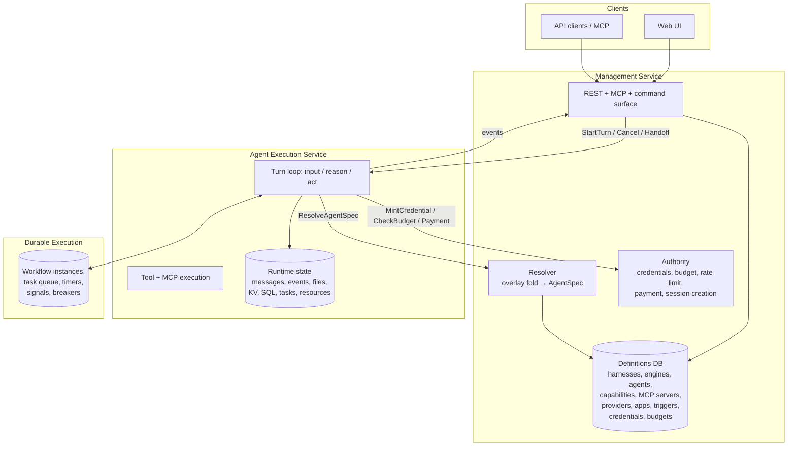

# Proposal: split management, agent execution, and durable execution

Status: draft design note (pre-spec). Answers "can Everruns be split into a
management service, a separate agent-execution service, and the existing
durable-execution engine — and what is the contract between them?" On
acceptance this becomes a spec in `knowledge/foundations/` plus a phased set of
Linear issues under EVE.

Validated against `origin/main` at `54fce13`.

## Summary

Everruns already runs as two processes (`everruns-server`, `everruns-worker`)
with a hard "workers never touch the database" rule. That is a **deployment**
split, not a **domain** split. The worker is not an agent-execution service; it
is a remote procedure body for the control plane, reaching back over 117 gRPC
methods for everything from harness lookup to SQLite page reads.

The split this proposal describes is different, and orthogonal to the existing
one:

| Service | Owns | Talks to |
|---|---|---|
| **Management** | definitions: harnesses, engines, agents, capabilities, MCP servers, models/providers, apps, triggers, credentials, budgets, org policy | clients (REST/MCP/UI), execution |
| **Agent Execution** | running sessions: turns, messages, events, session filesystem, session KV/SQL, session tasks, tool execution | management (spec + authority), durable |
| **Durable Execution** | workflow instances, task queue, retries, timers, signals, circuit breakers | its own store |

The load-bearing idea is **distillation**: management resolves harness chain +
agent + session + capability registry + MCP catalog + model + provider into one
self-contained, versioned `AgentSpec`, and execution runs that spec without
knowing what a harness is. Today that resolution happens *inside the worker*
(`crates/core/src/runtime_context.rs:287`), which is why the worker needs the
whole configuration surface over gRPC.

Everything else in this document follows from moving that one seam.

## Part 1 — What exists today

### Process topology

`crates/server` is the control plane: axum REST on 9301, tonic gRPC on 9001,
PostgreSQL via sqlx, migrations, encryption keys, SSE fan-out. `crates/worker`
claims durable tasks and executes `input` / `reason` / `act` atoms. The worker
holds no database credentials; every read and write goes through
`WorkerService` (`crates/internal-protocol/proto/worker.proto`, 2329 lines,
117 RPCs).

Both binaries build from the same workspace and force-link the same integration
crates. `crates/server` even depends on `crates/worker` for the `AgentRunner`
trait (`crates/server/Cargo.toml:108`), so the control plane cannot be built
without the executor.

### Where the 117 RPCs actually belong

Classifying every method in `worker.proto` by which of the three services would
own it after the split:

| Bucket | Count | Examples | Post-split home |
|---|---|---|---|
| Configuration reads that distillation deletes | 7 | `GetAgent`, `GetHarness`, `GetResolvedModel`, `GetDefaultModel`, `GetMcpServerByPrefix`, `PlatformListCapabilities`, config half of `GetTurnContext` | gone — folded into `AgentSpec` |
| Session runtime state | 63 | messages, events, compaction checkpoints, 8× session file, 8× session KV/secret, 7× session SQL, 9× session task, 6× leased resource, 4× session resource, 5× image artifact, 5× session schedule | Execution |
| Durable engine | 18 | `ClaimDurableTasks`, `CompleteDurableTask`, `SendDurableWorkflowSignal`, `RegisterDurableWorker`, circuit breakers, `SubscribeTaskNotifications` | Durable |
| Authority and secrets | 8 | `GetConnectionToken`, `GetDefaultProviderCredentials`, `CheckBudgetsForSession`, `CheckOutboundToolRateLimit`, `ExecuteMachinePayment`, `AuthorizeSessionCreation` | Management (narrow, deliberate) |
| Management-as-a-tool (`platform` capability) | 21 | `ExecuteCommand`, `ListCommands`, `InvokePlatformCommandSurface`, `Platform*Harness/Agent/Session`, `InvokeAgentTrigger` | Management (already a clean command surface) |

Two thirds of the surface is session runtime state that the worker manipulates
but the server stores. That is the real coupling — not configuration.

### Where distillation happens today

`assemble_turn_context()` (`crates/core/src/runtime_context.rs`) folds the
harness inheritance chain, agent, and session into an `AgentConfigOverlay`
(`crates/core/src/config_layer.rs`), resolves capability configs and their
dependency order, composes the system prompt, merges MCP tool definitions,
resolves the model, and produces a `RuntimeAgent`
(`crates/core/src/runtime_agent.rs`). It runs on the worker, per turn, from raw
entities shipped by `GetTurnContext`.

`RuntimeAgent` is already very close to the "distilled agent" the request asks
for: system prompt, model, tool definitions, max iterations, sampling params,
tool-search and prompt-cache config, merged network access list. It is
`Serialize + Deserialize`. It is not yet a wire contract, has no provenance,
and is not sufficient on its own — it omits resolved MCP endpoints, capability
runtime configs, initial files, locale, and credential handles.

### The re-distillation constraint

Distillation is not a once-per-session act. Three in-flight paths re-resolve
configuration mid-session, from inside tool execution:

- `agent_handoff` folds host and guest overlays and fetches harness chains and
  agents through `PlatformStore` (`crates/core/src/capabilities/agent_handoff.rs:478`)
- `subagents` builds a fresh `RuntimeAgent` for the child
  (`crates/core/src/capabilities/subagents.rs`)
- compaction installs a checkpoint that changes the effective message window

So the contract cannot be "management hands execution a spec at session start."
It must be "execution can ask management to resolve a spec, at any time, for any
(harness, agent, session) triple it is authorized for." That is one RPC, not a
configuration store.

## Part 2 — Target architecture



Three contracts, each narrow:

1. **Management → Execution**: run control. `StartTurn`, `CancelTurn`,
   `ResumeAfterToolResults`, `StartSession`, `EndSession`. Roughly the existing
   `AgentRunner` trait, promoted to a wire protocol.
2. **Execution → Management**: `ResolveAgentSpec` plus the authority calls, plus
   the `platform` capability command surface (which is already generic —
   `discover` / `query` / `execute`, see
   `proposals/platform-capability.md`). Target: **under 15 methods**, down from
   117.
3. **Execution → Durable**: unchanged, the existing durable client.

Event delivery back to SSE clients stays as it is — execution emits into
`EventDelivery` (NATS in production), management's SSE endpoint subscribes.
Neither side needs a synchronous call for this.

## Part 3 — The distilled contract: `AgentSpec`

The one new artifact. Self-contained, deterministic, cacheable, auditable.

```
AgentSpec {
  spec_id            // content hash of everything below; stable = cache key
  spec_version       // wire schema version
  org_id
  issued_at, expires_at

  // resolved from harness chain + agent + session overlay
  system_prompt      // fully composed, capability contributions included
  model              // resolved model name + driver id + endpoint + parameters
  tools[]            // full ToolDefinition set: builtin + capability + MCP + client-side
  capabilities[]     // resolved configs, dependency-expanded, topologically ordered
  initial_files[]    // merged, path-normalized
  network_access     // merged (intersect allow, union block)
  max_iterations, temperature, max_tokens, parallel_tool_calls
  tool_search, prompt_cache, openrouter_routing
  locale

  // resolved external attachments
  mcp_servers[]      // logical name, endpoint, transport, tool prefix, credential_handle
  sandbox            // engine-class requirements: flavor, image, resource class

  // secrets are never inlined
  credential_handles[]  // opaque, short-lived, scoped: {handle, scope, expires_at}

  // provenance, for audit and reproducibility
  provenance { harness_chain_ids[], agent_id, agent_version_id, session_id,
               capability_registry_version, resolved_at }
}
```

Design rules:

- **No entity IDs in the execution path.** Execution may log `provenance` but
  must never dereference it. If execution needs to look up a harness, the spec
  is incomplete.
- **Secrets are handles, not values.** `credential_handle` is redeemed against
  management's authority API at the moment of use, scoped to
  (session, server/provider, capability) and short-lived. This preserves
  today's property that only the control plane holds encryption keys, and
  improves on it: today `GetConnectionToken` returns bearer tokens that the
  worker holds for the turn's duration.
- **Content-addressed.** `spec_id` lets execution cache specs across turns of a
  session and lets management return `304`-style "unchanged" responses. It also
  makes eval reproducibility exact — a spec hash pins the whole configuration.
- **Distillation is pure.** Given the same entities and registry version, the
  same spec. The resolver becomes independently testable against golden specs,
  which is a test-surface improvement even before the split ships.

`AgentSpec` should live in a small crate (`crates/agent-spec`) depended on by
core, management, and execution — not in `everruns-core`, which is where the
current coupling lives. `RuntimeAgent` becomes a projection of `AgentSpec` for
the loop's internals rather than a parallel type.

## Part 4 — Engines as a managed resource

"Engine" is not currently an entity in the model. Under this split it needs to
be one, because management must decide *where* a session runs.

```
Engine {
  id, name, display_name, org_id (or null = shared pool)
  endpoint             // execution service address
  status               // registered, draining, unavailable
  version              // execution build; capability floor
  supported_capabilities[]   // which capability IDs this engine can execute
  supported_sandboxes[]      // docker, daytona, e2b, deno, none
  placement            // region, tenancy (shared | dedicated | byoc), labels
  limits               // max concurrent sessions, resource class
}
```

Harness gains an `engine_id` (or an engine *selector* — labels, so placement
stays declarative). Session resolution then reads: harness → engine → execution
endpoint. Management refuses to start a session whose spec requires a
capability or sandbox flavor the target engine does not advertise. That check is
a straight set comparison against `AgentSpec.capabilities` and
`AgentSpec.sandbox` — cheap, and impossible today because the worker pool is a
single undifferentiated cross-org set.

This is where the split pays for itself commercially: dedicated engine pools per
org, BYOC execution inside a customer VPC, GPU or sandbox-specialized pools, and
per-engine version pinning for risky capability rollouts. None of that is
expressible while "the worker" is one global pool that claims any task from any
org.

Engines also need registration and health: reuse the existing
`RegisterDurableWorker` / `HeartbeatDurableWorker` mechanics rather than
inventing a second liveness system — an engine is a labelled worker pool.

## Part 5 — The hard question: where does session runtime state live?

63 of the 117 RPCs are session runtime state. How this is decided determines
whether the split is real or cosmetic.

**Option A — state stays in management.** Execution remains stateless; the
chatty gRPC surface survives, minus configuration. Cheapest (weeks, not
quarters), keeps one database, keeps backup/restore and multi-tenant query
paths unchanged. But execution is still not an independent service: it cannot
run without management on the hot path of every file read and every message
append, and BYOC/edge placement stays impossible because session content still
flows to the management database.

**Option B — execution owns runtime state in its own store.** Management holds
definitions; execution holds messages, events, files, KV, SQL, tasks, resources,
leases. This is the honest version of the split. Cost is real: cross-service
reads for the UI (session transcript lives on the other side), a second
migration set, cross-store consistency on session delete, and per-engine backup.

**Option C — split by lifetime, not by kind (recommended).** Execution owns
*live* state during a session; management owns *durable record* state.

- Execution-owned, execution-local: session filesystem, session KV/secrets,
  session SQL databases, session resources and leases, in-flight session tasks,
  compaction working set, ephemeral delta events.
- Management-owned, written through: messages, durable events, session status
  and title, usage rows, session tasks' terminal outcomes.

Execution writes durable records through an append-oriented API
(`AppendMessages`, `EmitEvents` — the streaming one already exists) rather than
a read-write CRUD surface. Reads for the transcript stay on management, so the
UI, search, exports, evals, and reporting are untouched.

Option C keeps the surface small (an append path plus a resolve path), removes
the per-tool-call round trips that dominate today (file and KV operations are
the chattiest), and keeps a single authoritative transcript. It is also
incrementally reachable: each state family moves independently, guarded by a
per-family flag.

Recommendation: **Option C**, with Option B reachable later for BYOC engines by
moving the durable record write path to an async outbox.

## Part 6 — Phasing

Each phase is independently shippable and independently valuable. No phase
requires the next one to have landed.

**Phase 0 — extract the resolver (no topology change).**
Move `assemble_turn_context`'s configuration half behind a `resolve_agent_spec`
function producing `AgentSpec`. Both the in-process runtime and the worker call
it. Add golden-spec tests. *Value on its own:* the resolution logic gets a name,
a test surface, and a hash — which is immediately useful for eval
reproducibility and for debugging "why did this agent get that prompt."

**Phase 1 — `ResolveAgentSpec` over gRPC.**
Management implements it; `GetTurnContext` returns `AgentSpec` instead of
`Agent` + `Harness` + `McpToolDef[]` + `ResolvedModel`. Delete `GetAgent`,
`GetHarness`, `GetResolvedModel`, `GetDefaultModel`, `GetMcpServerByPrefix`,
`PlatformListCapabilities`. Route `agent_handoff` and `subagents` through
`ResolveAgentSpec` instead of `PlatformStore` chain walks. *Value:* −7 RPCs,
one fewer N+1 pattern per handoff, and the worker stops modelling harness
inheritance.

**Phase 2 — credential handles.**
Replace `GetConnectionToken` / `GetDefaultProviderCredentials` value returns
with scoped, expiring handles redeemed at point of use. *Value:* independent
security win (TM-DURABLE-002 blast radius), regardless of whether the split
continues.

**Phase 3 — split the proto.**
`worker.proto` becomes `management.proto` (resolve + authority + command
surface), `execution.proto` (run control), `durable.proto` (unchanged
semantics). Still one server binary, two services on the same port. *Value:*
the boundary becomes reviewable — a new RPC on the wrong service is now visible
in the diff.

**Phase 4 — invert run control.**
`AgentRunner` becomes an `ExecutionClient` trait with a gRPC implementation;
`crates/server` drops its `everruns-worker` dependency. Introduce `Engine` as a
managed entity, with registration, health, and capability advertisement.
Management routes `StartTurn` to an engine endpoint. *Value:* first point at
which a second, differently-configured execution pool can exist.

**Phase 5 — move execution-local state.**
Per Option C, one family at a time behind flags: session filesystem first
(chattiest, most self-contained), then KV/secrets, then session SQL, then
resources/leases. Each move is a PR-sized change with a dual-write/dual-read
window. *Value:* measurable latency reduction per family; the split becomes
real.

**Phase 6 — separate binaries and deployment.**
`everruns-management`, `everruns-execution`. Separate images, separate scaling,
separate integration force-linking (management stops linking sandbox
integrations entirely, shrinking its attack surface and build).

## Part 7 — What this breaks, and what it costs

**Embedded / in-process runtime.** `everruns-runtime` must keep working with no
services at all (`knowledge/foundations/runtime.md`). Mitigation: `AgentSpec` is
a plain serializable value with an in-process resolver; the embedded runtime
calls the resolver directly. This is a constraint on the design, not a blocker —
but it forbids putting anything service-shaped (handles that require a live
management endpoint) on the *required* path. Credential handles must therefore
be an interface with a local implementation, not a wire-only concept.

**DEV_MODE.** In-memory, in-process, no gRPC. Same mitigation: all three
"services" must remain composable into one process. This is already the pattern
(`DirectWorkerAdapters` vs `GrpcWorkerAdapters`) and the adapter-parity
principle keeps it honest.

**The `platform` capability.** Agents that manage the platform call back into
management by design. That stays, and it is fine: it is a generic
`discover`/`query`/`execute` surface, not a leak of internal structure. It does
mean execution always has *a* dependency on management — which is expected for a
control-plane-shaped product.

**Capability ↔ engine skew.** Once engines version independently, a harness can
reference a capability its engine cannot execute. Requires the advertisement and
admission check in Part 4, and a clear error at session start rather than a
mid-turn tool failure.

**Cross-org workers.** Today the pool is intentionally cross-org with
org-scoping enforced at the HTTP layer. Engines make tenancy explicit, which is
an improvement, but the migration must keep the shared pool working as the
default engine or every existing deployment breaks.

**Migration ordering.** `crates/server/migrations/` is a single sequence and
already carries a rebase hazard. Splitting stores means splitting the sequence;
`scripts/lib/check-migration-ordering.sh` needs to learn about a second set.

**Latency.** Phase 1 reduces round trips. Phase 4 adds one hop to turn start
(management → engine), which is negligible against LLM latency. Phase 5 removes
the per-tool-call hops, which is where the real win is.

**Observability.** Correlation IDs already exist
(`knowledge/operations/correlation-ids.md`); the spec's `spec_id` and
`provenance` should join the trace context so a turn can be traced from REST
call to engine to LLM.

## Part 8 — Open questions

1. **Engine selection: explicit or declarative?** `harness.engine_id` is simple
   and debuggable; label selectors are flexible and survive engine churn.
   Leaning selector, defaulting to a `default` label so nothing changes for
   existing orgs.
2. **Does `Engine` subsume `Harness`?** A harness already "represents a setup
   for agent execution" (`knowledge/foundations/concepts.md:48`) and configures
   the execution environment. The line to hold: harness is *what configuration
   the agent runs with*; engine is *what machine runs it*. Worth a naming pass
   before this ships, because the overlap will confuse users otherwise.
3. **Spec TTL and invalidation.** If an agent's prompt changes mid-session, does
   the running session pick it up on the next turn, or is the session pinned to
   its spec? Today it picks up changes. Pinning is more reproducible and is what
   `agent_version_id` already hints at. Needs a product decision.
4. **Streaming events under split state.** If execution owns ephemeral deltas
   and management owns durable events, SSE reconnect replay spans two owners.
   The current ephemeral/durable classification mostly handles this, but the
   boundary needs explicit testing.
5. **Do evals need a fourth service?** Evals spawn real sessions. They may be
   the first natural consumer of a dedicated engine pool rather than a service
   of their own.

## Part 9 — Non-goals

- Not a rewrite. Every phase lands on `main` behind flags with the existing
  topology working.
- Not language-agnostic execution. A third-party execution service speaking
  `execution.proto` is a possible consequence, not a goal.
- Not multi-region. Engine placement labels leave room for it; nothing here
  implements it.
- Not a change to the public REST API. Clients see the same `/v1` surface
  throughout.

## Appendix — What "distilled" removes from the wire

Before (per turn, worker side): `GetTurnContext` returns `Agent`, `Harness`,
`Session`, `Message[]`, `ResolvedModel`, `McpToolDef[]`; the worker then folds
overlays, resolves capability dependency order, composes the prompt, merges MCP
tools, and applies blueprint or progress-report modes — all of it re-derived
every turn, all of it depending on entity semantics the worker should not know.

After: `GetTurnContext` returns `AgentSpec` (or just `spec_id` when unchanged)
plus `Message[]`. The worker deserializes and runs. The fold, the registry, the
prompt composition, the model resolution, and the MCP catalog stay on the side
that owns the database — which is the side that already owns them everywhere
except at runtime.
