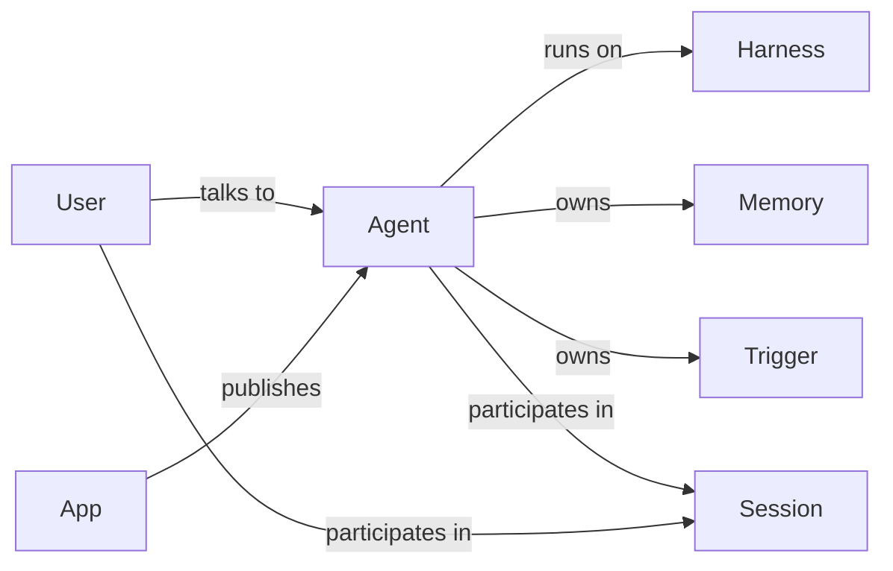

# Proposal: Agent-first architecture

Status: draft proposal (pre-spec). On acceptance this splits into spec updates
(`specs/concepts.md`, `specs/models.md`, `specs/apps.md`, `specs/memory.md`,
new `specs/session-participants.md`, new `specs/agent-triggers.md`) plus
Linear issues per phase.

## Problem

Today an Agent is a **configuration container**: system prompt + capabilities +
default model (`specs/concepts.md`). Everything that makes an agent an *actor*
lives somewhere else:

1. **Session creation is harness-first.** `POST /v1/sessions` requires
   `harness_id`/`harness_name`; `agent_id` is optional and mutable. The user
   says "create a session with this configuration", not "talk to this agent".
2. **A session has at most one agent.** `session.agent_id` is a single nullable
   pointer. There is no notion of several agents (or several users)
   participating in one conversation. Multi-agent work is only expressible as
   child sessions (`specs/agent-handoff.md`, `specs/subagents.md`).
3. **Agents have no memory of their own.** Org-scoped Memories exist and mount
   into workspaces (`specs/memory.md`), and sessions have workspace + KV
   storage — but nothing follows an agent across its sessions, and nothing
   follows a user across agents. An agent meets every session as a stranger.
4. **Proactivity lives in Apps.** Schedule/webhook invocation channels
   (`specs/app-invocation-channels.md`) hang off the App entity. An agent
   cannot act on its own initiative; to make it proactive you must create an
   App and re-decide execution concerns (harness, session routing) there.
5. **Harness is chosen per session/app, not by the agent.** The same agent can
   be run on any harness even when its prompt and capabilities assume a
   specific environment. Every session/App creation repeats an execution
   decision that really belongs to the agent's author.

Adjacent symptom: `AgentIdentity` (`specs/agent-identities.md`) exists because
Agent-the-config cannot act as a principal. The "who is acting" facet was
bolted on as a separate entity bound per session/App.

## Goal

**Agent becomes the primary actor of the platform**: addressable (you talk
*to* it), stateful (it remembers), proactive (it acts on triggers), and
self-contained (it owns its execution environment). Session becomes a
conversation between participants — agents and users. App slims down to what
it is good at: a publishing surface.



Five shifts, in dependency order:

## 1. Harness becomes a property of the Agent

Agent gains `harness_id` (required; defaults to the org's `generic` harness).
The overlay mechanics do not change — the effective config is still
`fold(harness chain, agent, session)` (`crates/core/src/config_layer.rs`) —
only the *selection point* moves from session/App creation to agent authoring.

- `POST /v1/agents` accepts `harness_id`/`harness_name`; existing agents are
  backfilled with `generic`.
- `App.harness_id` is removed (after a deprecation window): the App publishes
  an Agent, and the Agent knows how it runs.
- Direct harness-only sessions (no agent) remain as a platform/testing
  low-level path, but stop being the product-level default.

**Multi-agent consequence (decided here, used in §3):** a session's
*infrastructure* (workspace, sandbox, network policy, starter files) comes
from the **host agent's** harness, snapshotted at session creation exactly as
`session.harness_id` is today. Guest agents fold their own agent overlay
(prompt, capabilities, model) on top of the host environment; they do not
bring their own harness into someone else's session. Rationale: a session has
one filesystem and one sandbox — two harnesses cannot both own it. An agent
whose harness differs materially from the host's can still be delegated to via
handoff/child sessions, which preserve its native environment.

## 2. Agent-first session creation

Session creation becomes "start a conversation with this agent":

```
POST /v1/sessions { "agent": "support" }        // name or agent_ id
```

- `harness_id` on the request becomes optional/advanced; when absent it is
  resolved from the agent. Supplying both stays valid as an explicit override
  during migration, then gets restricted to platform callers.
- `session.agent_id` stops meaning "assigned configuration" and starts meaning
  "host participant" (see §3).
- Agent versions keep working: the session snapshots `agent_version_id` at
  creation/join time as today (`specs/agent-versions.md`).

## 3. Session participants

Replace the single mutable `session.agent_id` with a participant set.

New table `session_participants`:

| Column | Notes |
|---|---|
| `id` | UUID PK, public prefix `part_` |
| `session_id` | FK |
| `kind` | `agent` \| `user` |
| `agent_id` / `agent_version_id` | for `kind = agent`; version snapshotted at join |
| `principal_id` | acting principal (user principal, or the agent's identity principal) |
| `role` | `host` \| `member` |
| `joined_at` / `left_at` | membership is an interval, history is preserved |

- Exactly one `host` agent participant per session; it supplies the harness
  snapshot (§1) and is the default responder. `session.agent_id` remains as a
  denormalized pointer to the host for API compatibility.
- Users are participants too. Today's implicit "the owner talks to the
  session" becomes an explicit `kind = user` row, which is what makes
  multi-user sessions (channels already have this shape — Slack threads)
  representable instead of smuggled through `external_actor` metadata.
- **Turn routing:** V1 keeps it simple — the host agent responds to user
  input. Guest agents respond only when explicitly addressed (API parameter
  or `@mention`), never in an unsolicited loop. Agent-to-agent chatter within
  one session is out of scope for V1; delegation stays on handoff.
- **Provenance:** events already carry `initiator` / `acting_principal`
  metadata (`specs/agent-identities.md`); participant rows give those values a
  durable anchor. Every agent message records which participant produced it.
- `agent_handoff` gains a second mode: instead of spawning a child session,
  *invite* the target agent into the current session as a `member`. Child
  sessions remain the right tool when the target needs its own environment.

**Identity convergence:** an Agent that acts needs a principal. Every Agent
gets a linked `agent_identity` principal, created lazily on first unattended
action or participation (reusing the existing principal graph — no new
principal kind). `AgentIdentity` stops being an entity users must manually
create and wire per session/App; it becomes the identity facet of the Agent
(name/avatar/locale defaults, identity-owned connections). Standalone
identities remain supported for the "one identity, many agents" case, but the
default path is one-per-agent and automatic.

## 4. Memory scopes

Everruns already has the right storage primitive — org-scoped Memories with
mounts (`specs/memory.md`) — but only one scope. Extend Memory with a `scope`:

| Scope | Owner | Follows | Mounted |
|---|---|---|---|
| `org` | organization (today's behavior) | explicit mounts | wherever configured |
| `agent` | an Agent | the agent across all its sessions | auto at `/memory/agent`, read-write |
| `user` | a User | the user across agents and sessions | auto at `/memory/user` when that user participates |
| session | — (not a Memory) | stays what it is: workspace + session KV | `/workspace` |

- Agent memory is created lazily on first write, one per agent, and mounts
  automatically in every session where the agent participates. This is what
  lets an agent "learn" — the data-analyst `remember`/`recall`/`forget` flow
  generalizes to a first-class tier instead of a per-harness capability
  config.
- User memory mounts only into sessions where that user is a participant, and
  never into sessions the user is not part of. It is the durable home for
  preferences and facts the user has shared ("answer in Ukrainian", "my repo
  is X").
- Guest agents get the host session's workspace but their **own** agent
  memory mount — memory follows the agent, not the session.
- Governance: scoped memories reuse the Memory lifecycle, file surface, APIs,
  and threat-model entries as-is; `scope` adds owner-based access rules
  (agent memory writable only from sessions where that agent participates;
  user memory readable/writable per the user's own setting, default
  read-write for the user's own sessions).
- The recall surface (semantic `recall` vs plain file reads) is an open
  question below; the storage/mount contract does not depend on it.

## 5. Proactivity moves to the Agent

An agent should be able to act without being messaged. Introduce
**Agent Triggers**, owned by the agent domain:

| Field | Notes |
|---|---|
| `agent_id` | owner |
| `trigger_type` | `schedule` first; `webhook` later if a non-App use case appears |
| `config` | cron + timezone (normalized to the durable 7-field form, same limits as app schedule channels) |
| `message` | template, same `{{...}}` interpolation contract |
| `session_mode` | `shared_session` \| `session_per_invocation` |
| `enabled` | plus standard lifecycle |

- Execution reuses the durable scheduler exactly like app schedule channels do
  today (`specs/scheduled-tasks.md`): the scheduler fires a single activity
  (`invoke_agent_trigger`), all agent-specific resolution happens in the agent
  domain. Sessions created by a trigger are owned by the agent's identity
  principal (effective human owner = the agent's owner), tagged
  `agent_trigger:{id}`.
- Because the agent owns its harness (§1), a trigger needs no execution
  decisions beyond routing — this is the concrete payoff of §1.
- **Apps become a pure publishing platform**: channel binding (Slack, AG-UI,
  A2A, public chat, api_endpoint), endpoint auth, branding, rate limits,
  publish lifecycle. App-level `schedule`/`webhook` invocation channels are
  deprecated in favor of agent triggers (webhook may keep an App home longer,
  since inbound HTTP + auth genuinely is a publishing concern — see open
  questions). `App.agent_id` becomes required; `App.harness_id` goes away.
- Session-local schedules (`SessionSchedule`) are unchanged — they remain
  "this conversation continues later"; agent triggers are "this agent wakes
  up".

## What does NOT change

- Harness, Capability, overlay fold, RuntimeAgent assembly, events, turns,
  the durable engine, MCP, and the capability registry all keep their current
  contracts. This proposal moves *ownership and addressing*, not execution
  mechanics.
- Handoff/subagents remain the isolation-preserving delegation path.
- Org Memories, workspace, and session KV keep their semantics.

## Phasing

Each phase is independently shippable and useful:

1. **Agent owns harness** — `agent.harness_id`, agent-first
   `POST /v1/sessions {agent}`, App create prefills harness from agent.
   Compat: harness-first creation keeps working.
2. **Participants** — `session_participants` table, host/member semantics,
   `session.agent_id` denormalized to host, provenance anchored, invite-mode
   handoff. Compat: single-agent sessions read identically through old APIs.
3. **Memory scopes** — `memories.scope`, auto-mounted agent/user memories,
   generalized remember/recall tools.
4. **Agent triggers + App slimming** — agent-owned schedules, migration tool
   for existing app schedule channels, deprecate App `schedule` channel,
   make `App.agent_id` required.
5. **Identity convergence** — auto identity-per-agent, fold AgentIdentity
   management into the Agent surface.

## Open questions

- **Guest capability conflicts.** When a guest agent's capabilities collide
  with the host environment (e.g. both mount at the same path), reject at
  join time or drop the guest's mount? Leaning: reject, loudly.
- **Turn routing beyond V1.** Do we ever want agents responding to each other
  inside one session (moderated rounds, max-depth), or is handoff always the
  answer? V1 says: only explicit addressing.
- **Recall surface for scoped memory.** Plain file mounts are enough for V1;
  do `remember`/`recall` become built-in tools of the memory tier (with
  passive recall injection), and is recall lexical or embedded
  (`specs/knowledge-indexes.md` machinery)?
- **User memory privacy.** Is user memory visible to the org admin like org
  Memories, or user-private? Default proposal: user-private, org policy can
  disable the tier.
- **Webhook home.** Webhooks are both "inbound publishing endpoint" (App
  concern: auth, rate limits) and "proactivity source" (Agent concern).
  Proposal keeps webhooks on Apps and moves only schedules; revisit after
  agent triggers land.
- **Multiple hosts / no-agent sessions.** Platform-chat and raw harness
  sessions have no agent today. Do they get a synthetic host participant, or
  does `host` become optional with harness snapshot taken from the request as
  today? Leaning: optional host, request-supplied harness stays a platform
  path.
