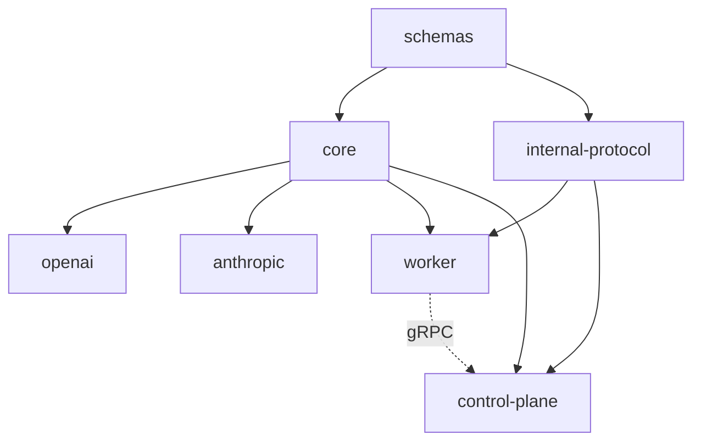

# Architecture Specification

## Abstract

Everruns is a durable AI agent execution platform built on Rust and Temporal. It provides APIs for managing agents, threads, and runs with streaming event output via SSE. The architecture prioritizes durability, observability, and developer experience.

## System Architecture


## Requirements

### Core Architecture

1. **Monorepo Structure**: Single repository with Cargo workspace containing multiple crates
2. **Crate Separation** (folder → package name):
   - `control-plane/` → `everruns-control-plane` - HTTP API (axum) + gRPC server (tonic), SSE streaming, database layer
   - `worker/` → `everruns-worker` - Temporal worker, workflows, activities, gRPC client adapters
   - `schemas/` → `everruns-schemas` - Shared type definitions (source of truth for all data structures)
   - `core/` → `everruns-core` - Core agent abstractions (traits, atoms, tools, events, capabilities, LLM drivers)
   - `internal-protocol/` → `everruns-internal-protocol` - gRPC protocol for worker ↔ control-plane
   - `openai/` → `everruns-openai` - OpenAI LLM provider implementation
   - `anthropic/` → `everruns-anthropic` - Anthropic LLM provider implementation
3. **Frontend**: Next.js application in `apps/ui/` for management and chat interfaces
4. **Documentation Site**: Astro Starlight in `apps/docs/` deployed to https://docs.everruns.com/
   - See [specs/documentation.md](documentation.md) for detailed specification

### Crate Dependency Graph



### Data Layer

1. **Database**: PostgreSQL 17 with custom UUID v7 function
   - Decision: Using PostgreSQL 17 because PostgreSQL 18 is not yet available on managed services like AWS Aurora RDS. This is temporary; we will migrate to PostgreSQL 18 with native uuidv7() when it becomes widely available.
2. **UUID Strategy**: All IDs use UUID v7 (time-ordered, better indexing, naturally sortable)
3. **Migrations**: Managed via sqlx-cli in `crates/control-plane/migrations/`

### Execution Layer

1. **Runner Abstraction**: `AgentRunner` trait provides the execution backend interface
2. **Temporal Execution**: All agent workflows run via Temporal for durability and reliability
3. **Workflow Isolation**: Temporal concepts (workflow IDs, task queues) never exposed in public API
4. **Event Streaming**: SSE for real-time event delivery via database-backed events

See [specs/temporal-integration.md](temporal-integration.md) for detailed Temporal architecture.

### Worker ↔ Control-Plane Communication

Workers communicate with the control-plane via gRPC instead of direct database access:

1. **gRPC Service** (port 9001):
   - `WorkerService` - Internal service for worker operations
   - Batched operations: `GetTurnContext` (agent + session + messages + model in one call)
   - Streaming: `EmitEventStream` for efficient event emission
   - Individual operations for messages, files, providers

2. **gRPC Client Adapters** (in worker crate):
   - `GrpcMessageStore` - Implements `MessageStore` trait via gRPC
   - `GrpcAgentStore` - Implements `AgentStore` trait via gRPC
   - `GrpcSessionStore` - Implements `SessionStore` trait via gRPC
   - `GrpcLlmProviderStore` - Implements `LlmProviderStore` trait via gRPC
   - `GrpcSessionFileStore` - Implements `SessionFileStore` trait via gRPC
   - `GrpcEventEmitter` - Implements `EventEmitter` trait via gRPC

3. **Benefits**:
   - Workers don't need database credentials or encryption keys
   - Clear boundary between control-plane (owns state) and workers (stateless executors)
   - Batched operations reduce round trips (4 DB calls → 1 gRPC call)

### Worker Communication Flow


### Core Abstractions (`everruns-core`)

The core crate provides DB-agnostic agent abstractions with pluggable backends:

1. **Trait-Based Design**:
   - `MessageStore` - Load/store conversation messages (add, get, list methods)
   - `LlmProviderStore` - Resolve LLM models and providers
   - `ToolExecutor` - Execute tool calls
   - `AgentStore` - Load agent configurations
   - `SessionStore` - Load session configurations

2. **Atoms** (Stateless Atomic Operations):
   - `InputAtom` - Retrieve user message from store
   - `ReasonAtom` - Call LLM with context preparation, store response
   - `ActAtom` - Execute tools in parallel, store results
   - Each atom implements `Atom` trait with `execute(input) -> Result<output>`

3. **AtomContext** (Execution Tracking):
   - `session_id` - The conversation session
   - `turn_id` - Unique identifier for the current turn
   - `input_message_id` - User message that triggered this turn
   - `exec_id` - Unique identifier for this atom execution

4. **In-Memory Implementations** (for testing/examples):
   - `InMemoryMessageStore`
   - In-memory stores for testing: `InMemoryAgentStore`, `InMemorySessionStore`, `InMemoryLlmProviderStore`

### OpenAI Provider (`everruns-openai`)

OpenAI-specific LLM provider implementation:

1. **Implements Core Traits**: `LlmProvider` trait from `everruns-core`
2. **OpenAI Protocol Base**: Core types use OpenAI's message format as the standard
3. **Streaming Support**: Full SSE streaming with tool call support
4. **Native API Access**: Direct methods for OpenAI-specific functionality

### Capabilities System

Capabilities are modular functionality units that extend Agent behavior. See [specs/capabilities.md](capabilities.md) for detailed specification.

1. **External to Agent Loop**: Capabilities are resolved at the service/API layer, not inside the loop
2. **Composition Model**:
   - Capabilities contribute system prompt additions
   - Capabilities provide tool definitions
   - Multiple capabilities can be enabled per agent
3. **Resolution Flow**:
   - Fetch agent's capabilities from `agent_capabilities` table
   - Look up internal capability definitions from registry
   - Merge system prompts and tools into `RuntimeAgent`
   - Execute Agent Loop with configured RuntimeAgent

### API Design

1. **RESTful**: Standard REST conventions for CRUD operations
2. **Versioning**: API versioned under `/v1/` prefix
3. **Documentation**: OpenAPI 3.0 with Swagger UI at `/swagger-ui/`

### Infrastructure

1. **Local Development**: Docker Compose in `harness/` for Postgres, Temporal, Temporal UI
2. **CI/CD**: GitHub Actions for format, lint, test, smoke test, Docker build
3. **License Compliance**: cargo-deny for dependency license checking

### Code Organization Conventions

#### Layer Separation

1. **Schemas Layer** (`schemas/` → `everruns-schemas`):
   - Source of truth for all shared data structures
   - Domain types: `Agent`, `Session`, `Message`, `Event`, `ContentPart`
   - Tool types: `ToolCall`, `ToolResult`, `ToolDefinition`
   - LLM types: `LlmProviderType`, `ModelWithProvider`
   - Optional OpenAPI support via feature flag

2. **Storage Layer** (`control-plane/src/storage/`):
   - Database models use `Row` suffix (e.g., `AgentRow`, `SessionRow`, `EventRow`)
   - Input structs for create operations use `Create` prefix + `Row` suffix (e.g., `CreateEventRow`)
   - Update structs use `Update` prefix (e.g., `UpdateAgent`)
   - Repositories handle raw database operations only
   - Migrations in `control-plane/migrations/`
   - Note: Messages are stored as events (see `specs/models.md`)

3. **Core Layer** (`core/`):
   - Contains shared domain types used across layers (e.g., `ContentPart`, `Controls`, `Message`)
   - Contains domain entity types (e.g., `Agent`, `Session`, `LlmProvider`, `Event`, `Capability`)
   - Provides trait definitions (`MessageStore`, `EventEmitter`, `LlmProvider` trait, `ToolExecutor`)
   - Provides tool types (`ToolDefinition`, `ToolCall`, `ToolResult`, `BuiltinTool`)
   - Domain types are DB-agnostic and serializable
   - Types that need OpenAPI support use `#[cfg_attr(feature = "openapi", derive(ToSchema))]`

4. **Control-Plane Layer** (`control-plane/` → `everruns-control-plane`):
   - HTTP API (axum) on port 9000 - public REST API
   - gRPC server (tonic) on port 9001 - internal WorkerService
   - API contracts (DTOs) are collocated with their routes in the same module
   - Controllers handle HTTP concerns only, delegating business logic to services
   - Input types for user-facing APIs use `Input` prefix (e.g., `InputMessage`, `InputContentPart`)
   - Request/response wrappers use `Request`/`Response` suffix

5. **Service Layer** (`control-plane/services/`):
   - Services accept API contracts (request types) and return domain types
   - Services handle conversion from API contracts to storage Row types
   - Services own business logic, validation, and orchestration
   - Services call repositories (via Database) for persistence
   - Each controller module has a corresponding service (e.g., `agents.rs` → `AgentService`)

6. **Internal Protocol Layer** (`internal-protocol/` → `everruns-internal-protocol`):
   - gRPC protocol definitions (proto files)
   - Generated Rust types via tonic-build
   - Conversion functions between proto types and schema types

#### Type Flow Example

```
Controller (HTTP)  →  Service (Business Logic)  →  Repository (Storage)
       ↓                      ↓                           ↓
CreateAgentRequest  →   CreateAgentRow             →   Database
       ↓                      ↓                           ↓
      JSON              Core types used                  SQL
```

For agents:
- Controller receives `CreateAgentRequest` (API request type)
- Controller passes request directly to `AgentService.create(req)`
- Service converts `CreateAgentRequest` → `CreateAgentRow` (storage type)
- Service calls repository to store and returns `Agent` (domain type)

For messages:
- `CreateMessageRequest` (API) → contains `InputMessage` with `InputContentPart[]`
- Service converts `InputContentPart` → `ContentPart` (core type)
- Service creates `CreateEventRow` (storage) with message data as JSON
- Repository stores event to database (messages stored as events)

#### Naming Conventions

| Layer | Pattern | Example |
|-------|---------|---------|
| Storage Row | `{Entity}Row` | `AgentRow`, `EventRow` |
| Storage Create | `Create{Entity}Row` | `CreateEventRow` |
| Storage Update | `Update{Entity}` | `UpdateAgent` |
| Core Domain | `{Entity}` | `Message`, `ContentPart` |
| API Input | `Input{Entity}` | `InputMessage`, `InputContentPart` |
| API Request | `{Action}{Entity}Request` | `CreateMessageRequest` |
| Service | `{Entity}Service` | `AgentService`, `SessionService` |

#### Content Types

Message content uses a unified `Vec<ContentPart>` representation across all layers:

- `ContentPart` - Core enum for all content types (text, image, tool_call, tool_result)
- `InputContentPart` - Restricted enum for user input (text, image only)
- `From<InputContentPart> for ContentPart` - Safe conversion from input to full type

This ensures:
- Users can only send allowed content types (text, images)
- System can store all content types (including tool calls, results)
- No conversion needed between storage and core layers
