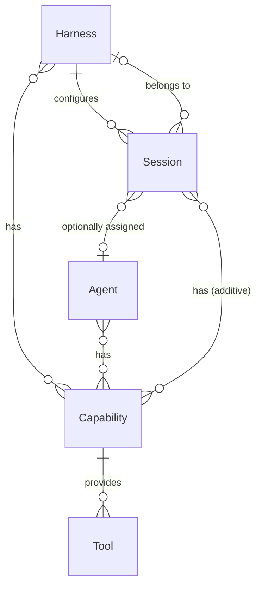
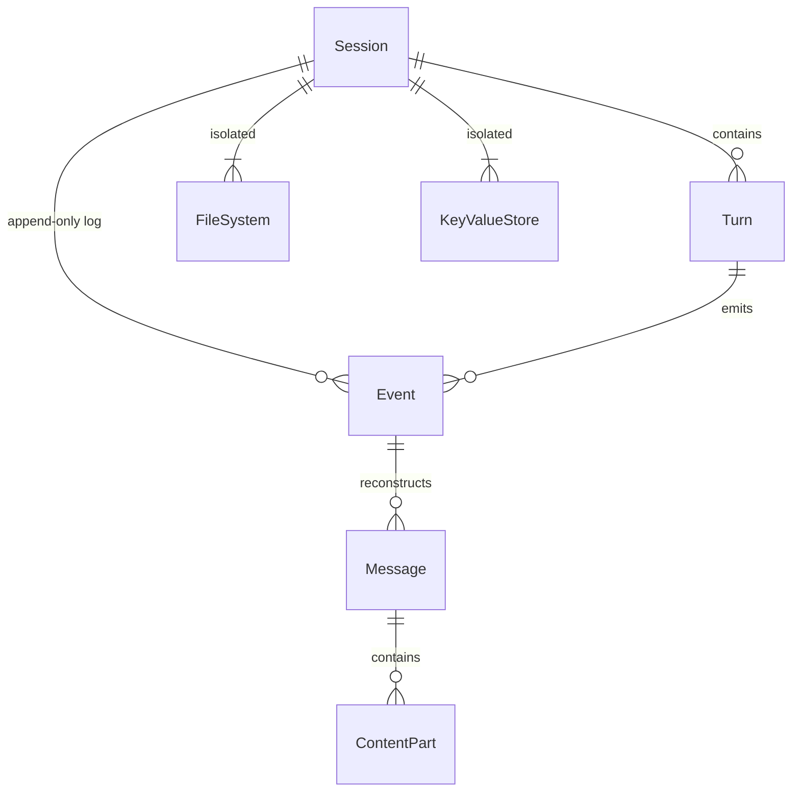
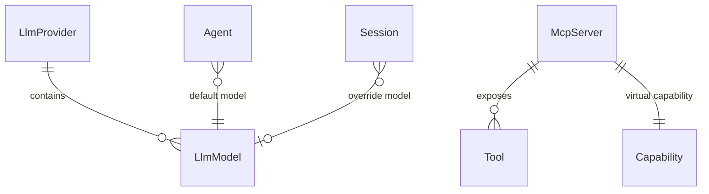

# Concepts

Everruns is a durable agentic harness engine. This document describes the core entities and how they relate to each other, split into three layers: high-level execution model, session internals, and settings.

## High Level

The core execution model: how harnesses, agents, sessions, capabilities, and tools relate.

### Harness

Top-level entity that represents a setup for agent execution. Defines infrastructure, defaults, and constraints under which sessions run. Configures how agents are invoked, which capabilities are available by default, and the execution environment.

- Many harnesses in the system
- Each session has exactly one assigned harness
- A harness can have capabilities attached

### Agent

Domain-specific or task-specific configuration for the agentic loop. Defines system prompt, default LLM model, and enabled capabilities.

- Many agents in the system
- A session may or may not have an agent assigned
- Agents can be assigned or changed during a session's lifetime
- Agent has capabilities (via junction table with position ordering)
- Agent references a default LLM model

### Session

Working instance of an agentic loop. Configured by its harness and situationally by an agent. Primary execution context where conversations happen.

- Many sessions in the system
- Each session has an assigned harness
- Agent is optional and can change over the session's lifetime
- Sessions can have own capabilities (additive to agent capabilities)
- Sessions can override the LLM model
- Status: `started` → `active` → `idle` (sessions work indefinitely)

### Capability

Modular, reusable configuration unit that extends harness, agent, or session behavior. Contributes:

1. **System prompt additions** — text prepended to the agent's prompt
2. **Tools** — functions the agent can invoke
3. **Mount points** — files/directories populated in the session filesystem

- Attached to a harness, an agent, or a session
- Session capabilities are additive to agent capabilities
- Built-in IDs: `snake_case` (e.g., `current_time`, `web_fetch`)
- MCP servers appear as virtual capabilities: `mcp:{uuid}`
- Can depend on other capabilities (resolved in topological order)
- Defined in-memory (not in database); no migration needed to add new ones

### Tool

Function the agent can invoke during execution. Provided by capabilities.

- Built-in tools: no name prefix
- MCP tools: `mcp_{server_name}__{tool_name}` (double underscore)
- Executed by `ActAtom` during a turn
- Can be context-aware (e.g., accessing session filesystem)

---

## Session

What lives inside a session: turns, messages, events, filesystem, and storage.

### Turn

One iteration of the agent loop: reason (call LLM) then act (execute tools).

- Each turn belongs to a session
- Produces messages and emits events
- Lifecycle: `turn.started` → reason → act → `turn.completed` (or `turn.failed`)
- Tracked via `turn_id` in event context

### Message

Conversation entry reconstructed from the event log. Not stored in a separate table.

- Roles: `user`, `agent`, `tool_result`
- Content is an array of parts: text, image, tool_call, tool_result
- Agent messages may include `thinking` content from reasoning models
- Supports per-message controls (model override, reasoning effort)
- Stored as events: `input.message`, `output.message.completed`, `tool.completed`

### Event

Immutable, append-only record. Primary data store for conversations and SSE notifications.

- Atomic per-session sequence numbering
- Types: input, output, turn, atom, tool, LLM, session lifecycle
- Cannot be updated or deleted (enforced by database triggers)
- Carries correlation context: `turn_id`, `input_message_id`, `exec_id`

### File System

Per-session isolated virtual filesystem stored in PostgreSQL.

- Paths relative to `/workspace`
- Capabilities can mount initial files/directories
- Shared between FileSystem and VirtualBash capabilities
- Files have optional read-only flag

### Key-Value Store

Per-session scoped storage with two tiers:

- **Key/Value** — plain text, general data (state, preferences, intermediate results)
- **Secrets** — AES-256-GCM encrypted at rest (API keys, tokens, credentials)
- Session-isolated; cannot access across sessions

---

## Settings

System-wide configuration: LLM providers, models, and MCP servers.

### LLM Provider

Configured API provider (OpenAI, Anthropic). Stores encrypted API keys.

- Types: `openai`, `openai_completions`, `anthropic`
- Each provider has many models
- Defaults seeded on startup with well-known UUIDs

### LLM Model

Specific model within a provider (e.g., `gpt-4o`, `claude-sonnet-4`).

- Belongs to one provider
- Sources: `predefined`, `discovered` (from provider API), `manual`
- Model resolution priority: message controls → session override → agent default → system default
- Runtime profiles (cost, limits, modalities) computed from external data, not stored

### MCP Server

Remote server exposing tools via Model Context Protocol. Integrated as virtual capability.

- Becomes capability with ID `mcp:{server_uuid}`
- Tools discovered at runtime, cached (24h TTL)
- Tool names prefixed: `mcp_{server}__{tool}`
- Execution via HTTP JSON-RPC (not in-process)
