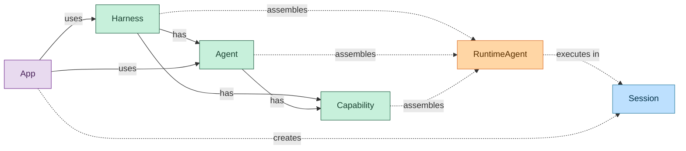
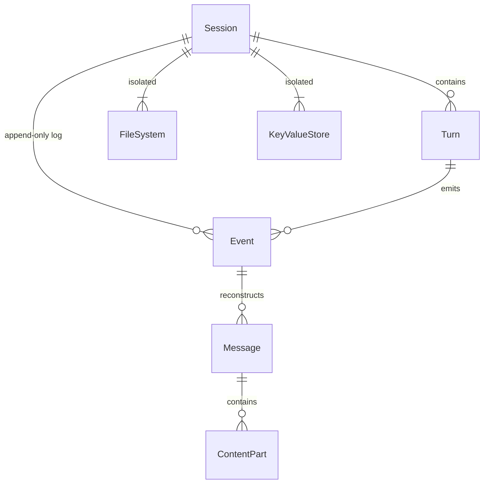
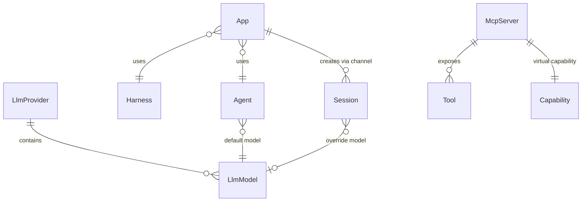

# Concepts

Everruns is a durable agentic harness engine. This document describes the core entities and how they relate to each other, split into three layers: high-level execution model, session internals, and settings.

## High Level

Harness and Agent are **configuration containers** — they hold capabilities and define behavior. At runtime, their configuration merges into a **RuntimeAgent** which executes inside a Session.



- **Solid arrows** — configuration ownership: Harness has Agents and Capabilities, Agent has Capabilities
- **Dashed arrows** — runtime assembly: each entity produces an `AgentConfigOverlay`, overlays fold into a single effective config, which resolves into a RuntimeAgent (see [AgentConfigOverlay](#agentconfigoverlay))
- **Purple** — deployment: App binds Harness + Agent to an external channel and creates sessions from incoming messages

### Harness

Top-level entity that represents a setup for agent execution. Defines infrastructure, defaults, and constraints under which sessions run. Configures how agents are invoked, which capabilities are available by default, and the execution environment.

- Many harnesses in the system
- Each session has exactly one assigned harness
- A harness can have capabilities attached

### Agent

Domain-specific or task-specific configuration for the agentic loop. Defines system prompt, default LLM model, and enabled capabilities.

- Many agents in the system
- A session may or may not have an agent assigned
- Agents can be assigned or changed during a session's lifetime
- Agent has capabilities with position ordering
- Agent references a default LLM model

### Session

Working instance of an agentic loop. Configured by its harness and situationally by an agent. Primary execution context where conversations happen.

- Many sessions in the system
- Each session has an assigned harness
- Agent is optional and can change over the session's lifetime
- Sessions can have own capabilities, additive to agent capabilities
- Sessions can override the LLM model
- Status: `started` → `active` → `idle` (sessions work indefinitely)

### Capability

Modular, reusable configuration unit that extends harness, agent, or session behavior. Contributes:

1. **System prompt additions** — text prepended to the agent's prompt
2. **Tools** — functions the agent can invoke
3. **Mount points** — files and directories populated in the session filesystem

- Can be attached to a harness, an agent, or a session
- Session capabilities are additive to agent capabilities
- Built-in capabilities use `snake_case` IDs (e.g., `current_time`, `web_fetch`)
- MCP servers appear as virtual capabilities with `mcp:{uuid}` IDs
- Capabilities can depend on other capabilities, resolved in topological order

### AgentConfigOverlay

Composable configuration layer shared by Harness, Agent, and Session. Each entity produces an overlay via `From<&T>`; overlays fold bottom-up into a single effective config that `RuntimeAgentBuilder::from_overlay()` resolves into a RuntimeAgent.

See `crates/core/src/config_layer.rs` for implementation.

**Fields and merge semantics:**

| Field | Merge rule |
|-------|-----------|
| `system_prompt` | Base first, overlay appended |
| `capabilities` | Overlay overrides base by capability ID |
| `initial_files` | Overlay overrides base by normalized path |
| `network_access` | Allowed intersects, blocked unions (can only narrow) |
| `default_model_id` | Overlay wins if set, else inherit base |
| `tools` | Additive (deduplicated by name at build time) |
| `max_iterations` | Overlay wins if set, else inherit base |

**Overlay chain:**

Harnesses support single-parent inheritance. `HarnessStore::get_harness_chain()` returns the full inheritance chain (root-to-leaf). Each harness in the chain becomes its own overlay, folded alongside the optional agent and session overlays.

```
 harness_root   harness_child   harness_leaf     agent       session
      │               │               │            │             │
      ▼               ▼               ▼            ▼             ▼
   overlay ──► overlay ──► overlay ──► overlay ──► overlay
                                                       │
                                          AgentConfigOverlay::fold()
                                                       │
                                                       ▼
                                              effective_overlay
                                                       │
                                        RuntimeAgentBuilder::from_overlay()
                                                       │
                                                       ▼
                                                  RuntimeAgent
```

The fold is associative — a pre-merged harness chain (single overlay) produces the same RuntimeAgent as the full chain (N overlays). This lets gRPC-backed stores return a single pre-merged harness while DB-backed stores return the raw chain.

### Tool

A function the agent can invoke during execution. Tools are provided by capabilities.

- Built-in tools have no name prefix
- MCP tools are prefixed: `mcp_{server_name}__{tool_name}`
- Executed during the act phase of a turn

---

## Session Internals

Each session contains turns, messages, events, an isolated filesystem, and key-value storage.



### Turn

One iteration of the agent loop: reason (call the LLM) then act (execute tools).

- Each turn belongs to a session
- Produces messages and emits events
- Lifecycle: `turn.started` → reason → act → `turn.completed` (or `turn.failed`)

### Message

A conversation entry reconstructed from the event log. Messages are not stored in a separate table.

- Roles: `user`, `agent`, `tool_result`
- Content is an array of parts: text, image, tool_call, tool_result
- Agent messages may include extended thinking content from reasoning models
- Supports per-message controls such as model override and reasoning effort

### Event

An immutable, append-only record. The primary data store for conversations and SSE notifications.

- Atomic per-session sequence numbering
- Types: input, output, turn, atom, tool, LLM, session lifecycle
- Cannot be updated or deleted
- Carries correlation context: turn ID, input message ID, execution ID

### File System

A per-session isolated virtual filesystem stored in PostgreSQL.

- Paths are relative to `/workspace`
- Capabilities can mount initial files and directories
- Shared between the FileSystem and VirtualBash capabilities
- Files support an optional read-only flag

### Key-Value Store

Per-session scoped storage with two tiers:

- **Key/Value** — plain text storage for general data such as state, preferences, or intermediate results
- **Secrets** — AES-256-GCM encrypted at rest for API keys, tokens, and credentials
- Storage is session-isolated and cannot be accessed across sessions

---

## Settings

System-wide configuration for LLM providers, models, and MCP servers.



### LLM Provider

A configured API provider such as OpenAI or Anthropic. Stores encrypted API keys.

- Provider types: `openai`, `openai_completions`, `anthropic`
- Each provider contains many models
- Default providers are seeded on startup

### LLM Model

A specific model within a provider (e.g., `gpt-4o`, `claude-sonnet-4`).

- Each model belongs to one provider
- Sources: predefined, discovered from the provider API, or manually added
- Model resolution priority: message controls → session override → agent default → system default

### MCP Server

A remote server that exposes tools via the Model Context Protocol. Integrated as a virtual capability.

- Becomes a capability with ID `mcp:{server_uuid}`
- Tools are discovered at runtime and cached with a 24-hour TTL
- Tool names are prefixed to avoid conflicts: `mcp_{server}__{tool}`
- Execution happens via HTTP JSON-RPC

### App

A deployable unit that binds a Harness and Agent to a distribution channel (Slack, WhatsApp, web widget, etc.). Provides a publish/unpublish lifecycle controlling whether incoming requests are accepted.

- Many apps in the system
- Each app references exactly one Harness (required) and one Agent (required)
- Each app has a channel type and channel-specific config (JSONB)
- Lifecycle: `draft` → `published` → `draft` (or `archived`)
- Only published apps accept incoming requests
- Channel types: `slack` (more planned)
- Session routing is channel-specific (e.g., per-thread, per-channel, per-user for Slack)
- See [apps.md](apps.md) for full specification

### User Connection

A linked external service account (GitHub, GitLab, etc.) associated with a user. Provides authenticated access to external services from agent sessions.

- User-scoped (not org-scoped) — represents the user's identity on the external service
- Tokens encrypted at rest via AES-256-GCM envelope encryption
- Auto-injected into sessions as secrets (e.g., `GITHUB_TOKEN`) when sessions are created
- Capabilities like `daytona` use injected tokens transparently for private repo access
- See [user-connections.md](user-connections.md) for full specification
