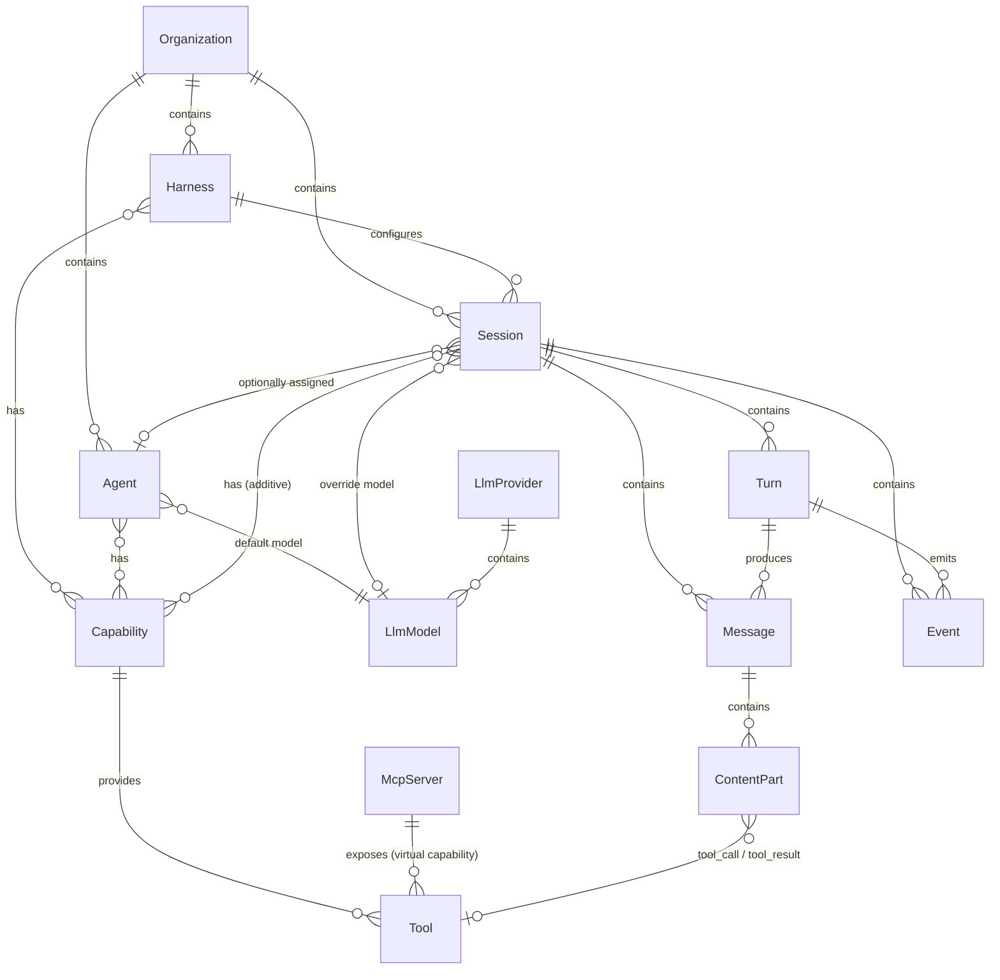

# Concepts

## Overview

Everruns is a durable agentic harness engine. This document describes the core entities and how they relate to each other.

## Entity Diagram

## Entities

### Harness

The **Harness** is the top-level entity that represents a setup for agent execution. It defines the infrastructure, defaults, and constraints under which sessions run. A harness configures how agents are invoked, which capabilities are available by default, and what execution environment is provided.

- There can be many harnesses in the system
- Each session has exactly one assigned harness
- A harness can have capabilities attached to it

### Agent

An **Agent** is a domain-specific or task-specific configuration for the agentic loop. It defines the system prompt, default LLM model, and which capabilities are enabled.

- There can be many agents in the system
- A session may or may not have an agent assigned
- Agents can be assigned or changed during the lifetime of a session
- An agent can have capabilities (via `agent_capabilities` junction with position ordering)
- An agent references a default LLM model

### Session

A **Session** is a working instance of an agentic loop. It is configured by its harness and situationally by an agent. Sessions are the primary execution context where conversations happen.

- There can be many sessions in the system
- Each session has an assigned harness
- A session may or may not have an agent, and the agent can change over the session's lifetime
- Sessions can have their own capabilities (additive to agent capabilities)
- Sessions can override the LLM model
- Each session owns its messages, events, turns, filesystem, and storage
- Status: `started` → `active` → `idle` (sessions work indefinitely)

### Capability

A **Capability** is a modular, reusable configuration unit that extends agent or harness behavior. Capabilities can contribute:

1. **System prompt additions** — text prepended to the agent's prompt
2. **Tools** — functions the agent can invoke
3. **Mount points** — files/directories populated in the session filesystem

- Capabilities can be attached to a harness, an agent, or a session
- Session capabilities are additive to agent capabilities
- Built-in capabilities use `snake_case` IDs (e.g., `current_time`, `web_fetch`)
- MCP servers appear as virtual capabilities with `mcp:{uuid}` IDs
- Capabilities can depend on other capabilities (resolved in topological order)
- Defined in-memory (not in database); no migration needed to add new ones

### Tool

A **Tool** is a function that the agent can invoke during execution. Tools are provided by capabilities.

- Built-in tools have no name prefix
- MCP tools are prefixed: `mcp_{server_name}__{tool_name}` (double underscore)
- Tools are executed by the `ActAtom` during a turn
- Each tool can be context-aware (e.g., accessing session filesystem)

### Turn

A **Turn** is one iteration of the agent loop: reason (call LLM) then act (execute tools). A session consists of many turns.

- Each turn belongs to a session
- A turn produces messages and emits events
- Turn lifecycle: `turn.started` → reason → act → `turn.completed` (or `turn.failed`)
- Turns are tracked via `turn_id` in event context

### Message

A **Message** is a conversation entry stored as events. Messages are reconstructed from the event log.

- Roles: `user`, `agent`, `tool_result`
- Content is an array of parts: text, image, tool_call, tool_result
- Agent messages may include `thinking` content from reasoning models
- Messages support per-message controls (model override, reasoning effort)
- Stored in the append-only events table, not a separate messages table

### LLM Provider

An **LLM Provider** represents a configured API provider (OpenAI, Anthropic). Providers store encrypted API keys and contain models.

- Provider types: `openai`, `openai_completions`, `anthropic`
- Each provider has many models
- Default providers (OpenAI, Anthropic) are seeded on startup with well-known UUIDs

### LLM Model

An **LLM Model** is a specific model within a provider (e.g., `gpt-4o`, `claude-sonnet-4`).

- Each model belongs to one provider
- Models can be predefined, discovered (from provider API), or manually added
- Model resolution priority: message controls → session override → agent default → system default
- Runtime profiles (cost, limits, modalities) are computed from external data, not stored

### MCP Server

An **MCP Server** is a remote server that exposes tools via the Model Context Protocol. MCP servers are integrated as virtual capabilities.

- Each MCP server becomes a capability with ID `mcp:{server_uuid}`
- Tools are discovered at runtime and cached (24h TTL)
- Tool names are prefixed to avoid conflicts: `mcp_{server}__{tool}`
- Execution happens via HTTP JSON-RPC (not in-process)

## Relationship Summary

| Relationship | Cardinality | Notes |
|---|---|---|
| Organization → Harness | 1:N | Many harnesses per org |
| Organization → Session | 1:N | Many sessions per org |
| Organization → Agent | 1:N | Many agents per org |
| Harness → Session | 1:N | Each session has one harness |
| Session → Agent | N:0..1 | Optional, can change over time |
| Agent → Capability | M:N | Via junction table with position |
| Harness → Capability | M:N | Harness-level defaults |
| Session → Capability | M:N | Additive to agent capabilities |
| Agent → LlmModel | N:1 | Default model |
| Session → LlmModel | N:0..1 | Optional override |
| LlmProvider → LlmModel | 1:N | Provider owns models |
| Session → Turn | 1:N | Many turns per session |
| Session → Message | 1:N | Reconstructed from events |
| Session → Event | 1:N | Append-only event log |
| Capability → Tool | 1:N | Capability provides tools |
| MCP Server → Tool | 1:N | Virtual capability |
