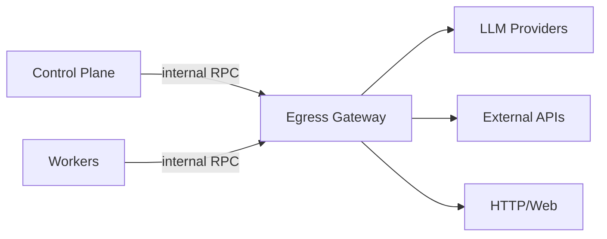

# Egress Service

## Intent

Provide one host-owned boundary for outbound network traffic.

The egress service owns HTTP/API traffic that leaves an Everruns deployment:
LLM provider calls, capability HTTP calls, toolkit integrations, system email,
utility LLM calls, sandbox-provider APIs, and future outbound protocols that can
be represented over HTTP. Workers and the control plane must not create direct
external HTTP clients at runtime once a call path has been migrated.

## Terminology

The service name is **Egress Service**. The future physical deployment component
is the **Egress Gateway**.

Reasoning:

- "egress" is the standard infrastructure term for outbound traffic.
- "service" fits the existing `EmailSender` and `UtilityLlmService` platform
  service pattern.
- "gateway" is reserved for the future process or network component that both
  control-plane and workers call inside an airgapped deployment.

## Goals

1. Give every outbound call site the same policy, audit, signing, retry, and
   observability boundary.
2. Keep provider credentials and signing keys inside host-owned services, not
   agent/session/tool configuration.
3. Support a default direct implementation for local/dev/self-hosted use.
4. Support a future remote gateway implementation so workers and control-plane
   processes can run without direct internet egress.
5. Preserve existing network access allowlist/blocklist semantics for
   agent-authored URLs.
6. Allow requests to opt into platform-managed signing.

## Core Contract

`everruns-core` owns the abstraction:

- `EgressService` is the async trait.
- `EgressRequest` is the provider-neutral outbound HTTP request.
- `EgressResponse` is the provider-neutral response body, status, and headers.
- `EgressStreamResponse` is the streaming response body used by LLM SSE and
  other long-lived HTTP responses.
- `EgressRequestKind` labels traffic as `llm_provider`, `capability`,
  `integration`, `system_email`, `utility_llm`, `mcp`, or `other`.
- `EgressSigning` expresses whether signing is disabled, optional via platform
  default, or required.
- `EgressError` separates invalid requests, network access denial, unavailable
  signing, and transport failures.
- `PlatformDefinition` carries the active `Arc<dyn EgressService>`.
- Runtime tool execution threads the service into `ToolContext`.

The default platform service is `DirectEgressService`, which performs outbound
HTTP directly. `DisabledEgressService` is available for embedded hosts that want
hard airgap behavior before installing a remote gateway implementation.

## Required Usage

New outbound runtime code must use `EgressService` instead of constructing
`reqwest::Client`, provider SDK clients, or toolkit-specific HTTP transports
directly.

This applies to:

- LLM drivers and model discovery.
- capability tools, including library-backed tools such as fetchkit and bashkit
  HTTP support.
- integration crates for external provider APIs.
- internal system services such as email and utility LLM.
- remote MCP servers (tool discovery and tool execution).
- background tasks that call external APIs.

Exceptions:

- inbound HTTP servers and gRPC servers are not egress.
- loopback-only test servers and unit-test clients may use direct HTTP clients
  inside tests.
- database, NATS, Valkey, and control-plane worker gRPC links are internal
  infrastructure traffic, not internet egress.

## Network Access

Agent/session `NetworkAccessList` remains a runtime policy, not an egress
implementation detail. Call sites that send agent-authored or
capability-configured URLs must pass the merged access list into
`EgressRequest.network_access`.

The egress service enforces the policy before making the request. Individual
capabilities may still perform earlier validation when they need better
user-facing errors, but the egress boundary is the final enforcement point.

System-owned fixed endpoints, such as a configured email provider or model
provider URL, do not use the agent/session network access list unless that
endpoint is derived from agent/session/user input.

An optional deployment-wide allowlist (`specs/system-allowlist.md`) sits at the
same boundary. When enabled, it constrains *all* egress — every request kind,
independent of `network_access` — to a curated set of public resources. It is
the in-process precursor to the future gateway's outbound allowlist.

## Signing

Requests can set:

- `disabled` — send without signatures.
- `platform_default` — sign when the platform has an egress signer configured.
- `required` — fail if the platform cannot sign the request.

V1 keeps the request shape provider-neutral. The concrete signer can implement
HTTP Message Signatures, vendor-specific signatures, or both. Existing fetchkit
bot-auth signing should move behind the egress service rather than remain a
capability-local signing path.

## Future Egress Gateway

The remote implementation will replace direct internet egress in workers and
control-plane processes:

Deployment properties:

- CP and workers need only internal network access to the gateway.
- The gateway owns outbound allowlists, signatures, proxy configuration, audit
  logs, and provider-specific transport policy.
- In airgapped deployments, the gateway can be disabled, replaced with an
  approved relay, or bound to a preapproved network route.

## Migration Order

1. Introduce `EgressService` and platform/runtime threading.
2. Move internal system services onto it. `EmailSender` is migrated first;
   `UtilityLlmService` follows with provider-driver migration.
3. Move fetchkit/web_fetch and any future bashkit HTTP hooks onto it.
4. Move LLM drivers and model discovery onto it.
5. Move integration provider clients onto it.
6. Add the remote Egress Gateway implementation and make worker/CP direct
   internet egress removable by deployment policy.

Each migration should leave tests that prove the call path uses injected egress
instead of a direct client.
